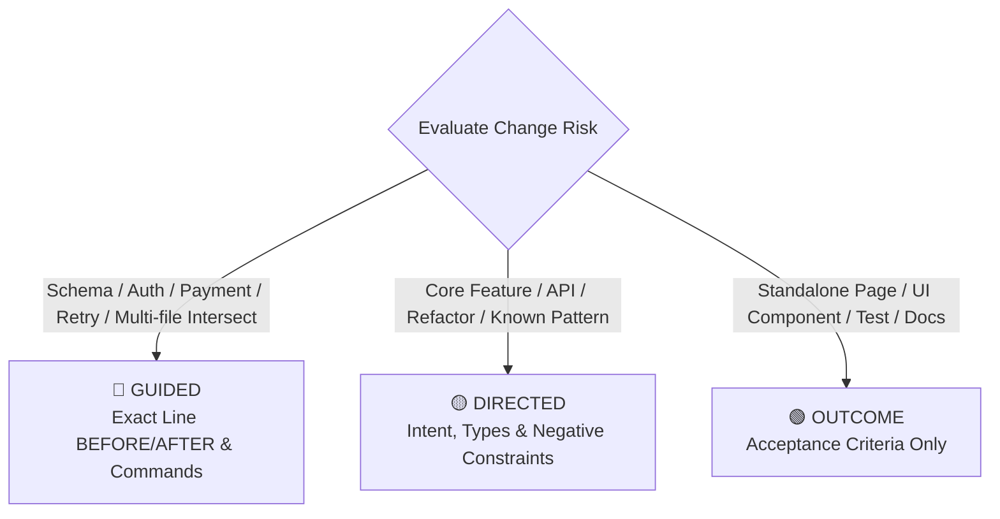

# Planner Output Contract — Work Item & Batch Plan Specification

> **Module Role:** On-demand specification contract loaded when the Planner authors Work Items (`.kramak/work-items/WI-XXX.md`) and Batch Plans (`plans/PLAN-batch-XX.md`).
>
> **The Planning-to-Execution Principle:**
> *"Your job is to collapse ambiguity, not write code. Once ambiguity is collapsed into a clear spec, even a less capable model can execute it. Spend your tokens on WHAT and WHY, not on quoting entire files."*
>
> **Universal Alignment:** Invariants in [ROUTER.md](../ROUTER.md) and schemas in [work-item.schema.json](../schemas/work-item.schema.json) strictly govern all artifacts authored under this contract.

---

## 1. Work Item Specification Format

Every Work Item is an autonomous execution contract written to `.kramak/work-items/WI-XXX.md` (or `.kramak/work-items/WI-XXX.json`).

### 1.1 Batch-Scoped Numbering
Use 3-digit batch-scoped identifiers:
- Batch 1 $\rightarrow$ `WI-101`, `WI-102`, `WI-103`...
- Batch 2 $\rightarrow$ `WI-201`, `WI-202`, `WI-203`...
- Batch $N$ $\rightarrow$ `WI-N01`, `WI-N02`...

### 1.2 Schema Alignment (JSON Schema Draft 2020-12)
Every Work Item file consists of strict YAML frontmatter followed by a structured Markdown body.

```yaml
---
id: "WI-101"
title: "Implement JWT refresh token rotation endpoint"
batch: 1
detail_level: "guided" # "guided" | "directed" | "outcome"
status: "queued"       # "queued" | "active" | "done" | "failed" | "blocked"
files_targeted:
  - "src/auth/tokens.ts"
  - "src/auth/routes.ts"
dependencies: []
retry_budget: 3
attempts: 0
acceptance_criteria:
  - "POST /api/auth/refresh returns 200 with new access and refresh tokens"
  - "Old refresh token is invalidated immediately upon rotation"
  - "npm test passes with 0 failures"
created_at: "2026-08-19T18:40:00Z"
completed_at: null
---
```

### 1.3 Work Item Section Structure
The Markdown body must include:
1. `## Intent / Context`: WHY this exists, user value created, and what fails if incorrect.
2. `## Read First / Key Files`: Specific files and line ranges the executor must inspect.
3. `## Specification / Changes`: Granular code changes scaled according to the detail tier.
4. `## DO NOT / Constraints`: Explicit negative constraints and forbidden patterns.
5. `## Verification`: Exact build, test, and lint commands to validate the change.
6. `## Acceptance Criteria`: Verifiable observable outcomes matching frontmatter.

---

## 2. Spec Detail Scaling — The Three Tiers

Kramak scales specification detail dynamically to match architectural risk and model capability:



### 2.1 Concrete Tier Selection Rules

Tier selection is algorithmic and deterministic. Do not make subjective judgment calls.

| Condition | Selected Tier | Rationale |
|---|---|---|
| Change modifies database schema, migrations, auth, encryption, or payment logic | 🔴 **Guided** | Zero error tolerance; prevent security vulnerabilities and data corruption. |
| Change spans $\ge 4$ files that interact with or call each other | 🔴 **Guided** | Prevent interface drift across multi-file boundaries. |
| This Work Item is a 2nd+ attempt (retry from a failed WI) | 🔴 **Guided** | Elevate detail tier from 🟡/🟢 to 🔴 to eliminate ambiguity. |
| Model Canary Capability Score is $0.60 \le S < 0.80$ | 🔴 **Guided** (Default) | Compensate for lower model reasoning capability with exact recipes. |
| Change modifies a single module with clear existing unit tests | 🟡 **Directed** | Standard task; executor discovers implementation within established bounds. |
| Change follows an established, repeating pattern in the codebase | 🟡 **Directed** | Contextual pattern matching is sufficient. |
| Change adds a standalone page, UI component, utility, or script | 🟢 **Outcome** | Bounded scope; executor has full implementation autonomy. |
| Change is pure formatting, renaming, documentation, or comment update | 🟢 **Outcome** | Minimal risk; acceptance criteria provide full validation. |

*Batch Distribution Invariant:* In normal operations ($S \ge 0.80$), maintain $\le 50\%$ 🔴 Guided WIs per batch. Over-specification induces prompt fatigue; under-specification causes execution drift.

---

## 3. Tier Specifications & Canonical Templates

### 3.1 🔴 Guided Tier (High Risk / Complex / Critical)

**Purpose:** Provide an exact, recipe-like replacement specification. The executor follows the instructions verbatim with zero guesswork.

**Requirements for Guided WIs:**
- Full `// BEFORE:` and `// AFTER:` code blocks citing exact file paths and line ranges.
- Every `BEFORE` pattern MUST be confirmed via live `grep_search` or `view_file` (never quoted from memory).
- Every `AFTER` block MUST be a complete, working drop-in replacement.
- Explicit list of new imported symbols and caller impact analysis.
- Specific check commands to run after applying the change.

#### Canonical 🔴 Guided Template
````markdown
---
id: "WI-101"
title: "Implement secure refresh token hashing and storage"
batch: 1
detail_level: "guided"
status: "queued"
files_targeted:
  - "src/auth/tokens.ts"
dependencies: []
retry_budget: 3
attempts: 0
acceptance_criteria:
  - "Tokens are SHA-256 hashed before database persistence"
  - "pnpm test src/auth/tokens.test.ts passes"
created_at: "2026-08-19T18:40:00Z"
completed_at: null
---

# WI-101: Implement secure refresh token hashing and storage

## Intent
Store refresh tokens as SHA-256 hashes rather than plaintext in the database to prevent token theft in the event of a database read breach.

## Read First
1. `src/auth/tokens.ts` (lines 15-45) — current token generation and persistence logic.
2. `src/db/schema.ts` (lines 80-95) — `refresh_tokens` table definition.

## Changes

### Change 1: Add SHA-256 token hashing before persistence
**File:** `src/auth/tokens.ts`  
**Verified:** ✅ grep confirmed unique match at lines 28-36

```typescript
// BEFORE:
export async function saveRefreshToken(userId: string, token: string): Promise<void> {
  await db.insert(refreshTokens).values({
    userId,
    token,
    expiresAt: new Date(Date.now() + 7 * 24 * 60 * 60 * 1000),
  });
}

// AFTER:
import { createHash } from "node:crypto";

export function hashToken(token: string): string {
  return createHash("sha256").update(token).digest("hex");
}

export async function saveRefreshToken(userId: string, token: string): Promise<void> {
  const tokenHash = hashToken(token);
  await db.insert(refreshTokens).values({
    userId,
    token: tokenHash,
    expiresAt: new Date(Date.now() + 7 * 24 * 60 * 60 * 1000),
  });
}
```

**New symbols:** `hashToken`  
**Callers affected:** `src/auth/service.ts:verifyToken` (verified compatible with hash lookup)

## DO NOT
- Do NOT alter the database column name (`token`).
- Do NOT use MD5 or unsalted bcrypt for token hashing (SHA-256 fast lookup is required).
- Do NOT modify any file outside `src/auth/tokens.ts`.

## Verification
```bash
pnpm test src/auth/tokens.test.ts
pnpm biome check src/auth/tokens.ts
```

## Acceptance Criteria
1. `saveRefreshToken` writes the SHA-256 digest of the token to the database.
2. Unit tests verify that matching plaintext hashes to the expected database entry.
3. Linter and typechecker pass with 0 errors.
````

---

### 3.2 🟡 Directed Tier (Medium Risk / Standard — Most Common)

**Purpose:** Specify the goal, target files, and interface boundaries while allowing the executor to design internal implementation details.

**Requirements for Directed WIs:**
- Explicit list of target files and the role of each file in the change.
- Key context: grounded type signatures, existing conventions to follow, and files to read first.
- Explicit constraints: what the executor MUST NOT do.
- Acceptance criteria and verification commands.

#### Canonical 🟡 Directed Template
````markdown
---
id: "WI-102"
title: "Implement workspace export endpoint with JSON streaming"
batch: 1
detail_level: "directed"
status: "queued"
files_targeted:
  - "src/routes/export.ts"
  - "src/services/export-service.ts"
dependencies:
  - "WI-101"
retry_budget: 3
attempts: 0
acceptance_criteria:
  - "GET /api/workspace/:id/export streams workspace data as ndjson"
  - "Memory consumption remains <50MB on 10,000 item export"
  - "pnpm test src/routes/export.test.ts passes"
created_at: "2026-08-19T18:40:00Z"
completed_at: null
---

# WI-102: Implement workspace export endpoint with JSON streaming

## Intent
Provide a high-volume data export endpoint that streams workspace records without buffering the entire dataset in Node.js process memory.

## Target Files
- `src/routes/export.ts` — Define Fastify/Express streaming route handler with auth guard.
- `src/services/export-service.ts` — Implement database cursor stream transformer.

## Key Context
Read `src/services/item-service.ts` for existing query patterns. The stream must adhere to this shape:

```typescript
export interface ExportChunk {
  id: string;
  type: "item" | "collection" | "metadata";
  payload: Record<string, unknown>;
  exportedAt: string;
}
```

## Constraints
- MUST use database cursor pagination / async iterable stream (e.g. `db.select().from(...).iterator()`).
- MUST NOT load all records into an in-memory array (`Array.push` accumulator is prohibited).
- MUST set HTTP headers: `Content-Type: application/x-ndjson` and `Transfer-Encoding: chunked`.
- MUST NOT modify database models or authentication middleware.

## Verification
```bash
pnpm test src/routes/export.test.ts
pnpm tsc --noEmit
```

## Acceptance Criteria
1. Requesting `GET /api/workspace/:id/export` with valid token returns HTTP 200 chunked stream.
2. Output parses line-by-line as valid NDJSON chunks.
3. Unauthorized requests return HTTP 401 before initializing stream.
````

---

### 3.3 🟢 Outcome Tier (Low Risk / Bounded)

**Purpose:** Provide full autonomous implementation freedom to the executor. Specify only the end state and acceptance criteria.

**Requirements for Outcome WIs:**
- Clear description of the desired end state.
- Hard boundaries on scope (files permitted and forbidden).
- Testable acceptance criteria.

#### Canonical 🟢 Outcome Template
````markdown
---
id: "WI-103"
title: "Create 404 NotFound page component with search redirect"
batch: 1
detail_level: "outcome"
status: "queued"
files_targeted:
  - "src/pages/NotFound.tsx"
  - "src/pages/NotFound.module.css"
dependencies: []
retry_budget: 3
attempts: 0
acceptance_criteria:
  - "NotFound page renders responsive 404 illustration and home link"
  - "Includes search input directing query to /search?q={query}"
  - "pnpm build passes without style or type errors"
created_at: "2026-08-19T18:40:00Z"
completed_at: null
---

# WI-103: Create 404 NotFound page component with search redirect

## Goal
A user navigating to an invalid route sees a polished, accessible 404 page that lets them search the site or navigate back to the home dashboard.

## Scope & Constraints
- Target files: `src/pages/NotFound.tsx`, `src/pages/NotFound.module.css`.
- Must use existing theme CSS variables from `src/styles/variables.css`.
- Must NOT add external icon or CSS dependencies.

## Verification
```bash
pnpm test src/pages/NotFound.test.tsx
pnpm build
```

## Acceptance Criteria
1. Rendered component contains an `<h1>` with "Page Not Found".
2. Includes a functional search form submitting to `/search`.
3. Passes accessibility contrast checks (WCAG AA).
````

---

## 4. Grounded Verification Protocol (GVP) for WI Writing

Before committing any Work Item specification, the Planner MUST execute the 5-step Grounded Verification Protocol:

```
┌────────────────────────────────────────────────────────────────────────┐
│ STEP A: LOCATE   ──► Find live file via grep_search / view_file        │
│ STEP B: QUOTE    ──► Copy verbatim lines for BEFORE (never memory)     │
│ STEP C: VERIFY   ──► Run grep on unique substring; confirm 1 match     │
│ STEP D: DESIGN   ──► Author complete, self-contained AFTER replacement │
│ STEP E: CHECK    ──► Cross-check imports and callers across codebase   │
└────────────────────────────────────────────────────────────────────────┘
```

### Grounding Rules
1. **File Existence:** Every path listed in `files_targeted` must be verified by reading or checking directory state.
2. **Exact Quotation:** The `// BEFORE:` block must match whitespace, comments, and syntax character-for-character.
3. **Ambiguity Resolution:** If a `BEFORE` snippet matches multiple locations in the file, widen the snippet to include surrounding unique context lines until exactly **ONE** match is confirmed.
4. **New File Protocol:** If the Work Item creates a new file, specify:
   - `**Verified:** ✅ New file (no prior lines)`
   - `// BEFORE: (empty / new file)`
   - Full file content in `// AFTER:`

---

## 5. Batch Plan Specification (`plans/PLAN-batch-NN.md`)

Before authoring individual Work Items, the Planner creates a holistic Batch Plan.

### 5.1 Batch Sizing by Capability Gate Score

| Canary Capability Score | Batch Sizing | Tier Allocation | Dispatch Mode |
|---|---|---|---|
| **$S \ge 0.80$** (High) | **5–8 WIs** | Balanced ($\le 50\%$ 🔴 Guided, rest 🟡/🟢) | Sequential or Parallel (if budget > 1) |
| **$0.60 \le S < 0.80$** (Medium) | **3–5 WIs** | Conservative (mostly 🔴 Guided) | Sequential only (`budget = 1`) |
| **$S < 0.60$** (Low) | **0 WIs** | Fail-closed $\rightarrow$ Route to `WAITING` | N/A |

### 5.2 Canonical Batch Plan Format
````markdown
# Batch 01 Plan: Authentication & Token Lifecycle Hardening

## Strategic Intent
Establish robust, attack-resilient token authentication and session lifecycle management before building secondary user workflows.

## Strategic Reorientation (if applicable)
- Prior phase confirmed stable; user requested secure token rotation in INBOX.
- No blocking items active in `HUMAN-TASKS.md`.

## Stories (Dependency-Ordered)

### Story 1: Token Security Architecture (2 WIs)
- **Goal:** Secure token hashing in persistence layer and add rotation endpoint.
- **Dependencies:** None
- **Risk:** High
- **Key Files:** `src/auth/tokens.ts`, `src/auth/routes.ts`

### Story 2: User Session & Error UX (2 WIs)
- **Goal:** Surface session expiry gracefully in UI and handle 404 routes.
- **Dependencies:** Story 1
- **Risk:** Low-Medium
- **Key Files:** `src/pages/NotFound.tsx`, `src/components/SessionBanner.tsx`

## Work Item Manifest
| WI ID | Title | Detail Tier | Risk | Dependencies | Files Targeted |
|---|---|---|---|---|---|
| `WI-101` | Implement secure refresh token hashing | 🔴 Guided | Critical | None | `src/auth/tokens.ts` |
| `WI-102` | Implement workspace export streaming | 🟡 Directed | Medium | `WI-101` | `src/routes/export.ts`, `src/services/export-service.ts` |
| `WI-103` | Create 404 NotFound page component | 🟢 Outcome | Low | None | `src/pages/NotFound.tsx` |

## Totals
- **Total Work Items:** 3
- **Guided (🔴):** 1 (33% — adheres to $\le 50\%$ ceiling)
- **Directed (🟡):** 1
- **Outcome (🟢):** 1
- **Estimated Horizon:** ~4.5 hours human-equivalent total work
````

---

## 6. Pre-Dispatch Self-Audit Checklist

Run this checklist after writing all WIs in a batch and before updating `state.json` to `executing`:

- [ ] **Batch Plan Exists:** `plans/PLAN-batch-XX.md` is fully written with Strategic Intent and Story dependencies.
- [ ] **Schema Compliance:** Every WI has valid YAML frontmatter matching `work-item.schema.json`.
- [ ] **METR Task Horizon:** Every WI represents $\le 2$ hours human-equivalent work (~200 words intent).
- [ ] **Grounded Verification:** Every 🔴 Guided WI has grep-verified line numbers and verbatim `BEFORE` blocks.
- [ ] **Grounded Context:** Every 🟡 Directed WI cites real, verified file paths and existing interfaces.
- [ ] **Acceptance Criteria Observable:** Every WI contains concrete, testable pass/fail conditions.
- [ ] **Topological Dependency Ordering:** Schemas precede endpoints; endpoints precede frontend UI; no cycles.
- [ ] **Polish Ceiling Enforced:** Standard WIs target $\le 5$ files and $\le 50$ lines changed.
- [ ] **Verification Commands Tested:** Commands listed in WI reflect actual detected project toolchain.
