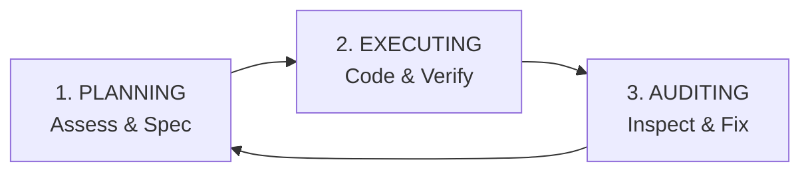

<div align="center">


# Kramak (क्रमक)

**The missing SDLC for AI agents.**

*√kram (to step, to progress methodically) + -aka (the agent who does)*

[](LICENSE)
[](VERSION)
[](spec/state.schema.json)
[](#)
[](#)

</div>

---

> AGENTS.md tells AI what your project is. Kramak tells AI how to build it — autonomously, verifiably, across any tool.

---

## What is this?

Kramak is a **file-based, model-agnostic, IDE-agnostic autonomous development methodology.** It provides a complete Plan → Execute → Audit loop that any AI coding agent can follow to develop software without human intervention.

It's like Scrum or Kanban, but for AI-assisted development.

> **This repo contains zero mandatory runtime dependencies.** Kramak is a set of markdown specifications, JSON schemas, and templates — a pure process framework. You bring it into *your* project, and any AI agent that can read files can follow it.

### Why does this exist?

The AI coding landscape in 2026 has a gap:

| Layer | Standard | Status |
|---|---|---|
| **Context** ("What is my project?") | AGENTS.md | ✅ 60k+ repos, AAIF standard |
| **Protocol** ("How do tools connect?") | MCP | ✅ Industry standard |
| **Process** ("How to autonomously develop?") | **Kramak (क्रमक)** | 🚀 **Fills this gap** |

---

## Key Features

| Feature | What it does | Why it matters |
|---|---|---|
| **Grounded Verification** | Every spec quotes actual code, confirmed by grep | Prevents hallucinated specs |
| **Anti-Bias Guard** | 5-point checklist before pipeline self-improvement | Prevents recency bias in self-evolving systems |
| **Perspective-Based Planning** | PERCEIVE → REASON → DECIDE assessment cycle | Ensures strategic thinking from the right angle |
| **Spec Detail Scaling** | 🔴 Guided (exact BEFORE/AFTER) · 🟡 Directed (intent+constraints) · 🟢 Outcome (goal+criteria) | Right level of detail per risk level |
| **Failure Taxonomy** | 6 failure categories with structured diagnosis | Enables learning from failures |
| **Hard Scope Check** | `git diff --name-only` vs spec file list | Deterministic scope enforcement |
| **State Reconciliation** | Crash recovery from state.json inconsistency | Survives session crashes |
| **Circuit Breaker** | Stops infinite audit-fix-audit loops | Prevents wasted work |
| **INBOX System** | Structured mid-project user input | Users can contribute without breaking flow |
| **Human Task Protocol** | Tracks tasks requiring human action | Pipeline doesn't block on what it can't do |
| **Auto-Bootstrap** | Detects project type and toolchain automatically | Works on any project from day 1 |

---

## Quick Start

### 1. One-Line Setup (Recommended)

In your project root, run:

```bash
# macOS / Linux / WSL
curl -fsSL https://raw.githubusercontent.com/bhaskarjha-dev/kramak/main/init.sh | sh

# Windows (PowerShell)
iwr -useb https://raw.githubusercontent.com/bhaskarjha-dev/kramak/main/init.ps1 | iex
```

### 2. Manual Setup

```bash
# Clone Kramak
git clone https://github.com/bhaskarjha-dev/kramak.git

# Copy specs and templates into your project
cp -r kramak/spec/ your-project/.kramak/
cp -r kramak/templates/ your-project/.agents/pipeline/
```

### 3. Choose your AI tool & Say "Start"

Use one of the pre-built adapters:
- [Google Antigravity IDE](adapters/antigravity/SKILL.md)
- [Cursor](adapters/cursor/README.md)
- [Claude Code](adapters/claude-code/README.md)
- [Windsurf](adapters/windsurf/README.md)
- [Cline & Roo Code](adapters/cline/README.md)
- [GitHub Copilot](adapters/copilot/README.md)
- [Aider](adapters/aider/README.md)
- [Any AI Tool (Generic)](adapters/generic/README.md)

---

## How It Works



**State persists across sessions** via `state.json` (validated against `spec/state.schema.json`).

**Model agnostic** — uses capability self-assessment, not model names. High-reasoning models plan; fast, precise models execute.

**IDE agnostic** — pure markdown and JSON files.

---

## Project Structure

```
kramak/
├── README.md                  ← You are here
├── LICENSE
├── CHANGELOG.md               ← Evolution history
├── CONTRIBUTING.md            ← Anti-Bias Guard guidelines
├── CODE_OF_CONDUCT.md
├── VERSION                    ← Spec version (1.0.0)
├── init.sh / init.ps1         ← One-command bootstrapper
├── spec/                      ← The core methodology
│   ├── PLANNER.md             ← Planning procedure & perspectives
│   ├── EXECUTOR.md            ← Execution procedure & audit execution
│   ├── PRINCIPLES.md          ← Constitutional development principles
│   ├── BOOTSTRAP.md           ← First-time setup & toolchain detection
│   └── state.schema.json      ← JSON Schema for state.json validation
├── templates/                 ← Workspace file templates
│   ├── state.json             ← State template
│   ├── INBOX.md               ← User input inbox
│   ├── HUMAN-TASKS.md         ← Human task tracker
│   ├── PLANNING-LOG.md        ← Planning history template
│   ├── batch-plan.md          ← Batch plan template
│   ├── audit-report.md        ← Audit report template
│   ├── work-item-guided.md    ← 🔴 Critical Guided WI template
│   ├── work-item-directed.md  ← 🟡 Medium Directed WI template
│   └── work-item-outcome.md   ← 🟢 Low Outcome WI template
├── adapters/                  ← IDE-specific integrations
│   ├── antigravity/           ← Google Antigravity IDE
│   ├── cursor/                ← Cursor (.mdc rule)
│   ├── claude-code/           ← Claude Code (CLAUDE.md)
│   ├── windsurf/              ← Windsurf (.windsurfrules)
│   ├── cline/                 ← Cline & Roo Code (.clinerules)
│   ├── copilot/               ← GitHub Copilot Workspace
│   ├── aider/                 ← Aider pair programming
│   └── generic/               ← Any AI coding tool
├── scripts/                   ← Zero-dependency tooling
│   └── validate.js            ← State & pipeline integrity linter
├── hooks/                     ← Git hooks
│   └── pre-commit             ← Build & state verification
├── docs/                      ← Documentation
│   ├── SPECIFICATION.md       ← Formal state machine & invariant spec
│   ├── GETTING-STARTED.md     ← Walkthrough guide
│   ├── COMPARISON.md          ← vs RIPER-5, Spec Kit, Aider, Devin
│   ├── FAQ.md                 ← Monorepos, models, edge cases
│   └── assets/                ← Logo and diagrams
├── examples/                  ← Sample adoption walkthrough
└── .github/                   ← CI/CD & Issue/PR templates
```

---

## Validation & Tooling

Validate your pipeline anytime:

```bash
node scripts/validate.js
```

Install the pre-commit hook for automated checks before every commit:

```bash
cp hooks/pre-commit .git/hooks/pre-commit && chmod +x .git/hooks/pre-commit
```

---

## Contributing

See [CONTRIBUTING.md](CONTRIBUTING.md).

All pipeline modifications must pass the **Anti-Bias Guard** — a 5-point checklist preventing recency bias in self-evolving systems.

---

## License

MIT — see [LICENSE](LICENSE).
