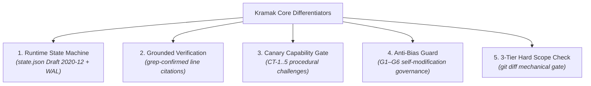

# Comparative Analysis: Kramak vs. the AI Development Landscape

> **Positioning:** Process control for autonomous coding agents  
> *Layer 3 — Process, alongside `AGENTS.md` (Context) and `MCP` (Connectivity)*

---

## 1. Executive Landscape Overview

As of August 2026, the autonomous AI coding ecosystem is structured around two established standards under the **Agentic AI Foundation (AAIF)**:
- **Layer 1 — Context (`AGENTS.md`):** Over 60,000 repositories declare project context and conventions in a standardized Markdown format `(Grade A)`.
- **Layer 2 — Protocol (`MCP`):** Over 110 million monthly SDK downloads connect agents to tools and host APIs `(Grade B)`.
- **Layer 3 — Process (`Kramak`):** Governs the runtime state machine, planning loops, scope enforcement, and auditability.

While the Process layer contains multiple active projects (>200,000 combined GitHub stars across Spec Kit, BMAD, GSD, OpenSpec, and RIPER-5 forks) `(Grade C)`, existing tools focus primarily on **pre-execution specification generation** or **conversational prompt conventions**. 

**Kramak is uniquely positioned as the deterministic runtime process-control and audit substrate that composes with, rather than replaces, upstream specification tools.**

---

## 2. Master Comparison Matrix

| Dimension | Kramak (क्रमक) | GitHub Spec Kit | RIPER-5 & Forks | BMAD Method | GSD ("Get Stuff Done") | OpenSpec |
|---|---|---|---|---|---|---|
| **Primary Category** | **Runtime Process Control** | Spec-Driven Dev (SDD) | System Prompt Mode | Agile Persona Framework | Execution Orchestration | Delta Specifications |
| **State Persistence** | **`state.json` (Draft 2020-12) + WAL** | Plain Markdown files | Markdown memory bank | Markdown story files | Markdown session logs | Markdown delta files |
| **State Machine** | **8-State Closed FSM** | None (advisory slash commands) | None (advisory prompt mode) | 4-Phase loop (advisory) | Multi-agent wave loop | 3-Step delta lifecycle |
| **Scope Enforcement** | **3-Tier Hard Scope Check** (`git diff`) | Advisory | Advisory ("don't edit X") | Human-in-the-loop review | Sub-agent diff review | Advisory delta bounds |
| **Verification Gate** | **Grounded Verification** (grep quotes) | Manual checklist (`/checklist`) | Unverified self-claim | Verification story | Sub-agent test runner | Test suite execution |
| **Audit Loopback** | **Core FSM loopback** (`AUDIT → PLAN`) | Optional (`/speckit.converge`) | Advisory review mode | Optional module ("BMad Loop") | Sub-agent debugger | Manual delta merge |
| **Self-Improvement** | **Anti-Bias Guard (G1–G6)** | None | None | None | None | None |
| **Capability Gate** | **Procedural Canaries (CT-1..5)** | None | None | None | None | None |
| **Dependencies** | **Zero mandatory dependencies** | CLI (`uv`, Python 3.11+) | Zero (prompt text) | Node.js / Python | Claude Code CLI | Node.js CLI |
| **Interoperability** | **Model & IDE Agnostic** (`AGENTS.md`) | 30+ agent integrations | Tool-specific forks | Multi-IDE persona configs | Claude Code specific | Multi-tool integrations |

---

## 3. Deep-Dive Comparative Breakdown

### 3.1 Kramak vs. GitHub Spec Kit
- **GitHub Spec Kit (128k+ stars):** A leading tool for pre-execution specification generation (`/specify → /plan → /tasks → /implement`) `(Grade A)`.
- **The Seam:** Spec Kit focuses on authoring specs before code is written. Once implementation begins, Spec Kit provides no runtime state machine, schema-validated execution state, or deterministic scope enforcement `(Grade A/C)`.
- **How They Compose:** Kramak does not compete with Spec Kit's prompt workflows. Kramak's `BOOTSTRAP` and `PLANNING` states can ingest Spec Kit's `spec.md` and `tasks.md` artifacts and execute them under Kramak's 8-state FSM, 3-Tier Hard Scope Checks, and automated audit loop.

### 3.2 Kramak vs. RIPER-5 (and Forks)
- **RIPER-5:** Originated as a prompt protocol on the Cursor community forum defining 5 modes (Research, Innovate, Plan, Execute, Review) `(Grade A)`.
- **The Problem:** Because RIPER-5 is delivered as prompt text, it relies on the model's subjective willingness to adhere to instructions. As a result, the community has fragmented into multiple forks (CursorRIPER, CursorRIPER.sigma, claude-code-riper-5) attempting to hand-code memory banks and strict modes `(Grade B)`.
- **The Difference:** Kramak replaces informal prompt conventions with a machine-readable, schema-validated state machine (`state.json`), Write-Ahead Logging, and mechanical git scope gates that operate independently of LLM self-discipline.

### 3.3 Kramak vs. BMAD Method
- **BMAD Method (52k+ stars):** An agile persona framework assigning 12+ specialized agent personas (Architect, Scrum Master, Developer, QA) to software tasks `(Grade A)`.
- **The Difference:** BMAD is organized around organizational role-playing. Kramak is a streamlined, deterministic process-control specification focused on mathematical state transitions, token economy (progressive disclosure), and automated verification gates.

### 3.4 Kramak vs. GSD ("Get Stuff Done")
- **GSD (17k–26k stars):** An execution-first framework built primarily around Claude Code sub-agent waves `(Grade C)`.
- **The Difference:** GSD focuses on rapid multi-agent parallel execution without formal schema contracts. Kramak provides deterministic single-writer state shards, git-worktree filesystem isolation, and an explicit serialized merge queue to eliminate merge collisions and race conditions.

### 3.5 Kramak vs. OpenSpec
- **OpenSpec (24k+ stars):** A brownfield-first specification tool that generates delta specs for incremental repository modifications `(Grade C)`.
- **The Difference:** OpenSpec standardizes declarative delta documentation. Kramak standardizes the procedural execution engine, verifying that the delta is executed within strict file boundaries and validated by fresh-session auditors.

### 3.6 Kramak vs. Native IDE Orchestration (Devin, Antigravity, OpenHands)
- **Native Orchestration:** Tools like Cognition Devin, Google Antigravity, and OpenHands ship integrated multi-agent task managers and sandboxes `(Grade A/B)`.
- **The Difference:** Native orchestration platforms are closed or single-vendor runtimes whose state lives in proprietary databases or cloud sessions. Kramak is an open, portable, file-based specification that runs inside any host environment without vendor lock-in.

---

## 4. The 5 Core Differentiators Unique to Kramak

Kramak introduces 5 core mechanisms not found in any other cross-tool framework:

### 1. Runtime State Machine & Crash Recovery
Kramak persists execution ground truth in `.kramak/state.json`, validated against a strict JSON Schema Draft 2020-12. Write-Ahead Logging (WAL) and level-triggered state reconciliation allow agents to resume safely after unexpected session crashes or context resets without data loss.

### 2. Grounded Verification Protocol
To prevent hallucinated refactoring, Kramak mandates that planning specifications quote confirmed code lines verified via live `grep` before modifications are proposed. Unverified code references are rejected in `PLANNING`.

### 3. Procedural Canary Capability Gate (CT-1 to CT-5)
Kramak assesses model reasoning competence using randomized, procedurally generated micro-challenges (DAG scheduling, plan-bug detection, state tracking, instruction hierarchy, paraphrase consistency) graded by deterministic algorithms, completely eliminating model-name allowlists.

### 4. Anti-Bias Guard (G1–G6)
Kramak is self-improving, allowing agents to propose updates to Kramak's own specifications during audits. The G1–G6 governance framework (history diff, rollback cross-check, dual-model critique, immutable ledger, cooldown, human gate) prevents recency bias and prompt degradation.

### 5. 3-Tier Hard Scope Check
Kramak mechanically compares `git diff --name-only` against the declared `files_targeted` list at three distinct checkpoints:
- **Tier 1 (Worktree):** Post-execution diff check prior to commit.
- **Tier 2 (Pre-Flight):** Static mutual exclusion verification across parallel tasks.
- **Tier 3 (Merge):** Re-verification against integration HEAD before queue advancement.

---

## 5. Evidence Ledger & Research Discipline

In accordance with our research standards, Kramak's design parameters are informed by peer-reviewed software engineering and multi-agent systems research:

- **Evidence Standards Applied:**
  - **Grade A:** Official specifications, foundation announcements (AAIF), peer-reviewed papers.
  - **Grade B:** Empirical research preprints, verified practitioner deployments, technical reports.
  - **Grade C:** Community discussions, aggregators, directional survey data.

> [!NOTE]
> **Evidence Language Discipline:** Kramak's design parameters (such as the 2-hour task horizon heuristic, Polish Ceiling Rule, and 6-category Failure Taxonomy) are informed by and aligned with empirical literature (including METR task-horizon evaluations, FeatBench scope-creep studies, and NeurIPS MAST multi-agent failure benchmarks).
