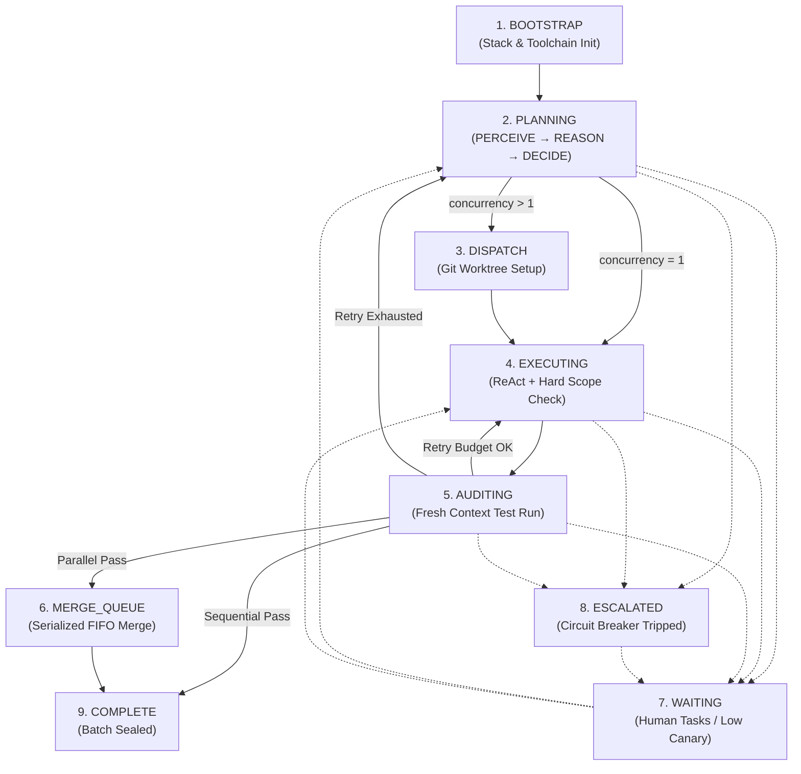

# Getting Started with Kramak

> **Process control for autonomous coding agents**
> *Layer 3 — Process, alongside `AGENTS.md` (Context) and `MCP` (Connectivity)*

---

## 1. Prerequisites

- A git-initialized project repository
- An AI coding agent (Claude Code, Cursor, Google Antigravity, GitHub Copilot, Devin Desktop, Cline, or Aider)
- No package installations, runtimes, or build tools required

---

## 2. 30-Second Quickstart (Pure Copy-Paste — No CLI)

### Step 1: Copy `.kramak/` into your project

```bash
# Clone Kramak and copy the governance directory
git clone https://github.com/bhaskarjha-dev/kramak.git /tmp/kramak
cp -r /tmp/kramak/.kramak ./
```

Your project directory will now contain:
```
your-project/
├── .kramak/
│   ├── ROUTER.md                     # Master invariant router (always read first)
│   ├── AGENTS.md                     # Universal AAIF context bridge
│   ├── SKILL.md                      # Universal Agent Skills standard
│   ├── schemas/                      # JSON Schemas (state, work-item, work-item-state)
│   ├── planner/                      # Planning specifications (CORE.md, edge cases, contracts)
│   ├── executor/                     # Execution specifications (CORE.md, error recovery, playbooks)
│   ├── templates/                    # Work item, human task, and retro templates
│   ├── work-items/                   # Active and queued work items
│   ├── inbox/                        # User requests and bug reports
│   └── ledger/                       # Immutable self-modification audit ledger
└── (your project source code)
```

### Step 2: Configure your agent's entry point

If your project uses `AGENTS.md` (or your IDE's instructions file like `CLAUDE.md`, `.cursorrules`, or `.gemini/AGENTS.md`), add:

```markdown
# Autonomous Development
Before taking any action, read [.kramak/ROUTER.md](.kramak/ROUTER.md) and follow the active state in [.kramak/state.json](.kramak/state.json).
```

Or use a pre-built adapter from the [`adapters/`](../adapters/) directory:

| IDE | Adapter File | Copy To |
|-----|-------------|---------|
| Claude Code | `adapters/claude-code/CLAUDE.md` | Project root as `CLAUDE.md` |
| Cursor | `adapters/cursor/.cursorrules` | Project root as `.cursorrules` |
| Antigravity | `adapters/antigravity/SKILL.md` | `.agents/skills/kramak/SKILL.md` |
| GitHub Copilot | `adapters/copilot/copilot-instructions.md` | `.github/copilot-instructions.md` |
| Devin Desktop | `adapters/devin/AGENTS.md` | Project root as `AGENTS.md` |
| Cline | `adapters/cline/.clinerules` | Project root as `.clinerules` |
| Aider | `adapters/aider/CONVENTIONS.md` | Project root as `CONVENTIONS.md` |

### Step 3: Say "Start" to your IDE agent

Your agent will:
1. Inspect `.kramak/state.json` (or initialize with `phase: "bootstrap"` if missing).
2. Read `.kramak/ROUTER.md` to load the Non-Negotiable Invariants.
3. Run the Capability Gate (CT-1 to CT-5 micro-challenges) to calibrate routing.
4. Route to `.kramak/planner/CORE.md` to analyze requirements and generate Work Items.

---

## 3. Optional CLI Quickstart

If you prefer automated scaffolding and offline validation, use the optional companion CLI:

```bash
# Initialize Kramak in the current directory
npx @kramak/cli init

# Validate state.json and work items against JSON Schemas
npx @kramak/cli validate

# Diagnose environment and adapter setups
npx @kramak/cli doctor
```

*(The CLI is maintained separately under [`kramak-cli`](https://github.com/bhaskarjha-dev/kramak-cli) and is completely optional.)*

---

## 4. How the Kramak Loop Operates

Kramak governs development through a 9-state closed-loop Finite State Machine (FSM):



### State Descriptions

| State | Role | What Happens |
|-------|------|-------------|
| **BOOTSTRAP** | Orchestrator | Auto-detects toolchain, initializes `state.json`, runs state reconciliation |
| **PLANNING** | Planner (High-Reasoning) | PERCEIVE → REASON → DECIDE cycle; generates Work Items with declared scope |
| **DISPATCH** | Orchestrator | Provisions git worktrees for parallel execution; verifies zero scope overlap |
| **EXECUTING** | Executor (High-Precision) | Implements changes within declared `files_targeted`; enforces 3-Tier Scope Check |
| **AUDITING** | Auditor (Fresh Context) | Runs tests in clean session; manages bounded retries; loops back or completes |
| **MERGE_QUEUE** | Orchestrator | Serializes parallel worktree branches into integration branch (FIFO) |
| **WAITING** | Human Coordinator | Blocks on human input; reachable from any active state |
| **ESCALATED** | Circuit Breaker | Triggered by repeated failures or oscillation detection; requires human review |
| **COMPLETE** | Summary | Batch sealed; agent produces retrospective |

---

## 5. Progressive Disclosure Architecture

Kramak splits specifications into a lean always-loaded core and on-demand modules to prevent instruction-stacking degradation:

| Document | Path | When Loaded |
|----------|------|------------|
| **Master Router** | `.kramak/ROUTER.md` | **Always** — every session, every turn |
| **Planner Core** | `.kramak/planner/CORE.md` | `phase == "planning"` or `"bootstrap"` |
| **Output Contract** | `.kramak/planner/output-contract.md` | When authoring Work Items |
| **Edge Cases** | `.kramak/planner/edge-cases.md` | Refactors >10 files, migrations, deprecations |
| **Domain Conventions** | `.kramak/planner/domain-conventions.md` | Monorepos, polyglot stacks |
| **Capability Gate** | `.kramak/planner/capability-gate.md` | During BOOTSTRAP (first session) |
| **Executor Core** | `.kramak/executor/CORE.md` | `phase == "executing"` or `"auditing"` |
| **Error Recovery** | `.kramak/executor/error-recovery.md` | On test failure or build error |
| **Tool Playbooks** | `.kramak/executor/tool-playbooks.md` | Git worktrees, complex patch application |

---

## 6. User Interaction: INBOX & Human Tasks

### Submitting Mid-Project Guidance

Drop notes or bug reports into `.kramak/inbox/` at any time:

```markdown
<!-- .kramak/inbox/bug-session-cookie.md -->
### Bug: Session cookie missing SameSite attribute
**Type:** bug
**Priority:** high
Chrome rejects authentication cookies on cross-origin redirects.
```

The Planner checks `inbox/` during the ORIENT step of every planning cycle and incorporates pending items immediately.

### Non-Blocking Human Tasks

When an agent encounters a step it cannot perform autonomously (e.g., obtaining an OAuth secret), it:
1. Records the task using `.kramak/templates/HUMAN-TASKS.template.md`.
2. Marks `humanTasksPending: true` in `state.json`.
3. Continues executing any non-blocked Work Items.
4. Transitions to `WAITING` only when zero unblocked tasks remain.