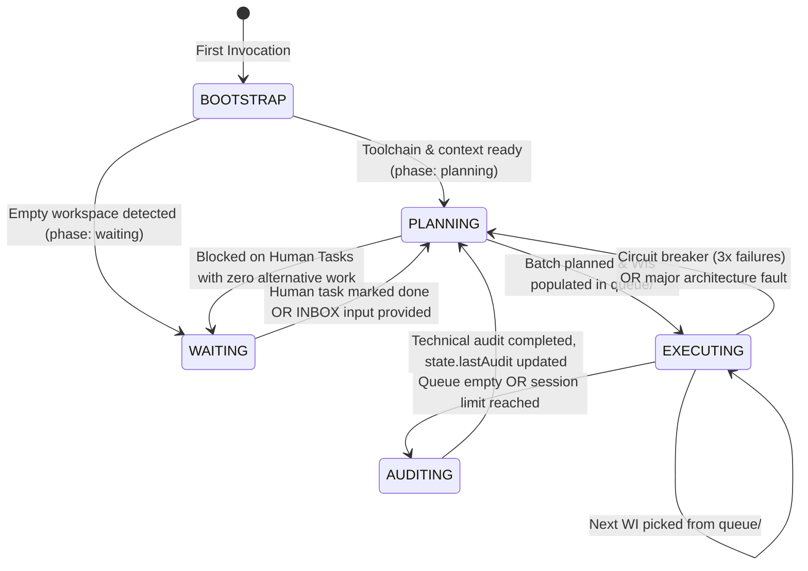
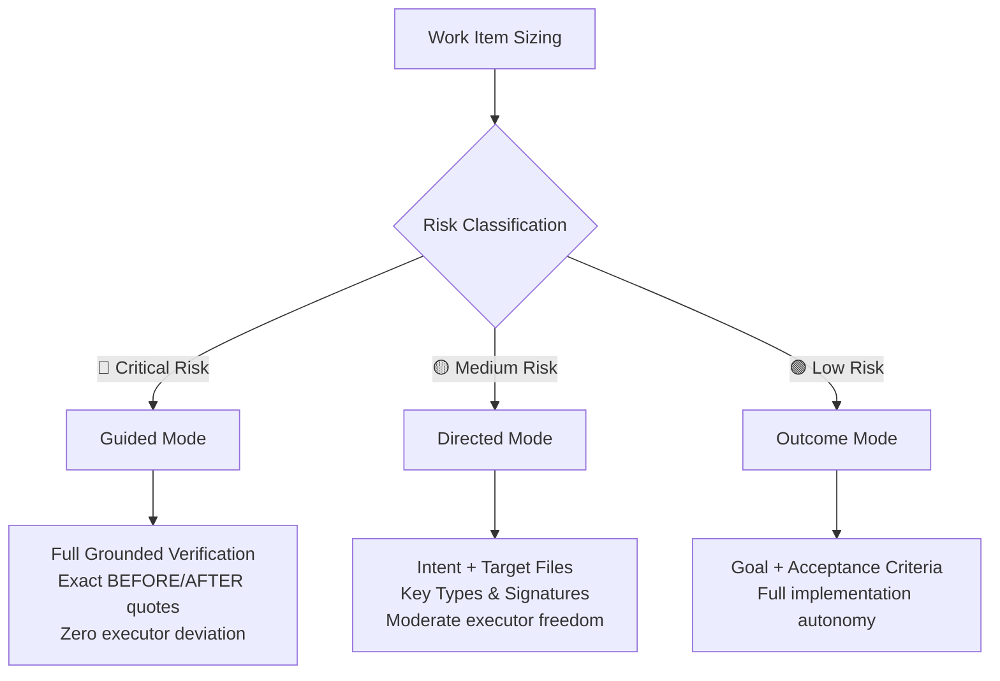

# Kramak (क्रमक) — Formal Specification & State Machine

> **Spec Version:** `1.0.0`  
> **Status:** Standard Reference Specification  
> **Classification:** Pure Process Framework / Autonomous Agent SDLC

---

## 1. Abstract

Kramak defines a file-based, deterministic Software Development Life Cycle (SDLC) for autonomous artificial intelligence coding agents. It separates strategic reasoning (Planning) from deterministic code modification (Execution) and empirical quality inspection (Auditing).

This document serves as the formal state machine and invariant specification for implementors of Kramak adapters, tooling, and autonomous pipelines.

---

## 2. State Machine Definition

A Kramak pipeline instance is modeled as a deterministic finite-state automaton with cross-session persistence:

$$M = (S, \Sigma, \delta, s_0, F)$$

### 2.1 States ($S$)

| State | Role | Primary Responsible Model Tier | Key Artifacts |
|---|---|---|---|
| $s_{\text{bootstrap}}$ | Initializer | Any capable tool | `.agents/pipeline/`, `state.json` |
| $s_{\text{planning}}$ | Architect / Strategist | High-Reasoning Tier (Claude Opus, Gemini Pro, GPT-o1/o3) | `plans/PLAN-batch-XX.md`, `queue/WI-XXX.md` |
| $s_{\text{executing}}$ | Engineer | Fast / Precise Tier (Claude Sonnet, GPT-4o, Gemini Flash) | Code modifications, `done/WI-XXX.md` |
| $s_{\text{auditing}}$ | Technical Inspector | Fast / Fresh Context Executor | `plans/AUDIT-batch-NN.md`, inline fixes |
| $s_{\text{waiting}}$ | Blocked / Idle | Human / External Operator | `HUMAN-TASKS.md`, `INBOX.md` |

### 2.2 Transition Function ($\delta$)



1. $\delta(s_{\text{bootstrap}}, \text{ToolchainDetected}) \to s_{\text{planning}}$
2. $\delta(s_{\text{bootstrap}}, \text{EmptyWorkspace}) \to s_{\text{waiting}}$
3. $\delta(s_{\text{planning}}, \text{BatchPlanCommitted}) \to s_{\text{executing}}$
4. $\delta(s_{\text{planning}}, \text{HardHumanBlock}) \to s_{\text{waiting}}$
5. $\delta(s_{\text{executing}}, \text{QueueNotEmpty} \land \text{DegradationLow}) \to s_{\text{executing}}$
6. $\delta(s_{\text{executing}}, \text{QueueEmpty} \lor \text{DegradationHigh}) \to s_{\text{auditing}}$
7. $\delta(s_{\text{executing}}, \text{CircuitBreaker} \lor \text{MajorArchFault}) \to s_{\text{planning}}$
8. $\delta(s_{\text{auditing}}, \text{AuditCompleted}) \to s_{\text{planning}}$
9. $\delta(s_{\text{waiting}}, \text{HumanTaskResolved} \lor \text{InboxInput}) \to s_{\text{planning}}$

---

## 3. Directory & Filesystem Contract

Every compliant Kramak workspace MUST maintain the following directory topology:

```
.agents/pipeline/
├── state.json              ← Cross-session state (validated against state.schema.json)
├── INBOX.md                ← Mid-project user inputs and strategic findings
├── HUMAN-TASKS.md          ← Pending and resolved external/human dependencies
├── PLANNING-LOG.md         ← Reverse-chronological log of planning perspectives
├── queue/                  ← Work items waiting for execution (WI-XXX.md)
├── active/                 ← Single work item currently being executed
├── done/                   ← Completed work items (immutable audit trail)
├── failed/                 ← Failed work items with mandatory ## Failure Diagnosis
└── plans/                  ← Batch plans and Audit reports
```

### 3.1 Filesystem Invariants

1. **Active Item Exclusivity:** At most **one** file may reside in `active/` at any given time. If `state.active` is non-null, exactly `active/<state.active>.md` must exist.
2. **Queue Consistency:** The set of Work Item IDs listed in `state.queue` must have a 1:1 bijective correspondence with files in `queue/`.
3. **Audit Trail Immutability:** Files moved into `done/` or `failed/` are historical records and must never be deleted or overwritten by subsequent sessions.

---

## 4. Spec Detail Scaling Protocol

To balance failure prevention against context saturation (the *Goldilocks Rule*), Work Items are categorized into three distinct tiers:



### 4.1 Grounded Verification Protocol (for 🔴 Guided)

For any high-risk change (auth, database schemas, financial/crypto logic):
1. **LOCATE:** Use `grep` or file search to pinpoint exact code lines.
2. **QUOTE:** Copy exact lines verbatim into the `// BEFORE:` block.
3. **VERIFY:** Run `grep` on a unique substring from BEFORE to ensure exactly 1 match.
4. **DESIGN:** Write the `// AFTER:` replacement.
5. **CROSS-CHECK:** Identify all callers affected by signature modifications.

---

## 5. Failure Taxonomy

When a work item cannot be completed safely, it is transitioned to `failed/` and annotated with a standardized failure category:

| Category | Description | Mitigation Strategy |
|---|---|---|
| `code-drift` | Code modified between planning and execution | Planner re-locates ground truth and re-issues WI |
| `verification-fail` | Toolchain check fails after 3–5 attempts | Re-evaluate approach or break into sub-items |
| `scope-exceeded` | Fix requires editing files outside WI scope | Issue ad-hoc work item or expand story scope |
| `dependency-missing` | Prerequisite WI failed or was skipped | Reorder queue or resolve prerequisite |
| `ambiguous-spec` | Contradictory or underspecified criteria | Re-plan with Guided or Directed spec |
| `tool-error` | Environment, network, or OS failure | Retry in fresh session or flag human task |

---

## 6. The Anti-Bias Guard (Meta-Governance)

Before any modification to Kramak specifications or templates, the change must pass the 5-point Anti-Bias Guard:

1. **Failure Mode Identity:** What specific, observable failure mode does this change prevent?
2. **Generality:** Is this change beneficial across all project domains (backend, frontend, security, devops, docs)?
3. **Scenario Matrix:** Does this change assist in all three scenarios:
   - Scenario A: Backend database migration
   - Scenario B: Frontend interactive component
   - Scenario C: Security & auth hardening
4. **Non-Harm:** Could this change slow down or harm a different development category?
5. **Cooldown Verification:** Has the change been validated in a fresh context after reflection?
