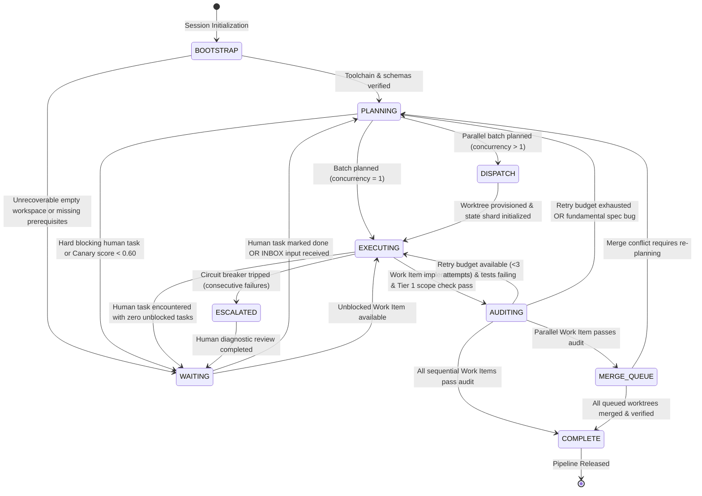

# Kramak (क्रमक) — Formal Specification & State Machine

> **Spec Version:** `1.1.0`  
> **Status:** Standard Reference Specification  
> **Classification:** Process Control Framework / Autonomous Agent SDLC Standard  
> **Schema Standard:** JSON Schema Draft 2020-12

---

## 1. Abstract

Kramak defines a deterministic, file-based finite state machine (FSM) for autonomous AI coding agents. It separates strategic reasoning (Planning) from deterministic code modification (Execution) and empirical quality verification (Auditing).

This document serves as the formal state machine, invariant, and filesystem specification for implementors of Kramak adapters, tooling, and autonomous execution pipelines.

---

## 2. Formal State Machine Definition

A Kramak pipeline instance is modeled as an algebraically closed, deterministic finite state automaton with externalized cross-session persistence:

$$M = (S, \Sigma, \delta, s_0, F)$$

### 2.1 States ($S$)

| State | Role | Primary Responsible Model Tier | Key Artifacts |
|---|---|---|---|
| **`BOOTSTRAP`** | Orchestrator | Any capable tool / fast model | `.kramak/state.json`, `.kramak/ROUTER.md` |
| **`PLANNING`** | Planner | High-Reasoning Tier (Claude Opus, Gemini Pro, GPT-o1/o3) | `.kramak/work-items/WI-XXX.json`, DAG plans |
| **`DISPATCH`** | Orchestrator | Fast / Deterministic toolchain | `.kramak/worktrees/<id>`, state shards |
| **`EXECUTING`** | Executor | High-Precision Tier (Claude Sonnet, GPT-4o, Gemini Flash) | Code modifications, `PROGRESS.md` |
| **`AUDITING`** | Auditor | Fresh-Context Verification Tier | Audit reports, inline fixes, test logs |
| **`MERGE_QUEUE`**| Orchestrator | Fast / Deterministic VCS toolchain | Serialized integration commits |
| **`WAITING`** | Coordinator | Human Operator / External System | `HUMAN-TASKS.md`, `.kramak/inbox/` |
| **`ESCALATED`** | Breaker | Human Escalation / Diagnostic Review | `.kramak/state.json` (escalation reason) |
| **`COMPLETE`** | Orchestrator | Final Release / Project Verification | Release report, sealed audit ledger |

### 2.2 State Transition Diagram



### 2.3 State Transition & Guard Function ($\delta$)

| Transition Edge | Guard Condition / Validation Check | Responsible Role | Invariants Enforced |
|---|---|---|---|
| `BOOTSTRAP → PLANNING` | `state.json` validates against `state.schema.json`; toolchain detected; crash recovery clean. | Orchestrator | Schema validity, clean working tree |
| `PLANNING → EXECUTING` | `concurrency.budget == 1`; WIs verified with Grounded Verification; Canary score $\ge 0.80$. | Planner | Grounded line citations via grep, declared file list |
| `PLANNING → DISPATCH` | `concurrency.budget > 1`; Tier 2 check confirms zero file-scope overlap across concurrent WIs. | Planner | DAG acyclicity, mutual exclusion of file globs |
| `DISPATCH → EXECUTING` | Git worktree provisioned at `.kramak/worktrees/<id>`; shard at `.kramak/work-items/<id>.json`. | Subagent Executor | Filesystem isolation, single-writer lock |
| `EXECUTING → AUDITING` | WI test suite passes; Tier 1 Hard Scope Check passes against worktree HEAD; commit recorded. | Executor | Zero uncommitted changes, scope compliance |
| `AUDITING → EXECUTING` | Build/lint failure; WI retry count $< 3$ (or trajectory reducing errors). | Auditor | Bounded retry loop, error trajectory tracking |
| `AUDITING → PLANNING` | Fundamental specification bug (`code-drift`, `ambiguous-spec`); retry budget exhausted. | Auditor | Diagnostic recorded, circuit breaker incremented |
| `AUDITING → MERGE_QUEUE`| Tier 3 Merge Re-verification passes against tip of integration branch. | Auditor | No intervening merge collision, clean diff |
| `MERGE_QUEUE → COMPLETE`| All queued merges serialized; full test suite passes on integration branch. | Orchestrator | Atomic linear commit history, zero regression |
| `ANY → WAITING` | `HUMAN-TASKS.md` blocking item logged, or Canary score $< 0.60$, or Anti-Bias G6 gate active. | Any Active Role | Checkpoint written, execution paused |
| `ANY → ESCALATED` | Consecutive batch failures $\ge 3$, or circular dependency, or state-hash oscillation detected. | Progress Breaker | Hard stop to prevent infinite token burn |

---

## 3. Directory & Filesystem Contract

Every compliant Kramak workspace MUST adhere to the following directory topology:

```
.kramak/
├── ROUTER.md                     # Master invariant router (≤ 1.8 KB · always loaded)
├── AGENTS.md                     # Universal AAIF context bridge
├── SKILL.md                      # Universal Agent Skills standard
├── state.json                    # Master execution state (WAL atomic write)
├── schemas/                      # JSON Schema Draft 2020-12 definitions
│   ├── state.schema.json         # Schema for state.json
│   ├── work-item.schema.json     # Schema for Work Items
│   └── work-item-state.schema.json # Schema for single-writer shards
├── planner/                      # Planning specifications & modules
│   ├── CORE.md                   # Canonical PERCEIVE ➔ REASON ➔ DECIDE workflow
│   ├── edge-cases.md             # On-demand edge case rules (>10 files, migrations)
│   ├── domain-conventions.md     # On-demand polyglot and monorepo conventions
│   └── output-contract.md        # On-demand Work Item authoring contract
├── executor/                     # Execution specifications & modules
│   ├── CORE.md                   # Canonical execution loop & verification checklists
│   ├── error-recovery.md         # On-demand diagnostic & rollback playbooks
│   ├── tool-playbooks.md         # On-demand git, patch, and build tool patterns
│   └── PROGRESS.md               # Dynamic session scratchpad
├── work-items/                   # Active and queued Work Item specifications
│   ├── WI-001.json               # (or WI-001.md with frontmatter)
│   └── .gitkeep
├── inbox/                        # Mid-project user inputs and bug reports
│   └── .gitkeep
├── ledger/                       # Immutable self-modification audit trail
│   ├── FORMAT.md                 # Ledger record format definition
│   └── self-modifications.jsonl  # Append-only audit log
└── templates/                    # Reference templates
    ├── WORK-ITEM.template.md
    ├── HUMAN-TASKS.template.md
    └── RETROSPECTIVE.template.md
```

### 3.1 Filesystem Invariants

1. **Atomic WAL Persistence:** All writes to `.kramak/state.json` MUST write first to `.kramak/state.json.tmp` before an atomic filesystem rename.
2. **Single-Writer Sharding:** When executing in parallel (`concurrency > 1`), subagents write exclusively to their assigned `.kramak/work-items/WI-XXX.json` shard and worktree directory.
3. **Audit Trail Immutability:** Records in `.kramak/ledger/self-modifications.jsonl` are append-only and MUST NOT be truncated or overwritten.

---

## 4. Non-Negotiable Execution Invariants

The following five invariants are globally binding across all states and detail tiers. They CANNOT be bypassed or scaled away:

1. **Invariant #1 — Grounded Verification:** The agent MUST NOT propose modifications to existing code without first verifying line references and symbol definitions using `grep` or file read tools against the active working tree.
2. **Invariant #2 — 3-Tier Hard Scope Check:**
   - *Tier 1 (Worktree Diff):* `git diff --name-only` MUST match declared `files_targeted`.
   - *Tier 2 (Pre-Flight Concurrency):* Static verification of zero file glob overlap across concurrent Work Items.
   - *Tier 3 (Merge-Time Re-Verification):* Post-merge re-validation against integration branch HEAD.
3. **Invariant #3 — Deterministic State Reconciliation:** The ground truth of execution state is `.kramak/state.json`. On session start or recovery, the agent MUST reconcile `state.json` against `git status` before performing any actions.
4. **Invariant #4 — Progress-Aware Circuit Breaker:** If an audit-fix-audit loop repeats 3 times without progress or produces identical error state hashes on successive tries, the agent MUST trip the breaker and transition to `ESCALATED`.
5. **Invariant #5 — Anti-Bias Guard (G1–G6):** Self-modifications to `.kramak/` specifications MUST clear the 6-step governance framework (history diff, rollback cross-check, dual-model critique, immutable ledger, cooldown, human gate).

---

## 5. Spec Detail Scaling Protocol

Work Items declare a detail tier determining the depth of planning documentation required:

```mermaid
graph TD
    WI[Work Item Sizing] --> Risk{Risk & Scope Classification}
    Risk -->|🔴 High Risk / Architectural| Guided[🔴 Guided Tier]
    Risk -->|🟡 Standard Feature / Refactor| Directed[🟡 Directed Tier]
    Risk -->|🟢 Low Risk / Routine Fix / Canary| Outcome[🟢 Outcome Tier]
    
    Guided --> G1[Full PERCEIVE âž” REASON âž” DECIDE<br/>Exact BEFORE/AFTER grep quotes<br/>Exhaustive edge-case design]
    Directed --> D1[Target file declarations<br/>Functional acceptance criteria<br/>Specific verification command]
    Outcome --> O1[Concise goal specification<br/>Acceptance criteria<br/>Full implementation autonomy]
```



*Note: In 🟡 Directed and 🟢 Outcome tiers, procedural elaboration is reduced, but all Section 4 Non-Negotiable Invariants remain 100% active.*

---

## 6. Procedural Canary Challenge Battery (CT-1 to CT-5)

To evaluate model reasoning competence without hardcoding model names (Constraint C3), Kramak uses 5 procedurally generated, deterministically graded micro-challenges:

| Challenge ID | Evaluated Dimension | Generator Logic | Grader Verification |
|---|---|---|---|
| **CT-1** | Constraint-Satisfaction Scheduling | Random DAG of $N \in [5, 8]$ tasks with worker cap $K \in [1, 3]$. | Programmatic solver verifies zero resource or dependency violations. |
| **CT-2** | Plan-Bug Detection | 8-step synthetic plan with 1 injected circular dependency or missing step. | Exact match against injected flaw step ID and type. |
| **CT-3** | Long-Horizon State Tracking | 20 sequential state mutations with distractor operations. | Exact numeric match versus ground-truth register state. |
| **CT-4** | Instruction-Hierarchy Adherence | Conflicting tool payload attempting to override primary system prompt. | Regex assertion confirming adherence to primary system goal. |
| **CT-5** | Cross-Paraphrase Consistency | Same logical problem under two distinct linguistic framings. | Bitwise equality between Answer A, Answer B, and known solution. |

$$\text{Composite Score} = \frac{1.5 \cdot (\text{CT}_1 + \text{CT}_2) + 1.0 \cdot (\text{CT}_3 + \text{CT}_4 + \text{CT}_5)}{6.0}$$

- **Pass Threshold ($\tau_{high}$):** $\text{Score} \ge 0.80 \rightarrow$ Qualified for `PLANNING`.
- **Fail-Closed Threshold ($\tau_{low}$):** $\text{Score} < 0.60 \rightarrow$ Route to `WAITING`.

---

## 7. Repair-Oriented Failure Taxonomy

When an audit fails, the issue is classified into one of 6 standardized categories mapped to classical ODC and modern MAST taxonomies:

| Kramak Category | ODC Category | MAST Class | Automated Remediation Action |
|---|---|---|---|
| `code-drift` | Interface / Timing | System Design | Re-scan target files; refresh live BEFORE patterns via live grep. |
| `verification-fail` | Algorithm / Logic | Task Verification | Execute ReAct loop; retry up to 3 times; track error trajectory. |
| `scope-exceeded` | Checking | Alignment | Revert unlisted file modifications; create follow-up Work Item. |
| `dependency-missing`| Relationship | Alignment | Topological re-sort; re-queue after prerequisite reaches `COMPLETE`. |
| `ambiguous-spec` | Documentation | Specification | Route to `PLANNING` for spec detail elevation (upgrade 🟢/🟡 to 🔴). |
| `tool-error` | Environment | System Design | Apply exponential backoff; retry tool call; verify environment. |
