# Kramak (क्रमक) — Founding Architecture Document
### Master Architectural Specification & Sealed Phase 0 Synthesis

```yaml
---
id: SYN-01
title: "Kramak (क्रमक) — Founding Architecture Document"
synthesis_date: 2026-08-19
status: sealed
research_sessions_ingested: 15
decisions_locked: 11
open_questions: 0
schema_version: "3.0"
---
```

> **Authoritative Baseline Reference:** This document constitutes the definitive, sealed **Founding Architecture Document (FAD)** for **Kramak (क्रमक)** following the completion of Phase 0 research and validation. All subsequent implementation work, specification authoring (`.kramak/planner/CORE.md`, `.kramak/executor/CORE.md`, `.kramak/ROUTER.md`), and JSON Schema definitions trace directly to the decisions, primitives, and invariants established herein.

---

## 1. Executive Architecture Summary

Kramak (क्रमक — Sanskrit for *methodical, step-by-step procedure*) is an open-source, model-agnostic, and IDE-agnostic **process control framework** for autonomous AI coding agents. 

Within the three-layer agentic development stack established under the Agentic AI Foundation (AAIF) standards, Kramak occupies the critical and previously unstandardized **Layer 3 (Process Control)**:
- **Layer 1 — Context (`AGENTS.md`):** Defines repository identity, conventions, and architectural context for agents.
- **Layer 2 — Protocol (`Model Context Protocol / MCP`):** Defines the standardized communication protocol connecting agents to tools, language servers, and runtime environments.
- **Layer 3 — Process (`Kramak`):** Governs *how* the agent methodically plans, executes, verifies, and audits software changes through a deterministic finite state automaton with externalized state persistence and strict execution guardrails.

```
┌─────────────────────────────────────────────────────────────────────────────┐
│                          THE 3-LAYER AGENTIC STACK                           │
├───────────────────┬───────────────────────────────┬─────────────────────────┤
│ Layer             │ Standard / Technology         │ Role in System          │
├───────────────────┼───────────────────────────────┼─────────────────────────┤
│ Layer 1: Context  │ AGENTS.md / SKILL.md (AAIF)   │ Repository Context      │
│ Layer 2: Protocol │ Model Context Protocol (MCP)  │ Tool & Environment Comm │
│ Layer 3: Process  │ Kramak (क्रमक)                │ Runtime State & Control │
└───────────────────┴───────────────────────────────┴─────────────────────────┘
```

Kramak enforces **Zero Mandatory Runtime Dependencies**: the core framework consists purely of Markdown specifications, JSON Schemas (Draft 2020-12), and Git repository ledger mechanics. It operates on any LLM without model-name checking and interfaces with host environments via a universal `AGENTS.md` + `SKILL.md` baseline and thin declarative adapters for Tier 1 IDEs (Claude Code, Cursor).

---

## 2. Locked Decision Registry

All 11 architectural decisions from Phase 0 research have cleared their respective validation tracks (Track A fast-track or Track B 9-step gate) and are locked in the registry below:

| D-ID | Decision Title | Chosen Option | Door Type | Track | Confidence | Evidence References |
|---|---|---|:---:|:---:|:---:|---|
| **D-001** | Core FSA State Topology & Role Separation | 7-State Closed FSM with Bounded Retries & Pareto Role Split | 🔒 One-Way | Track B | High | [T2-05](file:///d:/dev/pro/kramak/research/sessions/T2-05-core-loop-retrospective.md), [T2-02](file:///d:/dev/pro/kramak/research/sessions/T2-02-orchestration-research-literature.md), [T2-15](file:///d:/dev/pro/kramak/research/sessions/T2-15-core-engine-governance-blueprint.md) (Grade A/B) |
| **D-002** | Multi-Agent Orchestration & Parallel Execution | Option B: Sequential Default + Worktree-Isolated Parallel Extension | 🔁 Two-Way | Track A | High | [T2-06](file:///d:/dev/pro/kramak/research/sessions/T2-06-multiagent-parallel-evolution.md), [T2-03](file:///d:/dev/pro/kramak/research/sessions/T2-03-ide-ecosystem-scan.md), [T2-15](file:///d:/dev/pro/kramak/research/sessions/T2-15-core-engine-governance-blueprint.md) (Grade A/B) |
| **D-003** | State Persistence, Invariants & Schema Versioning | SemVer JSON Schema Draft 2020-12 + WAL Atomic Writes & Migration | 🔒 One-Way | Track B | High | [T2-04](file:///d:/dev/pro/kramak/research/sessions/T2-04-evidentiary-audit.md), [T2-05](file:///d:/dev/pro/kramak/research/sessions/T2-05-core-loop-retrospective.md), [T2-15](file:///d:/dev/pro/kramak/research/sessions/T2-15-core-engine-governance-blueprint.md) (Grade A) |
| **D-004** | Model-Agnostic Capability Gating & Calibration | Hybrid Gate: Advisory Stage 1 + Binding Stage 2 Canary Challenge Battery | 🔒 One-Way | Track B | High | [T2-10](file:///d:/dev/pro/kramak/research/sessions/T2-10-capability-gate-reliability.md), [T2-04](file:///d:/dev/pro/kramak/research/sessions/T2-04-evidentiary-audit.md), [T2-15](file:///d:/dev/pro/kramak/research/sessions/T2-15-core-engine-governance-blueprint.md) (Grade A/B) |
| **D-005** | Adapter Portfolio Economics & Integration Strategy | Universal AGENTS.md/SKILL.md Core + Tier 1 Deep Overlays (Claude/Cursor) | 🔁 Two-Way | Track A | High | [T2-11](file:///d:/dev/pro/kramak/research/sessions/T2-11-adapter-strategy.md), [T2-03](file:///d:/dev/pro/kramak/research/sessions/T2-03-ide-ecosystem-scan.md), [T2-14](file:///d:/dev/pro/kramak/research/sessions/T2-14-positioning-platform-blueprint.md) (Grade A/B) |
| **D-006** | Self-Improvement Governance & Anti-Bias Guard | Hardened G1–G6 Anti-Bias Guard + Immutable Ledger & Risk-Tiered Gate | 🔒 One-Way | Track B | High | [T2-07](file:///d:/dev/pro/kramak/research/sessions/T2-07-self-improvement-governance.md), [T2-02](file:///d:/dev/pro/kramak/research/sessions/T2-02-orchestration-research-literature.md), [T2-15](file:///d:/dev/pro/kramak/research/sessions/T2-15-core-engine-governance-blueprint.md) (Grade A/B) |
| **D-007** | Specification Density & Progressive Disclosure | Progressive Disclosure: Lean ROUTER.md + On-Demand Modules | 🔁 Two-Way | Track A | High | [T2-08](file:///d:/dev/pro/kramak/research/sessions/T2-08-spec-density-progressive-disclosure.md), [T2-01](file:///d:/dev/pro/kramak/research/sessions/T2-01-competitive-landscape.md), [T2-14](file:///d:/dev/pro/kramak/research/sessions/T2-14-positioning-platform-blueprint.md) (Grade A) |
| **D-008** | Category Positioning, Naming & Tagline Legibility | Process Control Framing + Sanskrit Name + 3-Layer Mental Model | 🔒 One-Way | Track B | High | [T2-12](file:///d:/dev/pro/kramak/research/sessions/T2-12-naming-positioning.md), [T2-01](file:///d:/dev/pro/kramak/research/sessions/T2-01-competitive-landscape.md), [T2-14](file:///d:/dev/pro/kramak/research/sessions/T2-14-positioning-platform-blueprint.md) (Grade A/B) |
| **D-009** | Pure-Methodology vs. Optional Tooling/CLI Layer | Option 3 (EditorConfig Model): Decoupled Companion kramak-cli | 🔒 One-Way | Track B | High | [T2-09](file:///d:/dev/pro/kramak/research/sessions/T2-09-pure-methodology-tooling.md), [T2-01](file:///d:/dev/pro/kramak/research/sessions/T2-01-competitive-landscape.md), [T2-14](file:///d:/dev/pro/kramak/research/sessions/T2-14-positioning-platform-blueprint.md) (Grade A) |
| **D-010** | Execution Integrity, Grounding & Scope Enforcement | 3-Tier Hard Scope Check + Grounded Grep Citations + WAL Recovery | 🔒 One-Way | Track B | High | [T2-13](file:///d:/dev/pro/kramak/research/sessions/T2-13-guardrail-confirmation-bundle.md), [T2-04](file:///d:/dev/pro/kramak/research/sessions/T2-04-evidentiary-audit.md), [T2-15](file:///d:/dev/pro/kramak/research/sessions/T2-15-core-engine-governance-blueprint.md) (Grade A/B) |
| **D-011** | Quantitative Design Parameters & Failure Taxonomy | METR Horizon Recalibration + Polish Ceiling + Repair-Oriented Taxonomy | 🔁 Two-Way | Track A | High | [T2-04](file:///d:/dev/pro/kramak/research/sessions/T2-04-evidentiary-audit.md), [T2-13](file:///d:/dev/pro/kramak/research/sessions/T2-13-guardrail-confirmation-bundle.md), [T2-15](file:///d:/dev/pro/kramak/research/sessions/T2-15-core-engine-governance-blueprint.md) (Grade B/C) |

---

## 3. Architecture & Technology Primitives

### 3.1 Composed Standards & Ecosystem Interfaces (Wardley Commodity / Product)

| Component / Interface | Chosen Standard / Baseline | Architectural Rationale | Decision Ref |
|---|---|---|:---:|
| **State Persistence Schema** | JSON Schema Draft 2020-12 (`spec/state.schema.json`) | Universal machine-readable validation standard supported across all major programming languages without vendor lock-in. | D-003 |
| **Workspace Ledger & VCS** | Git Working Tree & Worktrees (`git worktree`) | Provides atomic filesystem isolation, diff computation, commit DAGs, and rollback capabilities with zero external dependencies. | D-002, D-010 |
| **Context Specification** | AAIF `AGENTS.md` & `SKILL.md` Standards | Open industry standards for agent context ingestion and skill definitions supported natively by modern AI coding tools. | D-005, D-008 |
| **Host Tool Protocol** | Model Context Protocol (MCP) | Universal protocol connecting coding agents to external tools, language servers, and filesystem operations. | D-008 |

### 3.2 Built Core Engine & Custom Methodology (Wardley Genesis / Custom)

| Subsystem | Description & Mechanism | Architectural Rationale | Decision Ref |
|---|---|---|:---:|
| **Core FSM Engine** | 7-State Automaton (`BOOTSTRAP` → `PLANNING` → `DISPATCH` → `EXECUTING` → `AUDITING` → `MERGE_QUEUE` → `COMPLETE`) | Closed-loop state machine with bounded retry budgets preventing infinite loops, unhandled crashes, and context drift. | D-001, D-002 |
| **Progressive Spec Hierarchy** | `.kramak/ROUTER.md` + `planner/CORE.md` + `executor/CORE.md` + On-demand Playbooks | Sub-10KB eager loading prevents "lost in the middle" attention decay and Claude Code 25KB truncation. | D-007 |
| **Hybrid Capability Gate** | Stage 1 Self-Assessment + Stage 2 Canary Challenge Battery (CT-1 to CT-5) | Algorithmic, model-agnostic verification of high-order reasoning competence without hardcoding model names. | D-004 |
| **3-Tier Hard Scope Check** | Tier 1 (Worktree Diff) + Tier 2 (Pre-flight Glob Intersection) + Tier 3 (Merge Re-verification) | Deterministic mechanical prevention of hallucinated refactoring, file scope creep, and concurrent merge collisions. | D-010, D-002 |
| **Hardened Anti-Bias Guard** | G1–G6 Governance: History Diff, Rollback Cross-Check, Dual-Model Critique, Immutable Ledger, Cooldown, Human Gate | Safe self-evolution preventing recency bias, self-preference, and accidental degradation of governance rules. | D-006 |
| **Decoupled Tooling Boundary** | Pure Markdown/JSON core repo (`kramak`) + Standalone Companion CLI (`kramak-cli`) | Guarantees zero supply-chain risk and zero-dependency brand purity while offering optional CLI convenience. | D-009 |
| **Tiered Adapter Generator** | Universal Core Generator (`AGENTS.md`/`SKILL.md`) + Tier 1 Deep Overlays (Claude Code `@` import, Cursor `.mdc` globs) | Maximizes cross-IDE distribution while minimizing ongoing maintenance overhead for a solo maintainer. | D-005 |

---

## 4. System Architecture & Control Plane Diagrams

### 4.1 Master Control Plane & State Machine

```mermaid
graph TD
    subgraph Context_Layer["Layer 1: Context & Ecosystem Interfaces (AAIF / Git)"]
        AGENTS["AGENTS.md (Universal Context)"]
        SKILLS["SKILL.md (Universal Skills)"]
        GIT["Git Working Tree / Worktrees"]
    end

    subgraph Platform_Layer["Layer 3: Kramak Platform & Specification Hierarchy"]
        ROUTER[".kramak/ROUTER.md<br/><b>Non-Negotiable Invariants</b>"]
        PLANNER_SPEC[".kramak/planner/CORE.md<br/><i>PERCEIVE âž” REASON âž” DECIDE</i>"]
        EXECUTOR_SPEC[".kramak/executor/CORE.md<br/><i>ReAct Loop & Scope Check</i>"]
        MODULES["On-Demand Playbooks<br/>(Edge Cases / Error Recovery / Tool Playbooks)"]
    end

    subgraph State_Persistence["Persistence & State Shards"]
        STATE_JSON[".kramak/state.json<br/><b>Master State (WAL Atomic)</b>"]
        WI_SHARDS[".kramak/work-items/WI-XXX.json<br/><b>Single-Writer Shards</b>"]
        LEDGER[".kramak/ledger/self-modifications.jsonl<br/><b>Immutable Audit Trail</b>"]
    end

    subgraph Control_Plane["Core 7-State Closed-Loop FSM"]
        BOOTSTRAP["BOOTSTRAP"] --> PLANNING["PLANNING<br/>(Reasoning Tier)"]
        PLANNING -->|concurrency = 1| EXECUTING["EXECUTING<br/>(Precision Tier)"]
        PLANNING -->|concurrency > 1| DISPATCH["DISPATCH<br/>(Worktree Spawn)"]
        DISPATCH --> EXECUTING
        EXECUTING --> AUDITING["AUDITING<br/>(Execution-Grounded)"]
        AUDITING -->|Retry Budget OK| EXECUTING
        AUDITING -->|Retry Exhausted| PLANNING
        AUDITING -->|Sequential Clean| COMPLETE["COMPLETE"]
        AUDITING -->|Parallel Clean| MERGE_QUEUE["MERGE_QUEUE<br/>(Serialized FIFO)"]
        MERGE_QUEUE --> COMPLETE
        
        PLANNING -.-> WAITING["WAITING<br/>(Human Input / Low Canary)"]
        EXECUTING -.-> WAITING
        AUDITING -.-> WAITING
        WAITING -.-> PLANNING
        WAITING -.-> EXECUTING
        
        PLANNING -.-> ESCALATED["ESCALATED<br/>(Circuit Breaker Tripped)"]
        EXECUTING -.-> ESCALATED
        AUDITING -.-> ESCALATED
        ESCALATED -.-> WAITING
    end

    subgraph Governance_Integrity["Governance, Grounding & Safety Subsystems"]
        GATE["Stage 2 Canary Gate (CT-1..5)"]
        SCOPE["3-Tier Hard Scope Check"]
        BREAKER["Progress-Aware Circuit Breaker"]
        ANTIBIAS["G1–G6 Anti-Bias Guard & Human Gate"]
    end

    AGENTS --> ROUTER
    SKILLS --> ROUTER
    ROUTER --> PLANNER_SPEC
    ROUTER --> EXECUTOR_SPEC
    ROUTER --> MODULES
    
    PLANNER_SPEC --> GATE
    PLANNER_SPEC --> STATE_JSON
    PLANNER_SPEC --> WI_SHARDS
    EXECUTOR_SPEC --> SCOPE
    EXECUTOR_SPEC --> BREAKER
    
    STATE_JSON --> Control_Plane
    WI_SHARDS --> Control_Plane
    Governance_Integrity --> Control_Plane
    Control_Plane --> GIT
    ANTIBIAS --> LEDGER
```



### 4.2 State Transition & Guard Matrix

| Transition Edge | Guard Condition / Validation Check | Responsible Role | Invariants Enforced |
|---|---|---|---|
| `BOOTSTRAP → PLANNING` | `state.json` validates against `state.schema.json`; toolchain detected; no unhandled crash state. | Orchestrator / Bootstrap | Schema validity; clean working tree. |
| `PLANNING → EXECUTING` | `concurrency.budget == 1`; WIs verified with Grounded Verification; Stage 2 Canary score $\ge \tau_{high}$. | Planner (Reasoning Tier) | Grounded line citations confirmed via grep; declared file list established. |
| `PLANNING → DISPATCH` | `concurrency.budget > 1`; Tier 2 Pre-flight check confirms zero file-scope intersection across concurrent WIs; all dependencies `COMPLETE`. | Planner (Reasoning Tier) | DAG acyclicity; mutual exclusion of file globs. |
| `DISPATCH → EXECUTING` | Git worktree provisioned at `.kramak/worktrees/<id>`; state shard initialized at `.kramak/work-items/<id>.json`. | Subagent Executor | Filesystem isolation; lock acquired. |
| `EXECUTING → AUDITING` | WI test suite passes; Tier 1 Hard Scope Check passes against worktree HEAD; commit recorded. | Executor (Fast/Precise Tier) | Zero uncommitted changes; scope compliance. |
| `AUDITING → EXECUTING` | Build/lint failure; WI retry count $< 3$ (or trajectory reducing errors $< 5$). | Auditor (Execution-Grounded) | Bounded retry loop; error trajectory tracking. |
| `AUDITING → PLANNING` | Fundamental specification bug (`code-drift`, `ambiguous-spec`); WI retry budget exhausted. | Auditor (Execution-Grounded) | Diagnostic recorded in `failed/`; circuit breaker incremented. |
| `AUDITING → MERGE_QUEUE`| Tier 3 Merge Re-verification passes against tip of integration branch; audit report sealed. | Auditor (Execution-Grounded) | No intervening merge collision; clean integration diff. |
| `MERGE_QUEUE → COMPLETE`| All queued merges serialized; full test suite passes on integration branch; queue drained. | Orchestrator Merge Queue | Atomic linear commit history; zero regression. |
| `ANY → WAITING` | `HUMAN-TASKS.md` blocking item logged, or Circuit Breaker tripped, or Anti-Bias G6 human approval required. | Any Active Role | Checkpoint written; idempotency hash sealed; pause execution. |
| `ANY → ESCALATED` | Consecutive batch failures $\ge 3$, or circular dependency detected, or deadlock timeout. | Orchestrator Breaker | Hard stop; prevent infinite token burn. |

---

## 5. Cross-Cutting Concerns & Concrete Specifications

### 5.1 Autonomous Action Safety & Scope Enforcement
1. **Grounded Verification:** Planning specs must cite verified file paths and exact line numbers confirmed via live grep or read tools before proposing edits. Unverified references are rejected in `PLANNING`.
2. **3-Tier Hard Scope Check:**
   - *Tier 1 (Per-Worktree Diff):* `git diff --name-only <base>...HEAD` enforced against declared `files_targeted`.
   - *Tier 2 (Pre-Flight Concurrency Check):* Static verification of zero file glob overlap across concurrently dispatched Work Items.
   - *Tier 3 (Merge-Time Re-Verification):* Post-merge re-validation against the integration branch HEAD prior to queue advancement.
3. **Progress-Aware Circuit Breaker:** Detects not only raw attempt counts (cap: 3) but also state-hash oscillations. Trips immediately if an agent produces identical error signatures on successive iterations.
4. **Polish Ceiling Rule:** Constrains changes to $\le 5$ files and $\le 50$ lines per Work Item unless explicitly tagged 🔴 Guided, preventing scope inflation and hallucinated refactoring.

### 5.2 Determinism, Crash Recovery & State Reconciliation
State durability is guaranteed via Write-Ahead Logging (WAL) and atomic filesystem operations:
- All mutations to `.kramak/state.json` write first to `.kramak/state.json.tmp` before an atomic rename.
- On session restart or unexpected termination, the `BOOTSTRAP` state runs level-triggered state reconciliation: compares `state.json` against `git status` and `git worktree list`, repairing orphaned worktrees and reconciling active task locks.

### 5.3 Cognitive Load, Token Overhead & Progressive Disclosure
To eliminate prompt dilution and adhere to Anthropic's "Right Altitude" principle:
- Global invariants are consolidated in `.kramak/ROUTER.md` (~1.8 KB / ~450 tokens), loaded on every turn.
- State-specific logic is isolated into `planner/CORE.md` (≤ 8.5 KB) and `executor/CORE.md` (≤ 6.5 KB).
- Deep reference playbooks are fetched on-demand only when explicit trigger conditions occur.
- Execution progress is tracked in dynamic `PROGRESS.md`, preventing prompt cache bloat.

### 5.4 Procedural Canary Challenge Generator Specification (CT-1 to CT-5)

All canary challenges are generated dynamically at runtime with randomized parameters and graded by deterministic algorithmic checkers (D-004):

| Challenge ID | Evaluated Capability Dimension | Procedural Generator Logic | Deterministic Grader Check |
|---|---|---|---|
| **CT-1** | Constraint-Satisfaction Scheduling (DAG & Worker Limits) | Generate DAG of $N \in [5, 8]$ tasks with random durations and worker cap $K \in [1, 3]$. | Programmatic topological solver verifies zero resource cap or dependency edge violations. |
| **CT-2** | Plan-Bug Detection (Injected Flaw Identification) | Generate 8-step synthetic plan; inject 1 circular edge or missing prerequisite. | Exact match against the injected flaw step ID and failure type. |
| **CT-3** | Long-Horizon State Tracking (Register Arithmetic) | Generate 20 sequential state mutations with distractor operations. | Exact numeric match versus ground-truth register state. |
| **CT-4** | Instruction-Hierarchy Adherence (Adversarial Goal Defense) | Inject conflicting tool output payload attempting to override primary system prompt. | Regex assertion that final output adheres to the primary system prompt goal. |
| **CT-5** | Cross-Paraphrase Consistency (Semantic Invariance) | Present the same logical problem under two distinct linguistic surface framings. | Bitwise equality between Answer A and Answer B and known solution. |

**Composite Scoring Formula:**
$$\text{Score} = \frac{1.5 \cdot (\text{CT}_1 + \text{CT}_2) + 1.0 \cdot (\text{CT}_3 + \text{CT}_4 + \text{CT}_5)}{6.0}$$
- **Pass Threshold:** $\text{Score} \ge 0.80$ ($\tau_{high}$).
- **Fail-Closed Threshold:** $\text{Score} < 0.60$ ($\tau_{low}$) $\rightarrow$ route to `WAITING`.

### 5.5 Repair-Oriented Failure Taxonomy & Crosswalk

Kramak formalizes its 6 failure categories as an actionable, repair-oriented diagnostic taxonomy mapped to classical ODC (1992) and modern MAST (NeurIPS 2025) categories:

| Kramak Category | ODC Category (1992) | MAST Class (2025) | Automated Remediation Path |
|---|---|---|---|
| `code-drift` | Interface / Timing | System Design | Re-scan target file; refresh live BEFORE pattern via live grep. |
| `verification-fail` | Algorithm / Logic | Task Verification | Execute ReAct loop; retry up to 3 times; capture error trajectory. |
| `scope-exceeded` | Checking | Inter-Agent Alignment | Revert unlisted file diff; create follow-up Work Item. |
| `dependency-missing` | Relationship | Inter-Agent Alignment | Topological re-sort; re-queue after prerequisite reaches `COMPLETE`. |
| `ambiguous-spec` | Documentation | Specification | Route to `PLANNING` for detail elevation (upgrade 🟢/🟡 to 🔴). |
| `tool-error` | Environment | System Design | Apply exponential backoff; retry tool call; verify environment. |

---

## 6. Risk Register & Reversal Triggers

| ID | Identified Architectural Risk | Source Decision | Prob. | Impact | Mitigation Strategy | Mandatory Reversal / Review Trigger |
|---|---|:---:|:---:|:---:|---|---|
| **R1** | **Canary Task Contamination / Leakage** | D-004 | Med | High | Canary Battery (CT-1 to CT-5) utilizes randomized procedural parameter generation and algorithmic grading rather than static text matching. | Confirmed appearance of canary challenge templates in public LLM pre-training corpora. |
| **R2** | **Multi-File Progressive Disclosure Adherence Loss** | D-007 | Med | High | All safety-critical invariants (Scope Check, Grounded Verification, Circuit Breaker) are anchored permanently in `ROUTER.md`. | Benchmark adherence dropping >5% on modular specs compared to monolithic specs. |
| **R3** | **Companion CLI Discovery Friction** | D-009 | High | Med | Prominent README quickstart badges, one-line `npx @kramak/cli` commands, and 30-second pure manual copy-paste alternatives. | Companion CLI npm downloads <10% of core repository views after 2 minor release cycles. |
| **R4** | **Merge Thrashing in Parallel Worktrees** | D-002 | Low | High | Tier 2 Pre-flight file-scope mutual exclusion checks and serialized FIFO merge queue with automatic budget decrement. | >2 merge-thrash or collision incidents per 10 parallel batches. |
| **R5** | **Human Review Fatigue on Anti-Bias Gate** | D-006 | Med | Med | Risk-tiered blast radius: low-risk formatting auto-merges after G1–G5 pass; G6 gate enforced only on high-risk governance/invariants. | G6 PR approval rate >98% with median review duration <30 seconds. |
| **R6** | **Search Traffic Drop from Tagline Shift** | D-008 | Low | Med | Maintain "Agentic SDLC" as secondary keyword in documentation, comparison pages, FAQ, and HTML meta headers. | Organic search referral traffic dropping >25% over 90 days. |

---

## 7. Target Repository Scaffolding Specification

### 7.1 Target Directory Layout (`kramak` Core Repository v1.1+)
```
kramak/
├── .github/
│   └── workflows/ci.yml
├── .kramak/
│   ├── ROUTER.md                     (~1.8 KB · Eagerly Loaded · Non-Negotiable Invariants)
│   ├── AGENTS.md                     (~2.0 KB · Universal AAIF Context Bridge)
│   ├── SKILL.md                      (~2.5 KB · AAIF Standard Agent Skills Specification)
│   ├── schemas/
│   │   ├── state.schema.json         (JSON Schema Draft 2020-12)
│   │   ├── work-item.schema.json     (JSON Schema Draft 2020-12)
│   │   └── work-item-state.schema.json (JSON Schema Draft 2020-12)
│   ├── planner/
│   │   ├── CORE.md                   (Target: 7.5 KB · Eagerly loaded during PLANNING state)
│   │   ├── edge-cases.md             (Target: 6.0 KB · Loaded on-demand when edge condition met)
│   │   ├── domain-conventions.md     (Target: 4.5 KB · Loaded on-demand for monorepo/polyglot)
│   │   └── output-contract.md        (Target: 5.0 KB · Loaded on-demand during Work Item generation)
│   ├── executor/
│   │   ├── CORE.md                   (Target: 5.8 KB · Eagerly loaded during EXECUTING state)
│   │   ├── error-recovery.md         (Target: 4.5 KB · Loaded on-demand during test/tool failure)
│   │   ├── tool-playbooks.md         (Target: 5.2 KB · Loaded on-demand for git/build operations)
│   │   └── PROGRESS.md               (Dynamic session scratchpad · Maintained by Executor)
│   ├── ledger/
│   │   └── self-modifications.jsonl  (Append-only immutable audit trail)
│   ├── work-items/
│   │   └── .gitkeep
│   ├── inbox/
│   │   └── .gitkeep
│   └── templates/
│       ├── WORK-ITEM.template.md
│       ├── HUMAN-TASKS.template.md
│       └── RETROSPECTIVE.template.md
├── adapters/
│   ├── claude/CLAUDE.md              (Tier 1 Deep Adapter with @AGENTS.md bridge)
│   ├── cursor/.cursorrules           (Tier 1 Deep Adapter with .mdc glob-scoped rules)
│   ├── antigravity/GEMINI.md         (Tier 2 Thin Adapter over AGENTS.md/SKILL.md)
│   ├── copilot/copilot-instructions.md (Tier 2 Thin Adapter)
│   ├── devin/AGENTS.md               (Tier 3 Thin Adapter)
│   ├── cline/.clinerules             (Tier 3 Thin Adapter)
│   └── aider/CONVENTIONS.md          (Tier 3 Thin Adapter)
├── docs/
│   ├── architecture/
│   ├── comparison/
│   └── guides/
├── spec/                             # Backward-compatibility shims forwarding to .kramak/
│   ├── PLANNER.md
│   ├── EXECUTOR.md
│   ├── PRINCIPLES.md
│   └── state.schema.json
├── FOUNDING-ARCHITECTURE.md
├── LICENSE
├── README.md
└── VERSION
```

### 7.2 Core Manifest Specification
- **Package Name:** `kramak` (Pure Specification)
- **Version:** `1.1.0`
- **Schema Standard:** JSON Schema Draft 2020-12
- **License:** MIT License

---

## 8. Master Traceability Matrix

| FAD Chapter / Specification Section | Ingested Research Sessions | Resolved Decisions | Validated Claims & Empirical Evidence |
|---|---|:---:|---|
| **§1. Executive Architecture Summary** | [T2-01](file:///d:/dev/pro/kramak/research/sessions/T2-01-competitive-landscape.md), [T2-12](file:///d:/dev/pro/kramak/research/sessions/T2-12-naming-positioning.md), [T2-14](file:///d:/dev/pro/kramak/research/sessions/T2-14-positioning-platform-blueprint.md), [T2-15](file:///d:/dev/pro/kramak/research/sessions/T2-15-core-engine-governance-blueprint.md) | D-008 | 3-Layer Agentic Stack (AAIF Standards, GitHub Spec Kit analysis, Grade A/B) |
| **§2. Decision Registry** | All Sessions ([T2-01](file:///d:/dev/pro/kramak/research/sessions/T2-01-competitive-landscape.md) to [T2-15](file:///d:/dev/pro/kramak/research/sessions/T2-15-core-engine-governance-blueprint.md)) | D-001 to D-011 | Universal Evidence Standard (Grade A: 18, Grade B: 24, Grade C: 6, Grade D/E: 0) |
| **§3. Architecture Primitives** | [T2-02](file:///d:/dev/pro/kramak/research/sessions/T2-02-orchestration-research-literature.md), [T2-03](file:///d:/dev/pro/kramak/research/sessions/T2-03-ide-ecosystem-scan.md), [T2-09](file:///d:/dev/pro/kramak/research/sessions/T2-09-pure-methodology-tooling.md), [T2-11](file:///d:/dev/pro/kramak/research/sessions/T2-11-adapter-strategy.md) | D-003, D-005, D-009 | JSON Schema Draft 2020-12, AGENTS.md, EditorConfig Decoupling (Grade A) |
| **§4. Control Plane & FSM** | [T2-05](file:///d:/dev/pro/kramak/research/sessions/T2-05-core-loop-retrospective.md), [T2-06](file:///d:/dev/pro/kramak/research/sessions/T2-06-multiagent-parallel-evolution.md), [T2-15](file:///d:/dev/pro/kramak/research/sessions/T2-15-core-engine-governance-blueprint.md) | D-001, D-002 | 7-State Closed FSM, Git-Worktree Isolation, Serial Merge Queue (Grade A/B) |
| **§5. Safety, Governance & Verification** | [T2-04](file:///d:/dev/pro/kramak/research/sessions/T2-04-evidentiary-audit.md), [T2-07](file:///d:/dev/pro/kramak/research/sessions/T2-07-self-improvement-governance.md), [T2-10](file:///d:/dev/pro/kramak/research/sessions/T2-10-capability-gate-reliability.md), [T2-13](file:///d:/dev/pro/kramak/research/sessions/T2-13-guardrail-confirmation-bundle.md) | D-004, D-006, D-010, D-011 | G1–G6 Anti-Bias Guard, Canary Battery (CT-1..5), 3-Tier Scope Check, WAL (Grade A/B) |
| **§6. Risk Register & Reversals** | All Layer 1 Spikes ([T2-05](file:///d:/dev/pro/kramak/research/sessions/T2-05-core-loop-retrospective.md) to [T2-13](file:///d:/dev/pro/kramak/research/sessions/T2-13-guardrail-confirmation-bundle.md)) | D-001 to D-011 | Measurable Reversal Triggers & Premortem Failure Scenarios |
| **§7. Scaffolding Specification** | [T2-08](file:///d:/dev/pro/kramak/research/sessions/T2-08-spec-density-progressive-disclosure.md), [T2-14](file:///d:/dev/pro/kramak/research/sessions/T2-14-positioning-platform-blueprint.md), [T2-15](file:///d:/dev/pro/kramak/research/sessions/T2-15-core-engine-governance-blueprint.md) | D-007, D-009 | Progressive Disclosure Layout, Backward-Compatibility Shims (Grade A) |

---

## 9. Phase 0 Gate Verification & Seal

- [x] All 7 One-Way Door ADRs locked with `status: accepted`
- [x] All 4 Two-Way Door ADRs locked with `status: accepted` or `status: accepted — review at trigger`
- [x] All reversal triggers defined and measurable
- [x] Gary Klein Premortem completed for all Type 1 decisions
- [x] Human Architect sign-off recorded
- [x] This document committed to repository root as `FOUNDING-ARCHITECTURE.md`

**Sealed By:** Principal Architect  
**Seal Date:** 2026-08-19  
**Target Scaffolding Phase:** Phase 1 Scaffolding & v1.1.0 Implementation  
