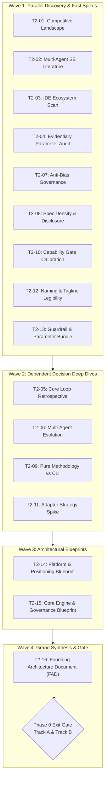

# Kramak (क्रमक) — Pre-Development Research System

Welcome to the **Kramak Research System (Phase 0)**. This directory contains the complete, evidence-based research and architectural decision framework governing Kramak's validation and evolution from v1.0.0 to v1.1+.

---

## 📁 Research Directory Structure

```
research/
├── README.md                   ← You are here: Master research guide
├── RESEARCH-PIPELINE.md        ← Master architecture & DAG specification (Tier 2, 16 sessions)
├── DECISIONS.md                ← Live Architectural Decision Registry (D-001 to D-011)
├── PROMPT-LIBRARY.md           ← 16 self-contained, copy-paste-ready research prompts
├── sessions/                   ← Research outputs land here (T2-01 through T2-16)
└── templates/                  ← Governance & gate templates
    ├── CONFLICT-RESOLUTION.template.md  ← ACH matrix for reconciling cross-session contradictions
    ├── DECISIONS.template.md            ← Canonical ADR template with YAML frontmatter
    ├── FOUNDING-ARCHITECTURE.template.md← Master FAD synthesis template
    └── PHASE-0-GATE.template.md         ← Two-track (A/B) exit gate checklist
```

---

## 🧭 How the Research System Operates



---

## ⚡ Quickstart: Running a Research Session

1. **Pick a Session:** Consult the Session Matrix in [RESEARCH-PIPELINE.md](RESEARCH-PIPELINE.md#41-master-session-matrix) or the index in [PROMPT-LIBRARY.md](PROMPT-LIBRARY.md#session-index).
2. **Copy the Prompt:** Open [PROMPT-LIBRARY.md](PROMPT-LIBRARY.md), navigate to your session (e.g. `## T2-01`), and copy the entire prompt block.
3. **Execute in Frontier AI:** Paste the prompt into a frontier model with live web search / deep research enabled (Gemini 1.5 Pro/2.0, Claude 3.5 Sonnet/Opus, or GPT-4o/o3).
   - *Note:* If the session lists hard dependencies, attach the referenced output file(s) from `sessions/` first.
4. **Save Output:** Save the model's response to `sessions/T2-##-[slug].md` (e.g., `sessions/T2-01-competitive-landscape.md`).
5. **Update Decision Registry:** Open [DECISIONS.md](DECISIONS.md) and update the corresponding decision status from `proposed` to `under-review` or `accepted`, recording the verified hypothesis and evidence grade.
6. **Reconcile Conflicts:** If findings contradict prior sessions, instantiate [templates/CONFLICT-RESOLUTION.template.md](templates/CONFLICT-RESOLUTION.template.md) to perform an Analysis of Competing Hypotheses (ACH).
7. **Compile & Gate:** Once Layer 2 blueprints (`T2-14`, `T2-15`) are complete, execute `T2-16` to generate the sealed [FOUNDING-ARCHITECTURE.template.md](templates/FOUNDING-ARCHITECTURE.template.md) and complete [templates/PHASE-0-GATE.template.md](templates/PHASE-0-GATE.template.md).

---

## 📊 Summary of Architectural Decisions (D-001 to D-011)

| Decision ID | Decision Area | Door Type | Gate Track | Validated Innovations |
|---|---|:---:|:---:|---|
| **D-001** | Core FSA Topology & Role Separation | 🔒 One-Way | Track B | #3 (Perspective Planning) |
| **D-002** | Multi-Agent Orchestration & Parallel Evolution | 🔁 Two-Way | Track A | Roadmap (v1.1+) |
| **D-003** | State Persistence, Invariants & Schema Versioning | 🔒 One-Way | Track B | #7 (State Reconciliation) |
| **D-004** | Capability Gate Check & Self-Assessment | 🔒 One-Way | Track B | #12 (Capability Gate) |
| **D-005** | Adapter Portfolio Economics & Maintenance | 🔁 Two-Way | Track A | #11 (Auto-Bootstrap) |
| **D-006** | Self-Improvement Governance & Anti-Bias Guard | 🔒 One-Way | Track B | #2 (Anti-Bias Guard) |
| **D-007** | Specification Density & Progressive Disclosure | 🔁 Two-Way | Track A | #4 (Spec Detail Scaling) |
| **D-008** | Category Positioning, Naming & Tagline | 🔒 One-Way | Track B | Category Framing |
| **D-009** | Pure Methodology vs. Optional Companion CLI | 🔒 One-Way | Track B | Distribution Model |
| **D-010** | Execution Integrity, Grounding & Scope Checks | 🔒 One-Way | Track B | #1, #6, #8, #9, #10 |
| **D-011** | Quantitative Parameters (METR 2h, Taxonomy) | 🔁 Two-Way | Track A | #5 (Failure Taxonomy) |

---

## 🛡️ Governance & Integrity

- **Fixed Constraints:** The project name ("Kramak"), zero mandatory runtime dependencies, model-agnosticism without model-name checking, and the MIT license are non-negotiable axioms.
- **Evidence Grading:** All factual claims are graded using the Universal Evidence Standard (Grade A through E with corroboration, recency, directness, and verification tags).
- **Gary Klein Premortem:** All one-way door decisions must complete prospective hindsight failure analysis before clearance.
