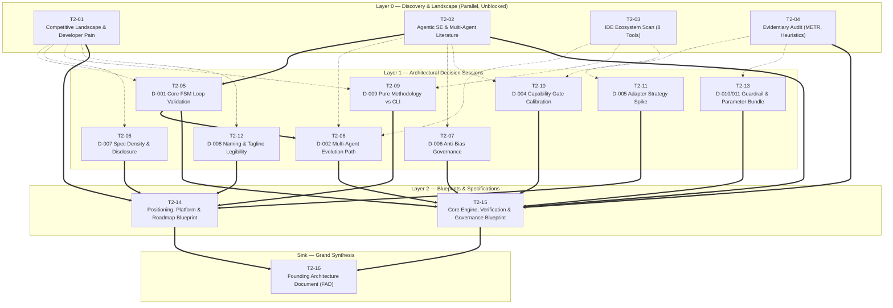

# Kramak (क्रमक) — Pre-Development Research Pipeline

> **The Definitive Evidence-Based Validation & Evolution Pipeline**  
> *Governing the transition from Kramak v1.0.0 (historical baseline) to v1.1+ (hardened, evidence-backed standard).*

---

## Executive Summary & Calibration Note

Kramak (क्रमक) is an open-source, file-based, model-agnostic, and IDE-agnostic autonomous development methodology. Shipped at **v1.0.0** in August 2026 after 24 development iterations, it encompasses 48 specification files, 8 IDE adapters, and 12 claimed process innovations. 

This research pipeline is **not** conventional pre-code software research (Kramak has no databases, microservices, auth providers, or cloud hosting by design). Its "architecture" is the **process framework itself**:
- A deterministic finite state automaton (FSM) control plane executed in prose.
- A cross-session state persistence contract (state.json + JSON Schema).
- A suite of grounding, scope-enforcement, and anti-hallucination mechanisms.
- An adapter translation layer spanning 8 IDE ecosystems.
- A market positioning claim asserting that "Layer 3: Process" is currently unstandardized.

This pipeline pressure-tests every foundational mechanism, heuristic, and positioning claim against empirical AI-agent research, developer-tool adoption dynamics, and production IDE capabilities.

---

## 1. How to Execute This Pipeline

```
research/
├── RESEARCH-PIPELINE.md        ← This architecture & execution specification
├── DECISIONS.md                ← Live Decision Registry (D-001 to D-011)
├── PROMPT-LIBRARY.md           ← 16 copy-paste ready, self-contained research prompts
├── README.md                   ← Quickstart execution guide
├── sessions/                   ← Research session outputs land here (T2-##-[slug].md)
└── templates/                  ← Governance & gate templates
    ├── CONFLICT-RESOLUTION.template.md
    ├── DECISIONS.template.md
    ├── FOUNDING-ARCHITECTURE.template.md
    └── PHASE-0-GATE.template.md
```

### Execution Protocol

1. **Running Sessions:** Open [PROMPT-LIBRARY.md](PROMPT-LIBRARY.md), select the prompt for the target session (e.g., `T2-01`), and copy the entire prompt into a frontier model with live web search / deep research enabled (Gemini 1.5 Pro/2.0, Claude 3.5 Sonnet/Opus, or GPT-4o/o3 Deep Research).
2. **Providing Upstream Context:** For sessions with prerequisites, attach or paste the referenced session output from `sessions/` into the prompt before executing.
3. **Saving Outputs:** Save the complete output to `sessions/T2-##-[slug].md` using the exact filename specified in the session matrix.
4. **Updating Decisions:** As Layer 1 sessions conclude, update the matching decision record in [DECISIONS.md](DECISIONS.md). Move status from `proposed` → `under-review` → `accepted` / `deferred` / `rejected`, recording the verified hypothesis and evidence grade.
5. **Resolving Conflicts:** If two sessions reach contradictory conclusions, instantiate [templates/CONFLICT-RESOLUTION.template.md](templates/CONFLICT-RESOLUTION.template.md) and execute an Analysis of Competing Hypotheses (ACH) matrix.
6. **Synthesizing Blueprints:** Execute Layer 2 synthesis sessions (`T2-14` and `T2-15`) to create concrete spec-delta roadmaps.
7. **Compiling the FAD:** Execute `T2-16` to populate [templates/FOUNDING-ARCHITECTURE.template.md](templates/FOUNDING-ARCHITECTURE.template.md) as the authoritative reference for all subsequent spec edits.
8. **Executing the Exit Gate:** Complete [templates/PHASE-0-GATE.template.md](templates/PHASE-0-GATE.template.md) across Track A and Track B before authoring v1.1+ code/spec modifications.

---

## 2. Project Extraction & Classification

### 2.1 Domain Archetype

- **Primary Archetype: DevTools (Developer Process / Methodology Standard)**  
  Kramak is a process framework consumed by developers and AI agents. It operates as an open-source standard, directly analogous to **AGENTS.md**, **MCP**, **Conventional Commits**, or **Twelve-Factor App**.
- **Secondary Archetype: AI/ML Control Plane (Agentic Systems Engineering)**  
  While Kramak contains zero runtime model code, its entire purpose is constraining non-deterministic LLM behaviors into deterministic execution trajectories. Its research base draws heavily from multi-agent software engineering, prompt calibration, and AI safety literature.

### 2.2 Stated Constraints (Fixed Axioms)

The following 6 constraints are treated as fixed invariants:
1. **Zero Mandatory Runtime Dependencies:** Core framework is 100% Markdown specifications, JSON Schemas, and templates.
2. **Model-Agnostic Design:** Capability-based self-assessment only; zero model-name checks.
3. **IDE-Agnostic Core:** Core methodology is editor-neutral; IDE-specific behavior is isolated in adapters.
4. **MIT License:** Permissive open-source distribution.
5. **Sanskrit-Rooted Nomenclature:** Personal maintainer naming convention (*√kram* + *-aka*).
6. **Atomic Work Item (WI) Execution:** Work Item is the atomic unit of planned and audited execution.

### 2.3 Decided vs. Open Scope

| Dimension | Decided (Fixed Axiom) | Open (Investigated by This Pipeline) |
|---|---|---|
| **Naming** | Name is "Kramak" (क्रमक) | Tagline, category subtitle, and positioning clarity (**D-008**) |
| **Dependencies** | Core spec has zero mandatory dependencies | Whether an *optional* companion CLI/validator should exist (**D-009**) |
| **Model Gating** | No model-name checking allowlists | Reliability of structured self-assessment vs. canary tasks (**D-004**) |
| **Adapter Pattern** | Adapters translate core specs to IDE formats | Portfolio breadth (8 vs. consolidated core vs. AGENTS.md native) (**D-005**) |
| **State Machine** | FSM exists with Plan/Execute/Audit phases | Optimality of 5-state topology & single-agent vs. multi-agent (**D-001**, **D-002**) |
| **Spec Format** | Markdown specifications in `spec/` | Spec density, token overhead & progressive disclosure (**D-007**) |
| **Innovations** | 12 innovations implemented in v1.0.0 | Evidentiary validation, METR citation accuracy & parameter calibration (**D-003**, **D-006**, **D-010**, **D-011**) |

### 2.4 Regulatory Exposure & Action Safety Assessment

- **Regulatory Exposure Score: 0 (No Direct Compliance Rails)**  
  Kramak collects zero telemetry, manages no user accounts, executes no cloud network requests, and handles no PII, PHI, financial, or children's data. All state resides locally in the user's git repository.
- **Autonomous Action Safety (Non-Regulatory Risk):**  
  Because Kramak grants AI coding agents authority to execute file edits and run pre-commit hooks, there is a legitimate safety risk regarding **unbounded scope creep, recursive self-modification degradation, and destructive operations**. This risk is directly addressed by **D-006** (Anti-Bias Guard), **D-010** (Hard Scope Check & Circuit Breaker), and **D-003** (Crash Recovery).

---

## 3. Complexity Scoring & Tier Determination

| Dimension | Score (0–3) | Rationale |
|---|:---:|---|
| **Domain Novelty** | **3** | Creating a formal "Process / SDLC" standard for AI coding agents is a nascent, highly contested category with no dominant industry standard. |
| **Technical Novelty** | **2** | While underlying formats (Markdown, JSON Schema, bash) are mature, using natural-language prose as a deterministic state-machine control plane is a novel paradigm. |
| **Regulatory Exposure** | **0** | No PII, HIPAA, PCI, or data privacy compliance surfaces. Purely local file-based operation. |
| **Reversibility** | **2** | `state.json` and the FSM topology represent the public API contract for all 8 adapters and external adopters; breaking changes require coordinated migration. |
| **Investment Horizon** | **2** | Ambitious ecosystem standard aiming for durable 1–3+ year multi-tool adoption, despite solo maintainer resourcing. |
| **Coordination Complexity** | **1** | Single primary decision-maker, but requires soft coordination across 8 fast-moving third-party IDE extension ecosystems. |
| **Expected Longevity** | **2** | Designed as durable infrastructure with regular v1.x evolution cycles. |
| **Integration Complexity** | **2** | 8 distinct external IDE integration surfaces (Antigravity, Cursor, Claude Code, Windsurf, Cline, Copilot, Aider, Generic) with independent update cadences. |
| **Total Score** | **14 / 24** | **→ Tier 2 (9–16 Sessions Band)** |

**Tier Determination:** The complexity score of **14/24** places Kramak squarely at the top of **Tier 2 (16 sessions)**. This accommodates deep empirical research into all 11 architectural decisions, 12 claimed innovations, and 8 target tool ecosystems.

---

## 4. Session Matrix & Dependency Graph (DAG)



### 4.1 Master Session Matrix

| ID | Title | Layer | Route | Door Type | Hard Deps | Soft Deps | Informs | Output File |
|---|---|:---:|:---:|:---:|---|---|:---:|---|
| **T2-01** | Competitive Landscape & Real-World Pain Points | 0 | Discovery | — | none | none | D-007, D-008, D-009 | `sessions/T2-01-competitive-landscape.md` |
| **T2-02** | Agentic SE & Multi-Agent Orchestration Literature | 0 | Discovery | — | none | none | D-001, D-002, D-004, D-006 | `sessions/T2-02-orchestration-research-literature.md` |
| **T2-03** | IDE Ecosystem Map & Convergence Trends (8 Tools) | 0 | Discovery | — | none | none | D-002, D-005, D-009 | `sessions/T2-03-ide-ecosystem-scan.md` |
| **T2-04** | Evidentiary Audit of Parameter Claims & Citations | 0 | Discovery | — | none | none | D-003, D-004, D-010, D-011 | `sessions/T2-04-evidentiary-audit.md` |
| **T2-05** | Core Orchestration Loop: Retrospective Validation | 1 | Deep Research | 🔒 One-Way | none | T2-01, T2-02 | **D-001** | `sessions/T2-05-core-loop-retrospective.md` |
| **T2-06** | Multi-Agent & Parallel Evolution Design Options | 1 | Deep Research | 🔁 Two-Way | **T2-05** | T2-02, T2-03 | **D-002** | `sessions/T2-06-multiagent-parallel-evolution.md` |
| **T2-07** | Self-Improvement Governance & Anti-Bias Guard | 1 | Deep Research | 🔒 One-Way | none | T2-02 | **D-006** | `sessions/T2-07-self-improvement-governance.md` |
| **T2-08** | Specification Density & Progressive Disclosure | 1 | Deep Research | 🔁 Two-Way | none | T2-01 | **D-007** | `sessions/T2-08-spec-density-progressive-disclosure.md` |
| **T2-09** | Pure-Methodology Identity vs. Optional Tooling | 1 | Deep Research | 🔒 One-Way | none | T2-01, T2-03 | **D-009** | `sessions/T2-09-pure-methodology-tooling.md` |
| **T2-10** | Capability Gate Check: Self-Assessment Reliability | 1 | Deep Research | 🔒 One-Way | none | T2-02, T2-04 | **D-004** | `sessions/T2-10-capability-gate-reliability.md` |
| **T2-11** | Adapter Strategy: Breadth vs. Depth (8 Tools) | 1 | Fast Spike | 🔁 Two-Way | none | T2-03 | **D-005** | `sessions/T2-11-adapter-strategy.md` |
| **T2-12** | Naming & Positioning: Kramak vs. Competitive Field | 1 | Fast Spike | 🔒 One-Way | none | T2-01 | **D-008** | `sessions/T2-12-naming-positioning.md` |
| **T2-13** | Core Guardrails, Grounding & Parameter Bundle | 1 | Confirm / Audit | 🔒 One-Way | none | T2-04 | **D-003, D-010, D-011** | `sessions/T2-13-guardrail-confirmation-bundle.md` |
| **T2-14** | Positioning, Distribution & Platform Layer Blueprint | 2 | Synthesis | — | **T2-08, T2-09, T2-11, T2-12** | T2-01 | D-005, D-007, D-008, D-009 | `sessions/T2-14-positioning-platform-blueprint.md` |
| **T2-15** | Core Engine, Verification & Governance Blueprint | 2 | Synthesis | — | **T2-05, T2-06, T2-07, T2-10, T2-13** | T2-02, T2-04 | D-001, D-002, D-003, D-004, D-006, D-010, D-011 | `sessions/T2-15-core-engine-governance-blueprint.md` |
| **T2-16** | Grand Synthesis: FAD Compilation & Gate Readiness | Sink | Synthesis / Gate | — | **T2-14, T2-15** | all | All Decisions | `sessions/T2-16-grand-synthesis-fad.md` |

---

## 5. Multi-Wave Parallel Execution Plan

The default-unblocked rule applies: a session is only hard-gated if it literally cannot produce valid output without prior artifacts. The 16 sessions resolve across **4 discrete execution waves**:

```
WAVE 1 (Parallel Discovery & Self-Contained Spikes)
├── T2-01 (Competitive Landscape)
├── T2-02 (Agentic SE Research)
├── T2-03 (IDE Ecosystem Scan)
├── T2-04 (Evidentiary Parameter Audit)
├── T2-07 (Self-Improvement Governance)
├── T2-08 (Spec Density)
├── T2-10 (Capability Gate)
├── T2-12 (Naming & Positioning)
└── T2-13 (Guardrail Confirmation Bundle)

WAVE 2 (Dependent Decision Deep Dives)
├── T2-05 (Core Loop Retrospective — unblocked by T2-02)
├── T2-06 (Multi-Agent Evolution — unblocked by T2-05)
├── T2-09 (Pure Methodology vs CLI — unblocked by T2-01 & T2-03)
└── T2-11 (Adapter Strategy Spike — unblocked by T2-03)

WAVE 3 (Layer 2 Architectural Blueprints)
├── T2-14 (Positioning & Platform Roadmap Blueprint)
└── T2-15 (Core Engine & Governance Blueprint)

WAVE 4 (Sink Compilation & Exit Gate)
└── T2-16 (Founding Architecture Document & Phase 0 Gate Verification)
```

---

## 6. Phase 0 Exit Gate Protocol

Phase 0 is complete only when every decision in [DECISIONS.md](DECISIONS.md) clears its assigned gate track in [templates/PHASE-0-GATE.template.md](templates/PHASE-0-GATE.template.md):

### Track A — Fast-Track Gate (Two-Way Doors: D-002, D-005, D-007, D-011)
- [ ] Logged in Decision Registry with `door_type: two-way`.
- [ ] Reversibility confirmed with a stated low switching cost.
- [ ] At least one corroborated Grade A or B source supports the recommendation (or explicit rationale for Grade C/D reliance).
- [ ] Specific review trigger assigned.

### Track B — Rigorous 9-Step Gate (One-Way Doors: D-001, D-003, D-004, D-006, D-008, D-009, D-010)
- [ ] **B1. DAG Closure:** All required session files exist in `sessions/` with `status: complete`.
- [ ] **B2. Contradiction Resolution:** All cross-model and cross-session divergences resolved via ACH matrix in [templates/CONFLICT-RESOLUTION.template.md](templates/CONFLICT-RESOLUTION.template.md).
- [ ] **B3. Evidentiary Threshold:** Zero uncorroborated Grade C/D/E claims underpin irreversible architectural pillars.
- [ ] **B4. Verification Integrity:** 100% of critical citations verified (`verification_method: fetched` or `cached`). Zero `recalled` citations support any Type 1 decision.
- [ ] **B5. Rejected Alternatives:** Detailed causal reasons documented for all rejected options.
- [ ] **B6. Decay Triggers:** Explicit, measurable re-evaluation conditions assigned to all ADRs.
- [ ] **B7. Gary Klein Premortem (1989):** Prospective hindsight exercise completed: *"It is 12 months from now. Kramak has suffered a catastrophic failure. What caused it?"* Top 3 failure modes documented with mitigations.
- [ ] **B8. Principal Architect Sign-Off:** Named review and sign-off recorded.
- [ ] **B9. Founding Architecture Document Sealed:** FAD compiled via `T2-16` and committed to repository root.

---

## 7. Universal Evidence Standard

Every research prompt in [PROMPT-LIBRARY.md](PROMPT-LIBRARY.md) mandates the following evidence classification:

```
Base Scale:
  Grade A: Official documentation, specifications, RFCs, primary source code
  Grade B: Peer-reviewed papers, reproducible empirical benchmarks (SWE-bench, METR)
  Grade C: Vendor claims, press releases, marketing documentation
  Grade D: Blog posts, forum discussions, tutorials, unverified AI recall
  Grade E: Unverifiable claims, speculative rumors

Modifiers:
  Corroboration: [single-source | corroborated by 2+ sources | contested]
  Recency:       [fresh (<3 months) | aging (3–12 months) | stale (>12 months relative to Aug 2026)]
  Directness:    [direct empirical evidence | indirect analogy / theoretical inference]

Verification Tag:
  [fetched (retrieved live) | cached | recalled (from training weights) | secondhand | human-provided]
  *Rule: Any claim marked 'recalled' is capped at Grade D regardless of apparent authority.*
```

---

## Appendix A: Methodology Adaptation Notes

Kramak differs from traditional software projects that have databases, API gateways, and microservices. The standard architecture rubric is adapted to Kramak's pure-methodology nature:

| Standard Architectural Concept | Kramak Methodological Equivalent |
|---|---|
| **Database Schema / Wire Format** | `templates/state.json` structure and `spec/state.schema.json` |
| **Public API Surface / RPC Contract** | The 5-State FSA transition rules and Work Item templates |
| **Microservice / Worker Daemon** | Executing AI coding agent sessions (Cursor, Antigravity, Claude Code) |
| **Circuit Breakers / Rate Limiters** | Audit-fix-audit loop limiter & Polish Ceiling Rule |
| **Crash Recovery / WAL** | State Reconciliation algorithm restoring state from `state.json` + `git status` |
| **Multi-Tenancy / Isolation** | Git worktree isolation for concurrent subagent execution |

---

## Appendix B: Pre-Execution Checklist

Before launching session prompts from [PROMPT-LIBRARY.md](PROMPT-LIBRARY.md):
1. Verify that `research/sessions/` directory exists.
2. Confirm that [templates/DECISIONS.template.md](templates/DECISIONS.template.md) and [templates/FOUNDING-ARCHITECTURE.template.md](templates/FOUNDING-ARCHITECTURE.template.md) are available.
3. Ensure research AI model has live search / browser tool access enabled.
4. Begin with **Wave 1** sessions (`T2-01`, `T2-02`, `T2-03`, `T2-04`).
