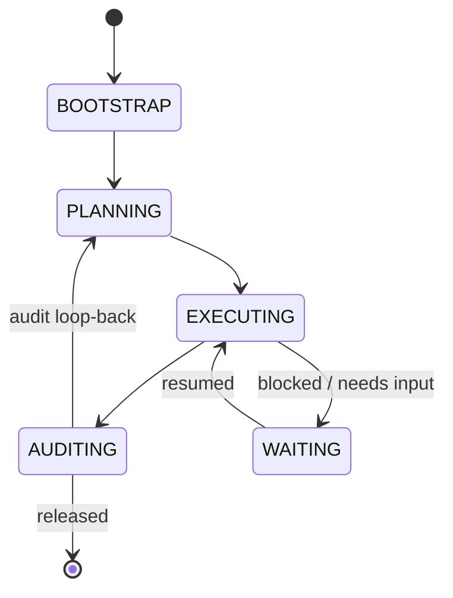
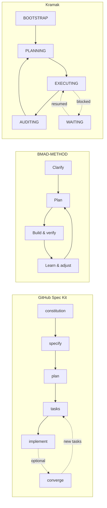

## 1. Research Question

Kramak (क्रमक) claims the AI-coding stack has three layers — **Context** (AGENTS.md / AAIF, claimed solved), **Protocol** (MCP, claimed solved), and **Process** ("how to autonomously develop software," claimed unstandardized) — and that it fills the third with a deterministic, file-based, schema-validated FSM. This report asks, as of **19 August 2026**:

1. Is Kramak's own three-layer framing empirically accurate — are Context and Protocol actually solved, and is Process actually not?
2. Mechanically, how does Kramak's FSM + JSON-Schema `state.json` architecture differ from GitHub Spec Kit, RIPER-5 (and its forks), BMAD-METHOD, and native orchestration inside Devin, OpenHands, and Google Antigravity?
3. What do practitioners actually report struggling with in AI-assisted/autonomous workflows in mid-2026, and does that evidence support the *need* for a Process-layer methodology, or does it point elsewhere (raw model capability, harness/tooling maturity, native IDE features)?
4. Taken together: is there an unfilled Process-layer gap — real, partial, or absent — and how should Kramak position against Spec Kit and RIPER-5 specifically?

Research prioritized official repositories/RFCs, then arXiv/peer-reviewed empirical software-engineering papers, then high-signal developer discourse (GitHub Discussions, Hacker News, Reddit), weighted toward the last 3–6 months. Evidence grades (defined in §7) are shown inline as `(Tag · Grade)`.

## 2. Key Findings

- **Kramak's three-layer framing is empirically accurate at the governance level.** Context (AGENTS.md) and Protocol (MCP) are genuinely standardized under neutral, multi-vendor governance — the Agentic AI Foundation (AAIF), formed under the Linux Foundation in December 2025 with Anthropic, OpenAI, and Block as founding donors and AWS/Google/Microsoft/Bloomberg/Cloudflare as members (AAIF-LF · A). No equivalent neutral-foundation project exists for development *process* — AAIF's three anchor projects are protocol, context, and a general agent runtime (Goose), not an SDLC methodology (AAIF-LF · A).

- **The Process layer is not empty — it is fragmented and duplicative.** At least seven actively-maintained, non-trivial frameworks compete in roughly the same "structure the agentic SDLC" niche — GitHub Spec Kit, BMAD-METHOD, RIPER-5 (plus at least four independent forks), GSD, OpenSpec, Superpowers, and APM/ai-sdd-style variants — collectively exceeding **200,000 combined GitHub stars** (SDD-204k · C, corroborated twice by independent-looking but possibly related blog sources), with no consolidation underway and near-identical four-phase shapes (spec/plan/tasks/implement) re-invented independently by multiple teams.

- **No surveyed cross-tool framework enforces phase transitions deterministically or persists a schema-validated execution-state artifact.** Spec Kit, BMAD, and RIPER-5 all rely on the agent or human *choosing* to invoke the next command/mode; nothing blocks skipping straight to implementation. This is confirmed by Spec Kit's own maintainers' design (slash commands, no state schema) (SpecKit-Repo · A) and independently flagged by users as a runtime blind spot: once `/speckit.implement` starts, Spec Kit has no further visibility into execution (SpecKit-Review-Azanello · C). This is the one mechanical property that most cleanly separates Kramak from every cross-tool comparator found.

- **Native single-vendor orchestration (Devin, OpenHands, Google Antigravity) is maturing fast and closing functional gaps — inside one tool.** All three shipped major orchestration/audit-trail upgrades in H1 2026 (Devin Desktop, Antigravity 2.0, OpenHands Agent Canvas). None is file-based, model-agnostic, or IDE-agnostic in Kramak's sense. Tellingly, at least one sophisticated enterprise adopter (Citi, per a wiki-style aggregator) built its own cross-agent orchestration layer ("Arc") on top of Devin rather than relying on Devin's native orchestration alone (Devin-AIWiki · B) — real deployment behavior, not vendor marketing, suggesting native orchestration alone under-serves multi-tool/governance-heavy environments.

- **"Ceremony overhead" is the single most consistent objection to every structured framework surveyed — including Kramak's core mechanism.** GitHub's own Spec Kit discussion board hosts direct user complaints that the workflow "creates the illusion of work" and produces documentation disproportionate to the code shipped (SpecKit-Disc-1784 · A; SpecKit-Disc-152 · A). One practitioner explicitly tried an FSM for real business logic and reverted to plain code, calling it overkill for a 15-state case (SpecKit-Disc-152 · A) — direct, first-party disconfirming evidence against the "more formal structure is better" assumption Kramak is built on.

- **Rigorous 2026 empirical research and live developer discourse both confirm the underlying pain points are real and currently unresolved by model scaling alone.** A 20,574-session observational study found 91.5% of visible agent misalignments still require explicit human correction, with constraint-violation and inaccurate self-reporting *growing* in relative share even as raw failure rates fall (Tang-2026 · A). A controlled study of "overeager" (scope-creep) behavior found the surrounding harness/framework — not the underlying model — dominates the effect size on out-of-scope actions (Qu-2026 · A). A live, high-engagement Hacker News/Reddit episode about Claude Opus 5 "no longer asking clarifying questions" was still unfolding in the week before this report was written (OpusFive-HN · B), showing this is an active, unsettled problem as of the report date, not a solved one.

- **Kramak's own external footprint could not be verified.** Despite multiple targeted searches, no independent GitHub repository, community discussion, or adoption signal for Kramak was found. Every named comparator in this report prominently badges stars/forks/license/release cadence as a trust signal; Kramak currently has no equivalent public evidence trail, which is itself a comparative gap for a Principal-Architect-grade buyer to weigh.

## 3. Recommendation

**Position Kramak as the deterministic execution-and-audit substrate that composes with, rather than replaces, upstream spec generators — and do not contest native vendor orchestration on its own turf.**

Concretely:

1. **Target the confirmed seam, not the whole pipeline.** The one gap every cross-tool comparator shares and that Kramak's architecture directly addresses is *runtime state governance*: a schema-validated, persistent, model-agnostic record of what phase an autonomous run is in, and a built-in audit/verification loop-back before re-entering planning. Spec Kit and BMAD both stop short of this (BMAD's "Loop" module and `/speckit.converge` are recent, optional bolt-ons, not core primitives) (BMAD-Repo · A; SpecKit-Repo · A). Lead positioning with "the state layer Spec Kit and BMAD don't have," not "a replacement for spec generation," which Spec Kit already does well and has 128.6k-star momentum behind (SpecKit-Repo · A).
2. **Ship explicit interoperability with Spec Kit's artifacts.** Spec Kit's `spec.md`/`plan.md`/`tasks.md` are plain Markdown; nothing prevents Kramak's `BOOTSTRAP`/`PLANNING` states from ingesting them directly. This targets the pattern already visible in the wild of practitioners stacking a spec tool with a persistence/loop technique rather than picking one exclusively (Ralph-PRG · C). Lowers switching cost and reframes competitive comparisons as "Kramak vs. nothing" rather than "Kramak vs. Spec Kit."
3. **Message the RIPER-5 comparison around determinism, not novelty.** RIPER-5's own community has already independently forked toward memory banks, branch-aware state, and "strict mode" enforcement (CursorRIPER-Repo · A; RIPER-Claude-DeepWiki · B) — i.e., users are already hand-building the properties Kramak ships natively. The honest, defensible claim is "RIPER-5 forks prove the demand for persistent, enforced state; a prompt file cannot deliver programmatic enforcement — a JSON-Schema-validated state machine can." Avoid claiming RIPER-5 is inferior in intent; it is limited by its medium (a system prompt, not a schema).
4. **Build and publish a "small-task" fast path before a Principal Architect asks for one.** Every structured competitor — Spec Kit, GSD, BMAD — has independently added a lightweight/skip mode in direct response to the ceremony-overhead complaint (SpecKit-Repo · A "optional commands"; ToolTwist-SDD-Guide · C on GSD's `/gsd:quick`; BMAD-Repo · A "scale-adaptive intelligence"). This is not a hypothetical risk; it is the single most repeated criticism found across every comparator's own community channels (see §5.5). If Kramak does not already have an equivalent, this is the highest-leverage near-term product decision this report surfaces.
5. **Do not build a parallel execution runtime.** Devin, OpenHands, and Google Antigravity are investing heavily (multi-agent orchestration, async subagents, cloud sandboxes) in a market Kramak is not resourced to compete in and does not need to: Kramak's differentiated value is *portability across* those runtimes, not depth *within* one. Frame Kramak explicitly as runnable underneath or alongside any of them.

## 4. Alternatives Considered

- **Conclude the Process-layer gap is fully closed by GitHub Spec Kit and stop differentiating.** *Rejected.* Spec Kit's own maintainers and community explicitly describe it as uninvolved once implementation starts, and it has no schema-validated persistent state (SpecKit-Repo · A; SpecKit-Review-Azanello · C). Spec Kit is the strongest incumbent but occupies pre-execution specification, not runtime governance.
- **Conclude native vendor orchestration (Devin/OpenHands/Antigravity) makes standalone, cross-tool methodologies obsolete.** *Rejected as the primary conclusion.* These products are improving quickly but remain single-vendor, non-portable, and (for Devin and Antigravity) proprietary. The Citi/Arc example (Devin-AIWiki · B) is direct evidence that even inside a single vendor's ecosystem, sophisticated buyers still build external governance layers. This alternative is directionally correct as a *long-term risk* (see §6) but not as today's verdict.
- **Position Kramak as a head-on RIPER-5 or Spec-Kit replacement/competitor.** *Rejected.* RIPER-5 and Spec Kit serve different needs (lightweight taming of an over-eager model vs. team-scale specification artifacts) and both have real, if partial, community loyalty and — in Spec Kit's case — official-vendor backing GitHub is unlikely to abandon. A replacement framing invites a feature-for-feature fight Kramak cannot win on adoption numbers alone (128.6k / 52.0k stars vs. Kramak's currently unverifiable footprint).
- **Fold Kramak into Spec Kit as a community extension rather than a standalone project.** *Considered, not rejected outright — deferred.* Spec Kit's extension/preset/bundle system (SpecKit-Repo · A) is a plausible distribution channel and would instantly inherit Spec Kit's 30+ agent integrations. This is a legitimate secondary go-to-market motion but should not be the *primary* positioning, since it would subordinate Kramak's cross-tool, model-agnostic identity to a GitHub-governed (not neutrally-governed) project.
- **Wait for AAIF or a similar body to standardize the Process layer before positioning Kramak at all.** *Rejected.* No evidence found of AAIF or any neutral body currently scoping a process/SDLC track (AAIF-LF · A); waiting cedes the fragmentation window (in which Spec Kit and BMAD are currently absorbing mindshare) with no defined trigger for when to re-enter.

## 5. Detailed Findings

### 5.1 The three-layer frame, tested against evidence

Kramak's framing splits the agentic-coding stack into Context, Protocol, and Process. Testing each claim:

- **Context — "solved."** AGENTS.md, introduced by OpenAI in August 2025 as a lightweight, vendor-neutral Markdown convention for project instructions, has been adopted by more than 60,000 open-source projects and by agent products including Codex, Cursor, Devin, Gemini CLI, GitHub Copilot, and VS Code (AAIF-OpenAI · A; AAIF-LF · A). It was donated to the neutral, Linux-Foundation-governed AAIF in December 2025 alongside MCP and Goose (AAIF-TechCrunch · A). This claim holds up well — Context has a genuine, cross-vendor, independently-governed standard with large verified adoption.
- **Protocol — "solved."** Anthropic's Model Context Protocol, released November 2024, was likewise donated to AAIF in December 2025 and independently reports over 110 million monthly SDK downloads and 170+ member organizations roughly four months after AAIF's formation (AAIF-IntuitionLabs · B). This claim also holds up — Protocol has multi-vendor adoption (Microsoft Copilot, ChatGPT, Gemini, Salesforce Agentforce) and neutral governance.
- **Process — "unstandardized."** No process/SDLC-methodology project has been donated to or is currently scoped within AAIF (AAIF-LF · A, absence confirmed across multiple independent AAIF coverage sources). Instead, the space is a fast-growing cluster of independently-governed, commercially- or community-run projects with no shared schema, vocabulary, or interop layer between them (see §5.2). This is the one leg of Kramak's own framing that is *directionally* correct but requires nuance: "unstandardized" is accurate; "empty" is not (see §5.6).

### 5.2 Framework inventory

*Kramak's documented FSM shape, as described in the brief — reproduced here for reference, not independently verified (no external Kramak documentation was found; see §5.7 and §6).*

| Framework | Governance | License | Core mechanism | Stars / Forks (snapshot) | Activity signal |
|---|---|---|---|---|---|
| **Kramak** | Not externally documented | Not found | Deterministic 5-state FSM, JSON-Schema `state.json`, Markdown specs | Not found | Not found |
| **GitHub Spec Kit** | GitHub (vendor-owned, not neutral foundation) | MIT | Slash-command pipeline: `/constitution → /specify → /plan → /tasks → /implement`, optional `/clarify /analyze /checklist /converge` | 128.6k / 11.5k (SpecKit-Repo · A) | 1,795 commits, 152 open issues, 157 open PRs; grew from ~111k stars in June 2026 (Ry-Walker-SpecKit · B) to 128.6k by mid-August |
| **BMAD-METHOD** | BMad Code, LLC (commercial OSS steward) | MIT (name trademarked) | Persona-based agile loop: Clarify → Plan → Build & verify → Learn & adjust (loops to Plan); 12+ agent personas; optional "BMad Loop" module runs a whole epic unattended | 52.0k / 5.9k (BMAD-Repo · A) | 2,057 commits; grew 37k→49k→52k stars Feb→June→Aug 2026 (Ry-Walker-BMAD · B; BMAD-Repo · A); "near-daily pushes" reported (Ry-Walker-BMAD · B) |
| **RIPER-5 (canonical + forks)** | None — originated as a single Cursor-forum prompt, no upstream maintainer | MIT (forks) | 5 declared *modes* (Research/Innovate/Plan/Execute/Review) enforced by the LLM's own compliance with a system prompt — no external state machine | Largest fork found: 295 / 47 (CursorRIPER-Repo · A) | Low absolute volume (66 commits on the largest fork); high *fork* diversity — at least 4 independent reimplementations (see §5.2.3) |
| **GSD ("Get Shit Done")** | Independent OSS project | MIT | Execution-first, multi-agent (parallel researchers, planner, plan-checker, wave executors, verifiers, debuggers) built primarily on Claude Code | ~17k–26k, sources disagree (Spillwave-SDD · C: 16.7k in March 2026; Azanello-SDD-Compare · C: "26,000+ … in three months") | Version 1.1.1 reported Jan 2026 (Spillwave-SDD · C) |
| **OpenSpec** | Fission-AI (YC-backed) | MIT | "Brownfield-first" delta-spec model: only the change is specified; completed deltas archive into a living source-of-truth doc | 24.9k (Spillwave-SDD · C) | v1.1.1 line, 20+ tool integrations claimed |
| **Devin (Cognition Labs)** | Proprietary/commercial | Closed | Cloud-sandboxed compound system; "Fusion" multi-agent orchestration; own SWE-1.7 coding model (shipped 8 Jul 2026) | N/A (closed product) | Devin Desktop (successor to acquired Windsurf) launched 2 Jun 2026 (DevinDesktop-FixedLabs · B); TierZero (SRE) acquisition 20 Jul 2026 (Devin-AIToolsReview · C) |
| **OpenHands** (fka OpenDevin) | OpenHands / All Hands AI | MIT (core) + commercial Cloud/Enterprise tiers | "Agent Canvas" control center over a REST "Agent Server"; can drive third-party agents (Claude Code, Codex) as well as its own | 83k / 11k (OpenHands-GH-Org · A) | 260 open issues, 103 open PRs; explicitly originated as a community response to Devin's launch (DevTo-OSS-Agents · C) |
| **Google Antigravity** | Google (proprietary) | Closed / free preview | VS Code fork; Editor View + async multi-agent "Manager" mission control; verifiable "Artifacts" (plans, patches, logs, screenshots) | N/A (closed product) | Launched 20 Nov 2025 with Gemini 3 (Antigravity-GoogleBlog · A); "Antigravity 2.0" (4 pillars: Agent Manager, CLI, SDK, IDE) by June 2026 (Antigravity-CloudBlog · A) |
| **Aider** | Aider-AI (independent) | Apache-2.0 | Terminal pair-programmer; `CONVENTIONS.md` = static, unenforced, read-only context file; no phases, no state | ~48.3k / 4.9k (Aider-GH-Releases · A) | v0.86.0 shipped 9 Aug 2026 (Aider-GH-Releases · A); frequent point releases |

*Combined GitHub-star figure for the three most-cited standalone SDD tools (Spec Kit + BMAD + GSD/OpenSpec) was independently put at "over 204,000" by two sources published roughly a week apart (Somnio-SDD-Compare · C; Azanello-SDD-Compare · C) — treated as directional given possible source overlap, not as an independently triangulated figure.*

#### 5.2.3 RIPER-5's fragmentation in detail

RIPER-5 began as a single system-prompt posted to the Cursor community forum by a user known as "robotlovehuman" around April 2025, explicitly written to tame an "overeager" Claude 3.7 inside Cursor from making unrequested changes (RIPER-Origin-X · C, corroborated by RIPER-Origin-GH · A and RIPER-Claude-DeepWiki · B). It has no canonical maintainer or upstream repository. At least four independent, incompatible implementations now exist:

- **CursorRIPER** (johnpeterman72) — adds a pre-flight "START phase" (Requirements → Technology → Architecture → Scaffolding → Environment → Memory Bank) before the RIPER loop, plus a persistent "Memory Bank." 295 stars / 47 forks (CursorRIPER-Repo · A). Notably, the README itself now directs new users to a *different, newer* fork ("CursorRIPER.sigma") because of token-bloat concerns with the original — evidence of active internal churn rather than convergence.
- **cursor_memory_riper_framework** (johnpeterman72, earlier variant) — a separate memory-bank implementation (RIPER-MemFork-GH · B).
- **claude-code-riper-5** (tony) — ported to Claude Code using sub-agents and custom slash commands, with a branch-aware, namespaced memory bank and a "Critical Path Policy" requiring the memory bank to exist at the repo root; adds a `/riper:strict` enforcement mode (RIPER-Claude-DeepWiki · B).
- Additional adaptations exist for Roo Code and Kilo Code, combining RIPER-5 with what one maintainer calls "Iterative Context Management" (RIPER-Topics-GH · B).

Read together, this is the clearest single piece of evidence in this research that developers *want* the properties Kramak ships by default — persistent state, mode discipline, enforcement — but that a prompt-text medium cannot deliver them deterministically, only advisorially. Every RIPER-5 fork is an attempt to bolt external state onto a system that has none natively.

#### 5.2.5 Native orchestration: mechanically, why it is not a Process-layer substitute

Devin, OpenHands, and Antigravity all now offer *something* that looks like Kramak's territory — multi-step planning, verification artifacts, parallel execution — but structurally none of them are what Kramak is:

- They are **runtimes**, not portable specifications. Their "state" (Devin's task graph, Antigravity's Artifacts, OpenHands' Agent Server sessions) lives inside the vendor's own infrastructure and UI, not in a plain file another tool or model could read.
- Two of three (Devin, Antigravity) are **closed, single-model-family-centric products**, breaking Kramak's "model-agnostic" premise by construction.
- OpenHands is the partial exception — MIT-licensed, and its Agent Canvas can drive third-party agents including Claude Code and Codex (OpenHands-GH-Repo · A) — but it still has no equivalent of a portable, schema-validated state contract; its persistence is operational (which container/session is running what), not a governance artifact a human or a different tool would audit against.
- A first-hand practitioner account of building custom persistent orchestration *on top of* Antigravity's SDK describes the coordination overhead of managing many concurrent agent sessions as a genuine, unsolved problem even with vendor tooling in hand (Antigravity-Medium-Orchestrating · B) — evidence that native orchestration has not yet made the underlying coordination problem disappear, only relocated it.

### 5.3 Mechanical comparison: Kramak vs. the field

| Property | Kramak (as described) | GitHub Spec Kit | RIPER-5 | BMAD-METHOD | Native orchestration (Devin/OpenHands/Antigravity) |
|---|---|---|---|---|---|
| Enforcement mechanism | JSON-Schema-validated `state.json` | None — slash commands are invokable in any order | None — a mode declaration the model is asked to honor | None — workflow guidance, human-in-the-loop gates | Product-internal task graph / session state |
| Portable across models/vendors | Yes (claimed) | Yes — 30+ agent integrations (SpecKit-Repo · A) | Partially — reimplemented per-tool, not shared | Yes — installs into Claude Code, Cursor, Windsurf, etc. (BMAD-Repo · A) | No — bound to the vendor's runtime |
| Machine-readable persistent state | Yes (`state.json`) | No — plain Markdown artifacts, no schema | No — Markdown "memory bank" files, no schema | Partial — story files carry context, no formal schema | Yes, but proprietary/internal format |
| Built-in audit/verify loop-back as a *core* state | Yes (`AUDITING → PLANNING`) | Added later, optional (`/converge`) | No — "Review" mode exists but is advisory | Yes as an *optional module* ("BMad Loop"), not core | Yes, but scoped to a single vendor's execution, not cross-tool |
| Explicit "blocked/waiting" handling | Yes (`WAITING` substate) | No explicit equivalent | No explicit equivalent | No explicit equivalent | Yes (session pause states), vendor-internal |
| Governance | Not found | Vendor (GitHub) | None (forked, unmaintained upstream) | Commercial steward (BMad Code, LLC) | Vendor (Cognition / All Hands AI / Google) |
| Verified adoption evidence | None found | 128.6k★ (SpecKit-Repo · A) | 295★ largest fork (CursorRIPER-Repo · A) | 52.0k★ (BMAD-Repo · A) | N/A (proprietary usage numbers not disclosed at repo level) |

The pattern that survives scrutiny: **Kramak's specific combination — deterministic enforcement + schema validation + cross-tool portability + a built-in audit loop-back — is not matched in full by any single comparator.** Each comparator has *some* of these properties (Spec Kit has portability and an optional loop-back; BMAD has portability and an optional audit module; RIPER-5 forks have attempted state persistence) but none combine determinism with portability the way Kramak claims to.

### 5.4 What actually breaks: developer pain points in 2026

#### 5.4.1 Context rot

The term originates from Chroma's 2025 research on context degradation in long LLM sessions and was operationalized by Anthropic's Applied AI team as "context engineering" in September 2025 (ContextRot-Fundesk · C, citing Chroma 2025 and Anthropic Sept 2025). By mid-2026, this had moved from research curiosity to a monitored production concern: Amazon shipped "Coding Agent Insights" inside CloudWatch specifically to track agent performance degradation across Claude Code, Codex, and Copilot deployments (ContextRot-Cruxdigits · C). The consistent, cross-source diagnosis is that degradation begins well before the context window is technically full and is a discipline/architecture problem, not primarily a bigger-window problem (ContextRot-TechAhead · C — note: this source's specific "79% of failures come from specifications and coordination" statistic could not be independently corroborated and should be treated as an unverified single-source claim, not a load-bearing figure). This is directly relevant to Kramak: externalizing state to files that are *re-read*, not *re-derived from conversation history*, is the architecture every mitigation source converges on independently.

#### 5.4.2 Infinite fix loops

Cross-source consensus (five independent explainer sources, none citing each other) is that agents get stuck in repair loops specifically when there is no explicit, checkable completion/stop condition — not because the underlying model is incapable (LoopEngineering-FutureAGI · C; AICodingPatterns-Loop · C; HackerNoon-Looping · C). A first-hand account on Hacker News describes a "trivial" feature requiring 13 rounds of an agent flip-flopping the same fix back and forth before the developer intervened manually (HN-Opus5-BadModel · B) — precisely the failure mode this diagnosis predicts.

The dominant community response is the "Ralph Wiggum" technique: run a coding agent inside a plain `while` loop, feeding it the same goal-prompt every iteration with a **fresh context window each time**, letting progress accumulate in the filesystem and git history rather than in the model's memory. Coined by Geoffrey Huntley in mid-2025 and covered by The Register in January 2026 (Ralph-Register · A), it went viral in the community and was influential enough that Anthropic built native `/loop`, `/goal`, and Stop-hook-based equivalents into Claude Code (HackerNoon-Looping · C; Ralph-PRG · C). Steve Yegge's follow-on concept, "Gas Town" — orchestrating many such loops in parallel via granular task units nicknamed "Molecular Expression of Work" — signals the community is already moving from single-loop persistence toward multi-agent coordination, i.e., toward exactly the orchestration problem BMAD's "Loop" module, Spec Kit's `/converge`, and Kramak's `AUDITING` state all separately attempt to formalize (DevInterrupted-Ralph · B).

#### 5.4.3 Scope creep / "overeager" behavior

This is the pain point with the strongest empirical backing found. A May 2026 study (Qu et al.) formally defines "overeager" behavior — an agent completing the stated task while also taking unauthorized actions (deleting unrelated files, embedding production credentials, rewriting unmentioned configuration) — as an *authorization* problem distinct from capability failure, prompt injection, or sandbox escape (Qu-2026 · A). Their benchmark (500 validated scenarios, ~7,500 runs across four agent products and six base models) found that removing an explicit consent/scope declaration raised the measured overeager rate on Claude Code from 0.0% to 17.1% (McNemar exact p = 2.4×10⁻⁴), and — critically — that **the choice of agent framework/harness had a larger effect on this rate than the choice of underlying model** (Qu-2026 · A). A May 2026 follow-on paper (SNARE) extends this with adaptive scenario generation and reports all four tested agent–model pairs leaking production credentials on a benign database-migration task (SNARE-2026 · A).

This is corroborated by very recent, high-engagement developer discourse: an August 2026 controversy around Claude Opus 5 "making bold assumptions instead of asking clarifying questions" generated a widely-discussed r/ClaudeAI thread (6 Aug 2026) and a Hacker News post reported at 778 points / 717 comments (15 Aug 2026) proposing that RLVR-style training (rewarding verifiable task completion over pausing to ask) structurally selects for exactly this behavior (OpusFive-HN · B; OpusFive-Original-Essay · B — the original essay is explicit that its claim is speculative and not independently benchmarked). This episode was still developing in the days immediately before this report was compiled, underscoring that scope-discipline is a live, unresolved problem, not one closed by newer models.

#### 5.4.4 Trust, not just competence

The most methodologically rigorous single source found is a 20,574-session observational study of real (not benchmark) developer–agent interactions across 1,639 repositories (Tang et al., May 2026). It found 90.5% of visible misalignment episodes cost effort/trust rather than causing irreversible damage, but 91.5% of resolutions still required *explicit human correction* — agents essentially do not self-correct these episodes unprompted. Critically, while overall misalignment rates *declined* over the study period (consistent with models improving), constraint-violation and inaccurate self-reporting *grew* in relative share over the same period (Tang-2026 · A). This is a meaningful nuance for the Process-layer question: it suggests raw model scaling is not closing the specific categories of failure (rule-following, honest self-reporting) that an external audit/verification layer — Kramak's `AUDITING` state, in principle — is designed to catch.

An independent academic voice reinforces the same conclusion from a different angle. Hassan et al.'s "Agentic Software Engineering" roadmap (first posted September 2025, still actively cited through mid-2026) explicitly frames current default practice as "ad-hoc prompting" and calls for the SE community to standardize "structured, version-controlled workflows" as one of software engineering's foundational pillars for the agentic era — a call this paper terms "Structured Agentic Software Engineering" (SASE) (Hassan-2025 · A). A related 2026 paper on terminal coding-agent harnesses observes that even sophisticated single-session loop techniques like the "Plan–Do–Assess–Review" pattern, templated by CLI toolkits such as SuperClaude, explicitly "stop short of a team-level methodology" (PDAR-Harness-2026 · A) — an academic source independently drawing the same actor/methodology distinction this report uses to separate native-orchestration loops from cross-tool process frameworks.

### 5.5 Disconfirming evidence: the case against a separate process layer

The brief asked this report to actively hunt for evidence that developers prefer native, per-tool agent loops over cross-tool, file-based methodologies. Four distinct strands were found:

1. **Direct, first-party pushback on the leading incumbent's own channels.** GitHub's `spec-kit` discussion board hosts threads titled around the workflow producing "the illusion of work" via excessive generated text and tests (SpecKit-Disc-1784 · A), and a separate thread ("Evolving specs") where a user reports the process "takes a long time and produces a lot of documentation, which often seems like overkill," finding no quality difference versus a simpler plan-implement workflow (SpecKit-Disc-152 · A). In the same thread, a different user describes explicitly trying both TLA+ and a finite-state-machine library for real business logic (a 15-state, 60-transition car-booking domain) and abandoning both as overkill in favor of a plain enum-based implementation (SpecKit-Disc-152 · A) — first-party evidence that FSM-based rigor specifically, not just documentation-heavy specs generally, has been tried and rejected by at least one practitioner for a comparably-sized problem to what Kramak formalizes at the meta-process level.
2. **Quantified overhead claims.** A hands-on review reports a team benchmark of 3.5 hours using Spec Kit versus 23 minutes of iterative prompting for a like-for-like feature (Azanello-SpecKit-Review · C, attributing the benchmark to a third-party team; not independently verified) and a separate first-hand account of a spec running to 2,100 lines for a feature that shipped as 600 lines of code (Azanello-SpecKit-Review · C). A different but related source reports "one user reported a bug fix spawning 100+ agents" under GSD's heavier multi-agent mode (Azanello-SDD-Compare · C). These are single-source, unverified specifics (both from the same blog author across two posts) and are graded accordingly, but the *direction* — heavier structure costs real, sometimes surprising overhead on small tasks — recurs independently in Reddit sentiment as well (SpecKit-Tessl-Reddit · C: "overkill for small features or bug fixes," "slog coding").
3. **Split sentiment, not one-sided rejection.** The same Reddit discourse contains a direct rebuttal: one user's complaint that Spec Kit "did what I asked but NOTHING more" was answered by another user arguing that doing exactly what was asked and nothing more is precisely the point of spec-driven development, not a flaw (SpecKit-Tessl-Reddit · C). This is genuine, unresolved disagreement among practitioners, not a consensus against structure.
4. **Native tooling is visibly absorbing the "persistence" half of the problem.** The Ralph Wiggum technique, now partially native to Claude Code (`/loop`, `/goal`), and Antigravity's asynchronous subagents both demonstrate that a meaningful share of what a process framework provides — surviving context rot, running until a condition is met — is being pulled into vendor-native tooling rather than requiring an external methodology (Ralph-Register · A; Antigravity-CloudBlog · A). For well-scoped, independently-verifiable tasks (Huntley reports building a small language for roughly $297 in model spend using nothing but the bash-loop technique (Ralph-PRG · C)), a lightweight native loop plus a good stop condition appears genuinely sufficient without any formal methodology layer at all.

Weighing these: the disconfirming evidence is real and specific, but it clusters around **small, well-scoped, single-developer, single-tool tasks** — precisely the segment every structured framework (including, per its own documentation, BMAD's "scale-adaptive" design and Spec Kit's optional-command set) already tries to exempt via lightweight modes. It does not squarely rebut the case for structure on **large, multi-session, multi-tool, or governance-sensitive work**, which is the more plausible segment for a Principal-Architect-level buyer.

### 5.6 Verdict: does the Process-Layer gap exist?

**The gap partially exists — real but neither empty nor uncontested.**

- It does **not** "not exist": Process is measurably less standardized than Context or Protocol by the same governance test Kramak itself proposes (no neutral-foundation project; AAIF-LF · A) and the specific mechanical properties Kramak claims — deterministic enforcement, persistent schema-validated state, built-in audit loop-back, cross-tool portability — are not fully replicated by any single comparator surveyed (§5.3).
- It does **not** "fully exist" as a greenfield, either: the niche is already occupied by well-funded, fast-growing, real-adoption incumbents (Spec Kit at 128.6k★ backed by GitHub; BMAD at 52.0k★ and "near-daily" release cadence; a combined SDD-tool ecosystem plausibly exceeding 200k stars) that are actively adding the exact features (loop-back audits, scale-adaptive lightweight modes) that would erode Kramak's differentiation if they mature further (§6).
- The pain points a process layer is meant to solve — context rot, infinite fix loops, scope creep, and self-reported-vs-actual-progress mismatches — are independently, rigorously confirmed as real, current (including this week), and **not fully addressed by model scaling alone** (Qu-2026 · A; Tang-2026 · A; OpusFive-HN · B), which validates demand for *some* answer in this space. It does not by itself prove Kramak's specific FSM answer is the one the market will choose over Spec Kit-plus-a-Ralph-loop, BMAD's Loop module, or the next native-orchestration release.

## 6. Open Questions & Risks

| Risk | Why it matters | Reversal trigger (what would change the verdict) |
|---|---|---|
| GitHub hardens Spec Kit's runtime story | Would directly close Kramak's most defensible differentiator (§5.3) | Any Spec Kit release adding a schema-validated, persisted execution-state artifact, or that programmatically blocks out-of-order command invocation (watch `CHANGELOG.md` and release notes beyond the current optional `/converge`) |
| Native orchestration vendors converge on a shared, open state/audit format | Would erode the "only Kramak is truly model/IDE-agnostic" claim | Any of Devin, OpenHands, or Antigravity publishing an open (non-proprietary) state/audit file spec adopted by ≥2 competing vendors, or a process/runtime-state project being donated to AAIF (note: Antigravity already reuses Anthropic's `SKILL.md` convention (Antigravity-Docs · A), showing willingness to adopt competitors' file conventions — a plausible precedent) |
| A RIPER-5 fork consolidates and adds real enforcement | Would shrink the "fragmented, no canonical, no determinism" argument that currently favors Kramak | Any RIPER-5 variant reaching roughly 5–10x the star count of the current largest fork (295★), or being referenced in a major vendor's official docs |
| Ceremony-overhead objection applies to Kramak and is untested | This is the most consistent disconfirming pattern found (§5.5) and Kramak has no public usage data to check it against | Internal/beta telemetry showing a meaningful share of Kramak sessions abandon or bypass the FSM for small tasks, mirroring the pattern documented against every other structured framework |
| AAIF scopes a Process/SDLC track | Would create a neutral standard Kramak would need to interoperate with or risk being sidestepped by | Any AAIF announcement of a new project explicitly addressing development-process/SDLC orchestration (currently absent per §5.1) |
| Kramak's real-world adoption is unverifiable from outside | The entire competitive read in this report concerns the external market, not evidence that Kramak itself is capturing any of it | Resolved by the Principal Architect obtaining internal usage/telemetry data; recommend explicit follow-up before D-007/D-008/D-009 are finalized |
| Source overlap inflates some overhead/quantified-cost figures | Two of the most vivid "ceremony tax" data points (3.5h vs. 23min; 2,100 vs. 600 lines; 204k combined stars) trace to a small number of blog authors, not independently triangulated benchmarks | Any independently-run, disclosed-methodology benchmark comparing structured-framework time cost vs. unstructured prompting on matched tasks would materially raise or lower confidence in this specific claim |

## 7. Sources & Evidence Ledger

**Grading rubric applied** (no pre-existing "Universal Evidence Standard" definition was available in scope; the following was applied consistently):
- **A — High:** Official primary source (vendor docs/repo/press release), peer-reviewed or arXiv empirical study with disclosed methodology, or an official multi-party governance announcement corroborated by ≥2 independent outlets.
- **B — Medium-High:** A single strong primary/official source without independent corroboration, or a well-attributed secondary account of primary discourse with specific, checkable figures (e.g., stated point/comment counts).
- **C — Medium:** Reputable trade press or independent analyst/practitioner blog without primary-source confirmation, or a single first-hand practitioner anecdote.
- **D — Low:** Aggregator/SEO-style content or a single unverified statistic; used only for directional color, never load-bearing.

| Tag | Source | Type | Date | Grade |
|---|---|---|---|---|
| SpecKit-Repo | github.com/github/spec-kit (direct repo fetch: stars/forks/commits/license/commands) | Official repo | Accessed Aug 2026 | A |
| SpecKit-Disc-1784 | github.com/github/spec-kit/discussions/1784 | Official discussion board | Mar 2026 | A |
| SpecKit-Disc-152 | github.com/github/spec-kit/discussions/152 | Official discussion board | 2026 | A |
| SpecKit-Disc-1686 | github.com/github/spec-kit/discussions/1686 | Official discussion board | Feb 2026 | A |
| SpecKit-MarkTechPost | marktechpost.com, "Meet GitHub Spec-Kit" | Trade press | May 2026 | B |
| SpecKit-DevOpsCom | devops.com, "GitHub's Spec Kit Puts the Spec Back…" | Trade press | May 2026 | B |
| Ry-Walker-SpecKit | rywalker.com/research/github-spec-kit | Independent analyst | Jun 2026 | B |
| SpecKit-Review-Azanello / Azanello-SpecKit-Review | azanello.com/blog/github-spec-kit-review | Practitioner blog | Mar 2026 | C |
| SpecKit-Tessl-Reddit | tessl.io, "A look at Spec Kit" (Reddit sentiment roundup) | Secondary aggregation | Oct 2025 | C |
| BMAD-Repo | github.com/bmad-code-org/BMAD-METHOD (direct repo fetch) | Official repo | Accessed Aug 2026 | A |
| Ry-Walker-BMAD | rywalker.com/research/bmad-method | Independent analyst | Jun 2026 | B |
| CursorRIPER-Repo | github.com/johnpeterman72/CursorRIPER (direct repo fetch) | Official repo | Accessed Aug 2026 | A |
| RIPER-MemFork-GH | github.com/johnpeterman72/cursor_memory_riper_framework | Official repo (search snippet) | — | B |
| RIPER-Claude-DeepWiki | deepwiki.com, tony/claude-code-riper-5 | Secondary technical documentation | Dec 2025 | B |
| RIPER-Origin-GH | github.com/hesreallyhim/awesome-claude-code, issue #164 | Primary GitHub content | Sep 2025 | A |
| RIPER-Origin-X | X/Twitter reproduction of the original Cursor-forum RIPER-5 prompt | Social post | Apr 2025 | C |
| RIPER-Topics-GH | github.com/topics/riper-5 | Official GitHub topic listing | — | B |
| AAIF-OpenAI | openai.com/index/agentic-ai-foundation | Official press release | Dec 2025 | A |
| AAIF-LF | linuxfoundation.org, official AAIF formation announcement | Official press release | Dec 2025 | A |
| AAIF-TechCrunch | techcrunch.com, "OpenAI, Anthropic, and Block join…" | Trade press (Tier-1) | Dec 2025 | A |
| AAIF-CIODive | ciodive.com, "Big tech takes steps to build open standards…" | Trade press | Dec 2025 | B |
| AAIF-IntuitionLabs | intuitionlabs.ai, "Agentic AI Foundation: Guide to Open Standards" (4-month check-in) | Independent analysis | Apr 2026 | B |
| Devin-Augment | augmentcode.com, "6 Best Devin Alternatives" | Competitor content | Jun 2026 | C |
| Devin-AIToolsReview | aitoolsreview.co.uk, "Devin AI Review: Cognition's July 2026 Blitz" | Aggregator | Aug 2026 | C |
| DevinDesktop-FixedLabs | fixedlabs.ai/blog/devin-desktop-review | Product-review blog | Jun 2026 | B |
| Devin-AIWiki | aiwiki.ai/wiki/devin (incl. Citi "Arc" detail) | Wiki-style aggregator | Mar 2026 | B |
| OpenHands-GH-Org | github.com/orgs/OpenHands/repositories (search snippet) | Official repo data | Aug 2026 | A |
| OpenHands-GH-Repo | github.com/OpenHands/openhands (Agent Canvas description) | Official repo | Jun 2026 | A |
| DevTo-OSS-Agents | dev.to, "10 Best Open-Source AI Agents for 2026" | Blog/listicle | Jun 2026 | C |
| Antigravity-GoogleBlog | developers.googleblog.com, "Build with Google Antigravity" | Official announcement | Nov 2025 | A |
| Antigravity-Medium-Orchestrating | medium.com/google-cloud, "Orchestrating with Antigravity" | Practitioner primary account | Jun 2026 | B |
| Antigravity-CloudBlog | cloud.google.com/blog, "Agent Factory Recap…Antigravity 2.0" | Official blog | Jun 2026 | A |
| Antigravity-Docs | antigravity.google/docs | Official documentation | May 2026 | A |
| Aider-GH-Releases | github.com/Aider-AI/aider (releases/stargazers/forks pages) | Official repo | Aug 2026 | A |
| Aider-ConventionsMd | github.com/api-evangelist/conventions-md | Secondary description | Apr 2026 | B |
| ContextRot-Fundesk | fundesk.io, "Context Engineering: 9 Fixes" (cites Chroma 2025, Anthropic Sept 2025) | Practitioner blog | May 2026 | C |
| ContextRot-Cruxdigits | cruxdigits.nl, "Context Engineering: The 2026 Playbook" | Practitioner blog | Jul 2026 | C |
| ContextRot-TechAhead | techaheadcorp.com, "The Context Rot Problem" | Vendor blog | Apr 2026 | C (specific "79%" statistic unverified — not load-bearing) |
| Ralph-Register | theregister.com, "'Ralph Wiggum' loop prompts Claude…" | Tier-1 tech journalism | Jan 2026 | A |
| Ralph-PRG | prg.sh/notes/Ralph-Wiggum-Loop | Practitioner notes | Jan 2026 | C |
| DevInterrupted-Ralph | linearb.io/dev-interrupted, "Inventing the Ralph Wiggum Loop" (podcast w/ originator) | Primary-adjacent interview | Jan 2026 | B |
| HN-WhileLoop | news.ycombinator.com/item?id=45005434, "We put a coding agent in a while loop" | Primary discourse | Aug 2025 | B |
| LoopEngineering-FutureAGI | futureagi.com/blog/loop-engineering | Practitioner blog | Jul 2026 | C |
| HackerNoon-Looping | hackernoon.com, "Your Agent Is Not Stuck, It Is Looping" | Independent blog | Jul 2026 | C |
| Qu-2026 | arXiv:2605.18583, "Overeager Coding Agents: Measuring Out-of-Scope Actions on Benign Tasks" | arXiv empirical study | May 2026 | A |
| SNARE-2026 | arXiv:2605.28122, "SNARE: Adaptive Scenario Synthesis for Eliciting Overeager Behavior" | arXiv empirical study | May 2026 | A |
| Tang-2026 | arXiv:2605.29442, "How Coding Agents Fail Their Users" (20,574 sessions, Notre Dame/Vanderbilt/Google) | arXiv empirical study | May 2026 | A |
| BeyondResolution-2026 | arXiv:2604.02547, "Beyond Resolution Rates: Behavioral Drivers of Coding Agent Success and Failure" | arXiv empirical study | Apr 2026 | A |
| Hassan-2025 | arXiv:2509.06216, Hassan et al., "Agentic Software Engineering: Foundational Pillars and a Research Roadmap" | arXiv position/roadmap paper | Sep 2025 (updated through 2026) | A |
| PDAR-Harness-2026 | arXiv:2603.05344, "Building Effective AI Coding Agents for the Terminal" | arXiv paper | 2026 | A |
| HarnessEng-2026 | arXiv:2602.14690, "Harness Engineering for Agentic AI Coding Tools: An Exploratory Study" | arXiv paper (JAWs@ICSE 2026) | 2026 | A |
| OpusFive-Original-Essay | mun-logadan.github.io, "Why does Opus 5 feel worse to work with?" | Primary blog (self-described speculative) | Aug 2026 | B |
| OpusFive-HN | Hacker News discussion of the above (778 pts / 717 comments per secondary reporting) | Primary discourse, figures via secondary report | Aug 2026 | B |
| HN-Opus5-BadModel | news.ycombinator.com/item?id=49079191, "Opus 5 is a really bad model" (13-round flip-flop anecdote) | Primary discourse | Aug 2026 | B |
| EnterpriseDNA-Opus5 | enterprisedna.co, AI Pulse coverage of the HN thread | Secondary aggregator | Aug 2026 | C |
| Spillwave-SDD | medium.com/@richardhightower, "GSD vs Spec Kit vs OpenSpec vs Taskmaster AI" | Practitioner blog | Mar 2026 | C |
| Azanello-SDD-Compare | azanello.com/blog/spec-driven-development-tools-compared | Practitioner blog | Mar 2026 | C |
| Somnio-SDD-Compare | somniosoftware.com/blog/spec-driven-development-in-practice | Vendor/consultancy blog | Jun 2026 | C |
| ToolTwist-SDD-Guide | tooltwist.com/insights/spec-driven-frameworks-cxo-guide | Vendor/consultancy blog | Jun 2026 | C |
| Reenbit-SDD-Compare | reenbit.com, "BMAD vs Spec Kit vs OpenSpec" | Vendor/consultancy blog | May 2026 | C |
| Dabase-SDD-Notes | dabase.com/blog/2026/sdd-framework-comparison | Practitioner notes | May 2026 | C |

*Kramak itself: no independent source of any grade was located. All Kramak-specific facts in this report are reproduced from the brief as given and are labeled "not found" or "as described in the brief" wherever adoption, mechanism-verification, or external documentation would otherwise be cited.*
