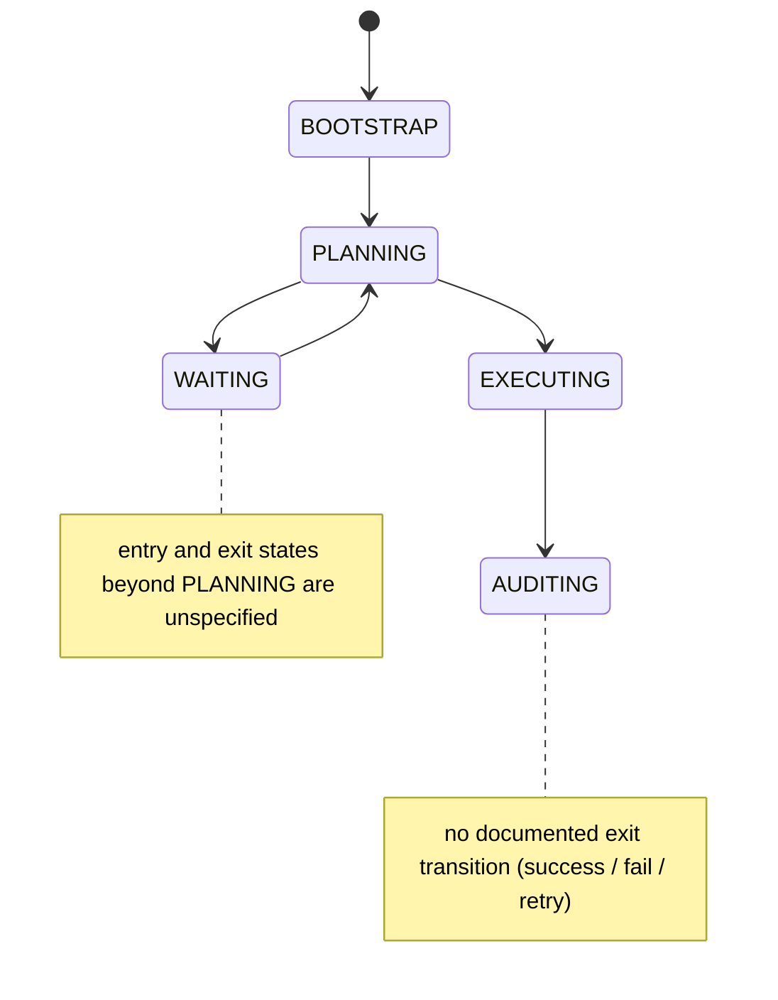
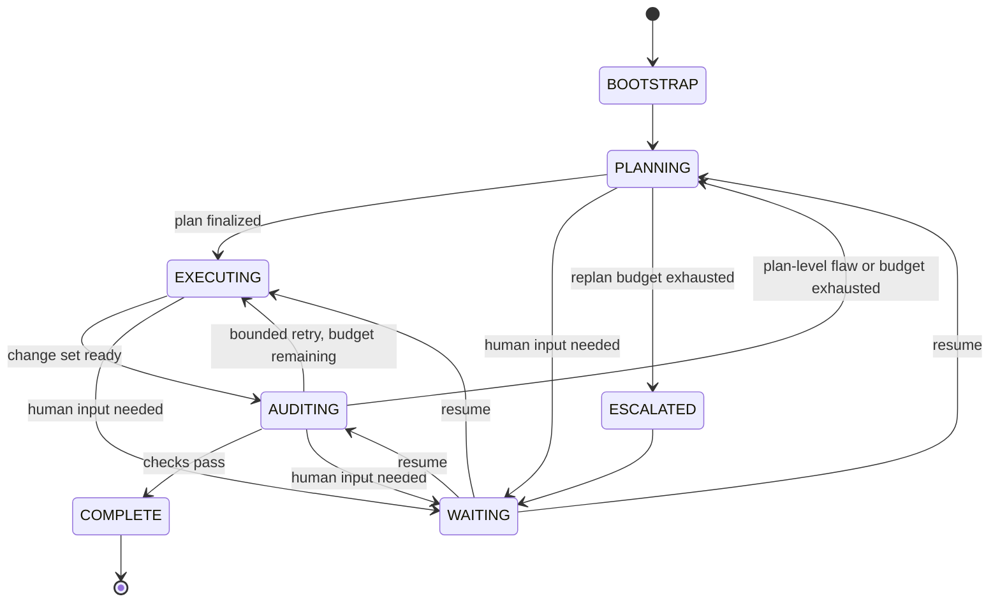

# Core Orchestration Loop: Retrospective Validation Against Agentic-SE Research

## 1. Scope, Method & Working Assumptions

This report validates Kramak's **shipped v1.0.0** core orchestration loop on its own merits — a single agent per phase, evaluated against the literature directly, not against multi-agent swarms (T2-06's territory). Four components are in scope: (1) the 5-state FSM — `BOOTSTRAP → PLANNING → EXECUTING → AUDITING`, plus `WAITING`; (2) the Planner/Executor session-and-model split; (3) Perspective-Based Planning's `PERCEIVE → REASON → DECIDE` cycle; (4) `state.json` cross-session persistence validated against JSON Schema.

**Relationship to T2-02.** T2-02 evaluated Kramak at a coarser grain — Planner → Executor → Auditor as three stages — and produced three findings this report inherits directly: the **routing claim** (strong model for planning) is the best-evidenced piece of the design [Grade B]; the **control-plane claim** (externalized, schema-validated state, FSM-governed transitions) is evidence-backed [Grade A/B]; the **structural claim** (hard session boundary organized by SDLC role) is the most contested [evidence-neutral to contradicted]. This report does not re-run that research. It (a) applies those findings specifically to v1.0.0's documented transition graph, (b) extends into three areas T2-02 did not cover — PERCEIVE→REASON→DECIDE against ReAct/Reflexion/Plan-and-Solve, whether long context retires the session split, and FSM crash-recovery invariants — and (c) treats the *specific* topology, not just the *existence* of an FSM, as the object of evaluation.

**Two specification gaps, handled as stated assumptions.** The brief names two sessions/model tiers (Planner, Executor) but lists four processing states. It does not say which session runs `AUDITING`, nor what internal loop `EXECUTING` uses — only `PLANNING`'s PERCEIVE→REASON→DECIDE cycle is named. Rather than stall on this, both are treated as open design questions and evaluated against the evidence for their plausible answers (§3, §7). This turns out to matter enough to belong in the verdict, not a footnote.

## 2. Kramak v1.0.0 as Shipped

| # | Component | As specified |
|---|---|---|
| 1 | FSM | 5 states: `BOOTSTRAP`, `PLANNING`, `EXECUTING`, `AUDITING`, `WAITING` |
| 2 | Role split | High-reasoning Planner session; fast/precise Executor session; instantiated per Work Item |
| 3 | Planning loop | Perspective-Based Planning: `PERCEIVE → REASON → DECIDE` assessment cycle |
| 4 | State persistence | `state.json`, JSON-Schema-validated, read/written across session boundaries |

The two notes mark the specification gaps carried into §7.

## 3. Finding 1 — Planner/Executor Role Separation in Coding Tasks

**T2-02's baseline transfers, with one load-bearing qualification.** The "spent more tokens on coordination than actual work" failure T2-02 cites from Anthropic's own guidance describes *concurrent* subagents negotiating with each other — the same failure mode MAST codes as inter-agent misalignment (Cemri et al., NeurIPS 2025, 1,600+ traces, 7 frameworks, κ = 0.88: 14 failure modes in 3 categories — specification/system-design ≈42%, inter-agent misalignment ≈37%, task verification ≈21%, the last split further into premature termination ≈6%, incomplete verification ≈8%, incorrect verification ≈9%). Kramak's Planner and Executor are never concurrently active; there is one handoff, not an ongoing negotiation. That specific failure mode transfers weakly. What transfers fully is the *other* half of T2-02's evidence: information loss at a one-way, cross-model handoff. A May 2026 survey of code-agent harness design (Ning, Tieu et al., arXiv:2605.18747) independently converges on the same diagnosis from the production side — it notes Anthropic's own long-running coding harnesses do separate planning, generation, and evaluation into distinct roles using structured artifacts, which is not in tension with the coordination-overhead caution once "role separation across a session boundary" and "role separation via live subagent delegation" are recognized as different designs with different risk profiles. **[Grade B]**

**A large, direct, and new test of exactly this mechanism now exists.** "Evaluating Plan Compliance in Autonomous Programming Agents" (Liu, Dehghan, Ganhotra, Hirzel, Jabbarvand — UIUC/IBM, arXiv:2604.12147, 2026) analyzed 16,991 SWE-agent trajectories across four LLMs on SWE-bench Verified and Pro under eight plan variations, measuring whether agents actually follow an upfront plan. Three findings matter directly for Kramak:

- A plan's influence measurably decays as a trajectory's context fills with error messages, file contents, and prior reasoning — the same attention-to-earlier-context limitation behind "lost in the middle." This decay happens *within a single session*, before any cross-model handoff is even involved — meaning Kramak's hard Planner→Executor boundary adds a second, distinct loss mechanism on top of one that already exists. **[Grade B]**
- A subpar plan hurts more than no plan at all, and periodic plan reminders (not a one-time handoff) measurably mitigate compliance decay — direct support for T2-02's routing claim, and a concrete mechanism recommendation (§9). **[Grade B]**
- Counterintuitively, padding a plan with extra phases that don't match the executor's own problem-solving strategy can *degrade* performance. This complicates T2-02's Recommendation #1 ("stop compressing the handoff artifact, share the full trace"): the fix is *availability* of the Planner's reasoning on demand, not maximal upfront verbosity or rigid phase-compliance enforcement. **[Grade B]**

**The open question T2-02 didn't have to resolve: what runs `AUDITING`?** Component 2 of the brief names only two session/model tiers. If `AUDITING` reuses the Executor tier, Kramak reproduces exactly the "early victory" rubber-stamping risk T2-02 flags for text-only, ungrounded review by a less capable model. If it reuses the Planner tier, that's evidence-consistent but costs more per Work Item than the architecture's own cost story implies, and isn't stated anywhere in the spec. Either answer is defensible; *no stated answer* is not, because it leaves the single highest-leverage design decision in the whole loop unaudited. This is carried into §7 as a structural gap, not resolved here.

**Verdict for this finding:** the *sequential* handoff pattern is meaningfully safer than the *concurrent* coordination failure T2-02's harshest citation describes, but the *trace-loss* mechanism is now better evidenced than it was in T2-02 (an additional, large, directly-on-point 2026 study), and it compounds with an unresolved routing gap specific to `AUDITING`. Net effect: T2-02's "evidence-neutral to contradicted" verdict for the structural claim stands for v1.0.0, for a partially different reason than T2-02 gave it.

## 4. Finding 2 — Cost/Accuracy Efficiency of Capability-Matched Routing

**The basic economics are real and roughly consistent across sources.** An informal but detailed vendor benchmark across 40 app builds found planning consumes ≈30% of tokens and execution ≈70%, and that routing execution to a cheaper model cut execution-side spend roughly 4x with planning held on the frontier tier (Morph Benchmarks, morphllm.com, June 2026) **[Grade C — single vendor study, not peer-reviewed, but methodologically concrete]**. This is directionally consistent with T2-02's PEAR/IPIGuard/D-CIPHER/Dr. MAS/AgentCARD cluster and with real production agents: a source-code-level audit of coding-agent scaffolds found that of the agents that route across models at all, cost is the dominant motive, and role-based model overrides (planner tier vs. editor tier) already exist in tools like Aider and OpenCode ("Inside the Scaffold," arXiv:2604.03515) **[Grade B]**.

**But the cost/quality curve is not linear, and a fixed cheap-executor policy can quietly erode its own savings.** Token spend on identical SWE-bench Verified tasks has been found to vary by up to 30x run-to-run, and models are poor at predicting their own cost (self-prediction correlation ≤0.39) — cited via industry cost-variance analysis of a 2026 study, "How Do AI Agents Spend Your Money?" **[Grade B/C — figures relayed via secondary source, treat as directional]**. The mechanism: a weak-executor failure often costs *more* in aggregate than a single frontier pass once retries and human cleanup are counted, because cheap is not a reliable proxy for weak, and weak failures are unpredictable in advance ("Model Routing for Coding Agents: Real Savings?", getunblocked.com, June 2026) **[Grade C]**. A companion paper, CodeRescue (arXiv:2607.19338), treats this properly as a *dispatch* problem rather than a binary: a failed cheap-executor attempt should be routed to patch-with-feedback, regenerate, or escalate-to-stronger-model depending on failure type, not defaulted to any one response **[Grade B]**.

**A controlled, real-cost study specifically weighs "how the plan is packaged" against "how capable the executor is" — and capability wins by a wide margin.** Testing deterministic shortening, structured rendering, and scoped loading of agent instructions against upgrading executor capability, only the capability upgrade produced a robust effect: +27 percentage points in pass rate at roughly 5x real cost; none of the representation-engineering tricks reliably beat the raw baseline, and none reached a practical cost break-even (arXiv:2607.03048) **[Grade B — single controlled study, real-cost accounting, not yet peer-reviewed]**. Read narrowly, this is about *skill/instruction* formatting, not the Planner's reasoning trace specifically — but it is a direct, quantified caution against assuming that clever handoff engineering can fully substitute for executor capability. Applied to Kramak: the "fast/precise" Executor tier has a real capability floor below which no amount of plan quality, handoff design, or prompt engineering reliably compensates, and that floor is an empirical fact about the chosen model, not a property this report can validate in the abstract.

**Verdict for this finding:** unchanged from T2-02 — **evidence-backed, High confidence** — with two additions that sharpen rather than weaken it: (a) the savings are real in aggregate but the risk is instance-level and asymmetric, so a *static* routing policy is a materially weaker design than an *adaptive* one with an escalation path (§9); (b) routing quality has a floor set by the Executor model's own capability that no orchestration-layer cleverness fixes.

## 5. Finding 3 — Perspective-Based Planning vs. ReAct, Reflexion, Plan-and-Solve

**No published framework under the name "Perspective-Based Planning" turns up in a direct search.** What does turn up is that `PERCEIVE → REASON → DECIDE` (and its many close variants — Perceive-Reason-Act, Perceive-Reason-Act-Observe, Sense-Decide-Act-Learn) is one of the most well-established shapes in agent design, with lineage running through Russell & Norvig's canonical agent loop, Boyd's OODA loop (Observe-Orient-Decide-Act), and classical robotics' Sense-Plan-Act pattern **[Grade A for the lineage claim — textbook-level, independently corroborated across many current sources]**. That is useful context, not a letdown: it means Kramak's planning cycle can be evaluated on its structural properties rather than on citation to a single paper that does not exist.

**The decisive structural question is where the cycle terminates.** A cycle that ends in `ACT` (or `ACT` + `OBSERVE`) is closed-loop: every decision is checked against a fresh observation before the next one is made. A cycle that ends in `DECIDE` is open-loop with respect to the *environment* — it produces a judgment, not a verified state change. PERCEIVE→REASON→DECIDE, as specified, is the second kind. That places it structurally closer to **Plan-and-Solve / Plan-and-Execute** (plan once, upfront, with a cheaper executor carrying it out) than to **ReAct**, despite vocabulary overlap with ReAct-family descriptions. This is not a superficial distinction — it is the exact design fork the practitioner literature uses to separate these patterns ("ReAct reasons per step; Plan-and-Execute plans upfront with a cheaper executor," theaiengineer.substack.com, April 2026) **[Grade B]**, and the canonical reference implementation for SWE-bench-class coding execution specifically is a plain ReAct loop (mini-SWE-agent, the standardized baseline on the official SWE-bench Verified leaderboard; SWE-agent itself is described as "fundamentally ReAct because the next edit depends on the compiler error from the previous one," DEV Community, April 2026) **[Grade B]**.

| Pattern | Plans when | Loop grain | External grounding | Nearest match to Kramak |
|---|---|---|---|---|
| ReAct (Yao et al. 2022/2023) | Continuously, interleaved with acting | Fine (per tool call) | Every step | `EXECUTING`'s likely internal loop — not stated in the brief, recommended in §9 |
| Reflexion (Shinn et al. 2023) | After failure, via self-critique | Per attempt/trial | Test execution results, not introspection | Absent from Kramak as specified — no verbal-RL memory across `AUDITING` failures |
| Plan-and-Solve / Plan-and-Execute (Wang et al. 2023; industry variants) | Once, upfront | Coarse (whole task) | None by default | `PLANNING`'s `DECIDE` output, handed to `EXECUTING` |
| ReWOO (Xu et al. 2023) | Once, upfront, tool calls batched | Coarse | None — explicit tradeoff | Closest cautionary analog: ReWOO's own authors document that it "struggles when tool results are unexpected... because it committed to its plan before seeing them" |
| Perspective-Based Planning (as specified) | Once (or cyclically) within `PLANNING` | Coarse, terminates at `DECIDE` not `ACT` | Unspecified — depends on whether `PERCEIVE` is tool-grounded | This report's assessment: closest to Plan-and-Solve, with ReWOO's brittleness as the operative risk |

**Two evidence-grounded fixes close most of the gap.** First, T2-02 already establishes that self-correction without external grounding reliably degrades accuracy on reasoning tasks (Huang et al., ICLR 2024); this applies directly to the `DECIDE` step — if `DECIDE` is a purely internal judgment call rather than checked against real signal (file contents actually read, dependency graphs actually queried, prior attempts' test results), it inherits that failure mode regardless of how sophisticated the upstream reasoning was **[Grade A, inherited]**. Second, nothing in the brief prevents `PERCEIVE → REASON → DECIDE` from *iterating* inside `PLANNING` before committing — treating it as a bounded ReAct-like loop over read-only tools (search the repo, inspect dependencies, run static analysis) rather than a single guess is consistent with everything above and is recommended in §9 regardless of what the as-shipped implementation currently does.

**Verdict for this finding:** the cycle itself is a legitimate, well-precedented planning pattern — **evidence-aligned, Medium-High confidence** — conditional on two things the brief does not confirm one way or the other: that `PERCEIVE` is tool-grounded rather than memory-only, and that `DECIDE` is not treated as self-certifying.

## 6. Finding 4 — Does Long Context Retire the Split? (Active Investigation)

This was the one question the brief required actively investigating rather than inheriting. The evidence says: **no, but not for the reason people usually give.**

**"Does it fit" and "does the model use it correctly" are different mechanisms, and only the first one is solved by bigger windows.** Chroma Research's controlled test of 18 frontier models (Hong, Troynikov & Huber, July 2025) found every one degrades as input length grows — sometimes 30-50% before the documented context limit is reached — meaning a bigger window changes the ceiling, not the shape of the degradation curve below it **[Grade B — widely replicated, not a single peer-reviewed venue]**. This sits on top of the older, extremely well-replicated "lost in the middle" result (Liu et al. 2024): a U-shaped position curve where mid-context information is attended to measurably less than information at the start or end, with an architectural explanation tied to RoPE's long-term decay property compounded by softmax normalization **[Grade A]**. The Plan Compliance paper (§3) is the coding-specific instance of the same mechanism: plan influence decays with context growth *inside a single session*, independent of whether a hard session boundary exists at all.

**A rigorous, current, coding-specific test of the strong version of the obviation hypothesis exists — and it fails.** "LCM: Lossless Context Management" (Ehrlich & Blackman, Voltropy PBC, Feb 2026, arXiv:2605.04050) benchmarked a deterministic, engineered context-management layer against Claude Code (both on the same underlying model) on the OOLONG long-context benchmark from 8K to 1M tokens. Below ≈32K tokens the two approaches were statistically indistinguishable — raw context capacity was already sufficient and extra engineering bought nothing. Above ≈32K tokens the engineered approach pulled ahead and the gap widened with length (largest gap at 512K, ≈+12.6 points); the raw model with no scaffold at all degraded sharply past ≈65K tokens regardless of nominal window size **[Grade B/C — single vendor study, one benchmark suite, contamination-controlled by the authors' own admission, directionally consistent with the broader context-rot literature]**. The finding that matters for Kramak is not the score gap; it is that the *winning* architecture in this study is not "just use a bigger native window" — it is deterministic, schema-validated, transactionally-written, provenance-preserving state management with lossless retrieval of anything compacted away. That is, structurally, the same bet Kramak's own `state.json` + JSON Schema design is making, applied at the intra-session rather than inter-session level. It is independent, current, directly-relevant corroboration of T2-02's control-plane claim, not evidence against session separation.

**Reading the two findings together:** long context genuinely retires *one* mechanism of the original T2-02 concern — a Planner's full trace can now physically fit in an Executor's context far more often than a few years ago — but it does not retire the mechanism the newer evidence (§3, §6) actually identifies as the operative risk, which is attention degradation and compliance decay *as context grows regardless of source*. A larger window makes the naive fix ("just paste the whole trace") cheaper to attempt and no more reliable once attempted. This reframes the right question from "can we afford to skip the split" to "how much should the split's boundary and handoff design change as usable context grows" — which is exactly the kind of question a reversal trigger (§10) should track, not a one-time verdict.

**Verdict for this finding:** **contradicted, Medium-High confidence** — not because the evidence is thin, but because the two strongest, most current, most directly-relevant sources found both point the same way.

## 7. Structural State-Machine Failure Points

Two categories: gaps in what v1.0.0 specifies, and risks in what it does specify.

**Specification gaps.**

- **`AUDITING`'s session/model tier is unstated** (§3). This is the single highest-leverage unanswered question in the whole architecture, given T2-02's own finding that a text-only, ungrounded audit by a weak model reproduces the "early victory" rubber-stamping failure.
- **`EXECUTING`'s internal loop is unstated.** Given §5's finding that coding execution is best modeled as a tight ReAct-style loop (the SWE-bench Verified reference baseline itself is "just a simple ReAct agent loop"), this should be made explicit rather than left implicit.
- **No stated terminal or error state.** A 5-state FSM with no `COMPLETE` or `FAILED`/`ESCALATED` state leaves "the Work Item is done" and "the Work Item cannot be completed autonomously" both undefined. Either they exist and weren't named in the brief, or they don't exist and every Work Item's endpoint is ad hoc.
- **`WAITING`'s entry/exit points are unstated** beyond its bare existence. If it can only be entered from `PLANNING`, there is no path for a human to intervene on an ambiguous requirement discovered mid-`EXECUTING`, or on a repeatedly-failing `AUDITING` cycle — exactly the scenario durable-execution practice treats as a first-class case (`waiting_human` status, reachable from any active step, per current practitioner consensus across Temporal, LangGraph, Hatchet, and related durable-execution platforms) **[Grade B — broad, independent multi-platform convergence, not a single controlled study]**.

**Risks in what is specified.**

- **No documented backward transition out of `AUDITING`.** The literature is explicit that a well-formed Plan-Execute-Verify loop must let verification failure reopen the loop — routing back to repair, or to replanning, not just forward (Ning, Tieu et al., arXiv:2605.18747, framing this as the Plan-Execute-Verify pattern generally) **[Grade B]**. A strictly linear `EXECUTING → AUDITING` edge with no return path cannot represent "the tests failed, try again" at all.
- **No documented retry budget or termination guarantee.** Without one, a bounded `EXECUTING ↔ AUDITING` disagreement can loop indefinitely. A recent, concretely-engineered analog is worth naming directly: the LCM architecture's (§6) delegation guard requires every recursive hand-off to declare what scope is being delegated and what scope is retained, rejecting any hand-off that would delegate the entire task — a structural, not heuristic, guarantee against infinite recursion. Kramak's retry/replan edges need the equivalent: a hard-coded bound plus a deterministic (non-LLM-dependent) fallback that always terminates, mirroring LCM's own three-level summarization-escalation design, whose final level requires no model call at all **[Grade B]**.
- **Crash-recovery invariants are not addressed by "JSON-Schema-validated" alone.** Schema validation guarantees `state.json` is well-formed; it does not guarantee (a) atomic writes (a crash mid-write should never leave a half-written or corrupt file — write-to-temp-then-rename or an equivalent transactional pattern is needed), (b) idempotency of side-effecting transitions (re-applying a patch or re-posting an audit comment after a crash-and-resume should not duplicate the effect — this needs an operation ledger keyed by a stable operation ID, checked before any side-effecting action re-fires), or (c) a clear boundary between deterministic orchestration logic (safe to replay) and non-deterministic or external-effect steps (LLM calls, shell commands, git operations — must be recorded as completed, not blindly re-executed on resume). This three-part pattern — atomic checkpoint, idempotent side effects, workflow/activity separation — is now broad, convergent practice across independent durable-execution platforms (Temporal, Restate, Hatchet, DBOS, LangGraph, and others), not a single vendor's opinion **[Grade B]**.
- **Schema versioning across releases is unaddressed.** A shipped v1.0.0 system will ship a v1.1; nothing in the brief describes a migration path for `state.json` files already in flight when the schema changes.
- **Concurrency semantics are unaddressed.** Whether `state.json` is per-Work-Item or global determines whether concurrent Work Items can race on writes; this isn't answered by the architecture as described.
- **Mid-phase steerability is a distinct, separate cost of the session-boundary design**, beyond trace loss: Anthropic's own trustworthy-agents framing explicitly flags that hard agent boundaries make it harder for a human to understand and intervene in a workflow mid-execution — a credit-assignment problem, not just an information-loss one (cited via a 2026 RL-for-multi-agent-orchestration survey referencing Anthropic's framework, arXiv:2605.02801) **[Grade B]**. This directly motivates letting `WAITING` be reachable from every active state, not only as a fix for information loss but for human oversight generally.

## 8. D-001 Verdict

| Component | Verdict | Confidence |
|---|---|---|
| 5-state FSM topology (the pattern) | **Evidence-aligned** — Plan-Execute-Verify with externalized, schema-governed state is a recognized, supported control pattern | High |
| 5-state FSM topology (as specified) | **Contradicted / incomplete** — no terminal states, no backward transitions, no retry bound, `WAITING` under-specified | Medium-High |
| Planner/Executor role split | **Neutral to contradicted** — sequential handoff avoids T2-02's sharpest concurrency-failure citation, but trace-loss/compliance-decay evidence is now stronger, and `AUDITING`'s tier is an unresolved, consequential gap | Medium |
| Perspective-Based Planning cycle | **Evidence-aligned** — a legitimate, well-precedented pattern, conditional on tool-grounded `PERCEIVE` and non-self-certifying `DECIDE` | Medium-High |
| `state.json` + JSON Schema persistence | **Evidence-aligned** — reinforced by independent, current (2026) evidence beyond T2-02; crash-recovery hardening (atomicity, idempotency, versioning) is a build-out, not a design flaw | High |

**Headline: NEUTRAL — evidence-aligned as a pattern, contradicted as shipped.** No component of D-001 is wrong in kind. The FSM pattern, the routing strategy, and the externalized-state control plane are among the best-evidenced choices available in the current literature, and the planning cycle is a legitimate instance of a well-established family. What v1.0.0 ships is an *incomplete* instance of an architecture the evidence otherwise supports: missing terminal/retry structure, an unresolved model-tier assignment for `AUDITING`, and no stated crash-recovery invariants. Every gap identified in §7 has a concrete, bounded fix in §9. None require abandoning the FSM, the persisted state, or capability-matched routing — which is the meaningful difference between this verdict and a genuine structural contradiction.

## 9. Recommendations — State Machine Topology Refinements

1. **Add explicit terminal and escalation states.** `COMPLETE` (checks passed) and `ESCALATED` (autonomous resolution exhausted, human required) close the two gaps identified in §7.
2. **Add bounded backward transitions.** `AUDITING → EXECUTING` for a fixable failure with retry budget remaining; `AUDITING → PLANNING` for a plan-level flaw or budget exhaustion. Cap the retry count and route to `ESCALATED → WAITING` on exhaustion, with a deterministic (non-LLM) fallback that is guaranteed to terminate regardless of model behavior (§7).
3. **Make `WAITING` reachable from every active state**, not just `PLANNING`, so a human can intervene on ambiguity discovered during execution or a stuck audit loop — and resumes back to the state that requested it.
4. **Resolve `AUDITING`'s model tier explicitly**, and re-scope it as execution-grounded (full test suite, explicit negative tests) rather than text-only judgment, per T2-02's existing recommendation — this report's new evidence (§3, §5) only strengthens the case.
5. **State `EXECUTING`'s internal loop explicitly as tool-grounded and ReAct-like** (interleaved act/observe against the real repository and test suite), not a single non-reentrant execution of the Planner's static output.
6. **Replace "handoff the plan once" with "make the Planner's full trace retrievable on demand."** Per §3 and §6, the fix is availability, not maximal upfront verbosity: a compacted default with lossless, provenance-preserving expansion (the pattern independently converged on by both the harness survey and the LCM architecture, §6) — plus periodic re-grounding of the active plan during long `EXECUTING` sessions, which the Plan Compliance paper found measurably mitigates compliance decay.
7. **Treat `PERCEIVE → REASON → DECIDE` as an iterable, tool-grounded loop within `PLANNING`**, not a single guess, and require `DECIDE` outputs to cite checkable evidence rather than self-certify.
8. **Harden `state.json` for crash recovery**, independent of any FSM topology change: atomic writes (temp-file-then-rename or equivalent), an idempotency-key ledger for every side-effecting transition, and an explicit separation between replay-safe orchestration logic and non-replayable external effects.
9. **Version the schema**, with a stated migration path for in-flight `state.json` files across Kramak releases.
10. **Make routing adaptive, not static, at the failure boundary.** On an `EXECUTING` failure, dispatch by failure type (patch-with-feedback vs. regenerate vs. escalate) rather than a fixed response, per §4.

None of these require abandoning the session boundary, the FSM, or the routing strategy — they complete a pattern the evidence supports rather than replace it.

## 10. Evidence Grade Summary & Open Risks with Reversal Triggers

| # | Claim | Grade | Reversal trigger |
|---|---|---|---|
| 1 | Sequential Planner→Executor handoff avoids the sharpest concurrent-coordination failure mode | B | A study showing sequential, single-handoff designs incur coordination overhead comparable to concurrent subagent negotiation |
| 2 | Trace/compliance decay is a real, measured risk independent of the session boundary | B | Replication failure of the Plan Compliance findings on a second agent scaffold or benchmark family |
| 3 | Capability-matched routing is cost-effective in aggregate | B/C | A coding-specific, peer-reviewed study showing homogeneous frontier-model teams beat heterogeneous teams at matched real cost, inclusive of rework |
| 4 | Executor capability is a harder floor than handoff/context engineering | B | A controlled study showing a compression or handoff-formatting intervention matches or beats a capability upgrade at equal or lower cost |
| 5 | PERCEIVE→REASON→DECIDE is structurally Plan-and-Solve-like, not ReAct-like | A (structural claim) / B (empirical support) | Evidence that the shipped cycle iterates with fresh tool-grounded observations *and* environment-changing actions before `DECIDE`, i.e., is actually closed-loop |
| 6 | Long context does not retire the session split | B/C | A coding-specific, contamination-controlled study showing a single continuous session with a frontier-context model matches FSM-split performance on held-out (non-leaderboard) tasks at practical cost |
| 7 | SWE-bench Verified is unsuitable as the arbiter of any of the above | A | A successor benchmark achieving both contamination resistance and leaderboard-level adoption, with frontier scores well below ceiling |
| 8 | Durable-execution patterns (atomicity, idempotency, workflow/activity separation) apply to Kramak's `state.json` | B | Evidence that agent state machines have failure characteristics categorically different from other long-running distributed workflows |

**Open risk not resolved by any current evidence:** whether `AUDITING`'s model tier should match `PLANNING` or `EXECUTING` has no direct empirical answer in the literature reviewed here — it inherits T2-02's routing evidence by analogy, not by direct test. This is the single item in this report most likely to change with new evidence, and is flagged as such rather than resolved by assumption.

## 11. References

- Cemri et al., "Why Do Multi-Agent LLM Systems Fail?" (MAST), NeurIPS 2025 — https://arxiv.org/abs/2503.13657
- Liu, Dehghan, Ganhotra, Hirzel, Jabbarvand, "Evaluating Plan Compliance in Autonomous Programming Agents," 2026 — https://arxiv.org/abs/2604.12147
- Ning, Tieu et al., "Code as Agent Harness: Toward Executable, Verifiable, and Stateful Agent Systems," 2026 — https://arxiv.org/pdf/2605.18747
- Ehrlich & Blackman, "LCM: Lossless Context Management," Voltropy PBC, 2026 — https://arxiv.org/pdf/2605.04050
- Hong, Troynikov & Huber, "Context Rot: How Increasing Input Tokens Impacts LLM Performance," Chroma Research, 2025 (via secondary analyses, e.g. https://www.morphllm.com/context-rot , https://glasp.co/articles/context-rot-rag-long-context-hybrid )
- Liu et al., "Lost in the Middle," 2024 (cited via https://arxiv.org/pdf/2603.26707 )
- "Evaluating Plan Compliance" companion coverage — https://arxiv.org/html/2604.12147v2
- "Multi-Agent Model Routing: Planner + Executor Pairs," Morph Benchmarks, 2026 — https://www.morphllm.com/multi-agent-model-routing
- "Model Routing for Coding Agents: Real Savings?," Unblocked, 2026 — https://getunblocked.com/blog/model-routing-coding-agents/
- "CodeRescue: Budget-Calibrated Recovery Routing for Coding Agents," 2026 — https://arxiv.org/html/2607.19338v1
- "Agent-as-a-Router: Agentic Model Routing for Coding Tasks," 2026 — https://arxiv.org/html/2606.22902
- "Inside the Scaffold: A Source-Code Taxonomy of Coding Agent Architectures," 2026 — https://arxiv.org/pdf/2604.03515
- "Compression, structure, and executor capability," 2026 — https://arxiv.org/pdf/2607.03048
- Anthropic, "When to use multi-agent systems (and when not to)," Jan 2026 — https://claude.com/blog/building-multi-agent-systems-when-and-how-to-use-them
- Anthropic multi-agent research system architecture (90.2% / 15x-token result) — https://theaiengineer.substack.com/p/how-anthropic-built-multi-agent-deep
- "ReAct, Plan-and-Execute, or Reflection?," DEV Community, 2026 — https://dev.to/gabrielanhaia/react-plan-and-execute-or-reflection-the-three-agent-patterns-every-engineer-needs-in-2026-355p
- "ReAct vs Plan-and-Execute vs ReWOO vs Reflexion," The AI Engineer, 2026 — https://theaiengineer.substack.com/p/the-4-single-agent-patterns
- SWE-bench Verified leaderboard status, Aug 2026 — https://www.vals.ai/benchmarks/swebench , https://benchlm.ai/benchmarks/swe-bench-verified
- Durable execution / crash-recovery practice — https://zylos.ai/research/2026-04-24-durable-execution-agent-runtimes/ , https://hatchet.run/blog/durable-execution , https://agentspan.ai/glossary/idempotency/
