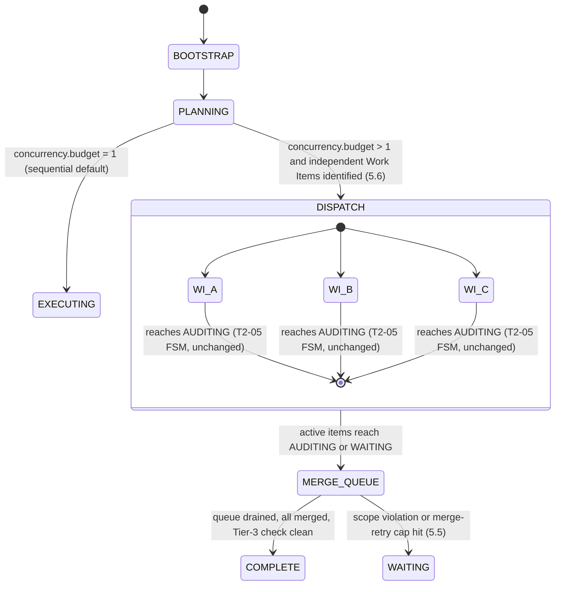

## 1. Research Question

`T2-05` validated Kramak's sequential Planner/Executor core loop and specified a refined FSM topology for v1.1 (`BOOTSTRAP → PLANNING → EXECUTING → AUDITING → COMPLETE`, with bounded retry loops and universal `WAITING`/`ESCALATED` reachability). That verdict is treated as given here and is not re-litigated.

2026's production coding-agent landscape has moved decisively toward native multi-agent and parallel-execution primitives: Google Antigravity 2.0 ships dynamic, worktree-isolated subagents; Cursor 3's Agents Window runs many agents across local and cloud environments; Claude Code ships both lightweight subagents and an experimental peer-coordinating Agent Teams mode; GitHub Copilot's standalone app and Devin Desktop both default to one git worktree per concurrent agent session. `T2-06` asks how Kramak's core loop should evolve to meet this landscape in v1.1+, without discarding the deterministic auditability `T2-05` established as a hard constraint.

Four sub-questions frame the investigation:

1. What architecture lets Kramak run Work Items in parallel while preserving the same audit guarantees as the sequential baseline?
2. What concrete changes does `state.json` need to track concurrent Work Item state without write contention or loss of crash-recoverability?
3. How must the Hard Scope Check (`git diff --name-only`) — built for one agent in one working directory — adapt when several agents work in isolated worktrees at once?
4. What new failure modes does concurrency introduce, and how must `T2-05`'s single-agent Circuit Breaker design extend to cover them?

Resolving these four questions closes decision `D-002`: whether Kramak's core loop should remain (A) permanently sequential, adopt (B) a sequential default with an opt-in, git-worktree-isolated parallel extension, or rebuild around (C) a fully multi-agent-native core with persistent inter-agent coordination.

## 2. Key Findings

- Every production tool surveyed — Antigravity 2.0, Cursor 3, Claude Code, the GitHub Copilot app, and Devin Desktop — isolates concurrent agent work at the filesystem level via git worktrees (OpenHands uses containers instead) and serializes the merge back to one integration branch. None ship unmediated concurrent writes into a shared working tree as a default.
- None of the surveyed tools defaults to persistent peer-to-peer multi-agent coordination for ordinary work. Where a peer-messaging mode exists — Claude Code's Agent Teams is the most fully documented instance — it ships disabled by default, is labeled experimental, and vendor guidance explicitly steers sequential or same-file work away from it. This directly favors Option B over Option C for `D-002`.
- Git itself provides zero cross-worktree conflict detection. This is confirmed across multiple independent practitioner sources with no official counter-evidence, and it is the single fact that makes Kramak's Hard Scope Check a load-bearing, non-optional component of any parallel extension rather than a nice-to-have.
- The concurrent-state schema shape converges across the surveyed systems: a task/work-item identifier, a dependency DAG, an isolation handle (branch/worktree path), and a claim or lock. This maps almost field-for-field onto the four IR primitives `T2-03` already proposed (`task`, `isolation-mode`, `concurrency-budget`, `dependency`), which de-risks the `state.json` delta in §5.3.
- Circuit breakers for single-agent runaway cost and loops are mature, well-documented practice by mid-2026, but every source addresses one agent at a time. Parallelism introduces failure modes existing breaker designs don't cover: concurrent cost-velocity multiplication, cross-worktree scope collisions, dependency-graph deadlock, and merge-conflict thrash. §5.5 extends the breaker to cover them.
- Task-independence in production is decided by a declared, Planner-authored file-scope heuristic, not automated static analysis — that is the default across every practitioner guide surveyed. A May 2026 academic result (Co-Coder) shows static-analysis-based graph partitioning beats naive file-scope parallelism on real repositories, but it is unproven in production and is best treated as a v1.3+ evaluation target, not a v1.2 dependency.
- Cost scales with concurrency in every system that publishes guidance on it: running N agents in parallel spends roughly N times the tokens of running one, repeatedly and independently observed. For a solo maintainer with no team to amortize coordination overhead across, `concurrency.budget` should default low and be raised deliberately, not treated as a free wall-clock win.

## 3. Recommendation

**`D-002` is resolved in favor of Option B: keep the sequential Planner/Executor default, and add an opt-in, git-worktree-isolated parallel Work Item extension.** Kramak should not rebuild its core loop around persistent multi-agent peer coordination (Option C), and should not freeze the loop as permanently single-threaded (Option A).

Concretely:

- The FSM topology `T2-05` validated for a single Work Item — `PLANNING → EXECUTING → AUDITING → COMPLETE`, with bounded retry and universal `WAITING`/`ESCALATED` reachability — is unchanged and remains the unit of execution. Nothing in this report modifies it.
- A new orchestrator-level `concurrency.budget` (default `1`, i.e. today's sequential behavior) lets more than one Work Item's FSM run at once, each in its own git worktree, only when the Planner has explicitly marked those Work Items independent (§5.6).
- Merging is always serialized through a single merge queue — never concurrent. This is the single most load-bearing constraint in this report: it is what lets Kramak gain parallel wall-clock throughput without weakening the deterministic, replayable audit trail `T2-05` established.
- No inter-agent peer messaging, no shared mutable task list under distributed locking, no persistent "team" abstraction. Every production system surveyed treats that pattern as a distinct, heavier, still-experimental mode — not the default even for parallelism.

**Option A collapses into Option B.** A pure-sequential core is not an architecturally distinct alternative to B; it is B's degenerate case with `concurrency.budget` fixed at `1`. Once the schema and Hard Scope Check extensions in §5.3–§5.4 exist, "stay sequential" is a configuration choice, not a separate codebase. The real fork in the road — the one worth calling a decision — is B versus C.

This recommendation rests on an unusually strong convergence signal: six independently built, commercially shipping coding-agent products arrived at "isolate execution per unit of work, serialize the merge" as their concurrency-safety mechanism, without exception (§5.1). None default to unmediated concurrent writes into a shared tree, and none treat peer-to-peer multi-agent chat as the default mode for ordinary work — Claude Code's own documentation states plainly that team-style coordination adds overhead and cost not justified for sequential tasks, same-file edits, or work with many dependencies. For a solo maintainer running Kramak autonomously, that overhead is pure downside with no team of humans to spread it across.

## 4. Alternatives Considered

| | A. Pure Sequential | B. Opt-in Parallel (worktree-isolated) | C. Multi-Agent Native |
|---|---|---|---|
| Core loop change | None | Additive: `concurrency.budget`, `active_work_items[]`, merge queue | Foundational rewrite: shared task list, inter-agent messaging, persistent team abstraction |
| Auditability | Trivial — one linear diff | Preserved — per-worktree diff + serialized merge repeats the same guarantee N times | Weakest — MAST's inter-agent-misalignment and task-verification failure categories (§5.1, §7) become live risks against a harder-to-reconstruct trail |
| Wall-clock benefit | None | Real, bounded by `concurrency.budget` and genuine task independence | Real, at the highest coordination tax of the three |
| Solo-maintainer cost | Lowest | Scales ~linearly with `concurrency.budget` — the conclusion every production cost-guidance source reached (§5.1, §5.5) | Highest — cost scales with live contexts *and* the messages between them |
| Engineering cost to Kramak | None (already built) | Moderate: schema delta, two new Hard Scope Check tiers, breaker extensions — all specified below | High: durable message bus, distributed task claiming, conflict-resolution UX — all novel to Kramak |
| Production precedent for the *default* mode | N/A | Antigravity 2.0, Cursor 3, Claude Code subagents, GitHub Copilot app, Devin Desktop | Claude Code Agent Teams (opt-in, experimental, off by default); OpenAI-style stateless handoff swarms |
| Verdict | Rejected as a permanent ceiling — leaves real throughput on the table against a growing autonomous backlog | **Recommended** | Rejected for v1.1+; revisit only if a §6 reversal trigger fires |

**Why not A, permanently:** a solo maintainer running Kramak autonomously against a backlog of independent Work Items (separate modules, separate bugfixes, separate test suites) pays full serial latency for zero benefit — nothing about `T2-05`'s findings requires strict serialization *across* Work Items, only within one. Every competing tool a Principal Architect will be asked to compare Kramak against already exploits this.

**Why not C, yet:** the MAST taxonomy (`Cemri et al., 2025`, verified independently this session — §7) found that multi-agent LLM systems fail predominantly on specification issues (~coordination/design flaws) and inter-agent misalignment, not on raw model capability — and that free-form multi-agent dialogue reliably degrades accuracy and wastes tokens relative to well-engineered single-agent loops. The most sophisticated production analogue surveyed, Claude Code's Agent Teams, corroborates this from the inside: it is disabled by default, explicitly labeled experimental, and documents real limitations (no session resumption for in-process teammates, task-status lag, no nested teams, shutdown latency). When the team building the most capable version of this pattern still ships it behind a flag, that is a strong signal it is not yet the right default for a solo-maintained, autonomous system where nobody is watching every teammate's transcript in real time.

## 5. Detailed Findings

### 5.1 Production Multi-Agent Concurrency Landscape (August 2026 update to `T2-03`)

`T2-03`'s concurrency matrix is reproduced below with corrections and evidence grades. Two products moved versions since `T2-03` was drafted: Cursor shipped **Cursor 3** (Agents Window, GA April 2, 2026) as the successor to Cursor 2.0, and GitHub's Copilot capability moved out of the IDE sidebar into a standalone **Copilot app** (GA June 17, 2026). Where the brief for this session referenced "Cursor 2.0," treat that as the superseded predecessor whose worktree-isolation model carried forward unchanged into 3.

| Tool | Multi-agent / subagent model | Isolation mechanism | Concurrency controls | Grade |
|---|---|---|---|---|
| **Google Antigravity 2.0** (GA May 19, 2026) | Dynamic subagents: the main/manager agent spawns and isolates child agents on the fly, hierarchically, from its Manager Surface | Auto-provisioned git worktrees per subagent; created and cleaned up autonomously with no manual step | Async background tasks, cron-style Scheduled Tasks; no published hard concurrency ceiling found | A |
| **Cursor 3** (GA Apr 2, 2026; supersedes Cursor 2.0) | Agents Window — unified multi-workspace interface across local, cloud, remote SSH, mobile; `/multitask` (added Apr 24, 2026) spawns async subagents for independent sub-parts of one request | Local: git worktree per agent. Cloud: isolated VMs, described as "elastic concurrency" | Cursor 2.0 (Oct 2025) publicly cited "up to 8" concurrent agents; Cursor 3's cloud concurrency is plan-tier-gated (Pro/Pro+/Ultra/Teams) with no fixed public ceiling | B |
| **Claude Code** (current) | Subagents (built-in Explore/Plan/general-purpose, plus custom) with fork mode; separately, an experimental Agent Teams mode for peer-coordinated teammates | `isolation: worktree` frontmatter field, per subagent or per fork; Agent Teams uses the same worktree primitive, one per teammate | `CLAUDE_CODE_MAX_CONCURRENT_SUBAGENTS` (default 20); `CLAUDE_CODE_MAX_SUBAGENT_SPAWN_DEPTH` (default 3, this value has changed across releases); Agent Teams task claiming uses file locking against race conditions | A |
| **GitHub Copilot app** (GA Jun 17, 2026; opened to all paid plans Jul 7, 2026) | Parallel agent sessions from a prompt, issue, or PR; a separate "multi-agent VS Code" preview lets one orchestrator fan out to lint/test/docs/security subagents | Isolated git worktree auto-created and removed per session | Marketed headline figure is up to 10 parallel sessions; independent walkthroughs commonly describe 2–3 concurrent sessions as the practical starting point, and the feature is plan-gated | B |
| **Devin Desktop** (ex-Windsurf; rebranded Jun 2, 2026) | Devin Local (Rust rewrite, native subagent support, replacing Cascade) plus Devin Cloud; Agent Command Center gives a Kanban view across all local and cloud agents | Worktrees organized through "Spaces"; Agent Client Protocol (ACP) lets any compatible agent host in any ACP editor | No fixed published concurrency ceiling found; tiered by plan | A/B |
| **OpenHands** | Main planning agent dynamically spawns short-lived sub-agents; explicitly designed to scale "from single tasks to thousands of parallel agent runs" for well-bounded, decomposable fan-out work (migrations, dependency bumps, vulnerability fixes) | Primarily Docker/container sandboxes rather than git worktrees — the one architectural outlier in this matrix | Built-in budget controls (max iterations, max retries, accumulated-cost tracking) and a five-pattern stuck detector, both native to the agent loop | B |
| **Aider** | None — sequential two-model Architect/Editor pipeline; no native multi-agent or concurrency primitive as of this session | N/A natively; third-party terminal multiplexers (tmux, Pane, amux) bolt on worktree-per-pane parallelism externally | Zero native concurrency controls | B |

The pattern that survives across every row except the concurrency-ceiling numbers (which vary by vendor and plan, and shift often) is: **isolate the unit of work, then serialize the merge.** OpenHands is the instructive exception that proves the rule — it isolates via containers instead of worktrees because its target workload (large-scale, often network-touching migrations) needs more than filesystem isolation, but it still isolates first and reconciles second rather than allowing concurrent writes into one tree. Aider is the useful null case: a tool with zero concurrency primitives is not thereby a worse *sequential* tool, which is itself a data point supporting Option A's degeneracy into Option B rather than treating "add concurrency" as free.

### 5.2 Git-Worktree Isolation & Conflict-Free Merge Strategies

A git worktree gives each agent its own `HEAD`, index, and working directory while sharing the repository's single object store — so two worktrees' staging operations never contend on one `.git/index.lock`, and the disk cost is limited to duplicated working files rather than a full clone.

What a worktree does **not** give you, confirmed independently across several 2026 practitioner sources with no official counter-evidence: any warning when two worktrees on different branches modify the same file. Git has no cross-worktree conflict detection mechanism at all — the problem surfaces only later, at merge time, exactly as an ordinary two-branch merge conflict would. For Kramak this is the central design fact: nothing upstream will catch a scope collision between two concurrently running Work Items. The Hard Scope Check (§5.4) has to do that work itself.

The merge discipline that recurs across every production guide surveyed is a **serialized merge queue**: generate in parallel, merge one at a time, re-run verification after each merge before starting the next, rather than merging several completed branches simultaneously. The further apart two branches are by the time they merge, and the more their file scopes overlap, the higher the probability of a silent regression that individually-passing diffs won't catch. `git rerere` (reuse recorded resolutions) is commonly paired with this to avoid re-resolving the same conflict shape repeatedly across cycles.

The dominant multi-agent role split in the production tooling that documents its own architecture (Augment Code's guides, Claude Code's Agent Teams docs) is **coordinator / specialist / verifier** — one agent decomposes and assigns scope, N agents execute in isolation, one step validates each result against the original spec before it is allowed to merge. This maps directly onto Kramak's existing Planner / Executor / Auditor triad; extending it to parallel execution is a matter of running N Executors and gating each one's result through the existing Auditor role before it reaches the merge queue, not inventing a new role.

### 5.3 Core Loop Topology Delta & `state.json` Schema Extension

The per-Work-Item FSM from `T2-05` is unchanged. What changes at v1.1+ is that the orchestrator can now hold several instances of that FSM open at once, each pinned to its own worktree, converging through one merge gate before the session can reach `COMPLETE`:



Each lane inside `DISPATCH` is a full, unmodified copy of `T2-05`'s `PLANNING → EXECUTING → AUDITING` topology, parameterized per Work Item. Nothing about that inner loop is new; only the fan-out/fan-in wrapper around it is.

`state.json`'s delta, addressing the concurrent-write problem directly rather than assuming it away:

```json
{
  "schema_version": "1.1.0",
  "session_id": "sess_8f2a1c",
  "fsm_state": "EXECUTING",
  "concurrency": {
    "budget": 3,
    "active_count": 2
  },
  "active_work_items": [
    {
      "work_item_id": "WI-042",
      "fsm_state": "EXECUTING",
      "isolation_mode": "worktree",
      "worktree_branch": "kramak/wi-042",
      "worktree_path": ".kramak/worktrees/wi-042",
      "assigned_subagent_id": "executor-3f9a",
      "declared_file_scope": ["src/auth/**", "tests/auth/**"],
      "dependency_ids": ["WI-039"],
      "lock": {
        "holder": "executor-3f9a",
        "acquired_at": "2026-08-19T10:15:00Z",
        "lease_expires_at": "2026-08-19T10:45:00Z"
      },
      "merge_status": "pending",
      "retry_count": 0,
      "started_at": "2026-08-19T10:12:41Z",
      "updated_at": "2026-08-19T10:30:02Z",
      "state_shard": ".kramak/work-items/WI-042.json"
    }
  ],
  "merge_queue": ["WI-039", "WI-042"],
  "circuit_breaker": {
    "global_concurrent_agent_cap": 5,
    "per_work_item_merge_retry_cap": 3,
    "cost_velocity_cap_usd_per_hour": null,
    "cumulative_cost_usd_session": 0.0,
    "tripped": false,
    "trip_reason": null
  },
  "version": "17"
}
```

Every new field maps onto the four IR primitives `T2-03` already proposed: `work_item_id` → `task`, `isolation_mode` → `isolation-mode`, `concurrency.budget` → `concurrency-budget`, `dependency_ids` → `dependency`. That convergence is worth stating plainly, because it means this schema is not new invention so much as an operationalization of the primitives `T2-03` already argued for.

**Concurrent-write hazard and how the schema avoids it.** The naive design — N executors all writing directly into one shared `state.json` — reproduces exactly the race condition `T2-05` already solved for once with atomic temp-file-then-rename writes, except now with multiple writers instead of one. Rather than adding distributed locking on top of a single mutable file, this schema shards: each active Work Item owns a **single file it alone writes to** (`state_shard`, e.g. `.kramak/work-items/WI-042.json`), holding that item's full detail — its own idempotency-key entries, plan/audit trail references, and FSM history. `state.json` itself keeps only a lightweight, orchestrator-owned index into those shards, written exclusively by the orchestrator process via the same atomic rename `T2-05` already established, reconciled by periodically reading the shard files rather than being written by them. This gives every file in the system exactly one writer — Kramak needs no compare-and-swap or lock manager on the hot path, only on the low-frequency reconciliation write, and only against the orchestrator's own prior version (the `version` field, a simple monotonic counter, guards that single writer against its own stale reads across async operations — not against concurrent writers, since there are none). This single-writer-per-shard shape is not a novel proposal invented for this report: it mirrors what Claude Code's Agent Teams actually does in production — a per-agent mailbox file that only its owner writes, plus file-locked claiming for the one genuinely shared resource (the task list) — rather than one JSON blob under concurrent write from every teammate.

### 5.4 Hard Scope Check Adaptation for Concurrent Worktrees

`T2-05`'s Hard Scope Check — run `git diff --name-only` at `AUDITING` and confirm the touched-file set stays inside the plan's declared scope — assumed one working directory and one diff. Because git provides no cross-worktree awareness (§5.2), a straightforward per-worktree repeat of that check is necessary but not sufficient once several Work Items run at once. Three tiers are needed:

**Tier 1 — per-worktree scope check (unchanged mechanism, now parameterized).** Run once per active Work Item at its own `AUDITING` transition, exactly as before, just against that item's own worktree and its own declared scope:

```
git -C .kramak/worktrees/wi-042 diff --name-only <base-ref>...HEAD
```

Compare the resulting path set against `WI-042.declared_file_scope`. This tier is literally `T2-05`'s existing check, run N times instead of once — no new logic.

**Tier 2 — pre-flight cross-item intersection (new).** Before a candidate Work Item is admitted from `PLANNING` into `DISPATCH`, expand its `declared_file_scope` glob against the repository tree and check for a non-empty intersection with the declared scope of every *other* currently active item. This is pure schema comparison, not a git call — nothing has been written yet — and it is cheap enough to run on every admission decision. A non-empty intersection means the two items are queued rather than run concurrently; this is what prevents the "no cross-worktree warning" gap from ever becoming live.

**Tier 3 — merge-time re-verification (new).** Declared scope is advisory, not enforced at the OS level, and a Planner's estimate can be wrong even when Tier 2 finds no conflict on paper. Immediately before a completed Work Item is allowed to merge, re-run Tier 1's diff against the *current* tip of the integration branch rather than the item's original (now possibly stale) base:

```
git -C .kramak/worktrees/wi-042 fetch origin integration
git -C .kramak/worktrees/wi-042 diff --name-only origin/integration...HEAD
```

Check the result against both the item's own declared scope and the set of paths touched by every Work Item that has merged since this one branched. A failure here is the backstop of last resort — it catches everything Tiers 1 and 2 could miss, including scope creep an executor introduced mid-task and collisions that only exist because of an intervening merge. It is also, deliberately, the last point at which a violation can be caught before it becomes part of the permanent history, which is why it gates the transition to `COMPLETE` rather than merely logging a warning.

### 5.5 Circuit Breaker Extensions for Concurrency

`T2-05`'s bounded-retry breaker (`AUDITING → EXECUTING` on budget remaining, else `AUDITING → PLANNING` or `→ ESCALATED`) is unchanged and still applies to a single Work Item's own execution loop. Parallelism adds failure modes that a single-item, single-session breaker cannot see, because it was never designed to look across concurrently running items:

| Failure mode | New in v1.1+? | Trigger | Breaker response | FSM effect |
|---|---|---|---|---|
| Runaway fan-out | Yes | Active item count or nested spawn depth exceeds `concurrency.budget` / `global_concurrent_agent_cap` | Reject the new spawn outright; do not retry the spawn request | No transition — request denied |
| Concurrent cost-velocity | Yes | Aggregate session spend rate exceeds the user-configured `cost_velocity_cap_usd_per_hour` | Trip the session-level breaker; halt admission of new items at the next safe checkpoint | Active items → `WAITING` |
| Cross-worktree scope violation | Yes | Tier-2 or Tier-3 Hard Scope Check (§5.4) finds a non-empty intersection | Trip the breaker for the offending item(s) only — not the session | Offending item: `AUDITING → WAITING` |
| Circular / unsatisfiable dependency | Yes | Topological sort of the `dependency_ids` graph across active and queued items fails (cycle, or a dependency on an abandoned item) | Trip the breaker for the blocked item; never spin waiting on an unreachable dependency | Blocked item: `PLANNING → ESCALATED` |
| Merge-conflict thrash | Yes | Same item fails Tier-3 re-verification more than `per_work_item_merge_retry_cap` times | Quarantine the item; stop auto-retrying its merge | Item: `AUDITING → WAITING` (human merge) |
| Stale lock / orphaned worktree | Yes | `lock.lease_expires_at` passes with no heartbeat from `assigned_subagent_id` | A reaper process releases the lock and returns the worktree to the pool | Item: `EXECUTING → WAITING` (reassign), or `ESCALATED` if this recurs for the same item |
| Single-item runaway | No — `T2-05` baseline | Per-item retry budget exhausted | As `T2-05` specifies, unchanged | `AUDITING → PLANNING` or `ESCALATED` |

The design principle underneath this table is that a breaker trip must be **as narrowly scoped as the failure that caused it.** A scope collision between two Work Items should never halt a third, unrelated one; only aggregate cost velocity and the global fan-out cap are legitimately session-wide. This is a genuine architectural departure from `T2-05`'s breaker, which only ever had one item to reason about and so never needed this distinction. The stale-lock reaper is directly informed by production precedent: Claude Code's own worktree cleanup explicitly handles the case of a lock left behind by a killed session, releasing it on a periodic sweep rather than leaving it stuck — the same shape recommended here for `lease_expires_at`.

### 5.6 Task-Independence Heuristics

The default across every practitioner guide surveyed — independently, not by shared origin — is a **declared, Planner-authored file-scope heuristic**: the Planner states which files a Work Item will touch, and two items are treated as parallel-safe only when their declared scopes don't intersect and all of a candidate's `dependency_ids` are already `COMPLETE`. This is exactly what §5.3's schema encodes, and it is the recommended v1.2 default: it is cheap, legible to a human reading the plan, and requires no new infrastructure beyond what §5.4 already builds.

Its known failure mode is precisely why Tiers 2 and 3 of the Hard Scope Check exist as a backstop rather than a formality: an LLM Planner's declared scope can simply be wrong — too narrow, or blind to a shared config file a change will touch incidentally. The heuristic decides *opportunistic* parallelism; the Hard Scope Check enforces *correctness* regardless of whether the heuristic guessed right.

DAG-based dependency modeling, independent of how the graph is derived, is already validated in production at the schema level: Claude Code's Agent Teams task list supports dependency edges natively with automatic unblocking on completion, and a June 2026 paper on agentic-coding preparation documents "Beads" — lightweight, git-backed JSON task records carrying priorities, dependencies, and acceptance criteria — as production practice for exactly this purpose. `dependency_ids` in §5.3's schema is architecturally identical to both.

A more sophisticated frontier exists and is worth naming as a later target rather than a v1.2 requirement: a May 2026 paper (`Yang, Nie et al., 2026` — see §7) formalizes multi-agent task decomposition as a graph-partitioning problem, building a dependency graph from static analysis of the codebase itself rather than trusting a declared glob, isolating structural hub files, and partitioning via community detection. Evaluated on 28 real-world tasks across two benchmarks, it measurably outperformed both sequential execution and naive file-scope parallel baselines. It is genuinely promising and genuinely unproven at Kramak's actual scale and language mix as of this session — flagged in §6 as a v1.3+ evaluation target, gated behind a reversal trigger rather than adopted now.

### 5.7 Implementation Roadmap

| Phase | Ships | Gate to advance |
|---|---|---|
| **v1.1 — Foundation** | `T2-05`'s refined FSM (`COMPLETE`/`ESCALATED` states, bounded retry); the `state.json` schema delta from §5.3 with `concurrency.budget` hardcoded to `1`; per-Work-Item state sharding; Tier-1 Hard Scope Check unchanged | Ships inert — zero behavior change for a maintainer running today's sequential loop; proves the schema before any concurrency risk is introduced |
| **v1.2 — Opt-in parallel** | `concurrency.budget` becomes user-configurable (recommended starting ceiling: 3, consistent with the "2–5 agents" sweet spot every practitioner source and Claude Code's own Agent Teams guidance converges on before coordination overhead dominates); Planner emits `declared_file_scope` and `dependency_ids`; Tier-2 pre-flight intersection check; serialized merge queue; Tier-3 merge-time re-check; the concurrency-specific breaker extensions in §5.5; user-configured cost-velocity cap | Dogfooded against Kramak's own backlog for enough cycles to observe zero Tier-3 escapes (a scope violation reaching `COMPLETE` undetected) before recommending `concurrency.budget` above `1` to a new user |
| **v1.3+ — Heuristic upgrade (optional, experimental)** | Evaluate Co-Coder-style static-analysis scope derivation as an *assist* to Planner-declared scope, not a replacement for it; per-session cost-velocity dashboards; container-level isolation as an add-on if Work Items begin needing untrusted or network-touching execution beyond file edits and local tests | Pursued only if a §6 reversal trigger fires — not scheduled by default |

## 6. Open Questions & Risks

- **Antigravity's SDK is immature.** As of this session, Google's Antigravity SDK ships as a Python package in Research Preview, not a stable release. *Reversal trigger:* if it graduates with published production SLAs and benchmarks, re-evaluate whether adopting or wrapping that harness is more attractive than maintaining Kramak's bespoke dynamic-subagent implementation.
- **Reported concurrency ceilings are inconsistent and move fast.** GitHub's Copilot app is marketed at up to 10 parallel sessions in one press source, while independent walkthroughs describe 2–3 as typical in practice; the brief for this session referenced "Cursor 2.0" where the current product is "Cursor 3." Vendor-published concurrency numbers in this space should be treated as directional, not load-bearing, and re-verified each session rather than assumed stable — Kramak's own `concurrency.budget` is deliberately left fully configurable rather than hardcoded to any vendor's published figure for exactly this reason.
- **Declared-scope heuristics may not scale past a handful of concurrent items.** Production guidance is consistent that manual file-domain decomposition works well for 2–5 concurrent agents and starts showing real coordination overhead beyond that; Co-Coder is promising but unproven in production. *Reversal trigger:* if Kramak's typical parallel batch routinely exceeds ~5 concurrent Work Items, or declared-scope conflicts (Tier-2 rejections) become a recurring operational cost, prioritize evaluating static-analysis-based scope derivation over continuing to tune the declared-scope heuristic.
- **Parallelism's cost economics may not pay off for a solo maintainer.** Cost scales roughly linearly with `concurrency.budget` across every source that publishes guidance on it. *Reversal trigger:* if observed cost-per-completed-Work-Item under parallel mode exceeds sequential mode by more than roughly 1.5x without a proportional wall-clock gain, default `concurrency.budget` back to `1` and restrict parallel mode to Work Items explicitly flagged high-value.
- **Worktree-only isolation has a ceiling.** One 2026 source (graded C — see §7) describes worktree-plus-lightweight-container as an emerging standard once teams run more than four concurrent agents, though this is not yet a strong cross-source consensus. Pure worktree isolation shares the host OS and network with every concurrent agent. *Reversal trigger:* if Work Items begin requiring capabilities beyond file edits and local test execution — installing arbitrary dependencies, reaching external network resources — add container-level isolation per the v1.3+ roadmap rather than stretching worktree isolation past its design.
- **The most detailed production analogue still calls this experimental.** Claude Code's Agent Teams — the single most thoroughly documented peer-coordination feature surveyed — ships disabled by default with acknowledged limitations (no session resumption for in-process teammates, task-status lag, no nested teams, slow shutdown). *Reversal trigger:* if Agent Teams, or a comparable feature from Antigravity or Cursor, graduates out of experimental status with documented reliability guarantees, revisit whether Kramak should adopt a similar lead-plus-teammate messaging model rather than the Planner/Executor-per-worktree model recommended here.

## 7. Sources & Evidence Ledger

Grading standard applied in this ledger: **A** — primary/official documentation from the vendor that ships the product, or a peer-reviewed/arXiv paper with a stated, reproducible methodology. **B** — independent tech press, or a practitioner source that demonstrates real technical engagement (cited source code, working configuration, concrete benchmarks), especially where multiple independent instances converge on the same claim. **C** — single-source blog or community content without independent corroboration, used only where flagged as such and treated as directional rather than settled.

**Claude Code (subagents, worktrees, Agent Teams) — §5.1, §5.2, §5.3, §5.5**
- Anthropic, "Create custom subagents," code.claude.com/docs/en/sub-agents.md (current as of Aug 19, 2026) — **A**
- Anthropic, "Orchestrate teams of Claude Code sessions," code.claude.com/docs/en/agent-teams.md — **A**
- Anthropic, "Run parallel sessions with worktrees," code.claude.com/docs/en/worktrees.md — **A**

**Google Antigravity 2.0 — §5.1, §6**
- Google, "Google Antigravity @ I/O 2026" and "Subagents, Hooks, Scheduled Tasks, Agent Management, Voice, and Much More," antigravity.google/blog (May 19, 2026) — **A**
- Google Developers Blog, "Build with Google Antigravity" (Nov 20, 2025, original 1.0 launch) — **A**
- MCP.Directory, "Antigravity 2.0: Google's 4-Surface Agent Platform Explained" (May 20, 2026) — **B**

**Cursor 3 — §5.1, §6**
- Cursor, "Agents Window," cursor.com/docs/agent/agents-window — **A**
- Cursor, "Choose where Cloud Agents run," cursor.com/docs/cloud-agent/choose-runtime — **A**
- InfoWorld, "Cursor 2.0 adds coding model, UI for parallel agents" (Oct 30, 2025) — **B**
- digitalapplied.com, "Cursor 3: Agents Window, Cloud Agents, and What Changed" (May 16, 2026) — **B**

**GitHub Copilot app — §5.1, §6**
- AlphaSignal, "GitHub's Copilot App Lets Developers Run 10 Parallel AI Coding Agents at Once" (Jun 11, 2026) — **B**
- webdeveloper.com, GitHub Copilot app GA coverage (Jun 17, 2026) — **B**
- ecorpit.com, "GitHub Copilot app 2026: 3 parallel agents, 1 repo" (Jul 2026) — **C**, included only to show the real-world-usage figure diverges from the marketed headline number

**Devin Desktop / Cognition / Windsurf — §5.1**
- Cognition, "Windsurf is now Devin Desktop," devin.ai/blog (Jun 2, 2026) — **A**
- digitalapplied.com, "Windsurf Becomes Devin Desktop: IDE Migration 2026" (Jun 5, 2026) — **B**

**OpenHands — §5.1**
- OpenHands, "What Is an Agentic Swarm? Architecture, Patterns, and Tools," openhands.dev/blog (Jul 11, 2026) — **A**
- dev.to (truongpx396), "OpenHands — Deep Dive & Build-Your-Own Guide" (Apr 28, 2026) — **B**
- amux.io, "Best AI Agent Multiplexers Compared (2026)" — **B**

**Aider — §5.1**
- deployhq.com, "How to Use Aider in 2026" (Jun 10, 2026) — **B**
- deepwiki.com, "Architect Mode | Aider-AI/aider" — **B**
- runpane.com, "Aider with Parallel Worktrees" (May 25, 2026) — **B**

**Git-worktree isolation & merge strategy — §5.2, §5.4**
- Augment Code, "How to Use Git Worktrees for Parallel AI Agent Execution" (Jun 18, 2026) — **B**
- Augment Code, "How to Build a Multi-Agent AI System for Code Development" (Mar 30, 2026) — **B**
- Autonoma, "5 Ways to Stop AI Agents Stepping on Each Other" (Apr 16, 2026) — **B**
- Zylos Research, "Git Worktree Isolation Patterns for Parallel AI Agent Development" (Feb 22, 2026) — **C**, sole source for the >4-agent worktree-plus-container claim in §6

**Circuit breakers for AI agents — §5.5**
- dev.to (waxell), "AI Agent Circuit Breakers: The Reliability Pattern Production Teams Are Missing" (May 1, 2026) — **B**
- dev.to (sebastian_chedal), "The Cost Circuit Breaker" (Apr 6, 2026) — **B**
- truefoundry.com, "Rate Limiting AI Agents" (May 12, 2026) — **B**
- buildmvpfast.com, "AI Agent Timeout & Circuit Breaker Patterns" (Apr 2, 2026) — **B**

**Academic literature — §4, §5.6**
- Cemri, Pan, Yang et al., "Why Do Multi-Agent LLM Systems Fail?" (MAST), arXiv:2503.13657 — verified directly against the abstract this session: 14 failure modes across specification issues, inter-agent misalignment, and task verification, from 7 frameworks across 200+ tasks with Cohen's Kappa 0.88. The "1,600+ traces" figure carried from `T2-02` refers to the expanded MAST-Data release rather than the original 200-task study; both are attributable to the same author group — **A**
- Yang, Nie, Chandra, Gannutin, Lin, Chaudhuri, "When Parallelism Pays Off: Cohesion-Aware Task Partitioning for Multi-Agent Coding" (Co-Coder), arXiv:2606.00953 (May 31, 2026), UT Austin / Oxford — **A**
