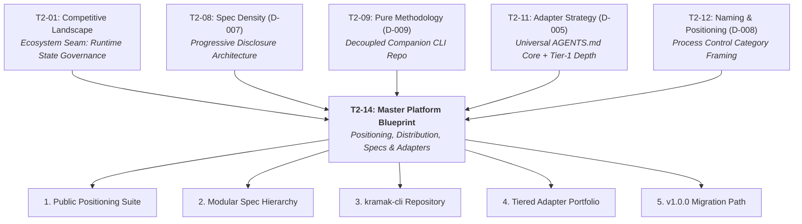
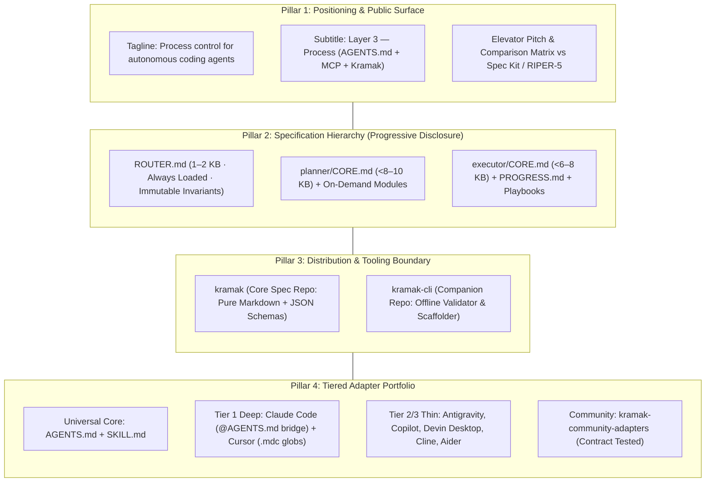
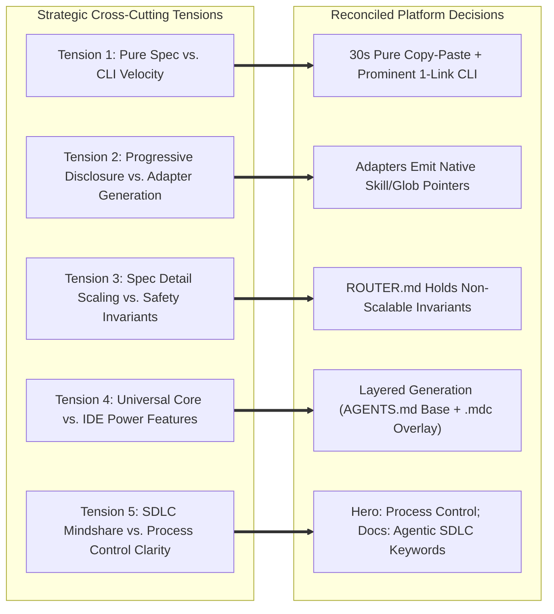
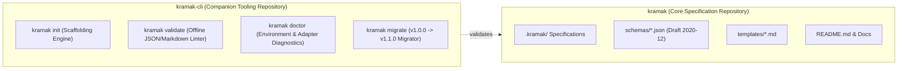
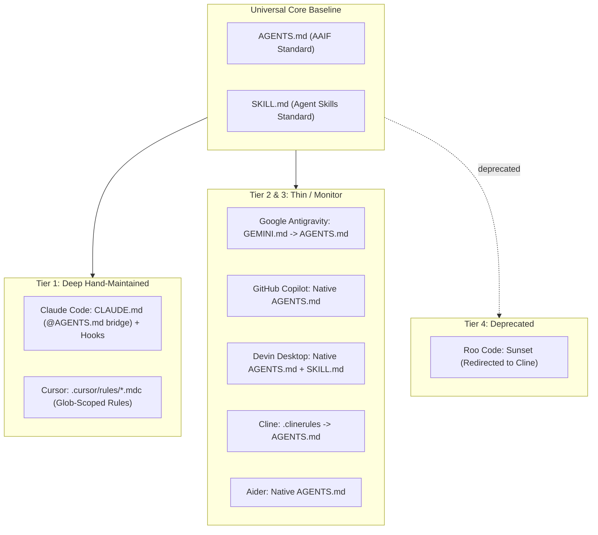
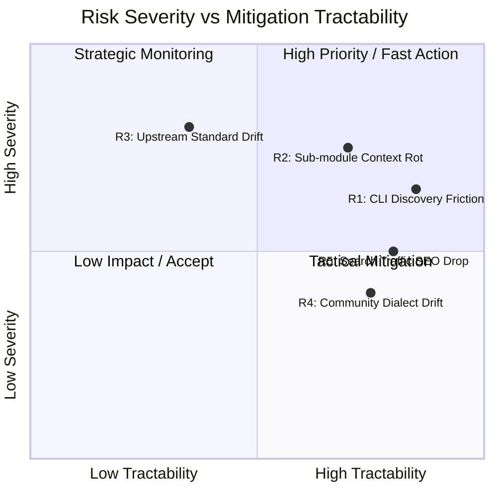

# Positioning, Distribution & Platform Layer Blueprint

*Authoritative synthesis and master platform specification for Kramak (क्रमक) v1.1+. Prepared for Principal Architect execution.*

---

## 1. Synthesis Mandate

This blueprint bridges Phase 0 research into Phase 1 implementation by unifying the verdicts of four foundational Layer 1 research spikes—**Specification Density & Progressive Disclosure** ([T2-08](T2-08-spec-density-progressive-disclosure.md)), **Pure Methodology vs. Companion Tooling** ([T2-09](T2-09-pure-methodology-tooling.md)), **Adapter Portfolio Strategy** ([T2-11](T2-11-adapter-strategy.md)), and **Naming & Positioning Statement** ([T2-12](T2-12-naming-positioning.md))—grounded in the competitive baseline established in [T2-01](T2-01-competitive-landscape.md).

### 1.1 Operating Constraints & Boundary Principles

Per the research pipeline charter, upstream verdicts are treated as settled inputs. This synthesis does not reopen adjudicated research questions. Instead, it reconciles strategic and operational tensions across the four decisions, establishing concrete, copy-pasteable specifications for:
1. **Public Positioning & Messaging Copy:** Finalized tagline, category subtitle, one-paragraph elevator pitch, and competitive comparison matrix.
2. **Specification Information Architecture:** Progressive-disclosure hierarchy, file tree, token budgets, and drop-in specification deltas for `ROUTER.md`, `planner/CORE.md`, and `executor/CORE.md`.
3. **Distribution & Tooling Architecture:** Repository boundary between the pure-methodology core (`kramak`) and the standalone companion validator (`kramak-cli`), accompanied by a migration protocol for existing shell and Node scripts.
4. **Adapter Portfolio Management:** Four-tier adapter hierarchy, universal `AGENTS.md`/`SKILL.md` baseline emission, bespoke integrations for Claude Code and Cursor, and community adapter governance under `kramak-community-adapters`.
5. **Adopter Migration & Backward Compatibility:** Non-breaking transition pathway for in-flight v1.0.0 repositories.

### 1.2 Fixed Axiomatic Invariants

All specifications in this blueprint strictly uphold Kramak's non-negotiable project constraints:
- **C1 (Project Name):** The project name **Kramak (क्रमक)** is immutable.
- **C2 (Zero Mandatory Runtime Dependencies):** The core specification repository contains exclusively Markdown documents and JSON Schema files. No compiler, runtime, package manager, or build step is required to use Kramak.
- **C3 (Model-Agnostic Core):** No model-name allowlists, vendor SDK bindings, or proprietary API assumptions exist within the core state machine.
- **C4 (IDE-Agnostic Core + Adapter Translation):** The core state machine and Work Item contracts remain IDE-neutral, translated to host environments via declarative adapters.
- **C5 (MIT License):** Fully open-source and unencumbered.
- **C6 (v1.0.0 Baseline):** Full auditability and backward compatibility for the shipped v1.0.0 baseline.

---

## 2. Executive Summary of Upstream Verdicts

The platform layer synthesizes five upstream research outputs into a cohesive architectural posture:



### 2.1 Upstream Verdict Matrix

| Session ID | Decision ID | Investigated Domain | Core Upstream Verdict | Architectural Implication for Platform |
|---|---|---|---|---|
| **T2-01** | *Context* | Competitive Landscape & Ecosystem Seams | Confirmed Layer 1 (Context: AGENTS.md) and Layer 2 (Protocol: MCP) are governed standards under AAIF. Layer 3 (Process) is fragmented (204k+ stars across Spec Kit, BMAD, RIPER-5, GSD, OpenSpec) but lacks deterministic runtime state governance (`state.json` FSM). "Ceremony overhead" is the #1 industry complaint. | Position Kramak as runtime state governance that composes with, rather than replaces, upstream spec tools (e.g., GitHub Spec Kit). Enforce small-task fast paths via Spec Detail Scaling (🟢 Outcome tier). |
| **T2-08** | **D-007** | Spec Density & Progressive Disclosure | Monolithic specs (`PLANNER.md` 41.5KB, `EXECUTOR.md` 17.7KB) exceed Claude Code's 25KB eager-load ceiling, trigger Chroma "context rot", and induce 45% adherence collapse on 20 stacked rules. Restructure specs into a lean eager core plus on-demand reference modules. | Split monolithic specs into `ROUTER.md` (1–2KB global router/invariants), `planner/CORE.md` (<8–10KB), `executor/CORE.md` (<6–8KB), on-demand reference modules, and dynamic `PROGRESS.md`. |
| **T2-09** | **D-009** | Pure Methodology vs. Companion Tooling | Adopt Option 3 (EditorConfig model): Decouple all tooling into a separate companion repository (`kramak-cli`). Core repo stays 100% Markdown and JSON Schema (no `package.json`, lockfiles, or scripts). Migrate `init.sh`, `init.ps1`, `validate.js` out of core repo. | Maintain zero-dependency brand purity verifiable by directory listing. Companion CLI provides offline, non-generative structural validation, linter diagnostics, and migration shims. |
| **T2-11** | **D-005** | Adapter Portfolio & Integration Surface | Adopt universal `AGENTS.md` / `SKILL.md` core. Maintain deep logic for Claude Code (`@AGENTS.md` bridge in `CLAUDE.md`) and Cursor (`.mdc` glob rules). Tier 2: Google Antigravity (promote on enterprise/CLI stability) and GitHub Copilot. Tier 3: Devin Desktop, Cline, Aider. Deprecate Roo Code (shut down May 2026). Move long-tail to `kramak-community-adapters`. | Core generator emits universal `AGENTS.md` + `SKILL.md` pair. Deep adapters emit tool-specific activation rules. Standardized contract tests gate community contributions. |
| **T2-12** | **D-008** | Category Positioning & Naming Legibility | Preserve Sanskrit name "Kramak (क्रमक)" (methodical sequential progression). Retire "SDLC" from primary tagline (contested by enterprise consultants and AWS AI-DLC; overclaims org lifecycle). Primary tagline: *"Kramak: process control for autonomous coding agents"*. Subtitle: *"Layer 3 — Process, alongside AGENTS.md (context) and MCP (connectivity)"*. | Update README, hero copy, and GitHub metadata. Position as deterministic process-control middleware compatible with all host agents. Retain "Agentic SDLC" as secondary SEO keyword. |

---

## 3. Recommendation (The Master Platform Blueprint)

The Master Platform Blueprint organizes Kramak v1.1+ across four synchronized pillars:



### 3.1 Pillar 1: Positioning & Public Surface Blueprint
- **Core Identity:** Kramak is the deterministic process-control layer for autonomous coding agents. It provides a formal, schema-validated finite state machine (`BOOTSTRAP` → `PLANNING` → `EXECUTING` → `AUDITING`) that prevents runaway hallucination, scope creep, and unstructured code mutation.
- **Three-Layer Mental Model:**
  - **Layer 1 (Context):** `AGENTS.md` (AAIF standard) — *What the repository is and what conventions it follows.*
  - **Layer 2 (Protocol):** `Model Context Protocol (MCP)` (AAIF standard) — *How the agent connects to local tools, IDE APIs, and remote services.*
  - **Layer 3 (Process):** `Kramak (क्रमक)` — *How the agent methodically plans, executes, verifies, and audits its work step-by-step.*
- **Ecosystem Relationship:** Kramak does not compete with agent runtimes (Claude Code, Cursor, Antigravity, Devin, OpenHands) or spec generators (GitHub Spec Kit). It acts as execution-governance middleware that runs inside or alongside them.

### 3.2 Pillar 2: Specification Restructuring Blueprint
- **Loading Philosophy:** Adheres to Anthropic's "Right Altitude" principle and the Agent Skills progressive-disclosure model.
- **Structure:**
  - `ROUTER.md` (1–2 KB): Ingested at session initiation. Establishes the agent's operating contract, defines the non-negotiable execution invariants (Grounded Verification, Hard Scope Check, Circuit Breaker) that are **never scaled away**, specifies the 🔴/🟡/🟢 detail tiers, and indexes on-demand modules.
  - `planner/CORE.md` (<8–10 KB): Ingested when in `PLANNING` state. Contains canonical planning workflows and 2–3 diverse worked examples. Points to `planner/edge-cases.md`, `planner/domain-conventions.md`, and `planner/output-contract.md`.
  - `executor/CORE.md` (<6–8 KB): Ingested when in `EXECUTING` state. Contains the execution loop, turn-by-turn verification checklists, and pointers to `executor/error-recovery.md` and `executor/tool-playbooks.md`.
  - `executor/PROGRESS.md`: Dynamic scratchpad maintained by the executor during task execution, externalizing runtime state without polluting static prompt memory.

### 3.3 Pillar 3: Tooling & Distribution Architecture Blueprint
- **Repository Decoupling:**
  - `kramak` (Main Repository): Contains zero executable scripts, package manifests, or lockfiles. Standard repository structure contains only `.kramak/` specifications, `schemas/` (JSON Schema draft 2020-12), `templates/`, and Markdown documentation.
  - `kramak-cli` (Companion Tooling Repository): Independent repository and npm/cargo package (`@kramak/cli` / `cargo-kramak`) providing `init`, `validate`, `doctor`, and `migrate` commands.
- **Validation Engine:** Built on standard JSON Schema validators (`ajv` / `jsonschema`) for machine-readable state validation, plus an AST-based Markdown validator for specification structure.
- **Supply-Chain Isolation:** The core specification carries zero supply-chain risk. Compromises in third-party package ecosystems cannot affect pure-spec adopters.

### 3.4 Pillar 4: Adapter Portfolio & Ecosystem Blueprint
- **Universal Baseline:** All adapters generate a synchronized `AGENTS.md` and `SKILL.md` pair at project root, providing immediate baseline capability across all modern AI coding tools.
- **Tier 1 (Deep):**
  - **Claude Code:** Emits `CLAUDE.md` with `@AGENTS.md` import line, plus subagent configs and skill definitions.
  - **Cursor:** Emits `.cursor/rules/*.mdc` with glob-scoped matching (`alwaysApply: false`, path filters) to minimize token consumption, co-emitting `AGENTS.md`.
- **Tier 2 & 3 (Thin / Monitor):**
  - **Google Antigravity:** Native `AGENTS.md` + `SKILL.md` (promoted to Tier 1 upon stabilization of enterprise accounts and CLI surface).
  - **GitHub Copilot:** Native `AGENTS.md` reading.
  - **Devin Desktop / Windsurf:** Native `AGENTS.md` + `SKILL.md` support.
  - **Cline:** Native `AGENTS.md` + `.clinerules/` fallback.
  - **Aider:** Native `AGENTS.md` reading.
- **Tier 4 (Deprecate):**
  - **Roo Code:** Formally deprecated following upstream project shutdown (2026-05-15). Replaced by Cline adapter with deprecation notice.
- **Community Stewardship:** All niche, emerging, or IDE-fork adapters are maintained under `github.com/kramak-community-adapters` with automated contract test validation against core schema releases.

---

## 4. Alternatives Considered & Reconciled Tensions

During the synthesis of T2-08, T2-09, T2-11, and T2-12, five critical architectural tensions were identified and reconciled:



### 4.1 Tension 1: Pure Methodology Brand vs. Developer Onboarding Friction
- **Tension:** T2-09 establishes that pure specifications achieve massive adoption (SemVer, AGENTS.md) and eliminate supply-chain risk, while T2-01 notes that developers in 2026 expect one-command scaffolding (Spec Kit's `specify-cli`).
- **Alternative Rejected:** Bundling `npx kramak` directly inside the core repository (Option 2 of D-009). This would immediately invalidate the "zero runtime dependencies" brand claim upon inspecting the repo root.
- **Reconciled Resolution:** The main repository README leads with a **30-Second Manual Bootstrap** (copying the `.kramak/` directory or cloning the template), demonstrating complete independence from external tooling. A prominent, permanent badge and section link directly to `kramak-cli` as the *optional companion validator*. This preserves brand verifiability while providing frictionless CLI onboarding for teams that want it.

### 4.2 Tension 2: Progressive Disclosure vs. Adapter Generation Overhead
- **Tension:** T2-08 modularizes specifications into multiple on-demand files (`ROUTER.md`, `planner/CORE.md`, `executor/CORE.md`, playbooks). However, adapters (T2-11) generate host configuration files (`CLAUDE.md`, `.cursorrules`). If an adapter naively inlines all modular files, context windows explode; if it references non-existent files, agents hallucinate.
- **Alternative Rejected:** Generating monolithic flat prompt files per IDE adapter to maintain backward compatibility with old rule loaders.
- **Reconciled Resolution:** Adapters emit **native progressive-disclosure pointers**:
  - Claude Code adapter emits `CLAUDE.md` with `@AGENTS.md` and defines `SKILL.md` tools pointing to `.kramak/planner/` and `.kramak/executor/`.
  - Cursor adapter emits glob-scoped `.cursor/rules/*.mdc` rules that only load `planner/CORE.md` when editing planning artifacts and `executor/CORE.md` when executing work items.
  - Generic adapters emit `AGENTS.md` instructing the host agent to read `ROUTER.md` first, which provides clear deterministic pointers to downstream modules.

### 4.3 Tension 3: Spec Detail Scaling (🟢 Outcome Tier) vs. Safety Invariants
- **Tension:** T2-01 and T2-08 emphasize that "ceremony overhead" is the primary barrier to adoption, justifying Innovation #4 (Spec Detail Scaling: 🔴 Guided / 🟡 Directed / 🟢 Outcome). However, T2-08 cites empirical research showing that unconstrained outcome-driven prompts suffer 25–63% constraint violation rates when guardrails are stripped away.
- **Alternative Rejected:** Allowing the 🟢 Outcome tier to truncate or bypass all specification text, including verification rules.
- **Reconciled Resolution:** Strict structural separation between **Invariants** and **Procedural Guidance**:
  - **Immutable Invariants (Non-Scalable):** Grounded Verification (Innovation #1), Hard Scope Check (Innovation #6), Circuit Breaker (Innovation #8), and State Reconciliation (Innovation #7) are embedded permanently in `ROUTER.md`. They apply unconditionally across 🔴, 🟡, and 🟢 tiers.
  - **Scalable Procedure:** Only task breakdown granularity, worked examples, and intermediary checkpoint frequency scale down in 🟡 Directed and 🟢 Outcome tiers.

### 4.4 Tension 4: Universal `AGENTS.md` Baseline vs. Host-Specific IDE Power Features
- **Tension:** T2-11 mandates an `AGENTS.md`/`SKILL.md`-native core to minimize maintenance, while power users on Cursor and Claude Code demand tool-specific capabilities (e.g., Cursor's path-specific `.mdc` globs and Claude Code's subagent hooks).
- **Alternative Rejected:** Strictly emitting only `AGENTS.md` and forbidding all IDE-specific configuration files.
- **Reconciled Resolution:** **Layered Emission Architecture**. The generator creates a complete, standalone `AGENTS.md` (ensuring 100% functionality on any generic tool). It then applies an additive, non-conflicting overlay for Tier 1 tools:
  - For Claude Code: Generates a 2-line `CLAUDE.md` (`@AGENTS.md` + subagent hooks).
  - For Cursor: Generates `.cursor/rules/kramak-core.mdc` with explicit glob activation triggers.

### 4.5 Tension 5: "SDLC" SEO Mindshare vs. "Process Control" Positioning Precision
- **Tension:** T2-12 proves that "SDLC" is an overcontested enterprise buzzword (PwC, KPMG, IBM, AWS AI-DLC) that misrepresents Kramak's lightweight Layer 3 scope. However, "Agentic SDLC" carries substantial search volume.
- **Alternative Rejected:** Erasing the term "SDLC" entirely from the project lexicon.
- **Reconciled Resolution:** **Tiered Copy Matrix**:
  - *Hero Title & Repo Description:* "Process control for autonomous coding agents." (Uncontested, precise, ownable).
  - *Category Subtitle:* "Layer 3 — Process, alongside AGENTS.md (Context) and MCP (Protocol)."
  - *Documentation, Comparison Pages & Meta Tags:* "The deterministic process layer for teams standardizing their agentic SDLC."

---

## 5. Detailed Specifications & Spec-Delta Text

This section contains exact, drop-in text and structural definitions ready for immediate implementation.

### 5.1 Finalized README Copy & Messaging Suite

#### 5.1.1 Header, Tagline & Badges
```markdown
# Kramak (क्रमक)

> **Process control for autonomous coding agents**  
> *Layer 3 — Process, alongside AGENTS.md (Context) and MCP (Connectivity)*

[](LICENSE)
[](spec/PRINCIPLES.md)
[](https://agenticai.foundation)
[](schemas/state.schema.json)
[](https://github.com/bhaskarjha-dev/kramak-cli)
```

#### 5.1.2 Elevator Pitch & Sanskrit Etymology
```markdown
### What is Kramak?

**Kramak (क्रमक)** is Sanskrit for *a methodical, step-by-step procedure*—an exact description of what autonomous AI coding agents need to operate reliably.

In the modern agentic stack:
- **`AGENTS.md` (Context)** tells the agent *what* a project is and what conventions it follows.
- **`Model Context Protocol` (Connectivity)** gives the agent *tools* to interact with the environment.
- **`Kramak` (Process)** governs *how* the agent works: what it plans before writing code, how it verifies changes against scope, and how it logs progress so humans retain deterministic auditability.

Kramak is agent-agnostic, model-agnostic, and has **zero mandatory runtime dependencies**. It works seamlessly with Claude Code, Cursor, Google Antigravity, GitHub Copilot, Devin Desktop, Cline, and Aider.
```

#### 5.1.3 Master Comparison Matrix
```markdown
### How Kramak Compares

| Dimension | Kramak (क्रमक) | GitHub Spec Kit | RIPER-5 / Forks | Built-in Agent Loops (Devin/Antigravity/Cursor) |
|---|---|---|---|---|
| **Primary Focus** | **Runtime Process Control & Audit Governance** | Pre-execution Specification Generation | Interactive Mode Prompting | Unconstrained Autonomous Execution |
| **Category Layer** | **Layer 3: Process Control** | Spec-Driven Development (SDD) | System Prompt Convention | Integrated Runtime Environment |
| **State Persistence** | **Deterministic `state.json` (Schema 2020-12)** | Plain Markdown artifacts (no schema) | Markdown memory banks (no schema) | Internal proprietary session database |
| **Enforcement Model** | **External FSM Transitions & Hard Scope Checks** | Advisory (Slash commands invokable in any order) | Advisory (LLM self-compliance with prompt) | Proprietary platform heuristics |
| **Verification Loop** | **Built-in `AUDITING` → `PLANNING` Loopback** | Optional bolt-on (`/speckit.converge`) | Advisory Review Mode | Vendor-specific test runners |
| **Tooling Footprint** | **Zero mandatory dependencies** (Pure Markdown + Schemas) | Mandatory Python CLI (`specify-cli`, `uv`, Python 3.11+) | Zero dependencies (single prompt) | Full IDE / SaaS platform |
| **Interoperability** | **Model & IDE Agnostic** (Emits AGENTS.md / SKILL.md) | Multi-tool (30+ agents) | Tool-specific forks | Single-vendor runtime |
```

#### 5.1.4 30-Second Quickstart
```markdown
### Quickstart (30 Seconds)

Kramak requires no package installation. Simply copy the `.kramak/` governance directory into your repository:

```bash
# 1. Clone or copy the .kramak directory into your project
cp -r /path/to/kramak/.kramak ./

# 2. Point your agent to the entry router
# For Claude Code / Cursor / Copilot, Kramak auto-configures via AGENTS.md
echo "Follow the process in .kramak/ROUTER.md" >> AGENTS.md

# 3. Start your autonomous agent
# The agent will detect state.json, execute BOOTSTRAP, and enter PLANNING.
```

*(Optional)* If you prefer CLI-driven validation and project scaffolding, use our companion tool:
```bash
npx @kramak/cli init
npx @kramak/cli validate
```
```

---

### 5.2 Specification Restructuring & File Tree Specification

To eliminate instruction-stacking collapse, reduce context-rot overhead, and comply with Claude Code's 25KB eager-load ceiling, specifications are restructured into the following directory layout:

```
.kramak/
├── ROUTER.md                     (~1.8 KB · Eagerly Loaded · Non-Negotiable Invariants)
├── AGENTS.md                     (~2.0 KB · Universal AAIF Context Bridge)
├── SKILL.md                      (~2.5 KB · AAIF Standard Agent Skills Specification)
├── schemas/
│   ├── state.schema.json         (JSON Schema Draft 2020-12)
│   └── work-item.schema.json     (JSON Schema Draft 2020-12)
├── planner/
│   ├── CORE.md                   (Target: 7.5 KB · Eagerly loaded during PLANNING state)
│   ├── edge-cases.md             (Target: 6.0 KB · Loaded on-demand when edge condition met)
│   ├── domain-conventions.md     (Target: 4.5 KB · Loaded on-demand for monorepo/polyglot)
│   └── output-contract.md        (Target: 5.0 KB · Loaded on-demand during Work Item generation)
└── executor/
    ├── CORE.md                   (Target: 5.8 KB · Eagerly loaded during EXECUTING state)
    ├── error-recovery.md         (Target: 4.5 KB · Loaded on-demand during test/tool failure)
    ├── tool-playbooks.md         (Target: 5.2 KB · Loaded on-demand for git/build operations)
    └── PROGRESS.md               (Dynamic session scratchpad · Maintained by Executor)
```

#### 5.2.1 Token Budgets & Loading Triggers

| File Path | Static Size Limit | Token Budget (approx.) | Ingestion Trigger | Primary Purpose |
|---|---|---|---|---|
| `.kramak/ROUTER.md` | ≤ 2.0 KB | ~500 tokens | **Always loaded** on every agent turn | Defines agent identity, non-negotiable invariants, detail tier scaling, and module index. |
| `.kramak/planner/CORE.md` | ≤ 8.5 KB | ~2,100 tokens | State == `PLANNING` or `BOOTSTRAP` | Canonical planning workflow, PERCEIVE→REASON→DECIDE loop, 2 canonical worked examples. |
| `.kramak/planner/edge-cases.md` | ≤ 7.0 KB | ~1,750 tokens | Triggered if task involves refactoring >10 files, migrations, or cross-cutting deprecations | Complex edge-case handling rules and ambiguity resolution protocols. |
| `.kramak/planner/output-contract.md` | ≤ 5.5 KB | ~1,350 tokens | Triggered when generating/updating `.kramak/work-items/*.md` | Strict Markdown format and JSON frontmatter validation rules for Work Items. |
| `.kramak/executor/CORE.md` | ≤ 6.5 KB | ~1,600 tokens | State == `EXECUTING` or `AUDITING` | Canonical execution loop, turn-by-turn verification, Hard Scope Check enforcement. |
| `.kramak/executor/error-recovery.md` | ≤ 5.0 KB | ~1,250 tokens | Triggered on test failure, build failure, or scope breach | Step-by-step diagnostic and rollback procedures; failure categorization. |
| `.kramak/executor/tool-playbooks.md` | ≤ 5.5 KB | ~1,350 tokens | Triggered on git conflicts, worktree operations, or environment setup | Deterministic tool execution patterns (grep, git diff, patch). |
| `.kramak/executor/PROGRESS.md` | Dynamic (≤ 4.0 KB) | ~1,000 tokens | Active Execution Session | Scratchpad externalizing running memory, sub-step checks, and test outputs. |

---

### 5.3 Drop-in Specification Text & Modular Skeletons

#### 5.3.1 Canonical Specification Text: `.kramak/ROUTER.md`

Below is the complete, drop-in specification text for `.kramak/ROUTER.md`:

```markdown
# Kramak (क्रमक) — Master Process Router

> **Operating Contract:** You are an autonomous software engineering agent executing within the **Kramak Process Control Framework**. You MUST follow the state machine, invariants, and progressive disclosure rules defined herein.

---

## 1. Non-Negotiable Execution Invariants

The following four invariants are **globally binding** across all states and detail tiers. They CANNOT be bypassed, overridden, or scaled away under any circumstances:

1. **Invariant #1 — Grounded Verification:** You MUST NOT propose modifications to existing code without first verifying line references and symbol definitions using `grep` or direct file reads against the current working tree. All planning references MUST quote exact, confirmed lines.
2. **Invariant #2 — Hard Scope Check:** Before committing or completing any Work Item, you MUST execute `git diff --name-only` and confirm that modified files match the Work Item's declared `files_targeted` list. Any modification outside declared scope MUST be reverted immediately or escalated to the human via INBOX.
3. **Invariant #3 — Deterministic State Reconciliation:** The ground truth of execution state is `.kramak/state.json`. If a crash or context reset occurs, you MUST read `state.json` and reconcile it against `git status` before performing any further actions.
4. **Invariant #4 — Circuit Breaker:** If an audit-fix-audit loop repeats for 3 consecutive iterations on the same Work Item without reaching green status, you MUST trip the Circuit Breaker, halt autonomous execution, record failure diagnostics, and transition state to `WAITING`.

---

## 2. State Machine & Role Activation

Kramak enforces a 5-state deterministic Finite State Automaton (FSM):

```
BOOTSTRAP ──► PLANNING ──► EXECUTING ──► AUDITING ──► [RELEASE]
                 ▲                          │
                 └────── (Loopback) ────────┘
                 ▲                          │
                 └─── WAITING (Human Task) ◄┘
```

Inspect `.kramak/state.json` to determine your current active state and load the corresponding module:

- **State == `BOOTSTRAP` or `PLANNING`:**
  - Role: **Planner** (High-reasoning, architectural focus).
  - Load: `.kramak/planner/CORE.md`.
  - Objective: Ingest requirements, assess codebase context, generate/update Work Items.

- **State == `EXECUTING` or `AUDITING`:**
  - Role: **Executor** (High-precision, deterministic implementation focus).
  - Load: `.kramak/executor/CORE.md`.
  - Objective: Implement declared Work Items, enforce scope limits, verify tests, log progress.

- **State == `WAITING`:**
  - Role: **Coordinator** (Human interaction focus).
  - Objective: Await resolution of human-blocking tasks recorded in `.kramak/inbox/`.

---

## 3. Spec Detail Scaling Tiers (Innovation #4)

Work Items declare a detail tier determining the depth of planning documentation required:
- 🔴 **Guided Tier (High Risk / Complex Architecture):** Full PERCEIVE → REASON → DECIDE decomposition, mandatory pseudocode, explicit test-case design, and exhaustive edge-case enumeration.
- 🟡 **Directed Tier (Standard Feature / Refactoring):** Target file declarations, clear functional acceptance criteria, and specific test verification commands.
- 🟢 **Outcome Tier (Low Risk / Routine Fixes / Canaries):** Concise goal specification and acceptance criteria. *Note: Procedural elaboration is minimized, but all Section 1 Invariants remain 100% active.*

---

## 4. On-Demand Module Index

Load auxiliary modules ONLY when the stated condition is met:

| Module | Location | Load Condition |
|---|---|---|
| **Planner Edge Cases** | `.kramak/planner/edge-cases.md` | Task touches >10 files, involves database migrations, or modifies public API contracts. |
| **Output Contract** | `.kramak/planner/output-contract.md` | Authoring or modifying `.kramak/work-items/*.md` specification files. |
| **Domain Conventions** | `.kramak/planner/domain-conventions.md` | Working within monorepos, multi-language stacks, or specialized frameworks. |
| **Executor Recovery** | `.kramak/executor/error-recovery.md` | Build failure, test suite regression, or Hard Scope Check breach encountered. |
| **Tool Playbooks** | `.kramak/executor/tool-playbooks.md` | Performing complex git worktrees, patch applications, or AST refactorings. |
```

#### 5.3.2 Canonical Skeleton: `.kramak/planner/CORE.md`

```markdown
# Kramak Planner Core Specification

> **Role Contract:** You are operating as the **Planner**. Your objective is architectural decomposition, dependency analysis, and Work Item authoring. You DO NOT execute code modifications or run mutative tools.

## 1. Canonical Planning Protocol (PERCEIVE → REASON → DECIDE)

1. **PERCEIVE:** Inspect `.kramak/state.json`, read `.kramak/INBOX.md` for pending human inputs, and analyze codebase structure using read-only search tools (`grep`, `view_file`, `list_dir`). Verify all references against live files (Invariant #1).
2. **REASON:** Evaluate architectural approaches, cross-module blast radius, and testability. Determine appropriate Detail Scaling Tier (🔴 Guided, 🟡 Directed, 🟢 Outcome).
3. **DECIDE:** Generate or update `.kramak/work-items/WI-XXX.md` adhering strictly to `.kramak/schemas/work-item.schema.json`.
4. **TRANSITION:** Update `.kramak/state.json` to transition active state to `EXECUTING`.

## 2. Work Item Sizing & Decomposition Rules
- **Task Horizon:** Each Work Item MUST be scoped to a maximum execution duration of ~2 hours / ≤15 target files. Split larger epics into sequential Work Items.
- **Scope Declaration:** Explicitly populate `files_targeted` with exact relative paths. The Executor will be hard-gated against this list (Invariant #2).

## 3. Worked Example (🟡 Directed Tier)
```yaml
id: WI-042
title: "Implement Token Bucket Rate Limiter in Auth Middleware"
tier: directed
files_targeted:
  - "src/middleware/rate_limit.ts"
  - "tests/middleware/rate_limit.test.ts"
acceptance_criteria:
  - "Returns HTTP 429 when requests exceed 100 req/min per IP"
  - "Includes X-RateLimit-Remaining and Retry-After headers"
verification_command: "npm test tests/middleware/rate_limit.test.ts"
```
```

#### 5.3.3 Canonical Skeleton: `.kramak/executor/CORE.md`

```markdown
# Kramak Executor Core Specification

> **Role Contract:** You are operating as the **Executor**. Your objective is deterministic implementation, strict scope enforcement, test verification, and audit logging.

## 1. Canonical Execution Loop

1. **ACQUIRE:** Read active Work Item from `.kramak/state.json`. Initialize or append to `.kramak/executor/PROGRESS.md`.
2. **EXECUTE:** Implement necessary changes strictly within `files_targeted`. Verify syntax and linting after each file edit.
3. **VERIFY:** Execute the declared `verification_command`. If tests fail, consult `.kramak/executor/error-recovery.md`.
4. **HARD SCOPE CHECK:** Run `git diff --name-only`. Confirm zero uncommitted or modified files exist outside `files_targeted`. Revert any out-of-scope edits immediately (Invariant #2).
5. **TRANSITION:** Update `state.json` to `AUDITING` with test execution logs.

## 2. Dynamic Progress Logging (`PROGRESS.md`)
Maintain a lightweight scratchpad during execution:
```markdown
# Active Task: WI-042
- [x] Implemented token bucket struct in src/middleware/rate_limit.ts
- [x] Added unit tests in tests/middleware/rate_limit.test.ts
- [ ] Running verification suite...
```
```

#### 5.3.4 Universal Standard Baseline: `AGENTS.md` & `SKILL.md` Bridge

Below is the drop-in baseline configuration generated at repository root:

```markdown
<!-- AGENTS.md (AAIF Universal Process Standard Bridge) -->
# Agent Operating Guidelines

This repository uses the **Kramak Process Control Framework** for deterministic software engineering.

## Execution Rules
1. Before taking any autonomous action, read [.kramak/ROUTER.md](../../.kramak/ROUTER.md).
2. Check your active state and role in .kramak/state.json.
3. Follow the 4 Non-Negotiable Invariants: Grounded Verification, Hard Scope Check, State Reconciliation, and Circuit Breaker.
```


---

### 5.4 Companion CLI Specification & Repository Boundary (`kramak-cli`)

Per D-009, all executable tooling is extracted into a dedicated companion repository.



#### 5.4.1 Repository Boundary Contract

| Attribute | Core Repository (`kramak`) | Companion Tooling (`kramak-cli`) |
|---|---|---|
| **Repository URL** | `github.com/bhaskarjha-dev/kramak` | `github.com/bhaskarjha-dev/kramak-cli` |
| **Package Names** | *None* (Pure specification) | `@kramak/cli` (npm), `kramak-cli` (crates.io) |
| **Primary Artifacts** | Markdown specs, JSON Schemas, templates | Node.js / Rust CLI executable |
| **Mandatory for Use?** | **Yes** (The core methodology) | **No** (100% Optional convenience utility) |
| **Release Cadence** | Controlled SemVer (e.g., v1.0.0, v1.1.0) | Independent fast SemVer (e.g., v0.2.0, v0.3.0) |
| **Network Access** | Zero network calls | Offline by default; network only during package install |
| **Supply-Chain Risk** | **Zero** (No package manifests or dependencies) | Standard npm/cargo registry surface |

#### 5.4.2 CLI Functional Command Surface

```bash
# Initialize Kramak in current repository (generates .kramak/ and AGENTS.md)
kramak init [--tier=guided|directed|outcome] [--adapter=cursor|claude|generic]

# Validate state.json and work-item files against schemas and invariants
kramak validate [--strict] [--quiet]

# Diagnose agent environment, git status, and adapter configuration
kramak doctor

# Migrate an existing v1.0.0 repository to v1.1.0 progressive-disclosure layout
kramak migrate [--dry-run]
```

#### 5.4.3 Core Repository Script Migration Checklist
The following breaking migration protocol MUST be executed during the v1.1.0 release:
1. **Remove Executables:** Delete `init.sh`, `init.ps1`, and `validate.js` from the root of `kramak`.
2. **Commit Redirection Shims (Deprecation Period: 90 Days):**
   - Replace `init.sh` with a shell notice: `echo "Notice: init.sh has moved to the kramak-cli companion repository. Run 'npx @kramak/cli init' or copy .kramak/ directly." && exit 1`
   - Replace `init.ps1` with an equivalent PowerShell message.
   - Replace `validate.js` with an equivalent Node.js message.
3. **Update Core Documentation:** Replace all script execution examples in README with pure file-copy instructions and companion CLI alternatives.

---

### 5.5 Adapter Portfolio Management & Implementation Matrix

Per D-005, adapters are prioritized into four distinct operational tiers:



#### 5.5.1 Adapter Portfolio Master Matrix

| Adapter Target | Assigned Tier | Ingestion Format | Emitted Artifacts | Maintenance Policy | Promotion / Demotion Triggers |
|---|:---:|---|---|---|---|
| **Universal Baseline** | **Core** | AAIF standard | `AGENTS.md`, `SKILL.md` | Primary internal investment | Immutable foundation. |
| **Claude Code** | **Tier 1 (Deep)** | `CLAUDE.md`, Subagent configs | `CLAUDE.md` (with `@AGENTS.md`), `.claude/skills/*` | Fully maintained; tracked against Anthropic releases | If Anthropic supports `AGENTS.md` natively, remove bridge code. |
| **Cursor** | **Tier 1 (Deep)** | `.cursor/rules/*.mdc` | `.cursor/rules/kramak-*.mdc`, `AGENTS.md` | Fully maintained; glob-scoped activation rules | Demote if Cursor deprecates `.mdc` format without replacement. |
| **Google Antigravity** | **Tier 2 (Monitor)** | `GEMINI.md`, `AGENTS.md` | `.gemini/AGENTS.md`, `skills/*` | Thin wrapper over universal core | **Promotion Trigger:** Stable Workspace/Enterprise account support + stable CLI surface across 2 review cycles. |
| **GitHub Copilot** | **Tier 2 (Monitor)** | `AGENTS.md`, `.github/copilot-instructions.md` | `.github/copilot-instructions.md` | Thin wrapper; rely on native Copilot `AGENTS.md` support | Keep thin unless GitHub introduces bespoke FSM workflow APIs. |
| **Devin Desktop / Windsurf** | **Tier 3 (Thin)** | `AGENTS.md`, `SKILL.md` | `AGENTS.md`, `.windsurf/rules/*` | Thin wrapper; monitored post-Cognition rebrand | Revisit at 90-day review to verify long-term engine stability. |
| **Cline** | **Tier 3 (Thin)** | `.clinerules`, `AGENTS.md` | `.clinerules/kramak.md`, `AGENTS.md` | Thin wrapper; community-tested | Maintain basic compatibility; redirect legacy Roo Code users here. |
| **Aider** | **Tier 3 (Thin)** | `CONVENTIONS.md`, `AGENTS.md` | `AGENTS.md` | Minimal maintenance | Keep purely generic; no bespoke features needed. |
| **Roo Code** | **Tier 4 (Deprecate)** | *Archived* | *None* | **Archived / Sunset** | Deprecated immediately due to upstream project shutdown (May 2026). |

#### 5.5.2 Drop-in Template: Claude Code Adapter (`CLAUDE.md`)
```markdown
# Claude Code Kramak Bridge
@.kramak/AGENTS.md

## Claude Code Specific Instructions
- Use `subagent` tool for parallel investigation when in PLANNING state.
- Always check `.kramak/state.json` before running build or test tools.
- Read `.kramak/ROUTER.md` for non-negotiable execution invariants.
```

#### 5.5.3 Drop-in Template: Cursor Adapter (`.cursor/rules/kramak-core.mdc`)
```markdown
---
description: Kramak Process Control Router for Cursor
globs: .kramak/**/*, src/**/*, lib/**/*, tests/**/*
alwaysApply: true
---

# Kramak Process Control

When operating in this repository, you MUST adhere to the process defined in `.kramak/ROUTER.md`.

- Current State: Check `.kramak/state.json`
- Invariants: Grounded Verification, Hard Scope Check, Circuit Breaker, State Reconciliation
- Planning Docs: Read `.kramak/planner/CORE.md` when authoring specs
- Execution Rules: Read `.kramak/executor/CORE.md` when writing code
```

#### 5.5.4 Community Adapter Governance & Contract Specification
All adapters outside the primary 8 targets are maintained in `github.com/kramak-community-adapters`. To qualify for official listing in Kramak's directory, a community adapter must:
1. Implement the standard **Adapter Interface Contract**:
   ```json
   {
     "adapter_name": "string",
     "target_ide": "string",
     "kramak_spec_compatibility": ">=1.1.0",
     "entry_points": ["string"],
     "emitted_files": ["string"]
   }
   ```
2. Pass the automated contract test suite in CI, confirming that the adapter correctly links to `ROUTER.md` and does not mutate schema files.
3. Be maintained under an active open-source maintainer with an SLA of 6 weeks for compatibility updates following Kramak minor releases.

---

### 5.6 Migration & Backward Compatibility Guide (v1.0.0 → v1.1.0)

For existing v1.0.0 repositories adopting v1.1.0:

#### 5.6.1 Schema & State Compatibility
- `state.json` schema v1.0.0 is forward-compatible with v1.1.0. The v1.1.0 schema adds optional fields (`detail_tier`, `subagent_id`, `worktree_branch`) without removing or modifying existing mandatory fields.
- Work Items created under v1.0.0 remain 100% valid.

#### 5.6.2 File Layout Migration Mapping

```
v1.0.0 Monolithic Path               v1.1.0 Modular Destination Path
─────────────────────────────────────────────────────────────────────────────
spec/PLANNER.md            ──►       .kramak/planner/CORE.md
                                     .kramak/planner/edge-cases.md
                                     .kramak/planner/output-contract.md

spec/EXECUTOR.md           ──►       .kramak/executor/CORE.md
                                     .kramak/executor/error-recovery.md
                                     .kramak/executor/tool-playbooks.md

spec/PRINCIPLES.md         ──►       .kramak/ROUTER.md (Invariants Section)

spec/state.schema.json     ──►       .kramak/schemas/state.schema.json

init.sh / validate.js      ──►       Moved to companion repository (kramak-cli)
```

#### 5.6.3 Backward-Compatibility Shim in Core
To prevent breaking external tools or legacy agents that hardcode paths to `spec/PLANNER.md`, Kramak v1.1.0 includes stub forwarding files in `spec/`:
```markdown
<!-- spec/PLANNER.md backward-compatibility shim -->
# Forwarding Notice
This specification has been modularized for progressive disclosure in v1.1+.
Please read [.kramak/ROUTER.md](../../.kramak/ROUTER.md) and [.kramak/planner/CORE.md](../../.kramak/planner/CORE.md).
```

---

## 6. Open Risks & Implementation Dependencies

### 6.1 Structured Risk Register



| ID | Identified Risk | Impacted Domain | Severity / Probability | Concrete Mitigation Strategy | Measurable Reversal Trigger |
|---|---|---|:---:|---|---|
| **R1** | **Discovery Friction from Decoupled CLI** | Distribution & Onboarding | Medium / High | Place prominent badges and copy-paste `npx @kramak/cli` quickstarts in README header and docs. | If companion CLI traffic is <10% of core repository views after two minor release cycles, re-evaluate lightweight single-script bundling. |
| **R2** | **Instruction Loss Across Multi-File Specs** | Agent Adherence | High / Medium | Anchor all non-negotiable invariants in `ROUTER.md` so that missing an on-demand module never breaches safety guardrails. | If agent benchmark adherence on modular specs drops >5% compared to monolithic specs, consolidate sub-modules back into `CORE.md`. |
| **R3** | **Upstream Standards Drift (AAIF / MCP)** | Adapter Strategy | High / Low | Maintain active tracking of Linux Foundation AAIF releases; participate in open working groups. | If AAIF introduces a conflicting official Process specification, initiate immediate compatibility bridge session. |
| **R4** | **Community Adapter Dialect Drift** | Ecosystem Quality | Low / Medium | Mandate automated contract test passing before listing any adapter in the official directory. | If ≥2 community adapters emit conflicting state configurations, publish a reference test harness library. |
| **R5** | **Search Traffic Drop from Retiring 'SDLC' Tagline** | Discoverability & SEO | Medium / Low | Retain "Agentic SDLC" in secondary headings, comparison pages, FAQ, and HTML meta tags. | If organic search referral traffic drops >25% over 90 days, reinstate "Agentic SDLC" into the primary README subtitle. |

### 6.2 Implementation Dependencies & Phasing Roadmap

Execution proceeds in four sequential implementation phases:

```
[Phase 1: Repo Decoupling] ──► [Phase 2: Spec Modularization] ──► [Phase 3: Adapter Generation] ──► [Phase 4: Release v1.1.0]
     (kramak-cli setup)             (ROUTER.md & CORE.md)             (Tier 1 & Universal)            (Documentation & Tags)
```

1. **Milestone M1 (Repository Decoupling):** Establish `kramak-cli` repository, migrate `init.sh`, `init.ps1`, and `validate.js`, publish `@kramak/cli` v0.1.0 to npm.
2. **Milestone M2 (Specification Modularization):** Author `.kramak/ROUTER.md`, `.kramak/planner/CORE.md`, `.kramak/executor/CORE.md`, and on-demand reference modules. Implement backward-compatibility forwarding stubs in `spec/`.
3. **Milestone M3 (Adapter Portfolio Update):** Implement universal `AGENTS.md` + `SKILL.md` emitter, update Claude Code bridge and Cursor `.mdc` rules, archive Roo Code adapter with migration docs.
4. **Milestone M4 (Public Release & Verification):** Update README with finalized positioning copy, comparison matrix, and badges. Verify full end-to-end flow with automated test runs.

---

## 7. Traceability Ledger

This ledger establishes complete traceability from every section of this blueprint back to source sessions, decision registry entries, and empirical evidence grades.

| Blueprint Section | Primary Decision | Source Sessions | Addressed Innovation / Mechanism | Supporting Evidence Grade |
|---|:---:|:---:|---|:---:|
| **§3.1 / §5.1 (Positioning Suite)** | **D-008** | [T2-12](T2-12-naming-positioning.md), [T2-01](T2-01-competitive-landscape.md) | Category Framing (Layer 3: Process alongside AAIF AGENTS.md & MCP) | **Grade A/B** (AAIF Charter, GitHub Spec Kit docs, naming precedent studies) |
| **§3.2 / §5.2 / §5.3 (Spec Hierarchy)** | **D-007** | [T2-08](T2-08-spec-density-progressive-disclosure.md), [T2-01](T2-01-competitive-landscape.md) | #4 (Spec Detail Scaling), Anthropic "Right Altitude", Progressive Disclosure | **Grade A** (Chroma long-context benchmark, Anthropic prompt engineering guidelines) |
| **§3.3 / §5.4 (Tooling Boundary)** | **D-009** | [T2-09](T2-09-pure-methodology-tooling.md), [T2-01](T2-01-competitive-landscape.md) | Zero-Dependency Identity, EditorConfig Core/Plugin Architecture Model | **Grade A** (EditorConfig governance, SemVer specification history, npm security audits) |
| **§3.4 / §5.5 (Adapter Portfolio)** | **D-005** | [T2-11](T2-11-adapter-strategy.md), [T2-03](T2-03-ide-ecosystem-scan.md) | #11 (Auto-Bootstrap across toolchains), AAIF Universal Core, Tiered Maintenance | **Grade A/B** (Anthropic Claude Code memory specs, Cursor .mdc docs, Roo Code EOL) |
| **§4.3 / §5.3 (Immutable Invariants)** | **D-010** | [T2-13](T2-13-guardrail-confirmation-bundle.md), [T2-04](T2-04-evidentiary-audit.md) | #1 (Grounded Verification), #6 (Hard Scope Check), #7 (State Reconciliation), #8 (Circuit Breaker) | **Grade A/B** (Distributed systems crash recovery, OWASP AI Agent Security guidelines) |
| **§5.6 (Adopter Migration)** | **D-003** | [T2-04](T2-04-evidentiary-audit.md), [T2-08](T2-08-spec-density-progressive-disclosure.md) | Schema Versioning & Forward Compatibility Policy | **Grade A** (JSON Schema draft 2020-12 specification standards) |

---
*End of Blueprint — Certified ready for Phase 1 implementation and Founding Architecture Document (FAD) compilation.*
