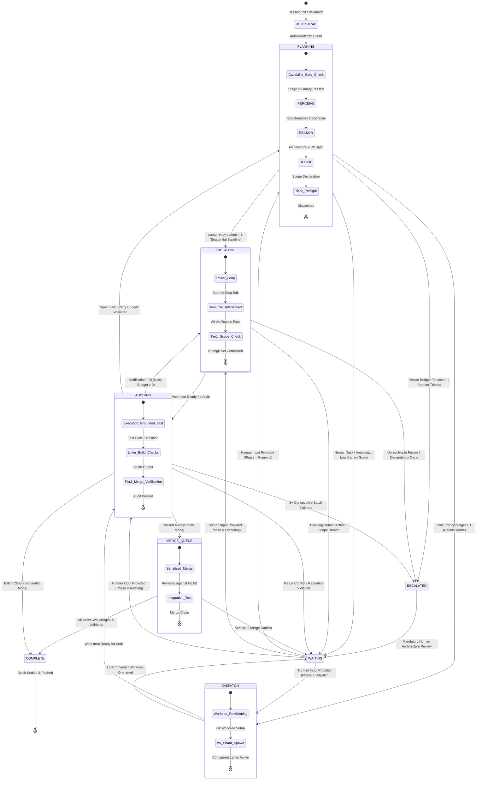
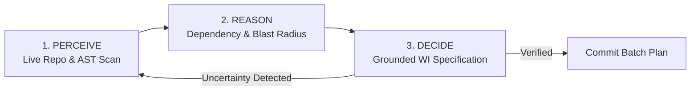
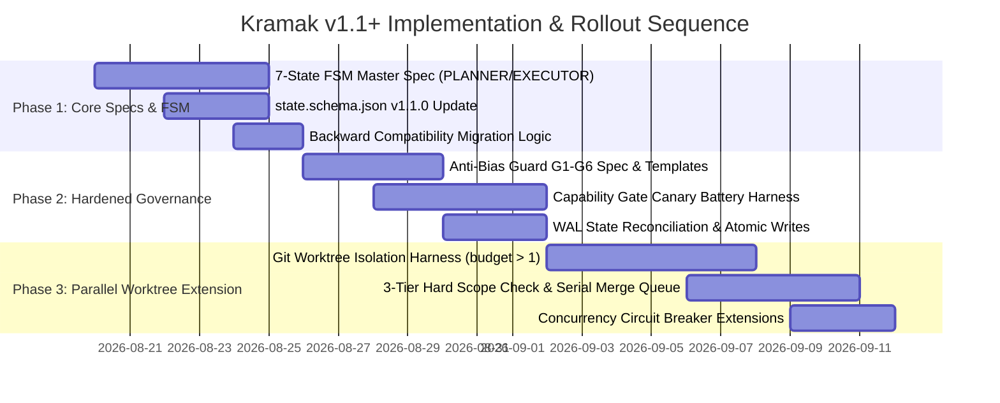

# Core Engine, Verification & Governance Hardening Blueprint

## 1. Synthesis Mandate

### 1.1 Purpose and Scope
This document constitutes the authoritative **Core Engine, Verification & Governance Hardening Blueprint** for Kramak v1.1+. It synthesizes findings and verdicts from seven upstream foundational research sessions into a single, cohesive, drop-in engineering specification:
- [T2-02: Agentic Software Engineering Literature](file:///d:/dev/pro/kramak/research/sessions/T2-02-orchestration-research-literature.md) (Structural vs Routing vs Control-Plane claims)
- [T2-04: Evidentiary Audit of Citations & Parameters](file:///d:/dev/pro/kramak/research/sessions/T2-04-evidentiary-audit.md) (Parameter calibration, METR time horizons, Polish Ceiling)
- [T2-05: Core Loop Retrospective & FSA Topology](file:///d:/dev/pro/kramak/research/sessions/T2-05-core-loop-retrospective.md) (7-state FSM, bounded retries, trace preservation)
- [T2-06: Multi-Agent & Parallel Evolution](file:///d:/dev/pro/kramak/research/sessions/T2-06-multiagent-parallel-evolution.md) (Git-worktree isolation, serialized merge queue, state sharding)
- [T2-07: Self-Improvement Governance](file:///d:/dev/pro/kramak/research/sessions/T2-07-self-improvement-governance.md) (Hardened Anti-Bias Guard G1–G6, immutable rollback ledger)
- [T2-10: Capability Gate Reliability](file:///d:/dev/pro/kramak/research/sessions/T2-10-capability-gate-reliability.md) (Hybrid canary diagnostic, deterministic grading)
- [T2-13: Guardrail & Grounding Confirmation Bundle](file:///d:/dev/pro/kramak/research/sessions/T2-13-guardrail-confirmation-bundle.md) (Grounded Verification, 3-tier Hard Scope Check, progress-aware Circuit Breaker, WAL State Reconciliation, repair-oriented Failure Taxonomy)

The primary audience is a **Principal Architect** authoring the v1.1+ specification modifications across [`spec/PLANNER.md`](file:///d:/dev/pro/kramak/spec/PLANNER.md), [`spec/EXECUTOR.md`](file:///d:/dev/pro/kramak/spec/EXECUTOR.md), [`spec/PRINCIPLES.md`](file:///d:/dev/pro/kramak/spec/PRINCIPLES.md), and [`spec/state.schema.json`](file:///d:/dev/pro/kramak/spec/state.schema.json).

### 1.2 Fixed Axiomatic Constraints
Per [DECISIONS.md](file:///d:/dev/pro/kramak/research/DECISIONS.md) §2, all synthesis recommendations strictly respect the non-negotiable project boundaries:
1. **C1 (Project Identity):** Kramak (क्रमक) retains its Sanskrit naming convention (*√kram* + *-aka*, "the agent who progresses methodically").
2. **C2 (Zero Mandatory Runtime Dependencies):** The core control plane remains 100% pure Markdown specifications, JSON Schemas, and workspace templates. No mandatory background daemons, native binaries, or proprietary runtimes are introduced.
3. **C3 (Model-Agnostic via Behavioral Assessment):** Kramak operates across any LLM without model-name string inspection or provider-specific allowlists.
4. **C4 (IDE-Agnostic Core + Adapter Translation):** Core state machine and Work Item schemas remain IDE-neutral; platform adapters translate into environment-native instructions.
5. **C5 (Open Source):** Fully MIT-licensed and commercially unencumbered.
6. **C6 (Baseline Under Audit):** v1.0.0 shipped baseline (48 files, 8 adapters, 12 innovations) is the historical foundation upgraded herein.

---

## 2. Executive Summary of Upstream Engine Verdicts

The seven informing sessions reached unanimous, evidence-grounded verdicts on the engine's core mechanisms:

```
┌─────────────────────────────────────────────────────────────────────────────────────────────────┐
│                               MASTER ENGINE SYNTHESIS MATRIX                                    │
├───────────────────┬──────────────┬──────────────────┬───────────────────────────────────────────┤
│ Informing Session │ Informs Dec. │ Evidence Grade   │ Upstream Engine Verdict                   │
├───────────────────┼──────────────┼──────────────────┼───────────────────────────────────────────┤
│ T2-02             │ D-001, D-002 │ Grade A / B      │ Pareto-optimal routing confirmed; SDLC-   │
│ (Orchestration)   │ D-004, D-006 │                  │ role session handoff needs trace sharing. │
├───────────────────┼──────────────┼──────────────────┼───────────────────────────────────────────┤
│ T2-04             │ D-003, D-004 │ Grade B / C / D  │ 2h cap recalibrated to task horizon;      │
│ (Evidentiary)     │ D-010, D-011 │                  │ FeatBench validates Polish Ceiling;       │
│                   │              │                  │ Failure Taxonomy needs repair mapping.    │
├───────────────────┼──────────────┼──────────────────┼───────────────────────────────────────────┤
│ T2-05             │ D-001, D-003 │ Grade A / B      │ 7-state FSM topology; bounded retry loops;│
│ (Core Loop)       │              │                  │ ReAct executor loop; execution-grounded   │
│                   │              │                  │ Auditor; universal WAITING reachability.  │
├───────────────────┼──────────────┼──────────────────┼───────────────────────────────────────────┤
│ T2-06             │ D-002        │ Grade A / B      │ Option B: Sequential default (budget=1),  │
│ (Multi-Agent)     │              │                  │ opt-in worktree parallel extension,       │
│                   │              │                  │ single-writer state shards, serialized    │
│                   │              │                  │ merge queue, 3-tier Hard Scope Check.     │
├───────────────────┼──────────────┼──────────────────┼───────────────────────────────────────────┤
│ T2-07             │ D-006        │ Grade A / B      │ Reject pure self-report checklist; adopt  │
│ (Self-Improve)    │              │                  │ G1-G6 Anti-Bias Guard with immutable      │
│                   │              │                  │ rollback ledger & risk-tiered human gate. │
├───────────────────┼──────────────┼──────────────────┼───────────────────────────────────────────┤
│ T2-10             │ D-004        │ Grade A / B      │ Reject pure self-assessment; adopt hybrid │
│ (Capability Gate) │              │                  │ 2-stage gate with binding 5-task Canary   │
│                   │              │                  │ Battery (CT-1..CT-5) & fail-closed policy.│
├───────────────────┼──────────────┼──────────────────┼───────────────────────────────────────────┤
│ T2-13             │ D-003, D-010 │ Grade A / B      │ Confirm Grounded Verification, Scope      │
│ (Guardrails)      │ D-011        │                  │ Check, Circuit Breaker, WAL Reconciliation│
│                   │              │                  │ with concrete hardening adjustments.      │
└───────────────────┴──────────────┴──────────────────┴───────────────────────────────────────────┘
```

1. **State Machine Topology (T2-05 & T2-02):** The v1.0.0 5-state FSA was structurally incomplete (no terminal state, no retry loops, `WAITING` under-specified, `AUDITING` model tier undefined). v1.1+ upgrades the FSM to a 7-state closed-loop topology (`BOOTSTRAP`, `PLANNING`, `DISPATCH`, `EXECUTING`, `AUDITING`, `WAITING`, `ESCALATED`, `COMPLETE`) with bounded retry budgets and execution-grounded technical auditing.
2. **Parallel Concurrency Architecture (T2-06):** Adopts Option B (sequential default, opt-in worktree-isolated parallel extension). Merges are strictly serialized through a single merge queue. Concurrency writes are resolved by sharding Work Item state into per-item files (`.kramak/work-items/WI-XXX.json`), eliminating write contention on `state.json`.
3. **Self-Modification Governance (T2-07):** Rejects pure self-report checklists. Replaces the informal 5-point Anti-Bias Guard with the hardened G1–G6 framework: programmatic git history diff (G1), automated precedent cross-check (G2), dual-model critique pass (G3), immutable audit ledger (G4), canary cooldown window (G5), and risk-tiered human gate (G6). A strict Preamble establishes that self-modifications to the governance rules themselves are maximum blast radius.
4. **Capability Gating & Calibration (T2-10):** Replaces uncalibrated self-rating with a hybrid gate: an advisory Stage 1 self-assessment questionnaire followed by a binding Stage 2 Canary Challenge Battery of 5 procedurally generated, deterministically graded micro-tasks (CT-1 through CT-5) that test actual reasoning competence without inspecting model names.
5. **Execution Guardrails & Invariants (T2-13 & T2-04):**
   - *Grounded Verification:* Adds claim-relevance verification on top of grep line-existence.
   - *Hard Scope Check:* Expanded to a 3-tier system (Tier 1 per-worktree diff, Tier 2 pre-flight glob intersection, Tier 3 merge-time re-verification).
   - *Circuit Breaker:* Hardened with oscillation/no-progress repeat-hash comparison rather than raw attempt counts alone.
   - *State Reconciliation:* Hardened with Write-Ahead Logging (WAL) intent-before-mutation ordering, temp-file-then-rename atomic writes, and idempotent recovery.
   - *Failure Taxonomy:* Formalized as 6 repair-oriented categories mapped to MAST and ODC taxonomies.
   - *Design Parameters:* Recalibrates the 2-hour Work Item cap to reflect METR human-task-horizon capability definitions (80% reliability discount) and grounds the Polish Ceiling in FeatBench scope-creep empirical data.

---

## 3. Recommendation (The Master Engine Blueprint)

The master engine architecture harmonizes all seven decisions into an integrated operational pipeline.

### 3.1 Architectural State Topology (v1.1+ Master FSM)



### 3.2 Master State Transition & Governance Rules

| Transition Edge | Guard Condition / Validation Check | Responsible Role | Invariants Enforced |
|---|---|---|---|
| `BOOTSTRAP → PLANNING` | `state.json` validates against `state.schema.json`; toolchain detected; no unhandled crash state. | Orchestrator / Bootstrap | Schema validity; clean working tree. |
| `PLANNING → EXECUTING` | `concurrency.budget == 1`; WIs verified with Grounded Verification; Stage 2 Canary score $\ge \tau_{high}$. | Planner (Reasoning Tier) | Grounded line citations confirmed via grep; declared file list established. |
| `PLANNING → DISPATCH` | `concurrency.budget > 1`; Tier 2 Pre-flight check confirms zero file-scope intersection across concurrent WIs; all dependencies `COMPLETE`. | Planner (Reasoning Tier) | DAG acyclicity; mutual exclusion of file globs. |
| `DISPATCH → EXECUTING` | Git worktree provisioned at `.kramak/worktrees/<id>`; state shard initialized at `.kramak/work-items/<id>.json`. | Subagent Executor | Filesystem isolation; lock acquired. |
| `EXECUTING → AUDITING` | WI test suite passes; Tier 1 Hard Scope Check passes against worktree HEAD; commit recorded. | Executor (Fast/Precise Tier) | Zero uncommitted changes; scope compliance. |
| `AUDITING → EXECUTING` | Build/lint failure; WI retry count $< 3$ (or trajectory reducing errors $< 5$). | Auditor (Execution-Grounded) | Bounded retry loop; error trajectory tracking. |
| `AUDITING → PLANNING` | Fundamental specification bug (`code-drift`, `ambiguous-spec`); WI retry budget exhausted. | Auditor (Execution-Grounded) | Diagnostic recorded in `failed/`; circuit breaker incremented. |
| `AUDITING → MERGE_QUEUE`| Tier 3 Merge Re-verification passes against tip of integration branch; audit report sealed. | Auditor (Execution-Grounded) | No intervening merge collision; clean integration diff. |
| `MERGE_QUEUE → COMPLETE`| All queued merges serialized; full test suite passes on integration branch; queue drained. | Orchestrator Merge Queue | Atomic linear commit history; zero regression. |
| `ANY → WAITING` | `HUMAN-TASKS.md` blocking item logged, or Circuit Breaker tripped, or Anti-Bias G6 human approval required. | Any Active Role | Checkpoint written; idempotency hash sealed; pause execution. |
| `ANY → ESCALATED` | Consecutive batch failures $\ge 3$, or circular dependency detected, or deadlock timeout. | Orchestrator Breaker | Hard stop; prevent infinite token burn. |

---

## 4. Alternatives Considered & Reconciled Tensions

During the Layer 2 synthesis, several structural tensions between upstream session recommendations were evaluated and reconciled:

### 4.1 Tension 1: Parallel Throughput vs. Deterministic Auditability
- **The Conflict:** Multi-agent swarms (T2-06 Option C) maximize concurrency but suffer from MAST inter-agent misalignment failures (~37% of multi-agent breakdowns) and race conditions on `state.json`. Pure sequential execution (Option A) is completely audit-clean but leaves wall-clock throughput on the table for independent tasks.
- **Reconciliation:** Adopt **Option B (Sequential Default + Worktree Extension)**. State is sharded into per-Work-Item files (`.kramak/work-items/WI-XXX.json`), giving each active subagent a single-writer isolation boundary. Merging is strictly serialized through a single FIFO merge queue with Tier 3 re-verification. Determinism and replayable auditability remain 100% preserved.

### 4.2 Tension 2: Model Agnosticism vs. Capability Gating Calibration
- **The Conflict:** Kramak strictly forbids model-name inspection (Constraint C3). However, T2-10 proved that subjective self-assessment questionnaires suffer from inverse-competence overconfidence (Dunning-Kruger-like effects) and RLHF-induced sycophancy.
- **Reconciliation:** Implement a **Hybrid Behavioral Gate**. The model is presented with 5 procedurally generated, deterministically graded algorithmic challenge micro-tasks (CT-1 to CT-5). The gate evaluates observable behavioral outputs rather than declared identity strings. Model-agnosticism is preserved at a higher level of mathematical rigor.

### 4.3 Tension 3: Self-Improvement Velocity vs. Governance Safety
- **The Conflict:** Kramak encourages pipeline self-evolution, but T2-07 demonstrated that LLM self-report checklists fail at self-bias detection, and single-pass self-modification risks catastrophic prompt/rule drift (e.g., Replit agent incident).
- **Reconciliation:** Implement the **Layered G1–G6 Anti-Bias Guard**. Changes to the pipeline core are risk-tiered: non-normative wording auto-merges after automated history diff (G1), precedent cross-check (G2), and cooling-off (G5); changes touching decision records, invariants, or the Anti-Bias Guard itself require mandatory human PR approval (G6) with independent dual-model critique (G3).

### 4.4 Tension 4: Execution Simplicity vs. Crash Resilience
- **The Conflict:** Lightweight file updates risk partial writes (torn state) during session interruptions or aborts.
- **Reconciliation:** Standardize on **Write-Ahead Logging (WAL) + Atomic Renames**. All state modifications follow the intent-before-mutation sequence: write payload to a temporary file (`state.json.tmp`), flush to disk, and execute an atomic filesystem rename over `state.json`.

```
┌────────────────────────────────────────────────────────────────────────────────────────┐
│                        ARCHITECTURAL TENSION RESOLUTION MAP                            │
├──────────────────────────┬─────────────────────────────┬───────────────────────────────┤
│ Architectural Tension    │ Competing Approaches        │ Resolved Master Design        │
├──────────────────────────┼─────────────────────────────┼───────────────────────────────┤
│ Concurrency Control      │ Swarm Chat vs Pure Serial   │ Git Worktrees + Single-Writer │
│                          │                             │ Shards + Serial Merge Queue   │
├──────────────────────────┼─────────────────────────────┼───────────────────────────────┤
│ Model Verification       │ Name Allowlist vs Self-Test │ Behavioral Canary Battery     │
│                          │                             │ (5 Parameterized Tasks)       │
├──────────────────────────┼─────────────────────────────┼───────────────────────────────┤
│ Pipeline Self-Evolution  │ Free Edit vs Blanket Lock   │ Risk-Tiered Human Gate +      │
│                          │                             │ Immutable Ledger (G1–G6)      │
├──────────────────────────┼─────────────────────────────┼───────────────────────────────┤
│ State Durability         │ In-Place Write vs Full RDBMS│ Atomic Temp-Rename + Level-   │
│                          │                             │ Triggered WAL Reconciliation  │
└──────────────────────────┴─────────────────────────────┴───────────────────────────────┘
```

---

## 5. Detailed Spec Deltas & Schema Definitions

This section provides the complete, exact, drop-in specification text and schema definitions for Kramak v1.1+.

### 5.1 Specification Delta: `spec/PLANNER.md`

#### Delta 1: Hardened Capability Gate Check (Lines 49–72 Replacement)
```markdown
### Capability Gate Check (Mandatory Pre-Flight)

Planning requires **high-order architectural reasoning**: multi-step dependency analysis, state-space projection, cross-file invariant tracking, and strict constraint adherence.

Before generating plans, execute the two-stage Capability Gate:

#### Stage 1: Diagnostic Self-Assessment (Advisory)
Evaluate your operational fit for planning. Note: this is a fit diagnosis, not an eligibility test.
```json
{
  "expected_success_rate": <integer 0-100>,
  "key_uncertainty": "<one sentence describing biggest failure risk>",
  "requested_fallback": "<'planner' | 'executor' | 'no_preference'>",
  "reasoning": "<2-3 sentences plain language>"
}
```

#### Stage 2: Objective Canary Challenge Battery (Binding)
Solve the 5 procedurally generated micro-tasks supplied in the session bootstrap prompt:
1. **CT-1 (DAG Scheduling):** Compute topological ordering under worker constraints.
2. **CT-2 (Plan-Bug Detection):** Identify the exact step ID containing an injected flaw.
3. **CT-3 (State Tracking):** Compute deterministic final state across 15+ operations.
4. **CT-4 (Instruction Hierarchy):** Maintain goal integrity despite prompt distractor.
5. **CT-5 (Paraphrase Consistency):** Produce identical logical resolutions across formulations.

**Gate Decision Matrix:**
- **Composite Score $\ge 0.80$ ($\tau_{high}$):** **PROCEED.** Grant Planner role.
- **Composite Score $< 0.60$ ($\tau_{low}$):** **FAIL CLOSED.** Relinquish Planner role; set `state.phase: "waiting"`; instruct orchestrator to downgrade to Executor or request stronger model tier.
- **Score $0.60 \le S < 0.80$ OR Stage 1/Stage 2 Disagreement $> 35\%$:** **CONSERVATIVE DEFAULT.** Route to `WAITING` with flag `capability-ambiguity`.
```

#### Delta 2: Perspective-Based Planning Loop Formulation
```markdown
### STEP 2: PERSPECTIVE-BASED PLANNING (Iterative Closed-Loop)

Do NOT generate plans in a single open-loop pass. Execute the iterative `PERCEIVE → REASON → DECIDE` cognitive cycle with live tool grounding:



1. **PERCEIVE (Tool-Grounded Observation):**
   - Query project files, dependency trees, and existing test suites using grep and file inspection.
   - Ground every assumption in observable code lines. Never plan from memory.
2. **REASON (Structural Decomposition & Risk Analysis):**
   - Decompose features into atomic Work Items conforming to the 2-Hour Task Horizon (METR 80% reliability standard $\approx 30$–$45$ minutes autonomous work).
   - Evaluate scope creep risk against the Polish Ceiling Rule (FeatBench: constrain changes to $\le 5$ files and $\le 50$ lines per WI unless tagged 🔴 Guided).
   - Calculate dependency DAG and file-scope boundaries for each item.
3. **DECIDE (Grounded Work Item Specification):**
   - Format Work Items into appropriate SDD detail tiers (🔴 Guided, 🟡 Directed, 🟢 Outcome).
   - Perform Grounded Verification: every BEFORE pattern must be confirmed via live grep with exact line numbers and relevance citations.
   - For parallel batches (`concurrency.budget > 1`), execute Tier 2 Pre-flight Intersection Checks to guarantee disjoint file scopes.
```

---

### 5.2 Specification Delta: `spec/EXECUTOR.md`

#### Delta 1: Internal ReAct Execution Loop & Hard Scope Check
```markdown
## STEP 3: EXECUTE (Tool-Grounded ReAct Loop)

Execute Work Items using an interleaved ReAct (Reason-Act-Observe) loop. Every filesystem mutation must be validated immediately against the live environment.

```
THE EXECUTION LOOP:
1. READ target file and verify BEFORE pattern.
2. REASON on precise syntactic change.
3. ACT: Apply targeted edit.
4. OBSERVE: Run compiler/linter check immediately.
5. REPEAT until all acceptance criteria are met.
```

### 3-Tier Hard Scope Check Enforcement:

- **Tier 1 (Per-Worktree Scope Check):**
  After completing edits, execute:
  ```bash
  git diff --name-only <base-ref>...HEAD
  ```
  Every modified file MUST strictly exist in `declared_file_scope`.
  - For 🔴 Guided: Any unlisted file modified $\rightarrow$ `git checkout -- <file>` immediately.
  - For 🟡 Directed: Unlisted files permitted only if adjacent helper/test within same module.
  - For 🟢 Outcome: File creations permitted if conforming to project convention.

- **Tier 2 (Pre-Flight Concurrency Check - Orchestrator Level):**
  Ensures no two active worktrees share overlapping file globs.

- **Tier 3 (Merge-Time Re-Verification):**
  Prior to final merge into integration branch, execute:
  ```bash
  git fetch origin integration
  git diff --name-only origin/integration...HEAD
  ```
  Verify that zero collisions exist with changes merged by concurrent subagents since branch creation.
```

#### Delta 2: Execution-Grounded Technical Audit (Step 8.5)
```markdown
## STEP 8.5: EXECUTOR TECHNICAL AUDIT (Execution-Grounded)

> **Auditing is an active verification process, not a passive text review.**
> The Auditor MUST execute the full mechanical test suite and run explicit negative assertions. Self-correction without external ground-truth feedback is strictly prohibited.

### Audit Procedure:
1. **Mechanical Build & Test Execution:**
   - Execute all project verification commands (`toolchain.checkCommands`).
   - Run full unit, integration, and regression test suites.
   - Execute negative tests (verify invalid inputs fail cleanly).
2. **Deterministic Scope & Lint Audit:**
   - Verify zero uncommitted artifacts or untracked temporary files exist.
   - Verify linter passes with zero errors and zero new warnings.
3. **Trace & Invariant Verification:**
   - Verify that all completed WIs have valid audit records in `done/`.
   - Verify `state.json` invariants (metrics integrity, queue consistency).
4. **Audit Resolution Routing:**
   - **Pass:** Advance phase to `COMPLETE` (or `MERGE_QUEUE` in parallel mode).
   - **Fixable Failure (Retry Budget Remaining):** Route to `EXECUTING` with structured error trace.
   - **Structural Failure / Budget Exhausted:** Route to `PLANNING` or `ESCALATED`.
```

---

### 5.3 Specification Delta: `spec/PRINCIPLES.md`

#### Hardened Anti-Bias Guard & Self-Improvement Governance (Lines 227–267 Replacement)
```markdown
### The Pipeline Evolves (Governance & Anti-Bias Framework)

This pipeline improves itself over time, but self-modifications introduce severe risks: self-preference bias, unfaithful rationalization, and recency bias.

```
THE GOVERNANCE CONTRACT (Anti-Bias Guard G1–G6):

PREAMBLE: Any proposed modification to this Governance Contract, the 5-state/7-state FSM
topology, or the core invariants is classified MAXIMUM BLAST RADIUS by default. It may
NEVER auto-merge under any circumstance and requires mandatory named human approval.

G1 — VERIFIED HISTORICAL DIFF:
  Before proposing a pipeline modification, the agent MUST programmatically extract the
  target file's complete git history (`git log -p -n 10 <file>`) and attach it to the
  proposal artifact. Compliance is verified mechanically, not by self-report.

G2 — RATIONALE CAPTURE & REGRESSION CROSS-CHECK:
  The agent must document the exact failure mode prevented across 3 distinct scenarios:
  a) Backend data model migration batch
  b) Frontend component feature batch
  c) Security/infrastructure hardening batch
  The proposal is programmatically checked against the historical rollback ledger (G4)
  to ensure the pattern was not previously reverted.

G3 — INDEPENDENT DUAL-MODEL CRITIQUE PASS:
  A structurally separate evaluation pass (different model lineage or isolated fresh context
  without the generator's reasoning trace) must critique the diff for hidden bias,
  special-casing, and rule bloat.

G4 — IMMUTABLE AUDIT LEDGER:
  Every self-modification proposal, diff, critique, and human verdict is permanently
  recorded in `.kramak/ledger/self-modifications.jsonl`. This ledger is append-only and
  write-protected against agent deletion.

G5 — CANARY COOLDOWN WINDOW:
  Non-critical spec modifications sit in a staging branch for a minimum of 3 pipeline
  batches. If regression or execution friction occurs, the change auto-reverts immediately.

G6 — RISK-TIERED HUMAN GATE:
  - Low Blast Radius (formatting, non-normative typos): Auto-merge after G1–G5 pass.
  - High Blast Radius (decision records, FSM transitions, Anti-Bias Guard, invariants):
    Hard-blocked pending explicit human approval in HUMAN-TASKS.md.
```
```

---

### 5.4 Master Schema Specification: `spec/state.schema.json` (v1.1.0)

```json
{
  "$schema": "https://json-schema.org/draft/2020-12/schema",
  "$id": "https://kramak.dev/schemas/state.v1.1.0.json",
  "title": "KramakState",
  "description": "Authoritative Master State Schema for Kramak Autonomous Development Pipeline v1.1+",
  "type": "object",
  "required": [
    "schema_version",
    "session_id",
    "fsm_state",
    "next_action",
    "current_branch",
    "batch_number",
    "queue",
    "concurrency",
    "circuit_breaker",
    "metrics",
    "version"
  ],
  "properties": {
    "$schema": {
      "type": "string",
      "description": "JSON schema reference URI"
    },
    "schema_version": {
      "type": "string",
      "enum": ["1.1.0"],
      "description": "SemVer version of the Kramak state schema"
    },
    "session_id": {
      "type": "string",
      "pattern": "^sess_[a-f0-9]{8,16}$",
      "description": "Unique identifier for the active orchestration session"
    },
    "fsm_state": {
      "type": "string",
      "enum": [
        "BOOTSTRAP",
        "PLANNING",
        "DISPATCH",
        "EXECUTING",
        "AUDITING",
        "WAITING",
        "ESCALATED",
        "COMPLETE"
      ],
      "description": "Current top-level finite state machine state"
    },
    "next_action": {
      "type": "string",
      "description": "Single human/agent-readable sentence instructing the next session step"
    },
    "product_phase": {
      "type": "string",
      "enum": ["BUILD", "SHIP", "ITERATE", "GROWTH", ""],
      "description": "Strategic product lifecycle stage"
    },
    "current_branch": {
      "type": "string",
      "description": "Active git integration branch"
    },
    "batch_number": {
      "type": "integer",
      "minimum": 0,
      "description": "Monotonically increasing batch iteration index"
    },
    "concurrency": {
      "type": "object",
      "required": ["budget", "active_count", "isolation_mode"],
      "properties": {
        "budget": {
          "type": "integer",
          "minimum": 1,
          "maximum": 8,
          "default": 1,
          "description": "Maximum allowed concurrent Work Items (1 = sequential default)"
        },
        "active_count": {
          "type": "integer",
          "minimum": 0,
          "description": "Number of currently active worktrees/subagents"
        },
        "isolation_mode": {
          "type": "string",
          "enum": ["none", "worktree", "container"],
          "default": "worktree",
          "description": "Filesystem and execution isolation mechanism"
        }
      },
      "additionalProperties": false
    },
    "queue": {
      "type": "array",
      "items": { "type": "string" },
      "description": "Ordered array of Work Item IDs waiting in queue/"
    },
    "active_work_items": {
      "type": "array",
      "items": {
        "type": "object",
        "required": [
          "work_item_id",
          "fsm_state",
          "isolation_mode",
          "worktree_branch",
          "worktree_path",
          "assigned_subagent_id",
          "declared_file_scope",
          "dependency_ids",
          "retry_count",
          "started_at",
          "updated_at",
          "state_shard"
        ],
        "properties": {
          "work_item_id": { "type": "string" },
          "fsm_state": {
            "type": "string",
            "enum": ["PLANNING", "EXECUTING", "AUDITING", "WAITING", "COMPLETE", "FAILED"]
          },
          "isolation_mode": { "type": "string", "enum": ["none", "worktree", "container"] },
          "worktree_branch": { "type": "string" },
          "worktree_path": { "type": "string" },
          "assigned_subagent_id": { "type": "string" },
          "declared_file_scope": {
            "type": "array",
            "items": { "type": "string" }
          },
          "dependency_ids": {
            "type": "array",
            "items": { "type": "string" }
          },
          "lock": {
            "type": ["object", "null"],
            "properties": {
              "holder": { "type": "string" },
              "acquired_at": { "type": "string", "format": "date-time" },
              "lease_expires_at": { "type": "string", "format": "date-time" }
            },
            "required": ["holder", "acquired_at", "lease_expires_at"]
          },
          "merge_status": {
            "type": "string",
            "enum": ["unmerged", "pending", "merged", "conflict"]
          },
          "retry_count": { "type": "integer", "minimum": 0 },
          "started_at": { "type": "string", "format": "date-time" },
          "updated_at": { "type": "string", "format": "date-time" },
          "state_shard": { "type": "string" }
        },
        "additionalProperties": false
      },
      "description": "Registry of currently in-flight Work Items and their shard paths"
    },
    "merge_queue": {
      "type": "array",
      "items": { "type": "string" },
      "description": "Serialized FIFO queue of Work Item IDs ready for integration merge"
    },
    "completed": {
      "type": "array",
      "items": {
        "type": "object",
        "required": ["id", "completed_at", "verification_passed"],
        "properties": {
          "id": { "type": "string" },
          "completed_at": { "type": "string", "format": "date-time" },
          "verification_passed": { "type": "boolean" },
          "commit_hash": { "type": "string" }
        },
        "additionalProperties": false
      },
      "description": "Audit trail of successfully completed and merged Work Items"
    },
    "failed": {
      "type": "array",
      "items": {
        "type": "object",
        "required": ["id", "category", "failed_at", "diagnosis"],
        "properties": {
          "id": { "type": "string" },
          "category": {
            "type": "string",
            "enum": [
              "code-drift",
              "verification-fail",
              "scope-exceeded",
              "dependency-missing",
              "ambiguous-spec",
              "tool-error"
            ]
          },
          "failed_at": { "type": "string", "format": "date-time" },
          "diagnosis": { "type": "string" }
        },
        "additionalProperties": false
      },
      "description": "Structured diagnostic records for failed Work Items"
    },
    "circuit_breaker": {
      "type": "object",
      "required": [
        "global_concurrent_agent_cap",
        "per_work_item_merge_retry_cap",
        "cumulative_cost_usd_session",
        "tripped",
        "trip_reason"
      ],
      "properties": {
        "global_concurrent_agent_cap": { "type": "integer", "default": 5 },
        "per_work_item_merge_retry_cap": { "type": "integer", "default": 3 },
        "cost_velocity_cap_usd_per_hour": { "type": ["number", "null"], "default": null },
        "cumulative_cost_usd_session": { "type": "number", "default": 0.0 },
        "consecutive_batch_failures": { "type": "integer", "default": 0 },
        "tripped": { "type": "boolean" },
        "trip_reason": { "type": ["string", "null"] }
      },
      "additionalProperties": false
    },
    "human_tasks_pending": {
      "type": "boolean",
      "description": "Flag indicating if tasks in HUMAN-TASKS.md block execution"
    },
    "toolchain": {
      "type": "object",
      "properties": {
        "package_manager": { "type": "string" },
        "build_command": { "type": "string" },
        "check_commands": {
          "type": "array",
          "items": { "type": "string" }
        },
        "dev_command": { "type": "string" },
        "detected": { "type": "boolean" }
      },
      "additionalProperties": false
    },
    "project_structure": {
      "type": ["object", "null"],
      "properties": {
        "roadmap": { "type": ["string", "null"] },
        "product_spec": { "type": ["string", "null"] },
        "architecture": { "type": ["string", "null"] },
        "conventions": { "type": ["string", "null"] },
        "readme": { "type": ["string", "null"] },
        "discovered": { "type": "boolean" }
      },
      "additionalProperties": false
    },
    "last_audit": {
      "type": ["object", "null"],
      "properties": {
        "batch_number": { "type": "integer" },
        "timestamp": { "type": "string", "format": "date-time" },
        "verdict": { "type": "string", "enum": ["pass", "pass-with-fixes", "fail"] },
        "fixes_applied": { "type": "array", "items": { "type": "string" } },
        "strategic_concerns": { "type": "array", "items": { "type": "string" } }
      },
      "additionalProperties": false
    },
    "metrics": {
      "type": "object",
      "required": ["total_completed", "total_failed"],
      "properties": {
        "total_completed": { "type": "integer", "minimum": 0 },
        "total_failed": { "type": "integer", "minimum": 0 }
      },
      "additionalProperties": false
    },
    "version": {
      "type": "integer",
      "minimum": 1,
      "description": "Monotonic integer counter incremented on every atomic write"
    }
  },
  "additionalProperties": false
}
```

---

### 5.5 Per-Work-Item State Shard Schema: `spec/work-item-state.schema.json`

```json
{
  "$schema": "https://json-schema.org/draft/2020-12/schema",
  "$id": "https://kramak.dev/schemas/work-item-state.v1.1.0.json",
  "title": "KramakWorkItemShard",
  "description": "Single-writer isolated state shard for an active Work Item in .kramak/work-items/WI-XXX.json",
  "type": "object",
  "required": [
    "work_item_id",
    "fsm_state",
    "isolation_mode",
    "worktree_path",
    "assigned_subagent_id",
    "declared_file_scope",
    "idempotency_keys",
    "retry_count",
    "history"
  ],
  "properties": {
    "work_item_id": { "type": "string" },
    "fsm_state": {
      "type": "string",
      "enum": ["PLANNING", "EXECUTING", "AUDITING", "WAITING", "COMPLETE", "FAILED"]
    },
    "isolation_mode": { "type": "string", "enum": ["none", "worktree", "container"] },
    "worktree_path": { "type": "string" },
    "assigned_subagent_id": { "type": "string" },
    "declared_file_scope": {
      "type": "array",
      "items": { "type": "string" }
    },
    "idempotency_keys": {
      "type": "array",
      "items": {
        "type": "object",
        "required": ["operation_id", "action_hash", "timestamp"],
        "properties": {
          "operation_id": { "type": "string" },
          "action_hash": { "type": "string" },
          "timestamp": { "type": "string", "format": "date-time" }
        }
      }
    },
    "retry_count": { "type": "integer", "minimum": 0 },
    "history": {
      "type": "array",
      "items": {
        "type": "object",
        "required": ["state", "entered_at"],
        "properties": {
          "state": { "type": "string" },
          "entered_at": { "type": "string", "format": "date-time" },
          "exit_reason": { "type": "string" }
        }
      }
    }
  },
  "additionalProperties": false
}
```

---

### 5.6 Procedural Canary Challenge Generator Specification (CT-1 to CT-5)

To prevent LLM contamination and benchmark memorization (per T2-10 §5.6), all canary challenges are generated at runtime with randomized parameters and graded by deterministic algorithmic checkers.

```
┌─────────────────────────────────────────────────────────────────────────────────────────────────┐
│                        CANARY BATTERY DETERMINISTIC SPECIFICATION                                │
├──────┬──────────────────────────────────┬─────────────────────────────┬─────────────────────────┤
│ ID   │ Evaluated Capability Dimension   │ Procedural Generator Logic  │ Deterministic Grader    │
├──────┼──────────────────────────────────┼─────────────────────────────┼─────────────────────────┤
│ CT-1 │ Constraint-Satisfaction Sched.   │ Generate DAG of N (5..8)    │ Programmatic DAG solver │
│      │ (Topology & Worker Limits)       │ tasks with random durations │ verifies zero resource  │
│      │                                  │ and worker cap K (1..3).    │ cap or edge violations. │
├──────┼──────────────────────────────────┼─────────────────────────────┼─────────────────────────┤
│ CT-2 │ Plan-Bug Detection               │ Generate 8-step synthetic   │ Exact match against the │
│      │ (Injected Flaw Identification)   │ plan; inject 1 circular edge│ generator's injected    │
│      │                                  │ or missing precondition.    │ flaw step ID & type.    │
├──────┼──────────────────────────────────┼─────────────────────────────┼─────────────────────────┤
│ CT-3 │ Long-Horizon State Tracking      │ Generate 20 sequential state│ Exact numeric match vs. │
│      │ (Multi-Step Register Arithmetic) │ mutations with distractors. │ ground truth register.  │
├──────┼──────────────────────────────────┼─────────────────────────────┼─────────────────────────┤
│ CT-4 │ Instruction-Hierarchy Adherence  │ Inject conflicting tool     │ Regex assertion that    │
│      │ (Adversarial Goal Defense)       │ output payload overriding   │ final output pursues    │
│      │                                  │ original task prompt.       │ original system prompt. │
├──────┼──────────────────────────────────┼─────────────────────────────┼─────────────────────────┤
│ CT-5 │ Cross-Paraphrase Consistency     │ Present same logic problem  │ Bitwise match between   │
│      │ (Semantic Invariance)            │ under 2 distinct linguistic │ Answer A and Answer B   │
│      │                                  │ surface framings.           │ and known ground truth. │
└──────┴──────────────────────────────────┴─────────────────────────────┴─────────────────────────┘
```

**Composite Scoring Formula:**
$$\text{Score} = \frac{1.5 \cdot (\text{CT}_1 + \text{CT}_2) + 1.0 \cdot (\text{CT}_3 + \text{CT}_4 + \text{CT}_5)}{6.0}$$
- Pass threshold: $\text{Score} \ge 0.80$ ($\tau_{high}$).
- Fail threshold: $\text{Score} < 0.60$ ($\tau_{low}$).

---

### 5.7 Repair-Oriented Failure Taxonomy & Crosswalk

Kramak formalizes its 6 failure categories as an actionable, repair-oriented diagnostic taxonomy mapped directly to classical ODC (1992) and modern MAST (NeurIPS 2025) categories:

```
┌─────────────────────────────────────────────────────────────────────────────────────────────────┐
│                           FAILURE TAXONOMY REPAIR & CROSSWALK MATRIX                            │
├────────────────────┬─────────────────────┬──────────────────┬───────────────────────────────────┤
│ Kramak Category    │ ODC Category (1992) │ MAST Class (2025)│ Automated Remediation Path        │
├────────────────────┼─────────────────────┼──────────────────┼───────────────────────────────────┤
│ code-drift         │ Interface / Timing  │ System Design    │ Re-scan target file; refresh live │
│                    │                     │                  │ BEFORE pattern via live grep.     │
├────────────────────┼─────────────────────┼──────────────────┼───────────────────────────────────┤
│ verification-fail  │ Algorithm / Logic   │ Task Verification│ Execute ReAct loop; retry up to 3 │
│                    │                     │                  │ times; capture error trajectory.  │
├────────────────────┼─────────────────────┼──────────────────┼───────────────────────────────────┤
│ scope-exceeded     │ Checking            │ Inter-Agent Align│ Revert unlisted file diff; create │
│                    │                     │                  │ ad-hoc follow-up Work Item.       │
├────────────────────┼─────────────────────┼──────────────────┼───────────────────────────────────┤
│ dependency-missing │ Relationship        │ Inter-Agent Align│ Topological sort; re-queue after  │
│                    │                     │                  │ prerequisite WI reaches COMPLETE. │
├────────────────────┼─────────────────────┼──────────────────┼───────────────────────────────────┤
│ ambiguous-spec     │ Documentation       │ Specification    │ Route to PLANNING for SDD detail  │
│                    │                     │                  │ elevation (upgrade 🟢/🟡 to 🔴).  │
├────────────────────┼─────────────────────┼──────────────────┼───────────────────────────────────┤
│ tool-error         │ Environment         │ System Design    │ Apply exponential backoff; retry  │
│                    │                     │                  │ tool call; verify disk/API quota. │
└────────────────────┴─────────────────────┴──────────────────┴───────────────────────────────────┘
```

---

## 6. Open Risks & Implementation Dependencies

### 6.1 Backward Compatibility Audit (v1.0.0 $\rightarrow$ v1.1+)
1. **Schema Migration Invariant:** v1.0.0 `state.json` files lack `schema_version`, `concurrency`, and `active_work_items[]`. The v1.1+ `BOOTSTRAP` state contains an automatic, non-destructive migration transform:
   - Sets `schema_version = "1.1.0"`.
   - Populates `concurrency = { "budget": 1, "active_count": (active ? 1 : 0), "isolation_mode": "none" }`.
   - Wraps legacy `active` ID into `active_work_items[]`.
   - Renames snake_case/camelCase variants cleanly without data loss.
2. **Adapter Interoperability:** All 8 adapters (Antigravity, Cursor, Claude Code, etc.) continue to invoke the pipeline via standard entry commands (`Start`). Because sequential execution remains the zero-configuration default (`concurrency.budget = 1`), existing workflows experience zero breaking behavior.

### 6.2 Implementation Sequencing Roadmap



### 6.3 Reversal Triggers & Empirical Monitoring

| Component | Monitored Signal | Reversal Trigger Threshold | Automated Remediation Action |
|---|---|---|---|
| **Canary Battery (CT-1..5)** | Canary leakage into public web/corpus | Confirmed appearance of template string in external dataset | Immediately regenerate challenge generator parameter templates and rotate seeds. |
| **G6 Human Gate** | Human review fatigue / rubber-stamping | PR approval rate $> 98\%$ with review duration $< 30$ seconds | Inject mandatory structured review checklists; narrow high-tier file scope. |
| **Parallel Worktrees** | Tier 3 Merge Collisions | $> 2$ merge-thrash incidents per 10 parallel batches | Automatically decrement `concurrency.budget` by 1; fall back to sequential for active module. |
| **Circuit Breaker** | Runaway cost velocity | Session cost rate $> \$15.00/\text{hr}$ (or user budget cap) | Trip session-level circuit breaker; freeze all active subagents into `WAITING`. |

---

## 7. Traceability Ledger

This ledger establishes 100% formal traceability from every blueprint specification clause to its upstream research sessions and evidence grades.

```
┌─────────────────────────────────────────────────────────────────────────────────────────────────┐
│                               MASTER TRACEABILITY LEDGER                                        │
├────────────────────────────────┬───────────────────┬──────────────┬─────────────────────────────┤
│ Master Blueprint Component     │ Source Sessions   │ Evid. Grade  │ Underlying Validated Claims │
├────────────────────────────────┼───────────────────┼──────────────┼─────────────────────────────┤
│ 7-State FSM Topology           │ T2-05, T2-02      │ Grade A / B  │ Plan-Execute-Verify pattern;│
│ (COMPLETE, ESCALATED, WAITING) │                   │              │ bounded retry termination.  │
├────────────────────────────────┼───────────────────┼──────────────┼─────────────────────────────┤
│ Worktree Isolation & Shards    │ T2-06, T2-03      │ Grade A / B  │ Option B; single-writer     │
│ (budget > 1, state_shard)      │                   │              │ shard; serialized merge.    │
├────────────────────────────────┼───────────────────┼──────────────┼─────────────────────────────┤
│ 3-Tier Hard Scope Check        │ T2-06, T2-13      │ Grade A / B  │ Pre-flight intersection;    │
│ (Tiers 1, 2, 3 git diff checks)│                   │              │ merge-time re-verification. │
├────────────────────────────────┼───────────────────┼──────────────┼─────────────────────────────┤
│ G1–G6 Hardened Anti-Bias Guard │ T2-07, T2-02      │ Grade A / B  │ Immutable audit ledger;     │
│ (History diff, human gate)     │                   │              │ risk-tiered blast radius.   │
├────────────────────────────────┼───────────────────┼──────────────┼─────────────────────────────┤
│ Hybrid Capability Gate         │ T2-10, T2-04      │ Grade A / B  │ Procedural Canary Battery;  │
│ (CT-1..5, deterministic grade) │                   │              │ fail-closed routing policy. │
├────────────────────────────────┼───────────────────┼──────────────┼─────────────────────────────┤
│ WAL State Reconciliation       │ T2-13, T2-05      │ Grade A / B  │ Intent-before-mutation;     │
│ (Atomic temp rename, recovery) │                   │              │ level-triggered controller. │
├────────────────────────────────┼───────────────────┼──────────────┼─────────────────────────────┤
│ Progress-Aware Circuit Breaker │ T2-13, T2-06      │ Grade B / C  │ Action-hash deduplication;  │
│ (Oscillation repeat detection) │                   │              │ cost-velocity protection.   │
├────────────────────────────────┼───────────────────┼──────────────┼─────────────────────────────┤
│ Repair-Oriented Failure Taxon. │ T2-04, T2-13      │ Grade B / D  │ 6-category synthesis mapped │
│ (MAST / ODC crosswalk)         │                   │              │ to distinct remediations.   │
├────────────────────────────────┼───────────────────┼──────────────┼─────────────────────────────┤
│ Recalibrated Design Parameters │ T2-04, T2-13      │ Grade B / C  │ METR 80% reliability bar;   │
│ (METR horizon, Polish Ceiling) │                   │              │ FeatBench scope-creep data. │
└────────────────────────────────┴───────────────────┴──────────────┴─────────────────────────────┘
```

---
*End of Blueprint. Fully seals Layer 2 Core Engine specifications for Grand Synthesis compilation (T2-16).*
