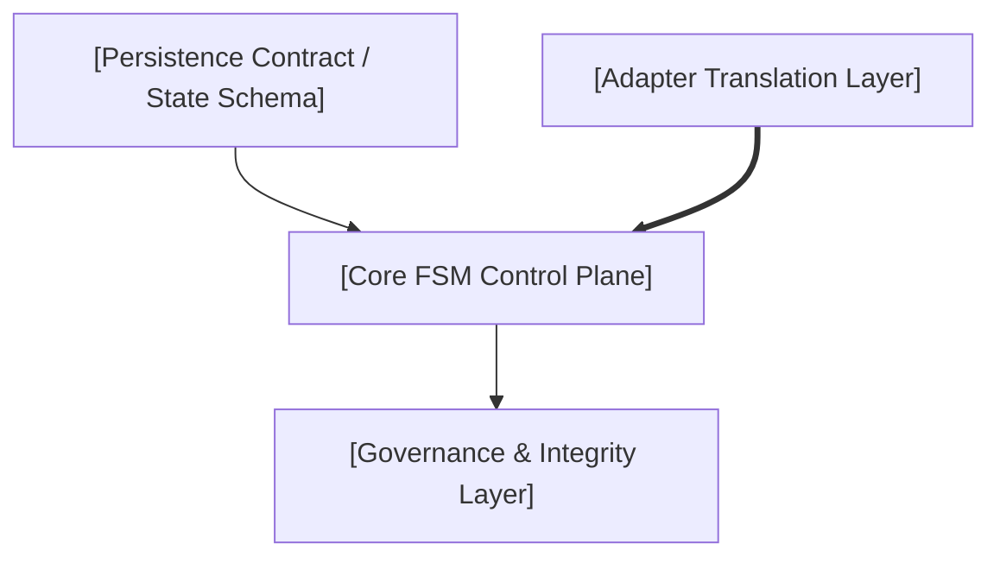

# Founding Architecture Document Template — URP v3.0
### Map-Reduce Synthesis from Research Pipeline to Repository Scaffolding

> **Usage:** This template is the blank structural schema used by **Session T2-16** to compile the definitive **Founding Architecture Document (FAD)** for the project upon completing Phase 0 research.
>
> **How to compile this document during T2-16:**
> 1. **Ingest Blueprints:** Read the Layer 2 Platform Blueprint (`T2-14`) and Core Engine Blueprint (`T2-15`).
> 2. **Ingest Decision Records:** Read all locked ADRs from `DECISIONS.md`.
> 3. **Populate Primitives & Diagram:** Insert the finalized control plane, persistence contract, and adapter architecture synthesized by the blueprints.
> 4. **Resolve Invariants:** Ensure zero contradictions between blueprints, state schemas, and governance rules.
> 5. **Traceability:** Complete the master traceability matrix connecting all architecture chapters to source research sessions (`T2-01` through `T2-15`).
> 6. **Gate Verification:** Execute and seal the Phase 0 Exit Gate checklist before committing to the repository root.

---

## Project: `[Project Name]`

```yaml
---
id: SYN-01
title: "[Project Name] — Founding Architecture Document"
synthesis_date: YYYY-MM-DD
status: draft                  # draft | sealed
research_sessions_ingested: N
decisions_locked: N
open_questions: N
schema_version: "3.0"
---
```

---

## 1. Executive Architecture Summary

`[Synthesize a 2–5 paragraph executive summary of the overall system architecture, core execution paradigm, key design decisions, and strategic positioning rationale, as finalized by T2-14 and T2-15.]`

---

## 2. Locked Decision Registry

`[Populate all locked architectural decisions from DECISIONS.md upon Phase 0 clearance.]`

| D-ID | Decision Title | Chosen Option | Door Type | Confidence | Evidence References |
|---|---|---|:---:|:---:|---|
| D-001 | `[Title]` | `[Chosen Option / Hypothesis]` | `[1-way/2-way]` | `[H/M/L]` | `[Sessions & Evidence Refs]` |
| D-002 | `[Title]` | `[Chosen Option / Hypothesis]` | `[1-way/2-way]` | `[H/M/L]` | `[Sessions & Evidence Refs]` |
| D-003 | `[Title]` | `[Chosen Option / Hypothesis]` | `[1-way/2-way]` | `[H/M/L]` | `[Sessions & Evidence Refs]` |
| D-NNN | `[Title]` | `[Chosen Option / Hypothesis]` | `[1-way/2-way]` | `[H/M/L]` | `[Sessions & Evidence Refs]` |

---

## 3. Architecture & Technology Primitives

### 3.1 Composed (Standards & Ecosystem Interfaces) — Wardley Utility/Product

`[Detail the external standards, file formats, and ecosystem conventions adopted by the system (e.g., JSON Schema specifications, Git repository ledger invariants, AGENTS.md / SKILL.md standards, MCP integration surfaces).]`

| Component / Interface | Chosen Standard / Baseline | Architectural Rationale | Decision Ref |
|---|---|---|---|
| `[State Wire Format]` | `[e.g., JSON Schema Draft 2020-12]` | `[Why chosen per research]` | D-NNN |
| `[Workspace Ledger]` | `[e.g., Git working tree / worktree isolation]` | `[Why chosen per research]` | D-NNN |
| `[Context Standard]` | `[e.g., AGENTS.md / SKILL.md]` | `[Why chosen per research]` | D-NNN |
| `[Tool Protocols]` | `[e.g., MCP / Native IDE Extension APIs]` | `[Why chosen per research]` | D-NNN |

### 3.2 Built (Core Engine & Custom Methodology) — Wardley Genesis/Custom

`[Detail the custom architecture, state machine control plane, execution engines, and governance rules designed specifically for this project.]`

| Subsystem | Description & Mechanism | Architectural Rationale | Decision Ref |
|---|---|---|---|
| `[Core FSM Engine]` | `[State topology, transition rules, role contracts]` | `[Why custom per T2-05/T2-15]` | D-001, D-002 |
| `[Execution Integrity]` | `[Grounding checks, scope diff verification, loop limits]` | `[Why custom per T2-13/T2-15]` | D-010 |
| `[Self-Governance]` | `[Self-modification safety guards, rollback logs, gates]` | `[Why custom per T2-07/T2-15]` | D-006 |
| `[Capability Calibration]` | `[Model qualification gate, canary probes, spot-checks]` | `[Why custom per T2-10/T2-15]` | D-004 |
| `[Adapter Portfolio]` | `[IDE/Agent translation wrappers, universal core]` | `[Why custom per T2-11/T2-14]` | D-005 |

---

## 4. System Architecture Diagram

`[Insert the finalized Mermaid diagram synthesized in T2-15/T2-16 representing the complete control plane, state transitions, governance guards, and integration boundaries.]`



---

## 5. Cross-Cutting Concerns

### 5.1 Autonomous Action Safety & Scope Enforcement
`[Synthesize the finalized Hard Scope Check, Grounded Verification, and Circuit Breaker specifications from T2-13 and T2-15.]`

### 5.2 Determinism, Crash Recovery & State Reconciliation
`[Synthesize the finalized State Reconciliation algorithm and state.json invariants from T2-04, T2-13, and T2-15.]`

### 5.3 Cognitive Load, Token Overhead & Progressive Disclosure
`[Synthesize the finalized specification modularization and progressive disclosure hierarchy from T2-08 and T2-14.]`

---

## 6. Risk Register & Reversal Triggers

| Identified Architectural Risk | Source Decision | Probability | Impact | Mitigation Strategy | Mandatory Re-evaluation Trigger |
|---|---|:---:|:---:|---|---|
| `[Risk Description]` | D-NNN | `[H/M/L]` | `[H/M/L]` | `[Mitigation Action]` | `[Measurable Trigger Condition]` |
| `[Risk Description]` | D-NNN | `[H/M/L]` | `[H/M/L]` | `[Mitigation Action]` | `[Measurable Trigger Condition]` |

---

## 7. Target Repository Scaffolding Specification

### 7.1 Directory Layout
```
[Insert finalized directory tree agreed upon in T2-14 and T2-15]
project-root/
├── spec/
├── templates/
├── adapters/
└── docs/
```

### 7.2 Core Manifest Specification
```json
{
  "name": "[project-name]",
  "version": "[target-version]",
  "description": "[target-description]"
}
```

---

## 8. Master Traceability Matrix

| FAD Chapter | Ingested Research Sessions | Architectural Decisions | Key Evidence References |
|---|---|---|---|
| 1. Executive Summary | `[T2-##, T2-##]` | `[D-NNN, ...]` | `[E-NNN / Primary literature]` |
| 2. Decision Registry | `[T2-##, T2-##]` | `[D-NNN, ...]` | `[E-NNN / Primary literature]` |
| 3. Architecture Primitives | `[T2-##, T2-##]` | `[D-NNN, ...]` | `[E-NNN / Primary literature]` |
| 4. Control Plane & FSM | `[T2-##, T2-##]` | `[D-NNN, ...]` | `[E-NNN / Primary literature]` |
| 5. Safety & Verification | `[T2-##, T2-##]` | `[D-NNN, ...]` | `[E-NNN / Primary literature]` |
| 6. Platform & Adapters | `[T2-##, T2-##]` | `[D-NNN, ...]` | `[E-NNN / Primary literature]` |

---

## 9. Phase 0 Gate Verification & Seal

- [ ] All One-Way Door ADRs locked with `status: accepted`
- [ ] All reversal triggers defined and measurable
- [ ] Gary Klein Premortem completed for all Type 1 decisions
- [ ] Human Architect sign-off recorded
- [ ] This document committed to repository root as `FOUNDING-ARCHITECTURE.md`

**Sealed By:** `[Principal Architect Name]`  
**Seal Date:** `[YYYY-MM-DD]`  
**Target Scaffolding Phase:** `[Phase 1 Scaffolding / v1.1.0 Implementation]`  

