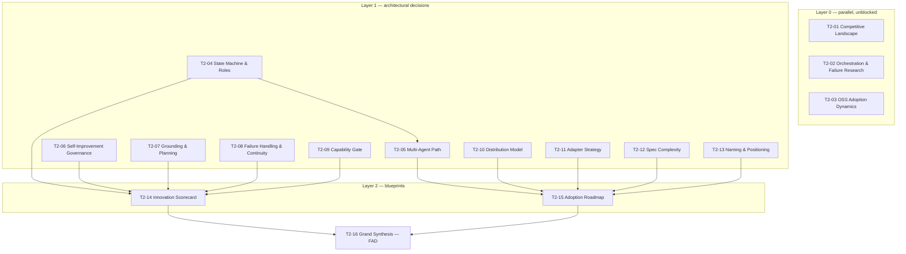

# Kramak — Pre-Development Research Pipeline

Kramak (क्रमक) is a file-based, model-agnostic, IDE-agnostic autonomous
development methodology already at v1.0.0 (Aug 2026, 48 files, 8 adapters,
12 claimed innovations, evolved through 24 iterations). This pipeline is
**not** pre-code product research in the usual sense — Kramak has no
database, no auth system, no hosting layer. Its "architecture" is the
methodology itself: a state machine, a set of enforcement mechanisms, a
distribution model, and a competitive position. The 16 sessions below are
scoped to pressure-test that architecture against evidence before it
hardens into a de-facto standard that others build on.

---

## How to Execute This Pipeline

1. **Save research outputs** to `sessions/T2-##-[slug].md`, one file per
   session, using the exact ID from the Session Matrix below (e.g.
   `sessions/T2-04-state-machine-role-separation.md`). Every prompt in
   `PROMPT-LIBRARY.md` specifies the YAML frontmatter and body structure
   the output file must follow — do not deviate from it, since later
   synthesis sessions (T2-14, T2-15, T2-16) parse these files directly.

2. **Record decisions** in `DECISIONS.md` (seeded in this pipeline with
   D-001 through D-011). After a session completes, open the matching
   D-NNN entry, move its `status` from `proposed` → `under-review` →
   `confirmed`, and update the "leading hypothesis" field based on that
   session's **Recommendation** section. Use
   `templates/DECISIONS.template.md` as the canonical entry shape if you
   are adding a decision not already seeded here (minimum fields: status,
   door type, competing hypotheses, informing sessions, review trigger).

3. **Resolve conflicts** with `templates/CONFLICT-RESOLUTION.template.md`
   whenever two sessions — or a Layer-1 session and a Layer-2 synthesis —
   reach contradicting recommendations. Log both positions side by side
   with their evidence grades and force an explicit tie-break rationale.
   Do not average the two positions or quietly pick one; an unresolved
   conflict that reaches T2-16 should be flagged there, not hidden.

4. **Compile the FAD** (Founding Architecture Document) in T2-16, using
   `templates/FOUNDING-ARCHITECTURE.template.md` as the base structure.
   T2-16 pulls the confirmed verdict for every D-NNN decision plus both
   Layer-2 blueprints (T2-14, T2-15) into one authoritative document.

5. **Run the gate** with `templates/PHASE-0-GATE.template.md` once the FAD
   draft exists. Apply the two-track criteria in §5 below — Track A for
   two-way doors, Track B for one-way doors — before treating any
   architectural decision as locked. A decision that fails its gate stays
   `under-review`, not `confirmed`, and blocks nothing else in the
   pipeline (see §4 default-unblocked rule) but should block a public
   claim of that feature being "evidence-backed."

If any of the four template files don't exist yet in your working repo,
create them with at least the fields referenced above — the structure
matters more than the exact filename.

---

## 1. Extracted Project Parameters

**Domain archetype:** Primary = **DevTools** (developer process /
methodology tooling). Secondary = **AI/ML-adjacent infrastructure** — the
entire product exists to standardize how AI coding agents operate, even
though Kramak itself contains no model code. This is a hybrid closer to
"open-source standard" (AGENTS.md, MCP) than to a conventional SaaS or
platform product.

**Stated constraints (fixed, not researched):**
- Zero *mandatory* runtime dependencies — pure markdown, JSON Schema, templates
- Model-agnostic by design: capability self-assessment, never model-name checks
- IDE-agnostic core with a translating adapter layer
- MIT license
- Sanskrit-rooted naming as an author-level convention across projects
- Work Item (WI) as the atomic unit of execution
- v1.0.0 already shipped with all 12 claimed innovations implemented

**Decided vs. open — what this pipeline actually investigates:** the
items above are treated as fixed inputs. Everything the user flagged as
"uncertain" (10 items in the brief) is treated as an open architectural
question and converted into a D-NNN decision in `DECISIONS.md`. Notably,
several "decided" items above have an open sub-question nested inside
them — e.g., the *existence* of the FSA is fixed, but its *optimality*
(D-001) is not; "model-agnostic via capability self-assessment" is a fixed
principle, but whether *self-assessment specifically* is a reliable
mechanism for it (D-004) is not.

**Independent regulatory assessment:** the vision contains no mention of
payments, health data, minors, financial transactions, or PII, and
independent review found none implicitly either — Kramak is a local,
file-based methodology with no telemetry, no hosted service, and no data
collection surface. This assessment applies to **Kramak itself only**;
any regulatory posture of a downstream project that *adopts* Kramak is
out of scope for this pipeline. Regulatory Exposure is scored 0 below and
the hard override does not trigger.

**Build-vs-buy default applied throughout:** wherever a session's
recommendation touches commodity infrastructure (schema validation,
CLI scaffolding, packaging), the default is to compose from established,
widely-adopted open-source tooling rather than building custom — reserve
custom engineering effort for Kramak's actual proprietary logic: the FSA
semantics, the grounding/scope-enforcement rules, and the spec templates
themselves. This is called out explicitly in T2-10 (distribution model).

---

## 2. Complexity Score

| Dimension | Score | Rationale |
|---|:-:|---|
| Domain Novelty | **3** | Positions itself as defining a wholly new "Process" layer for AI-driven SDLC — a category with no dominant standard and several competing nascent frameworks (RIPER-5, Spec Kit). |
| Technical Novelty | **2** | Every underlying technology is mundane (markdown, JSON Schema, git hooks) but the *pattern* — deterministic file-based scaffolding constraining non-deterministic LLM agents across sessions — is a genuinely novel combination. |
| Regulatory Exposure | **0** | No PII, payments, health, or children's data; no telemetry or hosted component in Kramak itself. |
| Reversibility | **2** | `state.json` + the FSA are the interoperability contract that 8 adapters and any external adopter depend on — a core-schema-level one-way door, not deep infrastructure lock-in. |
| Investment Horizon | **2** | 24 iterations and a v1.0.0 release with ecosystem-scale ambition (adapters, comparison docs) reflect sustained, serious investment well beyond a lean MVP, even though solo-authored and unfunded. |
| Coordination Complexity | **1** | Currently a single decision-maker, but a genuinely external-facing standard requires soft alignment with the conventions of 8 independently-evolving AI tool ecosystems. |
| Expected Longevity | **2** | Explicit ambition to become a durable "Scrum/Kanban for AI dev" standard, tempered by unproven adoption at v1.0 — a realistic 1–3 year horizon pending validation, not yet a proven 5+ year standard. |
| Integration Complexity | **2** | 8 IDE/agent adapters, each tracking a fast-moving, independently-evolving external surface — multiple complex, uncoordinated APIs. |

**Total: 14/24 → Tier 2 (9–16 sessions).** No hard override (Regulatory
Exposure ≠ 3). Session count below is deliberately built to the top of
the Tier 2 band given the number of genuinely distinct open questions
(10) the user raised.

---

## 3. Session Matrix (DAG)

**Layer 0 — Landscape & Discovery** (fully parallel, no dependencies)

| ID | Title | Purpose |
|---|---|---|
| T2-01 | Competitive & Category Landscape | Is the "Process layer" gap real? |
| T2-02 | Agent Orchestration & Failure Mode Research | Academic/applied grounding for role-split agents and documented failure modes |
| T2-03 | OSS Standard Adoption Dynamics | What actually drives adoption of dev methodologies/standards? |

**Layer 1 — Architectural Decisions**

| ID | Title | Door | Pattern | Depends on | Informs |
|---|---|---|---|---|---|
| T2-04 | State Machine & Role Separation Deep Dive | one-way | unknown/novel — DEEP | *(unblocked)* | D-001 |
| T2-05 | Multi-Agent Orchestration Evolution Path | two-way | unknown/novel — SPIKE | **T2-04** | D-009 |
| T2-06 | Self-Improvement Governance & Anti-Bias Guard | one-way | unknown/novel — DEEP | *(unblocked)* | D-006 |
| T2-07 | Grounding & Planning Mechanisms Validation | one-way | unknown/novel — DEEP | *(unblocked)* | D-010 |
| T2-08 | Failure Handling & Continuity Validation | one-way | unknown/novel — DEEP | *(unblocked)* | D-011 |
| T2-09 | Capability Gate & Self-Assessment Reliability | one-way | unknown/novel — DEEP | *(unblocked)* | D-004 |
| T2-10 | Distribution Model: Files vs. Optional CLI | one-way | unknown/novel — DEEP | *(unblocked)* | D-003 |
| T2-11 | Adapter Strategy & Auto-Bootstrap | two-way | unknown/novel — SPIKE | *(unblocked)* | D-005 |
| T2-12 | Spec Complexity & Adoption Psychology | two-way | unknown/novel — SPIKE | *(unblocked)* | D-007 |
| T2-13 | Naming, Positioning & Competitive Framing | one-way | unknown/novel — DEEP | *(unblocked)* | D-008 |

**Layer 2 — Blueprints & Specifications** (synthesis, not new primary research)

| ID | Title | Depends on |
|---|---|---|
| T2-14 | Evidence-Grounded Innovation Scorecard | T2-04, T2-06, T2-07, T2-08, T2-09 |
| T2-15 | Adoption & Positioning Roadmap | T2-05, T2-10, T2-11, T2-12, T2-13 |

**Sink**

| ID | Title | Depends on |
|---|---|---|
| T2-16 | Grand Synthesis — Founding Architecture Document | T2-14, T2-15 |

Every Layer-1 session is written as a fully self-contained, front-loaded
brief (per the default-unblocked rule — see §4) and does **not** literally
require a Layer-0 artifact to produce valid output. The one genuine
Layer-1 dependency is T2-05 on T2-04: you cannot sensibly evaluate whether
to extend the planner/executor split into multi-agent orchestration before
that split itself has a verdict.

---

## 4. Execution Plan

**Default-unblocked rule:** a session only gates on another session if it
*literally* cannot produce valid output without that session's artifact.
That's true for exactly three edges in this pipeline (T2-04→T2-05, the
five edges into T2-14, and the five edges into T2-15, plus T2-14/T2-15
into T2-16) — everything else is parallel by default, even across layers.

| Wave | Sessions | Notes |
|---|---|---|
| **Wave 1** | T2-01, T2-02, T2-03, T2-04, T2-06, T2-07, T2-08, T2-09, T2-10, T2-11, T2-12, T2-13 | 12 sessions, fully parallel. If running solo/serially rather than with parallel agent sessions, skim T2-01–T2-03 first anyway — it's not required, but it reduces redundant landscape-scanning inside the Layer-1 prompts. |
| **Wave 2** | T2-05 | Gated on T2-04's Recommendation. |
| **Wave 3** | T2-14, T2-15 | Gated on their respective five Layer-1 sessions each. Pure synthesis — no new primary research. |
| **Wave 4** | T2-16 | Gated on T2-14 + T2-15. Terminal sink; produces the FAD. |

---

## 5. Phase 0 Exit Gate

Two tracks, applied per D-NNN decision in `DECISIONS.md`, executed via
`templates/PHASE-0-GATE.template.md`.

### Track A — Two-way doors (D-005, D-007, D-009, D-011)
Lightweight bar. A decision passes Track A once:
- A convention is chosen and written down with a one-paragraph rationale
- The choice is recorded in `DECISIONS.md` with status `confirmed`
- No deep evidentiary bar is required — proceed to implementation, revisit
  opportunistically when the review trigger fires

### Track B — One-way doors (D-001, D-002, D-003, D-004, D-006, D-008, D-010)
Strict bar. A decision passes Track B only when **all** of the following hold:
- The recommendation is supported by at least Grade B evidence, *or* the
  absence of stronger evidence is explicitly documented as an accepted risk
- Disconfirming evidence was actively sought and is addressed in the
  session's Open Questions & Risks section, not omitted
- The decision is recorded in `DECISIONS.md` with status moved to
  `confirmed` and an explicit review trigger defined
- No unresolved Sev-1 / contested finding blocks the FAD
- T2-16 (the FAD) explicitly cites the confirmed verdict

A decision that fails Track B stays `under-review` — this blocks a public
claim that the feature is "evidence-backed," but per §4 it does not block
any other session in the pipeline from proceeding.
