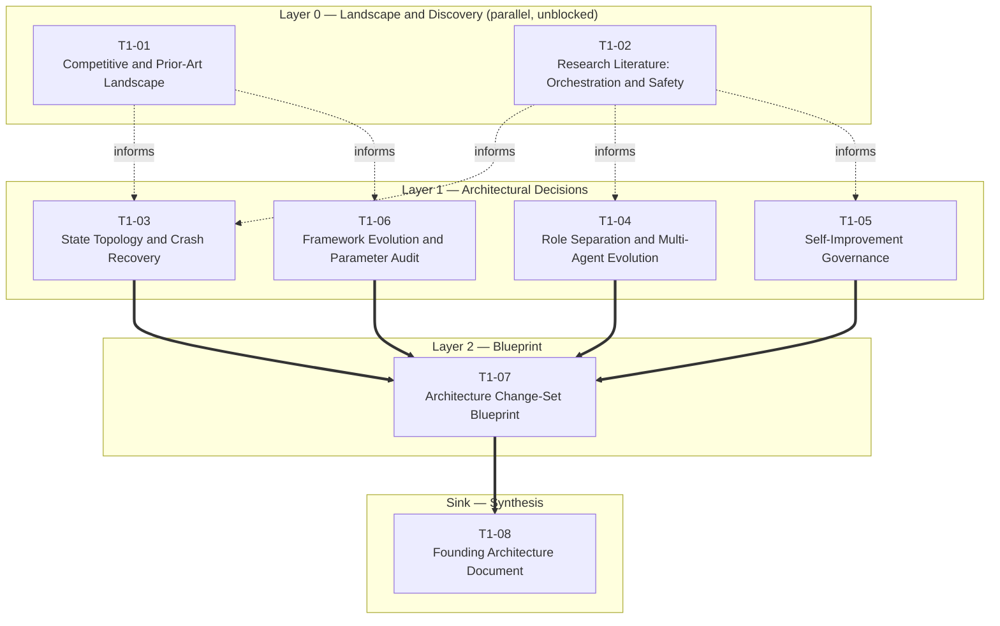

# Kramak — Pre-Development Research Pipeline

This pipeline exists to pressure-test Kramak's architecture *before* a v1.1
implementation pass locks in decisions that are currently running on 24
iterations of solo intuition rather than external evidence. It does not
ask "is Kramak good" — it asks, decision by decision, "does this specific
choice survive contact with what's actually known," and routes each one to
the amount of research its reversibility and novelty actually warrant.

---

## How to Execute This Pipeline

1. **Save research outputs** to `sessions/T#-##-[slug].md` — one file per
   session below, e.g. `sessions/T1-01-competitive-landscape.md`. Filenames
   for all eight sessions are listed in the Session Matrix.
2. **Record decisions** in `DECISIONS.md` using the structure defined in
   `templates/DECISIONS.template.md`. When a session concludes, open the
   corresponding D-NNN entry, move `Status` from `proposed` to `resolved`
   (or `deferred`, for watch-item decisions like D-010), fill in the
   recommendation, and link the session file(s) that informed it. Do not
   delete rejected hypotheses — move them to an "Alternatives Considered"
   note so the reasoning survives.
3. **Resolve conflicts** using `templates/CONFLICT-RESOLUTION.template.md`
   whenever two sessions — or a session and the founder's prior intuition —
   produce contradictory recommendations for the same decision (this is
   most likely between T1-03/T1-04's findings and the existing v1.0.0
   implementation, or between T1-01's competitive read and the project's
   self-assessment). Document both positions and their evidence grades
   explicitly rather than silently picking one.
4. **Compile the FAD** with `templates/FOUNDING-ARCHITECTURE.template.md`
   once T1-07 (the Layer 2 blueprint) is done and every decision in the
   registry is in a terminal state. T1-08 below is that compilation step.
5. **Run the gate** with `templates/PHASE-0-GATE.template.md`, applying the
   Track A / Track B criteria in this document's Phase 0 Exit Gate section.
   Phase 0 is not "done" because sessions were run — it's done when every
   decision clears its track's bar.

**Suggested tooling:** every session below is written for a frontier model
with deep-research/web-search capability (Claude, Gemini, or ChatGPT
research modes) run as a single-turn, front-loaded brief. `PROMPT-LIBRARY.md`
— the file containing the actual copy-paste-ready prompt for each session —
is intentionally **not** part of this deliverable; generate it in a
follow-up pass using the session matrix below as the spec.

### Cross-Cutting Principles for Every Session

- **Temporal anchor:** today is 2026-08-18. Sessions should treat this as
  "now," not rely on training recall for anything that could have moved
  since — model releases, IDE features, and competitor products in this
  space have historically moved on a matter of months, not years.
- **Commodity-first bias:** where a session evaluates whether to build
  something (a validator, a versioning scheme, a naming methodology),
  default to recommending established, off-the-shelf patterns or tools
  over bespoke ones. Reserve "build custom" for Kramak's actual proprietary
  logic — the methodology itself — not its supporting infrastructure.
- **Evidence grading is mandatory**, not optional polish: every factual
  claim in every session output needs a base grade (A/B/C/D/E),
  corroboration/recency/directness modifiers, and a verification tag,
  exactly as specified in the (forthcoming) prompt library. A recalled
  claim is capped at Grade D regardless of how confident it sounds.

---

## 1. Project Extraction & Classification

### 1.1 Domain Archetype

**Primary: DevTools.** Kramak is a process artifact consumed by developers
and their AI agents, not an end-user product — the closest fit among the
given archetypes even though "open-source standard/specification" would be
the more precise label if it existed on the list (see Appendix A).

**Secondary: AI/ML-adjacent.** Kramak has no runtime ML component of its
own, but its entire value proposition — grounded verification, capability
gating, spec detail scaling — is about shaping *LLM* behavior. Its research
needs pull as much from agentic-AI and ML-safety literature as from
conventional developer-tooling research, which is why Layer 0 includes a
dedicated academic-literature session (T1-02) alongside the competitive one.

B2B SaaS, FinTech, Consumer Mobile, and Real-Time/IoT were all considered
and rejected — none apply.

### 1.2 Stated Constraints

| Constraint | Type | Status |
|---|---|---|
| Zero mandatory runtime dependencies | Infrastructure | Fixed — not open for research, though its *implications* are (D-006) |
| Model-agnostic (capability-based, no model-name-checking) | Technical | Fixed — implementation quality is open (D-002, D-009) |
| IDE-agnostic core spec | Technical | Fixed — adapter *portfolio* strategy is open (D-007) |
| MIT license | Legal | Fixed — not revisited by this pipeline |
| Sanskrit-rooted naming (personal convention) | Branding | Fixed as a *practice*; whether "Kramak" specifically and its tagline work is open (D-008) |

No regulatory, geographic, or data-residency constraints were stated — this
absence is itself checked independently below rather than taken at face value.

### 1.3 Decided vs. Open — Traceability to the Research Pipeline

Everything under "Current State" in the project vision is *implemented*,
not *validated* — that gap is the entire reason this pipeline exists. The
table below maps each of the founder's ten stated uncertainties to the
decision(s) and session(s) that will address it, so nothing on that list
gets silently dropped:

| # | Founder's Question (paraphrased) | Decision(s) | Session(s) |
|---|---|---|---|
| 1 | Are the 12 innovations empirically novel/valid? | D-001, D-002, D-003, D-009 | T1-02 (background), T1-03, T1-04, T1-05, T1-06 |
| 2 | Spec complexity vs. adoption | D-005 | T1-06 |
| 3 | Pure methodology vs. optional CLI/runtime | D-006 | T1-06 |
| 4 | Is the "Layer 3" gap real? | D-007, D-008 (background for all) | T1-01 |
| 5 | Is the state-machine design right? | D-001, D-002 | T1-03, T1-04 |
| 6 | Is the 8-adapter strategy right? | D-007 | T1-01 |
| 7 | Is the naming/positioning right? | D-008 | T1-01 |
| 8 | Should Kramak evolve toward multi-agent orchestration? | D-010 | T1-04 |
| 9 | Is self-improvement governance robust enough? | D-003 | T1-05 |
| 10 | Do specific design parameters hold up? | D-009 | T1-05, T1-06 |

### 1.4 Regulatory Exposure — Independent Assessment

Checked against the trigger list (payments, health data, children,
financial transactions, PII) rather than trusting the vision's silence on
the topic: **none apply.** Kramak makes no network calls, collects no
telemetry, and persists no data beyond markdown/JSON files that already
live in the adopter's own git repository. It has no user accounts, no
backend, and no data flow that leaves the adopter's machine.

One adjacent-but-distinct issue was considered and deliberately *not*
scored here: `init.sh` / `init.ps1` and the pre-commit hook execute code on
the adopter's machine, which is a supply-chain-trust question, not a
regulatory one. It's routed to the SKIP list in Section 3.6 rather than
inflating this score, since standard OSS script-distribution hygiene
(checksums, no curl-pipe-bash, pinned releases) is a well-known pattern,
not an open research question.

**Hard override check:** Regulatory Exposure = 0, not 3. The override
clause ("all intersecting decisions automatically receive deep research")
is **not triggered**.

---

## 2. Complexity Score

| Dimension | Score | Rationale |
|---|:---:|---|
| **Domain Novelty** | 2 — Unconventional workflow | No single direct precedent for Kramak's exact combination, but it assembles known moves. RIPER-5 (2025, community-grade, Cursor-only, ungoverned) already popularized phase-based AI prompting. GitHub's Spec Kit — backed by GitHub/Microsoft, shipping a CLI, supporting 30+ agent integrations with 138 community extensions from 70+ authors — already occupies "spec-driven, phase-based process" territory at a scale the comparison docs understate. Devin's own architecture is already described as a high-reasoning "Planner" model directing an execution swarm; OpenHands already orchestrates multiple agents in parallel. This is real but *unconventional*, not *unprecedented* — which is precisely what T1-01 needs to stress-test. |
| **Technical Novelty** | 0 — Known stack | Markdown specs, JSON Schema validation, POSIX/PowerShell bootstrap scripts, git hooks, a Node.js validator. Mature, boring, fully documented technology — no new libraries, no unproven infrastructure. Whatever novelty exists lives in the process design (Domain Novelty), not the tech stack. |
| **Regulatory Exposure** | 0 — No sensitive data | See §1.4. Independently checked, not self-reported. |
| **Reversibility** | 2 — Schema-equivalent | No literal database or multi-tenancy, but `state.json`'s JSON Schema and the FSA topology function as Kramak's data-model equivalent — every adapter, `validate.js`, every hook, and any future third-party tooling assumes their current shape. Changing that shape post-adoption is a breaking change for every adopter's in-flight project: the *cost profile* of "core schema" reversibility, even though the underlying mechanism is a version-bumped file rather than a live database migration. |
| **Investment Horizon** | 1 — Lean MVP | Solo, unfunded, bootstrapped — but past pure-spike energy (v1.0.0 shipped, 24 iterations, comparison docs already written). No external capital or team changes the resourcing calculus, which is what this dimension is really tracking; "Lean MVP" is the closer fit than "Funded venture." |
| **Coordination Complexity** | 0 — Single decision-maker | The entire vision is written in first person with no collaborators, company, or funders mentioned. |
| **Expected Longevity** | 2 — 1–3 years | The ambition (an adopted standard, à la Scrum) implies 5+ years, but v1.0.0 has zero adoption track record in a space moving fast enough that a Linux-Foundation-backed standards body (AAIF) formed for the adjacent Context/Protocol layers within roughly the past year. A realistic, evidence-based horizon today is 1–3 years pending adoption proof, not the full aspiration. |
| **Integration Complexity** | 2 — Multiple complex APIs (by analogy) | Kramak makes no runtime API calls itself, but its 8 IDE/agent adapters (Antigravity, Cursor, Claude Code, Windsurf, Cline, Copilot, Aider, Generic) are the functional equivalent: each has its own conventions, config formats, and release cadence that Kramak doesn't control and must track. |
| **Total** | **9 / 24** | **→ Tier 1 (4–8 sessions)** |

This pipeline uses **8 sessions** — the top of the Tier 1 range. That's a
deliberate choice, not scope creep: Kramak's low regulatory/technical/
coordination complexity keeps the *tier* low, but the sheer number of
genuinely distinct strategic threads (architecture, governance, adoption,
positioning) means the budget is used in full rather than trimmed further.
See Appendix A for how that budget was protected from ballooning.

---

## 3. Session Matrix (DAG)

### 3.1 Routing Recap

Every decision below was classified as one-way (irreversible) or two-way
(reversible), then routed:

| | Known Pattern | Unknown / Novel |
|---|---|---|
| **Reversible (two-way)** | SKIP — decide by convention | FAST SPIKE — 1 session |
| **Irreversible (one-way)** | CONFIRM — 1 session + decision record | DEEP RESEARCH — 2–5 sessions + decision record |

**One deliberate deviation from a strict 1-decision-per-route reading:**
D-001 and D-002 are two faces of a single architectural bet (how Kramak
divides cognitive labor across states *and* roles) — a topology verdict is
incomplete without a role-separation verdict and vice versa. They're
researched jointly as **one deep-research investment of 2 sessions**
(T1-03 + T1-04) rather than two independent 2–5 session tracks, which
would have consumed the entire Tier 1 budget on a single decision cluster.
This is the largest single investment in the pipeline, consistent with it
being the most consequential and most novel one-way decision Kramak has to
make. Appendix A explains the other consolidations.

### 3.2 Dependency Graph

Dotted arrows are **soft/advisory** dependencies — richer with the prior
session's output in hand, but not blocking (per the default-unblocked
rule, each Layer 0/1 session can produce valid output on its own). Solid
arrows are **hard/gating** dependencies — the downstream session literally
cannot produce valid output without the upstream one.

### 3.3 Full Matrix

| ID | Title | Layer | Door Type | Route | Decisions Informed | Dependencies |
|---|---|---|---|---|---|---|
| T1-01 | Competitive & Prior-Art Landscape | 0 | — (discovery) | Discovery; doubles as CONFIRM for D-007, D-008 | D-007, D-008 (+ background: D-001, D-002, D-005, D-006) | none |
| T1-02 | Research Literature: Orchestration & Safety | 0 | — (discovery) | Discovery | background: D-001–D-004, D-009 | none |
| T1-03 | State Topology & Crash Recovery | 1 | One-way | Deep Research (1 of 2, joint with T1-04) | D-001 | soft: T1-01, T1-02 |
| T1-04 | Role Separation, Capability Gating & Multi-Agent Evolution | 1 | One-way | Deep Research (2 of 2, joint with T1-03) | D-002, D-010 | soft: T1-02 |
| T1-05 | Self-Improvement Governance | 1 | Two-way | Fast Spike | D-003, D-009 (Capability Gate part) | soft: T1-02 |
| T1-06 | Framework Evolution & Parameter Audit | 1 | Mixed (D-004 one-way; D-005/006/009 two-way) | Confirm + Fast Spike (bundled, 4 parts) | D-004, D-005, D-006, D-009 (remainder) | soft: T1-01 |
| T1-07 | Architecture Change-Set Blueprint | 2 | — (synthesis) | Gated synthesis | consolidates T1-03–T1-06 | **hard:** T1-03, T1-04, T1-05, T1-06 |
| T1-08 | Founding Architecture Document | Sink | — (synthesis) | Gated synthesis | compiles everything | **hard:** T1-07 |

### 3.4 Session Briefs

**T1-01 — Competitive & Prior-Art Landscape**
`sessions/T1-01-competitive-landscape.md`
Establish the *actual* 2026 landscape for AI-assisted-development process
frameworks, not the self-reported one. Must rigorously profile GitHub Spec
Kit (institutional backing, CLI, 30+ integrations, extension ecosystem),
RIPER-5 and its forks (community-grade, ungoverned), Aider's built-in
conventions, and how OpenHands and Devin handle orchestration internally
(including Devin's Planner/execution-swarm split and OpenHands' parallel
multi-agent orchestration) — plus anything newer that has emerged since.
Also scoped to gather: ecosystem-stability signals across Kramak's 8
target integrations (informs D-007), and naming/positioning precedent for
developer tools with non-English linguistic roots, checked against the
*actual* competitors this session uncovers rather than the ones named in
Kramak's existing comparison docs (informs D-008). Audience: a Principal
Architect deciding whether to continue, reposition, or fold Kramak's
differentiation claims.

**T1-02 — Research Literature: Orchestration & Safety**
`sessions/T1-02-orchestration-research-literature.md`
Survey the *academic/research* literature, not products: (a) plan-execute-
reflect loop architectures in single- and multi-agent LLM systems and their
documented failure modes; (b) grounding/anti-hallucination techniques for
AI-generated specifications; (c) safety research on self-modifying and
self-improving AI systems, including circuit-breaker and recursive-
self-improvement governance patterns; (d) empirical software-engineering
research on AI agent task-sizing and context limits, including a check of
the METR task-horizon research the founder already cites for the 2-hour
Work Item cap. Audience: a Principal Architect who wants the 12 claimed
innovations graded against literature, not against 24 iterations of
personal intuition.

**T1-03 — State Topology & Crash Recovery**
`sessions/T1-03-state-topology.md`
Deep research (paired with T1-04) on whether the 5-state FSA
(BOOTSTRAP → PLANNING → EXECUTING → AUDITING, with WAITING as a side-state)
is the right abstraction: too many states, too few, or wrong shape — is
WAITING correctly a peer state, or should it be a sub-state/flag? Is the
State Reconciliation crash-recovery model robust against the failure modes
documented in agentic-loop literature and against how competitors persist
and recover state (Spec Kit's phase artifacts, Devin's "Wiki," OpenHands'
session model)? Audience: a Principal Architect deciding whether to revise
the FSA before wider adoption makes it a de facto contract.

**T1-04 — Role Separation, Capability Gating & Multi-Agent Evolution**
`sessions/T1-04-role-separation-multiagent.md`
Deep research (paired with T1-03) on whether splitting "architect"
(high-reasoning) and "executor" (fast/precise) roles across model tiers is
empirically justified versus a single-agent-does-everything loop, and how
capability-based self-assessment (as opposed to model-name-checking)
should actually work. Explicitly extends to the multi-agent question:
should the single-planner/single-executor model evolve toward parallel
orchestration given 2026 tooling (subagent support in Antigravity, Claude
Code parallelism, OpenHands' parallel multi-agent orchestration, Devin's
internal compound-model architecture)? Audience: a Principal Architect
setting the core role model for v1.x and beyond.

**T1-05 — Self-Improvement Governance**
`sessions/T1-05-self-improvement-governance.md`
Fast spike on whether the Anti-Bias Guard (5-point checklist), the Circuit
Breaker (audit-fix-audit loop limiter), and the Capability Gate Check are
adequate against what safety research says about recursive self-
modification and self-critique loop failure modes. Should surface concrete
gaps or stronger alternative mechanisms, not just validate what already
exists. Audience: a Principal Architect assessing whether a foundational
trust/safety claim is actually defensible.

**T1-06 — Framework Evolution & Parameter Audit**
`sessions/T1-06-framework-evolution-parameter-audit.md`
A four-part bundled fast-spike/confirm session: **(1)** spec complexity vs.
adoption — precedent for how documentation size affects developer-tool
uptake, and whether PLANNER.md (41.5 KB) / EXECUTOR.md (17.7 KB) should be
restructured toward progressive disclosure; **(2)** `state.json` schema
versioning — precedent from config/schema-versioning practice (semver,
deprecation windows, migration scripts — Kubernetes CRDs, Terraform state,
JSON:API) for versioning without breaking in-flight adopter projects;
**(3)** pure-methodology positioning vs. an *optional* (never mandatory)
CLI/validator layer, benchmarked directly against Spec Kit's choice to
ship one; **(4)** evidence basis for the Failure Taxonomy's 6 categories,
the Polish Ceiling Rule, and a light re-verification of the METR-derived
2-hour Work Item cap. Audience: a Principal Architect scoping what changes
before or alongside a v1.1 release.

**T1-07 — Architecture Change-Set Blueprint**
`sessions/T1-07-architecture-blueprint.md`
Synthesis, not fresh research: consolidate T1-03 through T1-06's verdicts
into one concrete change-set — which of the 12 claimed innovations are
supported and ship as-is, which need revision (and what revision,
specifically), which should be deprecated, and what changes (if anything)
in `state.json`'s schema, the FSA topology, the role model, or the
adapter/tooling boundary. This does **not** rewrite PLANNER.md/EXECUTOR.md
prose — it produces the decision-grade blueprint a later implementation
pass acts on.

**T1-08 — Founding Architecture Document**
`sessions/T1-08-founding-architecture-document.md`
Compile the full research trail (T1-01–T1-07) plus the finalized Decision
Registry into the FAD via `templates/FOUNDING-ARCHITECTURE.template.md` —
the Phase 0 capstone: the durable record of what Kramak's architecture is
and why, for future contributors and future self-improvement cycles to
read before proposing changes.

### 3.5 Decisions Resolved Without a Dedicated Session

**D-007** (adapter portfolio strategy) and **D-008** (naming/positioning)
are both two-way-or-known-pattern decisions that would technically route
to their own 1-session treatment — but T1-01's landscape scan is explicitly
scoped to gather exactly what each needs (ecosystem-stability signals;
naming precedent against real competitors). Resolving them from T1-01's
output, rather than spinning up two more sessions, is disclosed here
rather than silently done, and both still get full D-NNN decision records.

### 3.6 Decided by Convention (SKIP)

Two-way, known-pattern choices this pipeline deliberately does **not**
spend a session on — representative, not exhaustive:

- **JSON Schema draft version for `state.json`** — use the current stable
  draft (2020-12); no research question here.
- **Markdown lint/formatting convention for spec files** — adopt standard
  `markdownlint` defaults or equivalent; reversible via config change.
- **Bootstrap-script distribution hygiene** (`init.sh` / `init.ps1`) —
  follow standard OSS practice (published checksums/signed releases, avoid
  encouraging curl-pipe-bash); this is where the supply-chain-trust note
  from §1.4 is actually resolved, by convention rather than research.
- **Shell-scripting portability approach** (POSIX `sh` vs. bash-specific
  features) — decide by the standard "target POSIX unless a feature
  requires bash" convention.

---

## 4. Execution Plan

| Wave | Sessions | Gating |
|---|---|---|
| **1** | T1-01, T1-02 | None — start immediately, fully parallel |
| **2** | T1-03, T1-04, T1-05, T1-06 | Soft-dependent on Wave 1; technically unblocked and can run in parallel with Wave 1 if speed matters more than depth, but richer if Wave 1 output exists first |
| **3** | T1-07 | **Hard-gated** — requires T1-03, T1-04, T1-05, and T1-06 all complete |
| **4** | T1-08 | **Hard-gated** — requires T1-07 complete |

If sessions are run serially by a single operator rather than in parallel,
a sensible order is: **T1-02 → T1-01 → T1-03 → T1-04 → T1-05 → T1-06 →
T1-07 → T1-08.** T1-02 leads because it's the broadest, slowest-to-digest
input; T1-01 second because several Layer 1 sessions lean on it more
directly than on T1-02.

---

## 5. Phase 0 Exit Gate

Phase 0 is complete only when **every** D-NNN in `DECISIONS.md` is in a
terminal state (`resolved`, `accepted`, or explicitly `deferred` with a
review trigger) — not merely when all eight sessions have been run.

### Track A — Two-Way Doors
*(D-003, D-005, D-006, D-007, D-009, D-010)*

- [ ] Decision record status moved from `proposed` to a terminal state.
- [ ] Recommendation cites at least one Grade A/B source, **or** explicitly
      states reliance on Grade C/D evidence and why that's acceptable for
      a reversible decision.
- [ ] Review trigger (already seeded in `DECISIONS.md`) is still accurate
      after the session, or has been updated.
- [ ] No multi-source corroboration requirement — a single well-sourced
      rationale is sufficient given the door is two-way.

### Track B — One-Way Doors
*(D-001, D-002, D-004, D-008)*

- [ ] Decision record includes a recommendation **and** at least two
      alternatives explicitly considered and rejected, with rationale.
- [ ] The core recommendation is corroborated by **2+ independent
      sources** — not the same source cited twice.
- [ ] No unresolved Grade E (unverifiable) claim underpins the final
      recommendation.
- [ ] Open Risks section is non-empty, with a reversal trigger for each.
- [ ] Explicit compatibility check against the fixed constraints in §1.2
      (model-agnostic, IDE-agnostic, zero mandatory runtime deps, MIT) —
      confirm the recommendation doesn't silently violate one.
- [ ] Founder sign-off recorded on the decision record before it's
      considered closed.

**Both tracks:** T1-08 (the FAD) cannot be run while any decision is still
`proposed`. If a decision genuinely can't reach a terminal state (e.g.
evidence is contested and inconclusive), it must be explicitly marked
`deferred` with a documented reason and review trigger — "proposed" is not
a valid end state for Phase 0.

---

## Appendix A — Methodology Adaptation Notes

The complexity rubric and one-way/two-way examples in the source
methodology (database, data model, auth, public APIs) are calibrated for a
typical software product with a runtime and a data layer. Kramak has
neither. Rather than forcing a mismatch or skipping the rubric, this
pipeline maps Kramak's actual artifacts onto the rubric's *intent*:

- `state.json`'s JSON Schema ≈ data model
- The FSA topology + role contract ≈ public API (it's what adapters and
  future tooling code against)
- The project name and tagline ≈ a market-facing commitment that's costly,
  not impossible, to reverse post-launch

Three judgment calls are flagged explicitly so they can be challenged
before execution rather than discovered after:

1. **Reversibility scored 2, not 1.** A case exists for "Modular" (1) —
   Kramak is literally 48 independent files, and no real multi-tenant data
   is at stake. The 2 reflects the *ecosystem* cost of breaking the schema
   post-adoption, not a literal migration cost. If you believe current
   adoption is low enough that this cost is closer to "Modular," the total
   drops to 8, which is still Tier 1 — this judgment call doesn't change
   the tier, only the framing.
2. **D-001 and D-002 share one deep-research budget (2 sessions)** rather
   than each independently claiming 2–5. See §3.1 for the reasoning; the
   alternative (treating them fully independently) would have consumed
   4–10 sessions on one decision cluster alone, which the Tier 1 budget
   doesn't support.
3. **T1-01 and T1-06 each bundle multiple decisions into one session**
   (T1-01 → D-007 + D-008; T1-06 → D-004 + D-005 + D-006 + part of D-009).
   Each bundled sub-question still gets its own decision record with full
   hypotheses and a review trigger — bundling affects session count, not
   decision-record rigor.

## Appendix B — What's Next

This document and `DECISIONS.md` are the complete Phase 0 planning
artifacts. The next step is generating `PROMPT-LIBRARY.md`: one complete,
copy-paste-ready, single-turn research prompt per session (BRIEF / SCOPE /
APPROACH / DELIVERABLE / FORMAT), built directly from the Session Briefs
in §3.4. That's a separate, follow-up generation — not included here.
