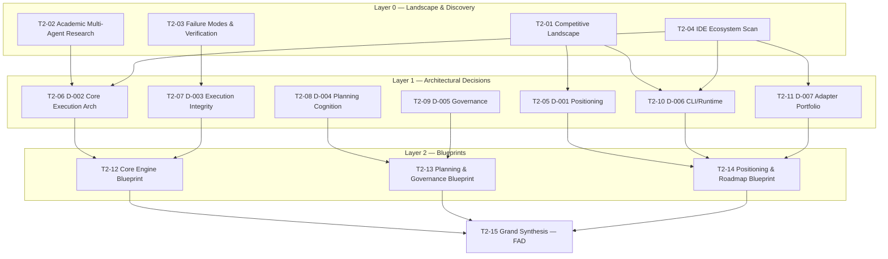

# Kramak — Pre-Development Research Pipeline

**Generated:** August 18, 2026 · **Tier:** 2 (9–16 sessions) · **Sessions:** 15 · **Decisions tracked:** 7

> **Calibration note.** Kramak already shipped v1.0.0 in August 2026 after 24 development iterations — this is not a from-scratch greenfield build. This pipeline is best read as pre-development research for v1.1+ (or a retroactive validation pass on v1.0.x), and the methodology has been adapted accordingly: "application code" means the specification itself (`PLANNER.md`, `EXECUTOR.md`, JSON schemas, the eight adapters), and "architectural decisions" are the mechanism-level and positioning-level choices governing them, not database/API/infra choices in the traditional sense.

## Contents
1. [How to Execute This Pipeline](#how-to-execute-this-pipeline)
2. [Project Extraction & Classification](#1-project-extraction--classification)
3. [Complexity Scoring](#2-complexity-scoring)
4. [Session Matrix (DAG)](#3-session-matrix-dag)
5. [Execution Plan](#4-execution-plan)
6. [Research Prompts](#5-research-prompts)
7. [Phase 0 Exit Gate](#6-phase-0-exit-gate)

---

## How to Execute This Pipeline

**Directory layout.** Wherever you place this file and `DECISIONS.md`, create these siblings:

```
├── RESEARCH-PIPELINE.md        ← this file
├── DECISIONS.md                ← decision registry
├── PROMPT-LIBRARY.md           ← generated in a follow-up session, not this one
├── sessions/                   ← research outputs land here
└── templates/
    ├── DECISIONS.template.md
    ├── CONFLICT-RESOLUTION.template.md
    ├── FOUNDING-ARCHITECTURE.template.md
    └── PHASE-0-GATE.template.md
```

**Running a session.** Copy one session's complete prompt (its BRIEF, SCOPE, APPROACH, DELIVERABLE, and FORMAT blocks together) into a fresh conversation with a frontier model that has web search / deep research enabled. If the session lists dependencies in the Session Matrix, attach or paste the upstream session's saved file into that fresh conversation first — a new AI session has no memory of this pipeline and no automatic access to your local files unless you give it access.

**Saving outputs.** Save each returned Markdown file to `sessions/T#-##-[slug].md` using the exact ID and slug from the Session Matrix (Section 3) — e.g. `sessions/T2-01-competitive-landscape-agentic-dev-frameworks.md`. Keep filenames stable; later sessions and blueprints reference these paths directly.

**Recording decisions.** As each Layer-1 session completes, update the matching D-NNN entry in `DECISIONS.md`: move its status from `proposed` to `decided`, `decided — revisit at trigger`, `deferred`, or `rejected`, and paste in the session's recommendation and evidence summary. Use `templates/DECISIONS.template.md` if you want a stricter per-entry format than the inline one already in `DECISIONS.md`.

**Resolving conflicts.** If a Layer-2 blueprint or the Grand Synthesis surfaces a genuine, unreconciled tension between two prior findings, don't force a synthetic resolution — log it in `templates/CONFLICT-RESOLUTION.template.md` and either commission a targeted follow-up session or carry the tension into the FAD as an explicitly flagged open item.

**Compiling the FAD.** The final session (T2-15) populates `templates/FOUNDING-ARCHITECTURE.template.md`. This becomes the single reference document for Kramak's post-v1.0.0 architecture — future edits to `PLANNER.md`, `EXECUTOR.md`, or the schemas should trace back to it.

**Running the gate.** Once T2-15 is compiled, walk it against `templates/PHASE-0-GATE.template.md` and the two-track criteria in Section 6 before starting implementation work.

**Parallelism.** This doesn't have to run sequentially by layer. Six of the fifteen sessions have zero dependencies and can start simultaneously from a cold start — see Section 4 for the real dependency graph, which is looser than the conceptual layers suggest.

---

## 1. Project Extraction & Classification

### 1.1 Project Snapshot

**Kramak (क्रमक)** — a file-based, model-agnostic, IDE-agnostic autonomous development methodology: a deterministic Plan → Execute → Audit loop, delivered as pure Markdown specs, JSON schemas, and templates with zero runtime dependencies, that any AI coding agent can follow by reading files. Positioned as the missing "Process" layer alongside AGENTS.md (Context) and MCP (Protocol). Currently v1.0.0 (shipped August 2026), 48 files, 8 IDE adapters, 24 development iterations, MIT licensed.

### 1.2 Domain Archetype

**Primary: DevTools** — specifically the developer-process/methodology-framework sub-genre. Nearest peers are Scrum/Kanban-as-artifact, RIPER-5, GitHub Spec Kit, and the built-in orchestration conventions inside Devin/OpenHands. Kramak is not itself an AI/ML system (no training, no inference, no model) — it's a framework about working with AI systems, which keeps it a DevTools artifact at its core.

**Secondary: AI/ML** — the subject matter the methodology reasons about (agent orchestration, planner/executor role separation, multi-agent coordination, self-improvement governance) is AI/ML-native, even though the implementation is dependency-free prose. This secondary classification is why academic AI-agent-orchestration literature carries real weight in this pipeline, not just competitive-landscape research.

This is a genuine hybrid, and the split matters operationally: DevTools-adoption dynamics (Section 5, D-001/D-006/D-007) and AI/ML-empirical grounding (D-002 through D-005) are different research disciplines with different source hierarchies, and the pipeline routes them accordingly.

### 1.3 Constraints (Stated)

1. **Zero runtime dependencies** — no mandatory npm/pip/cargo installs. The "pure methodology" claim is load-bearing for positioning; this constraint cannot be loosened by any decision below, only explored around (see D-006).
2. **Model-agnostic** — capability-based self-assessment only, never model-name checks.
3. **IDE-agnostic core** — adapters translate; the core spec doesn't assume any one tool.
4. **MIT licensed**, open source.
5. **Sanskrit naming convention** — a standing personal convention across this maintainer's projects, not specific to Kramak. Treated as fixed; see the note on D-001 below regarding what actually remains open here.

### 1.4 Decided vs. Open

| Decided (fixed) | Open (→ research question below) |
|---|---|
| Project name: Kramak, Sanskrit-rooted | Tagline/positioning framing — **D-001** |
| Zero mandatory runtime dependencies | Whether an *optional* CLI/runtime should exist — **D-006** |
| Capability-based model gating (no model names) | Whether the self-assessment mechanism is robust enough — **D-004** |
| IDE-agnostic core + adapter-translation pattern | Whether the 8-adapter portfolio is right-sized — **D-007** |
| MIT license | — |
| 5-state loop, planner/executor split (current form) | Whether this is the right abstraction, and whether to evolve toward multi-agent — **D-002** |
| The 12 mechanisms, as currently specified | Whether each is evidence-backed — **D-003, D-004, D-005** |
| v1.0.0 already shipped | — (historical fact; design choices within it remain open) |
| "Layer 3: Process" gap claim | Whether the gap is real, and whether spec complexity helps or hurts adoption — **D-001** |

Note on naming: the *name* Kramak is not reopened by this pipeline — it's a standing personal convention, not a project-specific bet. What D-001 actually investigates is the *tagline and category framing* around that fixed name, which is a genuinely open question distinct from the name itself.

### 1.5 Regulatory Exposure — Independent Assessment

Assessed independently rather than taken from self-report, per methodology. Kramak collects, stores, or transmits no user data of its own — it operates as local files read and written by AI agents inside the user's own repository. No PII, health data, payment data, or children's-data touchpoints exist anywhere in the product. **Regulatory Exposure = 0.**

One adjacent, *non-regulatory* risk is worth naming explicitly so it isn't lost: because Kramak grants autonomous agents authority to modify code (and, via hooks/scripts, execute local operations), there's a legitimate **autonomous-agent action-safety** question — unbounded scope creep, destructive operations, supply-chain risk from agent-run commands. This doesn't belong in the regulatory-exposure score (it isn't GDPR/HIPAA/PCI territory), but it is real, and it's substantively addressed by the Execution Integrity research thread (D-003) and the Governance thread (D-005) rather than by any compliance research this pipeline would otherwise generate.

### 1.6 A Note on the "Commodity Infrastructure" Principle

The brief's instruction to compose commodity infrastructure from established providers has limited direct purchase here — Kramak has no runtime infrastructure by design (Constraint 1). Where it does apply: `validate.js` and any future optional tooling (D-006) should lean on established libraries (e.g. `ajv` for JSON Schema validation) rather than custom-building solved problems. This is reflected in the "resolved by convention" list in Section 3.

---

## 2. Complexity Scoring

| Dimension | Score | Summary |
|---|---|---|
| Domain Novelty | 3 | Contested new category — no established genre for this artifact type yet |
| Technical Novelty | 2 | Conventional tech (Markdown/JSON Schema/shell), novel pattern (prose as control plane) |
| Regulatory Exposure | 0 | No PII/health/payment/children touchpoints — assessed independently, see 1.5 |
| Reversibility | 2 | State/FSM/WI format function as a breaking-change surface once adopted |
| Investment Horizon | 1 | Solo, unfunded — "Lean MVP" stakes despite large stated ambition |
| Coordination Complexity | 0 | Single decision-maker throughout |
| Expected Longevity | 2 | 1–3 yr defensible horizon pending an adoption signal |
| Integration Complexity | 2 | 8 independently-evolving external tool ecosystems to track |
| **Total** | **12** | **→ Tier 2 (9–16 sessions)** |

**Hard override check:** Regulatory Exposure = 0, not 3 — the override clause does not trigger. No decision below receives forced deep research on regulatory grounds; routing follows the standard door-type matrix.

### Per-dimension rationale

**Domain Novelty (3).** No established genre exists yet for "file-based, model-agnostic AI-SDLC standard" the way there's an established genre for, say, project-management SaaS. Whether that's because the category is genuinely new (supporting a 3) or an unconventional restructuring of already-served needs (which would argue for a 2) is exactly what D-001 investigates — this score reflects the claim's shape today, not a verdict on whether it survives scrutiny.

**Technical Novelty (2).** Every individual technology involved — Markdown, JSON Schema, shell scripts, a Node validator, git hooks — is thoroughly conventional. What's novel is one level up: encoding a deterministic control loop as natural-language specification that LLM agents self-execute via file reads, functioning as a control plane implemented in prose rather than code. That's an emerging pattern, not unproven infrastructure (nothing here depends on infra that doesn't already work), and more than a new-library adoption — hence 2.

**Regulatory Exposure (0).** See Section 1.5.

**Reversibility (2).** `state.json`'s schema, the Work Item format, and the FSM definition act like a core schema once other tools, adapters, and users depend on them — changing them later is a breaking change requiring migration, the same dynamic a live schema change forces in a multi-tenant system, even though "multi-tenant" isn't literally the right word here.

**Investment Horizon (1).** No funding, no team, no enterprise SLA — by stakes, this sits at "Lean MVP," even though the project's ambition (adopted infrastructure alongside AGENTS.md/MCP) is unusually large for that resourcing level. That mismatch — high ambition, low resourcing — is itself worth naming: a solo maintainer has less room to course-correct after a wrong bet than a funded team would, which is part of why D-001 and the adoption-dynamics question need real research rather than confidence.

**Coordination Complexity (0).** Solo maintainer, sole decision authority throughout. External stakeholders (future adopters, IDE vendors) exist but don't participate in Kramak's own decision-making — their behavior is a research *input* (especially T2-04), not a coordination requirement.

**Expected Longevity (2).** 24 iterations and a v1.0.0 release show sustained investment already, and the stated ambition is durable, adopted infrastructure. Scoring a 3 (5+ years) would be presumptuous before any external adoption signal exists; 1–3 years is the defensible planning horizon until D-001 clarifies whether the category bet is landing.

**Integration Complexity (2).** Not REST/gRPC integration in the traditional sense, but eight distinct external tool ecosystems (Antigravity, Cursor, Claude Code, Windsurf, Cline, Copilot, Aider, Generic), each with its own config/rules convention that adapters must track, each evolving independently — functionally equivalent to maintaining compatibility with multiple complex, independently-versioned interfaces, without the regulated-rails complexity that would justify a 3.

---

## 3. Session Matrix (DAG)

| ID | Layer | Title | Door Type | Pattern | Routing | Depends On |
|---|---|---|---|---|---|---|
| T2-01 | 0 | Competitive & Category Landscape | — | — | LANDSCAPE | none |
| T2-02 | 0 | Academic Multi-Agent SWE Research | — | — | LANDSCAPE | none |
| T2-03 | 0 | Agent Failure Modes & Verification Research | — | — | LANDSCAPE | none |
| T2-04 | 0 | Coding-Agent Ecosystem Scan | — | — | LANDSCAPE | none |
| T2-05 | 1 | D-001 Category Positioning & Adoption Dynamics | One-way | Unknown/Novel | **DEEP RESEARCH** | T2-01 |
| T2-06 | 1 | D-002 Core Execution Architecture | One-way | Unknown/Novel | **DEEP RESEARCH** | T2-02, T2-04 |
| T2-07 | 1 | D-003 Execution Integrity & Recovery | One-way | Unknown/Novel | **DEEP RESEARCH** | T2-03 |
| T2-08 | 1 | D-004 Planning Cognition & Calibration | One-way | Unknown/Novel | **DEEP RESEARCH** | none |
| T2-09 | 1 | D-005 Governance & Human-Interface | One-way | Unknown/Novel | **DEEP RESEARCH** | none |
| T2-10 | 1 | D-006 Pure-Methodology vs. Optional CLI/Runtime | One-way | Unknown/Novel | **DEEP RESEARCH** | T2-01, T2-04 |
| T2-11 | 1 | D-007 Adapter Portfolio Strategy | Two-way | Unknown/Novel | **FAST SPIKE** | T2-04 |
| T2-12 | 2 | Core Engine Blueprint | — | — | SYNTHESIS | T2-06, T2-07 |
| T2-13 | 2 | Planning & Governance Hardening Blueprint | — | — | SYNTHESIS | T2-08, T2-09 |
| T2-14 | 2 | Positioning, Platform & Roadmap Blueprint | — | — | SYNTHESIS | T2-05, T2-10, T2-11 |
| T2-15 | Sink | Grand Synthesis — FAD Compilation | — | — | SYNTHESIS | T2-12, T2-13, T2-14 |

**Why 15, not fewer or more.** Seven genuinely distinct one-way/novel decisions surfaced directly from the ten open questions in the project vision — none were manufactured to pad the tier, and none were dropped to shrink it. Sub-questions that were tightly coupled were merged into a single session (multi-agent evolution folded into core-execution-architecture; spec-complexity-vs-adoption folded into category-positioning) rather than fragmented, which is what keeps this at 15 instead of 19+. Landscape sessions were kept separate from decision sessions only where genuinely shared by two or more downstream decisions (T2-01 through T2-04 each feed at least two Layer-1 sessions); a landscape thread with only one consumer was folded directly into that decision's own session instead (self-improvement-governance research lives inside T2-09, not as a separate Layer-0 node).

**No CONFIRM-quadrant example.** Every one-way door surfaced by the vision is genuinely contested rather than having an obvious best-practice answer — none routed to CONFIRM (one-way + known pattern). That's a small data point in itself: Kramak's open questions cluster in newer, less-settled territory rather than "everyone knows the answer, just confirm it" territory.

### Resolved by Convention (No Session Needed)

Two-way doors with well-established patterns, routed SKIP — decided now rather than researched:

| Decision | Convention |
|---|---|
| JSON Schema validation library for `validate.js` | `ajv` — de facto standard for Node.js JSON Schema validation |
| Git hook mechanism | Plain git hooks (already in use), not a framework like Husky — consistent with the zero-dependency constraint |
| Framework version numbering | Standard SemVer (already in use — v1.0.0) |
| Markdown linting, if added at all | `markdownlint` with default ruleset |

None of these receive a D-NNN entry — they're conventions, not open decisions.

### DAG Visualization



If this doesn't render in your viewer, the table above is the source of truth. Note that T2-08 and T2-09 have no incoming edges at all — they're Layer-1 decisions with zero prerequisites, not blocked by anything in Layer 0.

---

## 4. Execution Plan

### Round 1 — fully parallel, zero dependencies (6 sessions)
`T2-01`, `T2-02`, `T2-03`, `T2-04`, `T2-08`, `T2-09`

T2-08 and T2-09 are Layer-1 decisions but have no Layer-0 prerequisite — they can start immediately alongside the landscape sessions. Don't let the layer labels imply a stricter sequence than the actual dependency graph requires.

### Round 2 — unblocks incrementally as specific prerequisites land (5 sessions)

| Session | Unblocked by |
|---|---|
| T2-05 (D-001) | T2-01 |
| T2-06 (D-002) | T2-02 **and** T2-04 |
| T2-07 (D-003) | T2-03 |
| T2-10 (D-006) | T2-01 **and** T2-04 |
| T2-11 (D-007) | T2-04 |

Each starts the moment its own listed prerequisites are done — none needs to wait for all of Round 1 to finish.

### Round 3 — Layer-2 blueprints (3 sessions)

| Session | Depends on |
|---|---|
| T2-12 | T2-06, T2-07 |
| T2-13 | T2-08, T2-09 |
| T2-14 | T2-05, T2-10, T2-11 |

### Round 4 — sink (1 session)
`T2-15`, depends on T2-12, T2-13, T2-14.

**Fastest possible path.** With unlimited parallel capacity, this pipeline resolves in 4 rounds, not 15 sequential sessions — the DAG exists precisely to avoid a 15-session single-file queue for a solo operator.

---

## 5. Research Prompts

Each prompt below is complete and self-contained — copy the whole block (BRIEF through FORMAT) into a fresh AI research session. Where a session has dependencies, provide the upstream session's saved file as context first.

### Layer 0 — Landscape & Discovery

#### T2-01 — Competitive & Category Landscape: AI-Agentic Development Process Frameworks (2026)

**BRIEF:** Investigate the current competitive and category landscape for AI-agentic software development process frameworks — the "Layer 3: Process" space Kramak claims is unfilled, alongside AGENTS.md (Context) and MCP (Protocol). This directly informs **D-001** (Category Positioning & Adoption Dynamics) and indirectly informs **D-006** (Pure-Methodology vs. Optional CLI/Runtime). The output will be read by a Principal Architect deciding whether to position Kramak as category-defining infrastructure or as one entrant among several — they need a rigorous, unflinching map of who else occupies this space, not confirmation of the premise. Context: Kramak is a file-based, zero-dependency methodology (Markdown specs + JSON schemas) implementing a five-state Plan→Execute→Audit loop, explicitly distinguished from named comparators RIPER-5 (a lightweight `.cursorrules`-style prompt file) and GitHub Spec Kit, and from the built-in orchestration inside agentic coding products like Devin and OpenHands.

**SCOPE:** Anchor all searches to today's date, August 18, 2026 — this category moves in months, not years, so anything not sourced within roughly the last 12 months should be flagged as potentially stale. In scope: named comparators (RIPER-5, Spec Kit, Aider's own conventions, OpenHands, Devin, BMAD-Method or similar "AI SDLC" efforts, and anything else marketed as a process/methodology layer for AI coding agents); adoption signals (stars, fork activity, cited production usage, community discussion); how each positions itself; whether any is trending toward de facto standardization the way AGENTS.md or MCP did. Also sanity-check the framing itself — verify whether the Context (AGENTS.md) and Protocol (MCP) layers are as settled as assumed; if either is less mature than presented, that changes how the Process-layer gap claim should be framed. Out of scope: general AI coding assistant reviews unrelated to process/methodology; pricing or business-model analysis. Prefer official repos, official docs/READMEs, and maintainer statements over secondhand blog summaries; where community sentiment matters, prefer forum/discussion threads with visible engagement over single-author opinion pieces.

**APPROACH:** Start with broad queries mapping the "AI SDLC" / agentic-development-process category as it exists today, then narrow into each named comparator individually, then broaden again to search for anything not already named that occupies similar territory — an unnamed competitor's existence is itself an important finding. Actively look for evidence that would falsify Kramak's central premise (signs the process-layer gap is closing, being filled informally by IDE-native features, or considered unnecessary by practitioners) rather than only cataloging support for the premise. Where sources disagree about a framework's maturity, adoption, or capabilities, surface the disagreement rather than picking a side.

**DELIVERABLE:** Cover at minimum: (1) as complete a map as possible of named and unnamed competitors, with what each actually does; (2) for each, a plain assessment of adoption-signal strength; (3) an explicit evaluation of whether the "Layer 3: Process" framing is a claim the evidence supports, partially supports, or contradicts; (4) a recommendation on whether the gap is real, partially real, or illusory, with reasoning isolated from the alternatives considered; (5) inline evidence grades on every factual claim about adoption, capability, or maturity; (6) open risks — including that this space may move fast enough that any finding here has a short shelf life — with a stated re-research trigger. Grade every claim: **Base** — A (official docs/RFCs) · B (peer-reviewed/rigorous empirical) · C (vendor/maintainer claims) · D (blog/tutorial/AI recall) · E (unverifiable). **Modifiers** — corroboration (single/corroborated/contested), recency (fresh/aging/stale relative to Aug 2026), directness (direct/indirect). **Verification** — fetched/cached/recalled/secondhand/human-provided; anything recalled from training rather than actually retrieved is capped at Grade D no matter how confident it reads.

**FORMAT:** Produce a single Markdown file as the complete output. Open with YAML frontmatter:

```yaml
id: T2-01
title: "Competitive & Category Landscape: AI-Agentic Development Process Frameworks"
date: [date this session is run]
status: complete
topic: category-landscape
tags: [competitive-analysis, ai-agent-frameworks, positioning]
informs_decisions: [D-001]
confidence: [your stated confidence]
```

Then structure the body as: **Research Question** → **Key Findings** (3–7 bullets) → **Recommendation** (clearly isolated from rejected alternatives) → **Alternatives Considered** → **Detailed Findings** → **Open Questions & Risks** → **Sources & Evidence Ledger**.

---

#### T2-02 — Academic & Empirical Research: Multi-Agent Software Engineering, Orchestration & Role Specialization

**BRIEF:** Survey academic and empirical research on multi-agent software engineering, LLM agent orchestration, and role specialization (planner/executor/critic-style splits) as it stands in 2026. This grounds **D-002** (Core Execution Architecture). The output will be read by a Principal Architect who has already built and shipped a planner/executor/auditor split through 24 iterations of intuition-driven design and wants to know whether the literature validates, contradicts, or refines that choice — not a general tutorial on multi-agent systems.

**SCOPE:** Date-anchor to August 18, 2026. In scope: peer-reviewed and preprint research on LLM-based multi-agent software engineering (role-specialized coding-agent studies, planner/executor/verifier architectures, agent debate/self-critique research), empirical comparisons of single-agent vs. multi-role pipelines on SWE-bench-style benchmarks, and research specifically on state-machine or FSM-style control structures for agent workflows. Out of scope: general multi-agent robotics or game-theory literature not applied to software engineering. Prioritize arXiv preprints with reproducible benchmarks, peer-reviewed venues (ICSE, FSE, NeurIPS/ICLR agent workshops), and primary research over secondary blog coverage of that research.

**APPROACH:** Begin broad (state of LLM agent orchestration research in 2026), then narrow toward role-specialization specifically — does splitting planning from execution measurably help, and under what conditions does it hurt via coordination overhead or context loss at the handoff. Actively hunt for null results and negative findings; research showing role-splitting adds overhead without benefit is exactly as valuable here as research showing it helps, and shouldn't be smoothed over for a cleaner narrative. Where benchmark results conflict across papers (different tasks, different agent counts, different models), name the conflict explicitly rather than averaging it away.

**DELIVERABLE:** Address explicitly: (1) what current empirical evidence says about planner/executor role separation specifically, including effect sizes or benchmark deltas where available, not just qualitative claims; (2) whether a fixed finite-state loop (versus a more dynamic/emergent agent-to-agent negotiation model) is supported as a control structure, and under what task characteristics it tends to win or lose; (3) a recommendation on whether Kramak's PLANNING→EXECUTING→AUDITING loop is well-grounded, under-grounded, or contradicted by current research, isolated from alternative framings considered; (4) inline evidence grades throughout; (5) open risks, including that this research area may be young enough that findings don't generalize or get superseded quickly, with a re-review trigger. Grade every claim: **Base** — A (official docs/RFCs) · B (peer-reviewed/rigorous empirical) · C (vendor/maintainer claims) · D (blog/tutorial/AI recall) · E (unverifiable). **Modifiers** — corroboration (single/corroborated/contested), recency (fresh/aging/stale), directness (direct/indirect). **Verification** — fetched/cached/recalled/secondhand/human-provided; recalled claims capped at Grade D regardless of apparent source.

**FORMAT:** Produce a single Markdown file. Open with YAML frontmatter:

```yaml
id: T2-02
title: "Academic & Empirical Research: Multi-Agent Software Engineering, Orchestration & Role Specialization"
date: [date this session is run]
status: complete
topic: academic-grounding
tags: [multi-agent-systems, orchestration, role-specialization, empirical-research]
informs_decisions: [D-002]
confidence: [your stated confidence]
```

Body structure: **Research Question** → **Key Findings** (3–7 bullets) → **Recommendation** (isolated from rejected alternatives) → **Alternatives Considered** → **Detailed Findings** → **Open Questions & Risks** → **Sources & Evidence Ledger**.

---

#### T2-03 — AI Agent Failure Modes, Context Engineering & Verification Research

**BRIEF:** Investigate current empirical research and production practice on LLM coding-agent failure modes — hallucinated specifications, context drift/rot over long sessions, scope creep, and verification strategies that catch these failures before they compound. This grounds **D-003** (Execution Integrity & Recovery Mechanisms) and materially informs D-004's Failure Taxonomy sub-question. The output will be read by a Principal Architect auditing four already-shipped mechanisms — grep-confirmed "Grounded Verification," a `git diff --name-only`-based "Hard Scope Check," a loop-preventing "Circuit Breaker," and a crash-recovery "State Reconciliation" step keyed on `state.json` — against what the evidence actually supports, including whether a commonly-cited "2-hour work item" duration cap, internally attributed to METR research, is an accurate extrapolation.

**SCOPE:** Date-anchor to August 18, 2026. In scope: empirical research and credible practitioner writeups on LLM agent hallucination/grounding failures, context-window degradation over long agentic sessions, scope-creep and unauthorized-file-edit patterns in autonomous coding agents, crash-recovery and idempotent-state-resumption designs for long-running agent workflows, and specifically METR's own published research on AI task-duration/reliability curves — verify what it actually claims before treating the "2-hour cap" as validated. Out of scope: general software crash-recovery/distributed-systems literature not specific to LLM agents. Prioritize METR's own publications, other AI-evaluation-org research, primary benchmark papers, and official agent-vendor postmortems over aggregated blog summaries.

**APPROACH:** Start broad on documented LLM coding-agent failure taxonomies, then narrow to each of the four mechanisms individually, asking for each: what failure mode does it target, does the evidence show that failure mode is actually common or costly, and does the proposed mechanism plausibly address it. Pull the METR source material directly rather than relying on secondhand characterizations, and check specifically whether the "2-hour work item" figure is a direct finding, an extrapolation, or a mismatch. Deliberately look for failure modes in current literature that none of the four mechanisms address, and for evidence that any of the four could themselves fail or be circumvented — for instance, an agent editing the file list to route around a Hard Scope Check.

**DELIVERABLE:** Cover: (1) an evidence-graded assessment of each of the four mechanisms individually; (2) a direct check of the METR-derived duration cap against primary sourcing, stating plainly whether the 2-hour figure is well-supported, an approximation, or unsupported by the cited research; (3) any failure modes documented in current research that fall outside all four mechanisms' coverage, flagged as gaps; (4) a recommendation — keep, strengthen, or redesign each mechanism — isolated from alternatives considered; (5) inline evidence grades; (6) open risks with reversal triggers, including what real-world usage signal would indicate a mechanism is failing silently. Grade every claim: **Base** — A (official docs/RFCs) · B (peer-reviewed/rigorous empirical) · C (vendor/maintainer claims) · D (blog/tutorial/AI recall) · E (unverifiable). **Modifiers** — corroboration (single/corroborated/contested), recency (fresh/aging/stale), directness (direct/indirect). **Verification** — fetched/cached/recalled/secondhand/human-provided; recalled claims capped at Grade D regardless of apparent source.

**FORMAT:** Produce a single Markdown file. Open with YAML frontmatter:

```yaml
id: T2-03
title: "AI Agent Failure Modes, Context Engineering & Verification Research"
date: [date this session is run]
status: complete
topic: failure-modes-verification
tags: [agent-reliability, context-engineering, verification, metr]
informs_decisions: [D-003, D-004]
confidence: [your stated confidence]
```

Body structure: **Research Question** → **Key Findings** (3–7 bullets) → **Recommendation** (isolated from rejected alternatives) → **Alternatives Considered** → **Detailed Findings** → **Open Questions & Risks** → **Sources & Evidence Ledger**.

---

#### T2-04 — Coding-Agent Ecosystem Scan: Native Orchestration, Multi-Agent Capabilities & Extension Surfaces (8 Target Tools)

**BRIEF:** Produce a current-state capability scan of the eight IDE/agent ecosystems Kramak targets — Antigravity, Cursor, Claude Code, Windsurf, Cline, GitHub Copilot, Aider, and the Generic fallback case — covering each tool's native orchestration/planning features, multi-agent or subagent support, and the extension/configuration surface Kramak's adapters hook into. This is a shared landscape input feeding three decisions: **D-002** (whether native multi-agent support means Kramak's execution model needs to evolve), **D-006** (whether these tools already fill gaps a Kramak CLI would otherwise fill), and **D-007** (which adapters remain worth maintaining). The output will be read by a Principal Architect who needs an accurate, current map of a fast-moving ecosystem, not marketing copy from each vendor.

**SCOPE:** Date-anchor hard to August 18, 2026 — this category changes materially in single-digit months, and anything not sourced from official docs/changelogs dated within roughly the last two quarters should be flagged as possibly stale. In scope, per tool: current native planning/orchestration features (if any), native multi-agent or parallel-subagent capabilities and their maturity, the file(s)/format(s) it reads for custom instructions or rules (the actual integration surface an adapter targets), and any signal about roadmap direction. Out of scope: pricing, general product reviews unrelated to orchestration/config surface. Prefer each vendor's own current documentation and changelog over third-party "best AI coding tool" roundups, which are heavily SEO-driven and go stale fast in this category.

**APPROACH:** Work through the eight tools systematically, but treat this as landscape-building rather than a fixed checklist — if research surfaces a ninth tool that has become significant enough to matter since Kramak's adapter list was set, note it even though it's outside the named eight. For each tool, distinguish clearly between features that are stable/documented and features that are in beta/preview/rapidly changing, since adapter-maintenance burden scales with the latter. Where a tool's marketing claims outpace what its docs actually specify, say so.

**DELIVERABLE:** Cover, per tool: (1) native orchestration/planning capability level (none / basic / Kramak-competitive); (2) native multi-agent support and maturity; (3) the actual config/rules surface an adapter integrates with, and how stable that surface has been; (4) a one-line adoption/momentum signal. Then, synthesized across all eight: (5) which tools are converging on similar native capabilities (adapter-consolidation candidates) versus diverging (adapter differentiation still needed); (6) a recommendation on ecosystem risk — which adapters face near-term breaking-change risk; (7) inline evidence grades throughout; (8) open risks and a re-scan trigger — this session likely has the shortest shelf life of any in the pipeline; say so explicitly. Grade every claim: **Base** — A (official docs/RFCs) · B (peer-reviewed/rigorous empirical) · C (vendor/maintainer claims) · D (blog/tutorial/AI recall) · E (unverifiable). **Modifiers** — corroboration (single/corroborated/contested), recency (fresh/aging/stale), directness (direct/indirect). **Verification** — fetched/cached/recalled/secondhand/human-provided; recalled claims capped at Grade D regardless of apparent source.

**FORMAT:** Produce a single Markdown file. Open with YAML frontmatter:

```yaml
id: T2-04
title: "Coding-Agent Ecosystem Scan: Native Orchestration, Multi-Agent Capabilities & Extension Surfaces"
date: [date this session is run]
status: complete
topic: ecosystem-scan
tags: [ide-ecosystem, coding-agents, adapters, multi-agent-tooling]
informs_decisions: [D-002, D-006, D-007]
confidence: [your stated confidence]
```

Body structure: **Research Question** → **Key Findings** (3–7 bullets) → **Recommendation** (isolated from rejected alternatives) → **Alternatives Considered** → **Detailed Findings** (organized per tool) → **Open Questions & Risks** → **Sources & Evidence Ledger**.

---

### Layer 1 — Architectural Decisions

#### T2-05 — D-001 Category Positioning & Adoption Dynamics [DEEP RESEARCH]

**BRIEF:** Using `sessions/T2-01-competitive-landscape-agentic-dev-frameworks.md` as required input, determine how Kramak should position itself given the actual competitive landscape, and whether the project's specification complexity (`PLANNER.md` alone at 41.5 KB, `EXECUTOR.md` at 17.7 KB, 48 files total) is a meaningful adoption barrier relative to lightweight comparators like RIPER-5's single-file approach. This informs **D-001**. The output will be read by a Principal Architect — and the project's sole maintainer — who needs a genuinely load-bearing answer on whether "the missing SDLC for AI agents" is the right frame, and whether comprehensiveness is a competitive advantage or a competitive liability, not reassurance.

**SCOPE:** Date-anchor to August 18, 2026. In scope: general research and case studies on developer-tool/framework adoption dynamics around complexity-versus-simplicity tradeoffs (documented cases where frameworks/standards won on simplicity despite being less capable, and counter-cases where comprehensiveness won); anything in T2-01's findings bearing on how comparators are actually received; general research on onboarding friction and abandonment in developer tooling. Out of scope: generic UX-writing advice unrelated to this specific complexity-vs-adoption question. Prefer documented case studies, developer-tool adoption research, and primary maintainer/community commentary over generic "keep it simple" advice pieces.

**APPROACH:** Start from T2-01's competitor map and build on it rather than re-deriving it. Investigate the positioning question and the complexity question as related but separate threads — positioning is about whether the claimed gap (Context/Protocol/Process, alongside AGENTS.md/MCP) is the right frame to compete on; complexity is about whether a 60+ KB spec surface helps or hurts within whatever frame is chosen. Look for disconfirming evidence on both counts: cases where "own the category" positioning failed, and cases where comprehensive/complex frameworks won anyway — for instance because complexity signaled rigor to the specific audience that mattered. Don't assume simpler always wins; test it.

**DELIVERABLE:** Cover: (1) a direct verdict on whether the Layer-3/"missing SDLC" positioning holds up against T2-01's findings or needs reframing, with reasoning that names specific competitors; (2) a direct verdict on whether current spec complexity is a probable adoption blocker, backed by adoption-dynamics evidence rather than intuition; (3) if reframing or simplification is recommended, concrete direction (not finished copy) on what the positioning/entry-point should look like — e.g. whether a smaller "quickstart" surface alongside the full spec resolves the tension without abandoning depth; (4) explicit treatment of whether the Sanskrit name is a distinct discoverability cost separate from the tagline question, and whether a clarifying subtitle is warranted — the name itself is fixed, not open; only the framing around it is; (5) a recommendation isolated from rejected alternatives; (6) inline evidence grades; (7) open risks with reversal triggers. Grade every claim: **Base** — A (official docs/RFCs) · B (peer-reviewed/rigorous empirical) · C (vendor/maintainer claims) · D (blog/tutorial/AI recall) · E (unverifiable). **Modifiers** — corroboration (single/corroborated/contested), recency (fresh/aging/stale), directness (direct/indirect). **Verification** — fetched/cached/recalled/secondhand/human-provided; claims carried over from T2-01 should be tagged as corroborated/cached rather than freshly fetched unless independently re-verified, and any recalled claim is capped at Grade D.

**FORMAT:** Produce a single Markdown file. Open with YAML frontmatter:

```yaml
id: T2-05
title: "D-001 Category Positioning & Adoption Dynamics"
date: [date this session is run]
status: proposed
topic: positioning-decision
tags: [positioning, adoption, spec-complexity, decision-record]
informs_decisions: [D-001]
confidence: [your stated confidence]
```

Body structure: **Research Question** → **Key Findings** (3–7 bullets) → **Recommendation** (clearly separated from rejected options) → **Alternatives Considered** → **Detailed Findings** → **Open Questions & Risks** → **Sources & Evidence Ledger**.

---

#### T2-06 — D-002 Core Execution Architecture: State Machine, Role Separation & Multi-Agent Evolution [DEEP RESEARCH]

**BRIEF:** Using `sessions/T2-02-academic-multiagent-swe-research.md` and `sessions/T2-04-ide-ecosystem-scan.md` as required inputs, evaluate Kramak's core execution architecture — the five-state BOOTSTRAP→PLANNING→EXECUTING→AUDITING(→PLANNING)/WAITING loop, with a high-reasoning "planner" model and a fast/precise "executor" model as distinct roles. This informs **D-002**, the single highest-stakes decision in this pipeline: getting it wrong means every other spec file, every adapter, and the `state.json` schema inherits a flawed foundation. The output will be read by a Principal Architect deciding whether to hold, refine, or restructure the design before more external adopters depend on it.

**SCOPE:** Date-anchor to August 18, 2026. In scope: synthesis of T2-02 and T2-04's findings against the specific shape of Kramak's loop; additional primary research needed to fill gaps those two sessions left; concrete alternative FSM/orchestration shapes used by comparable frameworks or research prototypes. Out of scope: re-litigating whether multi-agent research in general is promising — T2-02 covers that; this session's job is applying those findings to Kramak's specific five states and two roles. Prefer primary sources for anything not already covered by the two input sessions.

**APPROACH:** Treat T2-02 and T2-04 as required reading, not optional context — reconcile them where they point different directions (for instance, if academic research is cautious about role-splitting overhead while the ecosystem scan shows native multi-agent tooling maturing fast regardless, that tension is itself a finding). Then work through three sub-questions in whatever order the evidence suggests is most productive: whether the current state count and transitions are minimal-and-sufficient or missing/redundant; whether planner/executor separation should remain a hard architectural split, become a soft convention, or be reconsidered; and whether Kramak should define a multi-agent-native execution mode as a first-class path rather than an eventual add-on, given where the target ecosystems are heading. Seek evidence that the current design is already wrong in some specific, nameable way, not only evidence that it's directionally fine.

**DELIVERABLE:** Cover: (1) an explicit verdict on the five-state loop — sufficient, overbuilt, or underbuilt, naming any specific state to add, remove, or merge; (2) an explicit verdict on planner/executor role separation, grounded in T2-02's findings; (3) a concrete recommendation on multi-agent evolution — stay single-agent-per-phase, add multi-agent as an optional mode, or restructure around it as default — describing what that implies for `state.json` and the Work Item format; (4) a recommendation isolated from alternatives considered; (5) inline evidence grades, with clear attribution of which claims come from T2-02/T2-04 (tag as corroborated/cached, not freshly fetched, unless independently re-verified) versus fresh research; (6) open risks with reversal triggers — specify exactly what future evidence would justify revisiting this decision. Grade every claim: **Base** — A (official docs/RFCs) · B (peer-reviewed/rigorous empirical) · C (vendor/maintainer claims) · D (blog/tutorial/AI recall) · E (unverifiable). **Modifiers** — corroboration (single/corroborated/contested), recency (fresh/aging/stale), directness (direct/indirect). **Verification** — fetched/cached/recalled/secondhand/human-provided; recalled claims capped at Grade D regardless of apparent source.

**FORMAT:** Produce a single Markdown file. Open with YAML frontmatter:

```yaml
id: T2-06
title: "D-002 Core Execution Architecture: State Machine, Role Separation & Multi-Agent Evolution"
date: [date this session is run]
status: proposed
topic: core-architecture-decision
tags: [state-machine, role-separation, multi-agent, decision-record]
informs_decisions: [D-002]
confidence: [your stated confidence]
```

Body structure: **Research Question** → **Key Findings** (3–7 bullets) → **Recommendation** (clearly separated from rejected options) → **Alternatives Considered** → **Detailed Findings** → **Open Questions & Risks** → **Sources & Evidence Ledger**.

---

#### T2-07 — D-003 Execution Integrity & Recovery Mechanisms [DEEP RESEARCH]

**BRIEF:** Using `sessions/T2-03-agent-failure-modes-verification-research.md` as required input, produce a hardening recommendation for Kramak's four execution-integrity mechanisms — Grounded Verification (grep-confirmed specs), Hard Scope Check (`git diff --name-only` enforcement against the spec's file list), Circuit Breaker (audit-fix-audit loop termination), and State Reconciliation (crash recovery keyed on `state.json`) — plus the "2-hour work item" duration cap and the informally-named "Polish Ceiling Rule" (a boundary intended to stop the executor from over-engineering beyond what a Work Item specifies). This informs **D-003**. The output will be read by a Principal Architect deciding what, if anything, in Kramak's safety-critical execution path needs to change before more users depend on it.

**SCOPE:** Date-anchor to August 18, 2026. In scope: applying T2-03's failure-mode findings specifically to each of the six items above; additional research on the Polish Ceiling concept specifically, since T2-03 may not have covered it by name — search for the general pattern (over-completion/scope-inflation prevention in autonomous agents) if the specific term doesn't surface literature. Out of scope: re-deriving the general failure-mode landscape, which is T2-03's job. Prefer T2-03's already-graded findings where they apply directly; do fresh primary research only where genuinely necessary.

**APPROACH:** Go mechanism by mechanism, checking each against T2-03's findings: does real evidence support that this mechanism addresses a real, costly failure mode, and does the mechanism as designed plausibly close that gap or only partially close it. For the "2-hour cap," defer to T2-03's direct check of the METR sourcing rather than re-deriving it, but flag any discrepancy this session's context reveals. For the Polish Ceiling Rule, since it may be effectively undocumented in outside literature, be explicit about where you're evaluating it against a directly analogous published pattern versus reasoning from first principles about scope-inflation risk. Actively look for a single failure mode that would defeat multiple mechanisms simultaneously — a root cause each guard treats as a separate symptom — since that's more actionable than confirming each guard works in isolation.

**DELIVERABLE:** Cover, per mechanism (six items): a keep/strengthen/redesign verdict with the specific change recommended if not "keep." Also cover: (1) a proposed `state.json` schema-versioning/migration approach, since State Reconciliation implies old and new schema versions must coexist during any future spec change — this is a gap not named in the twelve claimed innovations and should be flagged as a genuine finding, not assumed away; (2) a recommendation isolated from alternatives considered; (3) inline evidence grades, with claims sourced from T2-03 tagged as corroborated/cached rather than freshly fetched unless independently re-verified; (4) open risks with reversal triggers, specifically naming what real-usage telemetry — if Kramak ever collects any, even opt-in — would validate or invalidate each verdict. Grade every claim: **Base** — A (official docs/RFCs) · B (peer-reviewed/rigorous empirical) · C (vendor/maintainer claims) · D (blog/tutorial/AI recall) · E (unverifiable). **Modifiers** — corroboration (single/corroborated/contested), recency (fresh/aging/stale), directness (direct/indirect). **Verification** — fetched/cached/recalled/secondhand/human-provided; recalled claims capped at Grade D regardless of apparent source.

**FORMAT:** Produce a single Markdown file. Open with YAML frontmatter:

```yaml
id: T2-07
title: "D-003 Execution Integrity & Recovery Mechanisms"
date: [date this session is run]
status: proposed
topic: execution-integrity-decision
tags: [grounded-verification, scope-check, circuit-breaker, state-reconciliation, decision-record]
informs_decisions: [D-003]
confidence: [your stated confidence]
```

Body structure: **Research Question** → **Key Findings** (3–7 bullets) → **Recommendation** (clearly separated from rejected options) → **Alternatives Considered** → **Detailed Findings** → **Open Questions & Risks** → **Sources & Evidence Ledger**.

---

#### T2-08 — D-004 Planning Cognition & Calibration Mechanisms [DEEP RESEARCH]

**BRIEF:** Evaluate the four mechanisms governing how Kramak's planner reasons and calibrates: Perspective-Based Planning (a PERCEIVE→REASON→DECIDE assessment cycle), Spec Detail Scaling (three tiers — 🔴 Guided with exact before/after, 🟡 Directed with intent and constraints, 🟢 Outcome with goal and criteria — matched to task risk), the Failure Taxonomy (six categories used for structured diagnosis), and Capability Gate Check (model self-assessment of capability, not model-name checking). This informs **D-004**. The output will be read by a Principal Architect who designed these from 24 iterations of personal experience and wants to know whether they reinvent, align with, or contradict current research on prompting AI planners and calibrating task-specification detail to risk.

**SCOPE:** Date-anchor to August 18, 2026. In scope: current research and credible practice on prompt/plan structuring for LLM agents (including the specific "no personas" belief the maintainer already holds — verify it rather than accept it), on matching instruction-detail level to task risk or ambiguity, on failure-classification schemes for AI-agent tasks, and on self-assessed versus externally-benchmarked capability-gating approaches. Out of scope: general prompt-engineering listicles not addressing calibration or planning structure specifically. Prefer primary research (papers, official model-provider guidance on agentic prompting) over generic prompting blogs.

**APPROACH:** Treat each of the four mechanisms as an independent claim to test, starting broad on planning-cognition and prompt-calibration research, then narrowing to each mechanism. Verify the "no personas" claim directly rather than treating the maintainer's existing belief as already confirmed — this is exactly the kind of self-referential claim the Grounded Verification principle would insist on checking against source rather than recall. For Capability Gate Check, look specifically for research or vendor guidance on self-assessed versus externally-benchmarked capability signals, since self-assessment has documented reliability problems in other AI-safety-adjacent contexts that may transfer here. Surface disagreement rather than resolving it artificially — if some research favors rigid detail-tiering and other research favors adaptive/dynamic instruction generation, name both sides.

**DELIVERABLE:** Cover, per mechanism (four items): a verdict on whether current evidence supports it, is silent on it, or cuts against it, with reasoning shown. Also cover: (1) whether the six-category Failure Taxonomy's categories map onto failure classifications used elsewhere, or are a Kramak-specific invention with unclear coverage, flagged either way; (2) whether Capability Gate Check's self-assessment approach has a known reliability gap per relevant research, and if so what a more robust design would add without reintroducing model-name checks — a hard constraint; (3) a recommendation isolated from alternatives considered; (4) inline evidence grades; (5) open risks with reversal triggers, including what would indicate Capability Gate Check is systematically over- or under-trusting a model. Grade every claim: **Base** — A (official docs/RFCs) · B (peer-reviewed/rigorous empirical) · C (vendor/maintainer claims) · D (blog/tutorial/AI recall) · E (unverifiable). **Modifiers** — corroboration (single/corroborated/contested), recency (fresh/aging/stale), directness (direct/indirect). **Verification** — fetched/cached/recalled/secondhand/human-provided; recalled claims capped at Grade D regardless of apparent source.

**FORMAT:** Produce a single Markdown file. Open with YAML frontmatter:

```yaml
id: T2-08
title: "D-004 Planning Cognition & Calibration Mechanisms"
date: [date this session is run]
status: proposed
topic: planning-cognition-decision
tags: [prompt-calibration, failure-taxonomy, capability-gating, decision-record]
informs_decisions: [D-004]
confidence: [your stated confidence]
```

Body structure: **Research Question** → **Key Findings** (3–7 bullets) → **Recommendation** (clearly separated from rejected options) → **Alternatives Considered** → **Detailed Findings** → **Open Questions & Risks** → **Sources & Evidence Ledger**.

---

#### T2-09 — D-005 Governance & Human-Interface Mechanisms [DEEP RESEARCH]

**BRIEF:** Evaluate Kramak's governance and human-interface layer: the Anti-Bias Guard (a five-point checklist run before the pipeline may modify its own methodology, intended to prevent recency bias in a self-evolving system), the INBOX System (structured mid-project user input), the Human Task Protocol (tracks tasks requiring human action without blocking the pipeline), and Auto-Bootstrap (automatic project-type/toolchain detection across five scenarios). This informs **D-005**, and specifically the maintainer's most safety-relevant open question: is a five-point checklist a robust enough control on self-modification, or does it need structural reinforcement. The output will be read by a Principal Architect evaluating whether this self-improvement governance is adequate for a system that will, by design, sometimes rewrite its own instructions.

**SCOPE:** Date-anchor to August 18, 2026. In scope: research and credible practice on safe self-modification and self-improvement in AI systems, including recency-bias and reward-hacking risk in self-evaluation loops, and — separately — general human-in-the-loop design patterns for autonomous systems (relevant to INBOX and Human Task Protocol) and project-bootstrapping/auto-detection reliability patterns (relevant to Auto-Bootstrap). Out of scope: broad AI-alignment research not applicable to a file-based, human-supervised, single-repo methodology — Kramak's self-modification is bounded (it edits its own Markdown spec files, subject to normal human code review via git, not an unsupervised production system), and the research should be evaluated at that appropriate scale rather than imported wholesale from higher-stakes contexts.

**APPROACH:** Start broad on self-modifying-system governance research, then narrow specifically to whether a checklist-based (as opposed to structural/enforced) control is defensible at Kramak's actual risk scale — a file-based methodology edited via normal git workflow is a materially different risk profile than an unsupervised system modifying its own weights or a live production service, and the research should be weighed accordingly. Then evaluate INBOX System, Human Task Protocol, and Auto-Bootstrap against relevant HCI/automation-design patterns; these are lower-stakes than the Anti-Bias Guard question and warrant proportionately lighter treatment. Look specifically for any documented failure pattern where a checklist-style self-check was later shown insufficient, since that's the most direct evidence against Kramak's current design.

**DELIVERABLE:** Cover: (1) a direct verdict on the Anti-Bias Guard's adequacy at Kramak's actual risk scale, with a specific recommendation — keep as a checklist, add a structural backstop (e.g. an explicit mandatory human-review gate on any self-modifying commit, which git may already imply but should be stated explicitly if so), or something else; (2) lighter-weight but explicit verdicts on INBOX System, Human Task Protocol, and Auto-Bootstrap, each with a keep/adjust call; (3) a recommendation isolated from alternatives considered; (4) inline evidence grades; (5) open risks with reversal triggers — specifically, what observed incident, even a near-miss, should immediately trigger reinforcing the Anti-Bias Guard rather than waiting for a scheduled review. Grade every claim: **Base** — A (official docs/RFCs) · B (peer-reviewed/rigorous empirical) · C (vendor/maintainer claims) · D (blog/tutorial/AI recall) · E (unverifiable). **Modifiers** — corroboration (single/corroborated/contested), recency (fresh/aging/stale), directness (direct/indirect). **Verification** — fetched/cached/recalled/secondhand/human-provided; recalled claims capped at Grade D regardless of apparent source.

**FORMAT:** Produce a single Markdown file. Open with YAML frontmatter:

```yaml
id: T2-09
title: "D-005 Governance & Human-Interface Mechanisms"
date: [date this session is run]
status: proposed
topic: governance-decision
tags: [anti-bias-guard, self-modification, human-in-the-loop, decision-record]
informs_decisions: [D-005]
confidence: [your stated confidence]
```

Body structure: **Research Question** → **Key Findings** (3–7 bullets) → **Recommendation** (clearly separated from rejected options) → **Alternatives Considered** → **Detailed Findings** → **Open Questions & Risks** → **Sources & Evidence Ledger**.

---

#### T2-10 — D-006 Pure-Methodology Identity vs. Optional CLI/Runtime [DEEP RESEARCH]

**BRIEF:** Using `sessions/T2-01-competitive-landscape-agentic-dev-frameworks.md` and `sessions/T2-04-ide-ecosystem-scan.md` as required inputs, evaluate whether Kramak should remain strictly pure-file (Markdown specs, JSON schemas, zero mandatory runtime dependencies) or add an optional, non-mandatory CLI/runtime component for tasks like state validation, IDE scaffolding, or bootstrap automation — currently handled by `init.sh`/`init.ps1` and `validate.js`, which already exist but aren't framed as a first-class "optional tooling" offering. This informs **D-006**. The output will be read by a Principal Architect weighing a genuine identity tradeoff: the "pure methodology, zero dependencies" claim is core to the project's positioning, but may also be leaving adoption-friction-reducing tooling on the table.

**SCOPE:** Date-anchor to August 18, 2026. In scope: how T2-01's named comparators handle the tooling-vs-purity tradeoff — do any position themselves as "pure" the way Kramak does, and if so how do they handle validation/scaffolding; how T2-04's ecosystem findings bear on whether the target IDEs already provide enough native scaffolding/validation that a Kramak-specific CLI would be redundant; general research or case studies on "optional companion tooling" architectures (a tool that enhances but is never required) in other zero-dependency or minimal-core open-source projects, and whether that pattern preserves a "pure" claim credibly or undermines it in practice. Out of scope: implementation-level CLI design (language choice, packaging) — this session decides whether, not how.

**APPROACH:** Treat the two required input sessions as your starting evidence base, then investigate the specific pattern of optional/companion tooling in other minimal-core projects — where does precedent exist for "the spec is complete without it, but a companion tool exists" — looking specifically for cases where that pattern was later perceived as compromising the project's core claim versus cases where it was well received. Weigh this against the concrete adoption-friction evidence available from T2-01 and T2-04. Consider explicitly whether a companion CLI shipped as a genuinely separate repository (rather than bundled into the core Kramak repo) changes the calculus, since that structurally preserves the zero-dependency claim of the core spec regardless of what the companion tool does.

**DELIVERABLE:** Cover: (1) a direct recommendation — remain strictly pure-file, add an optional bundled companion, or spin an optional companion into a separate repository — with reasoning for choosing among all three, not just the first two; (2) if any tooling is recommended, what it should cover first (validation, scaffolding, or something else) based on where T2-01/T2-04 evidence shows the friction actually concentrates, not assumption; (3) an explicit statement of how the recommended path does or doesn't put the "zero mandatory runtime dependencies" constraint at risk, since that constraint is fixed and any recommendation must respect it; (4) a recommendation isolated from alternatives considered; (5) inline evidence grades, with T2-01/T2-04-sourced claims tagged as corroborated/cached rather than freshly fetched unless independently re-verified; (6) open risks with reversal triggers. Grade every claim: **Base** — A (official docs/RFCs) · B (peer-reviewed/rigorous empirical) · C (vendor/maintainer claims) · D (blog/tutorial/AI recall) · E (unverifiable). **Modifiers** — corroboration (single/corroborated/contested), recency (fresh/aging/stale), directness (direct/indirect). **Verification** — fetched/cached/recalled/secondhand/human-provided; recalled claims capped at Grade D regardless of apparent source.

**FORMAT:** Produce a single Markdown file. Open with YAML frontmatter:

```yaml
id: T2-10
title: "D-006 Pure-Methodology Identity vs. Optional CLI/Runtime"
date: [date this session is run]
status: proposed
topic: tooling-identity-decision
tags: [zero-dependency, cli, companion-tooling, decision-record]
informs_decisions: [D-006]
confidence: [your stated confidence]
```

Body structure: **Research Question** → **Key Findings** (3–7 bullets) → **Recommendation** (clearly separated from rejected options) → **Alternatives Considered** → **Detailed Findings** → **Open Questions & Risks** → **Sources & Evidence Ledger**.

---

#### T2-11 — D-007 Adapter Portfolio Strategy [FAST SPIKE]

**BRIEF:** Using `sessions/T2-04-ide-ecosystem-scan.md` as required input, produce a fast, decisive recommendation on Kramak's eight-adapter portfolio (Antigravity, Cursor, Claude Code, Windsurf, Cline, GitHub Copilot, Aider, Generic) — keep all eight, consolidate to a smaller set of deeply-maintained adapters plus Generic, or open a lighter-weight community-contribution path for the long tail. This informs **D-007**. The output will be read by a Principal Architect who needs a clear call on a reversible decision, not an exhaustive study — this is a spike, not a deep-research session, and should be scoped accordingly.

**SCOPE:** Date-anchor to August 18, 2026. In scope: T2-04's per-tool findings on adoption momentum and integration-surface stability; a direct, fast judgment on maintenance burden versus coverage value for each of the eight. Out of scope: re-scanning the ecosystem, which T2-04 already did, or exploring tooling-architecture questions unrelated to which adapters to maintain.

**APPROACH:** This is intentionally a lighter pass than the deep-research sessions in this pipeline — use T2-04's findings directly rather than re-researching, and reach a decisive recommendation efficiently. Where T2-04 flagged a tool's integration surface as unstable or its native capabilities as converging with Kramak's own value-add, treat that as a strong signal toward consolidation for that specific adapter. Don't manufacture false uncertainty to pad this out; if the evidence points clearly one way, say so plainly.

**DELIVERABLE:** Cover: (1) a per-adapter keep/deprecate/community-maintained call, each with a one-line reason tracing back to a specific T2-04 finding; (2) an overall portfolio recommendation (unchanged, consolidated, or hybrid with a community path); (3) a recommendation isolated from alternatives considered; (4) evidence grades on the handful of claims this session adds beyond what T2-04 already graded; (5) a short open-risks note — since this is a two-way door, the main risk is simply that the ecosystem keeps moving and this call should be revisited on a cadence rather than treated as final. Grade every claim: **Base** — A (official docs/RFCs) · B (peer-reviewed/rigorous empirical) · C (vendor/maintainer claims) · D (blog/tutorial/AI recall) · E (unverifiable). **Modifiers** — corroboration (single/corroborated/contested), recency (fresh/aging/stale), directness (direct/indirect). **Verification** — fetched/cached/recalled/secondhand/human-provided; recalled claims capped at Grade D regardless of apparent source.

**FORMAT:** Produce a single Markdown file. Open with YAML frontmatter:

```yaml
id: T2-11
title: "D-007 Adapter Portfolio Strategy"
date: [date this session is run]
status: proposed
topic: adapter-portfolio-decision
tags: [adapters, ide-integration, maintenance-strategy, decision-record]
informs_decisions: [D-007]
confidence: [your stated confidence]
```

Body structure — lighter than the deep-research template given the spike scope, but still complete: **Research Question** → **Key Findings** → **Recommendation** (clearly separated from rejected options) → **Alternatives Considered** → **Open Questions & Risks** → **Sources & Evidence Ledger**. Detailed Findings may be brief or folded into Key Findings.

---

### Layer 2 — Blueprints & Specifications

#### T2-12 — Core Engine Blueprint: FSM, Roles, Multi-Agent Path & Execution-Integrity Spec Deltas

**BRIEF:** Synthesize the verdicts from `sessions/T2-06-core-execution-architecture.md` (D-002) and `sessions/T2-07-execution-integrity-mechanisms.md` (D-003) into a single, concrete blueprint for how Kramak's "engine room" — the state machine, role separation, multi-agent path, the four integrity mechanisms, and the schema-versioning approach — should actually be specified going forward. This is a synthesis session, not a fresh-research session: its job is reconciling two completed decision records into an implementable spec delta. The output will be handed directly to whoever next edits `PLANNER.md`, `EXECUTOR.md`, and the `state.json` schema.

**SCOPE:** Date-anchor to August 18, 2026, though this session's own currency matters less than its two inputs' — it inherits their evidence rather than gathering new evidence, except where reconciling them surfaces a genuine gap. In scope: producing concrete spec-delta language (what changes in the FSM diagram, what changes in the four mechanisms, what a schema-versioning addition looks like) sufficient for an implementer to act on. Out of scope: implementing the changes — this produces a blueprint, not a pull request — and re-researching anything T2-06 or T2-07 already covered.

**APPROACH:** Read both input sessions in full before synthesizing. Where they agree or are simply additive (e.g. T2-06's multi-agent recommendation and T2-07's schema-versioning gap both touch `state.json`), integrate them into one coherent picture of what `state.json` needs to become. Where they're in tension — for instance, if T2-06 recommends a more dynamic/emergent execution mode while T2-07's integrity mechanisms assume a more deterministic, checkpointable loop — name the tension explicitly and propose a reconciliation rather than silently picking a side. If a genuine conflict can't be reconciled with the evidence on hand, flag it for the conflict-resolution process rather than forcing a synthetic answer.

**DELIVERABLE:** Cover: (1) a single reconciled description of the recommended execution architecture, combining T2-06 and T2-07's verdicts; (2) concrete before/after language for the FSM (states, transitions) if changes were recommended, or explicit confirmation of no change if the research validated the current design; (3) concrete spec-delta language for each of the four integrity mechanisms per T2-07's verdicts, plus the schema-versioning addition; (4) any tensions between the two input sessions, named explicitly, with either a proposed reconciliation or an explicit flag for `templates/CONFLICT-RESOLUTION.template.md`; (5) inline evidence grades, carrying forward the source sessions' grades rather than re-grading from scratch; (6) open risks and reversal triggers, inherited or newly surfaced. Grade every claim using the same system as prior sessions: **Base** A–E, **Modifiers** for corroboration/recency/directness, **Verification** tags fetched/cached/recalled/secondhand/human-provided, with recalled claims capped at Grade D.

**FORMAT:** Produce a single Markdown file. Open with YAML frontmatter:

```yaml
id: T2-12
title: "Core Engine Blueprint: FSM, Roles, Multi-Agent Path & Execution-Integrity Spec Deltas"
date: [date this session is run]
status: draft
topic: core-engine-blueprint
tags: [blueprint, state-machine, execution-integrity, spec-delta]
informs_decisions: [D-002, D-003]
confidence: [your stated confidence]
```

Body structure: **Research Question** → **Key Findings** (3–7 bullets) → **Recommendation** (clearly separated from rejected options) → **Alternatives Considered** → **Detailed Findings** (organized around concrete spec-delta language, not raw research) → **Open Questions & Risks** → **Sources & Evidence Ledger**.

---

#### T2-13 — Planning & Governance Hardening Blueprint

**BRIEF:** Synthesize `sessions/T2-08-planning-cognition-mechanisms.md` (D-004) and `sessions/T2-09-governance-human-interface.md` (D-005) into a concrete blueprint for how Kramak's planning-calibration mechanisms and governance/human-interface layer should be hardened. The output will be handed directly to whoever next revises the relevant sections of `PLANNER.md` and any governance-specific spec files.

**SCOPE:** Date-anchor to August 18, 2026; inherits currency from its two inputs. In scope: concrete spec-delta language for Perspective-Based Planning, Spec Detail Scaling, Failure Taxonomy, and Capability Gate Check (from T2-08), and for Anti-Bias Guard, INBOX System, Human Task Protocol, and Auto-Bootstrap (from T2-09). Out of scope: re-researching either input session's ground.

**APPROACH:** Read both inputs fully, then organize the synthesis around a single question for each of the eight mechanisms: does this blueprint confirm it unchanged, specify a concrete strengthening, or specify a concrete redesign. Pay particular attention to reconciling T2-08's Capability Gate Check findings with T2-09's Anti-Bias Guard findings, since both touch on how much Kramak should trust automated self-assessment — of model capability in one case, of the pipeline's own bias in the other. If the two sessions reached different comfort levels with self-assessment generally, that pattern itself is worth naming rather than treating each mechanism in isolation.

**DELIVERABLE:** Cover: (1) a per-mechanism (eight items) confirm/strengthen/redesign call with concrete spec-delta language for anything not simply confirmed; (2) explicit treatment of the self-assessment reconciliation described above; (3) any tensions between the two inputs, named and either reconciled or flagged for `templates/CONFLICT-RESOLUTION.template.md`; (4) inline evidence grades carried forward from source sessions; (5) open risks and reversal triggers. Grade every claim using the same system as prior sessions: **Base** A–E, **Modifiers** for corroboration/recency/directness, **Verification** tags fetched/cached/recalled/secondhand/human-provided, with recalled claims capped at Grade D.

**FORMAT:** Produce a single Markdown file. Open with YAML frontmatter:

```yaml
id: T2-13
title: "Planning & Governance Hardening Blueprint"
date: [date this session is run]
status: draft
topic: planning-governance-blueprint
tags: [blueprint, planning-cognition, governance, spec-delta]
informs_decisions: [D-004, D-005]
confidence: [your stated confidence]
```

Body structure: **Research Question** → **Key Findings** (3–7 bullets) → **Recommendation** (clearly separated from rejected options) → **Alternatives Considered** → **Detailed Findings** (organized around concrete spec-delta language) → **Open Questions & Risks** → **Sources & Evidence Ledger**.

---

#### T2-14 — Positioning, Platform & Roadmap Blueprint

**BRIEF:** Synthesize `sessions/T2-05-category-positioning-adoption.md` (D-001), `sessions/T2-10-pure-methodology-vs-cli.md` (D-006), and `sessions/T2-11-adapter-portfolio-strategy.md` (D-007) into a single go-forward roadmap blueprint covering how Kramak presents itself, what companion tooling (if any) it builds next, and which adapters it invests in. The output will be read by a Principal Architect — and sole maintainer — who needs one coherent next-steps document rather than three separate, potentially overlapping recommendations to reconcile manually.

**SCOPE:** Date-anchor to August 18, 2026; inherits currency from its three inputs. In scope: reconciling the three inputs into a single prioritized roadmap; producing concrete next-action language (what changes in README/positioning-copy direction, what a companion-tooling decision implies for repo structure, what the adapter-portfolio call implies for near-term maintenance focus). Out of scope: re-researching any of the three inputs' ground, and writing final marketing copy — this produces direction, not finished prose.

**APPROACH:** Read all three inputs fully. Look specifically for reinforcing or conflicting signals across them — for instance, if T2-05 recommends leaning into comprehensiveness as a differentiator while T2-10 recommends adding tooling that increases surface area further, check whether that combination is coherent or whether it compounds the adoption-friction risk T2-05 was also asked to weigh. Sequence the roadmap by what unblocks the most value soonest, not simply by the order the three decisions were researched.

**DELIVERABLE:** Cover: (1) a single reconciled positioning direction, incorporating T2-05's verdict; (2) a single reconciled tooling direction, incorporating T2-10's verdict, sequenced relative to the adapter-portfolio decision from T2-11 — e.g. if adapters are being consolidated, does that free capacity for tooling work, or are they independent tracks; (3) a prioritized near-term roadmap (first, second, third) with reasoning tied back to specific findings in the three inputs; (4) any cross-input tensions, named and either reconciled or flagged for `templates/CONFLICT-RESOLUTION.template.md`; (5) inline evidence grades carried forward; (6) open risks and reversal triggers. Grade every claim using the same system as prior sessions: **Base** A–E, **Modifiers** for corroboration/recency/directness, **Verification** tags fetched/cached/recalled/secondhand/human-provided, with recalled claims capped at Grade D.

**FORMAT:** Produce a single Markdown file. Open with YAML frontmatter:

```yaml
id: T2-14
title: "Positioning, Platform & Roadmap Blueprint"
date: [date this session is run]
status: draft
topic: positioning-platform-roadmap
tags: [blueprint, positioning, tooling-roadmap, adapter-strategy]
informs_decisions: [D-001, D-006, D-007]
confidence: [your stated confidence]
```

Body structure: **Research Question** → **Key Findings** (3–7 bullets) → **Recommendation** (clearly separated from rejected options) → **Alternatives Considered** → **Detailed Findings** (organized as a prioritized roadmap) → **Open Questions & Risks** → **Sources & Evidence Ledger**.

---

### Sink — Grand Synthesis

#### T2-15 — Grand Synthesis: Kramak Founding Architecture Document (FAD) Compilation

**BRIEF:** Compile the three Layer-2 blueprints — `sessions/T2-12-core-engine-blueprint.md`, `sessions/T2-13-planning-governance-blueprint.md`, `sessions/T2-14-positioning-platform-roadmap-blueprint.md` — and, by reference, the seven underlying decision records they rest on, into a single Founding Architecture Document for Kramak, following the structure in `templates/FOUNDING-ARCHITECTURE.template.md`. This is the pipeline's sink node — every other session's work flows into this one document. The output will serve as the authoritative, internally-consistent reference for why Kramak's post-v1.0.0 architecture looks the way it does, so a Principal Architect (or future contributor) doesn't have to reconstruct the reasoning from fifteen separate session files.

**SCOPE:** Date-anchor to August 18, 2026. In scope: faithful compilation and reconciliation of the three blueprints into the FAD template's structure; a final pass checking for any remaining cross-blueprint inconsistency the individual blueprint sessions didn't catch — for example, whether the Core Engine Blueprint's multi-agent recommendation aligns with anything the Platform Roadmap Blueprint assumed about adapter-maintenance capacity. Out of scope: new primary research — this session synthesizes and reconciles existing findings; if it discovers a genuine unresolved gap, it should surface that gap rather than filling it with new, unverified research.

**APPROACH:** Read all three blueprints in full, and pull in the seven underlying decision records where the blueprints summarized rather than fully carried forward their evidence grades. Populate the FAD template section by section, treating any remaining contradiction between blueprints as a first-class finding to flag via `templates/CONFLICT-RESOLUTION.template.md` rather than silently resolving it in whichever direction seems more convenient. Where confidence varies across the underlying decisions — some may be well-evidenced, others may rest on thinner ground — preserve that variation in the FAD rather than presenting everything with uniform confidence.

**DELIVERABLE:** A complete Founding Architecture Document per the template's structure, covering at minimum: the reconciled execution architecture (from the Core Engine Blueprint); the reconciled planning/governance design (from the Planning & Governance Blueprint); the reconciled positioning/platform roadmap (from the Positioning Blueprint); a full list of the underlying decisions with their final status and confidence carried forward accurately; any unresolved conflicts flagged for the conflict-resolution process rather than papered over; and a single "what changed from the v1.0.0 spec" summary an implementer could act on directly. Grade every claim using the same system as prior sessions: **Base** A–E, **Modifiers** for corroboration/recency/directness, **Verification** tags fetched/cached/recalled/secondhand/human-provided, with recalled claims capped at Grade D.

**FORMAT:** Populate `templates/FOUNDING-ARCHITECTURE.template.md` as a single Markdown file. If that template defines its own frontmatter and section conventions, follow those. If it's unavailable when this session runs, fall back to the same YAML frontmatter pattern used throughout this pipeline:

```yaml
id: T2-15
title: "Kramak Founding Architecture Document"
date: [date this session is run]
status: draft
topic: founding-architecture
tags: [fad, synthesis, architecture-decisions]
informs_decisions: [D-001, D-002, D-003, D-004, D-005, D-006, D-007]
confidence: [your stated confidence]
```

— with body sections adapted to the FAD's own structure rather than the standard seven-section research format used elsewhere in this pipeline.

---

## 6. Phase 0 Exit Gate

Phase 0 is "done" — implementation work on Kramak v1.1+ can begin — only when both tracks below clear. This is a two-track gate because a two-way door (D-007) and everything else don't deserve equal ceremony; forcing equal rigor on both wastes the exact effort-calibration this pipeline exists to produce.

### Track A — Two-Way Doors (Fast Track)

- [ ] T2-11 (D-007 Adapter Portfolio) complete and saved to `sessions/`
- [ ] D-007 status updated in `DECISIONS.md`
- [ ] No further sign-off required — maintainer confidence is sufficient for a reversible call

### Track B — One-Way Doors (Full Track)

- [ ] All six deep-research sessions complete (T2-05 through T2-10) and saved to `sessions/`
- [ ] All three Layer-2 blueprints complete (T2-12, T2-13, T2-14)
- [ ] T2-15 (Grand Synthesis / FAD) compiled per `templates/FOUNDING-ARCHITECTURE.template.md`
- [ ] Every D-001 through D-006 entry in `DECISIONS.md` updated from `proposed` to a resolved status — `decided`, `decided — revisit at trigger`, or `deferred` with a stated reason. "Inconclusive" is an acceptable resolution as long as it's explicit and paired with a review trigger; a silently-still-`proposed` entry is not.
- [ ] No recommendation in the FAD rests on a Grade-E (unverifiable) claim without an explicitly accepted-risk note
- [ ] Every named cross-session conflict (surfaced in the Layer-2 or Sink prompts) is either reconciled or logged in `templates/CONFLICT-RESOLUTION.template.md` — none left silently dropped
- [ ] The "what changed from the v1.0.0 spec" summary in the FAD is concrete enough that an implementer could open a pull request from it without further clarification

Once both tracks clear, the populated `FOUNDING-ARCHITECTURE.template.md` becomes the reference document for all subsequent `PLANNER.md` / `EXECUTOR.md` / schema edits.
